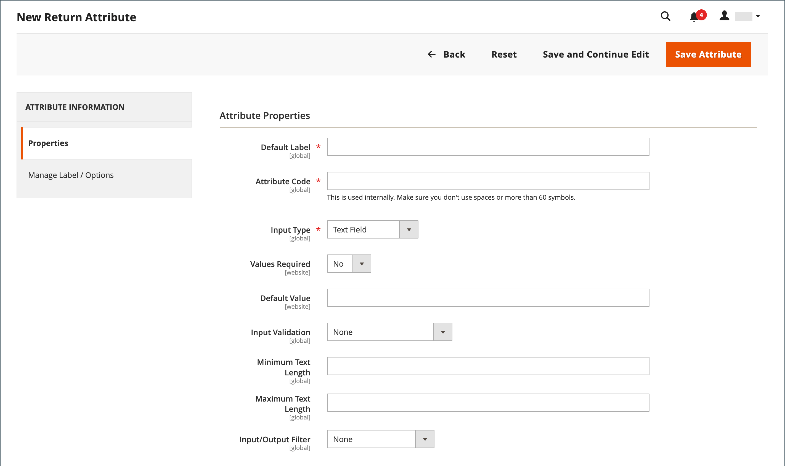

# Retourne l’attribut

{{ee-feature}}

Les attributs de retour sont utilisés pour stocker les informations nécessaires pendant le processus de retour du produit. Les attributs par défaut incluent la condition du produit renvoyé, le motif du renvoi et un champ indiquant comment le renvoi a été résolu. Le processus de création d’un attribut de retour est similaire à la création d’un [attribut du client](../customers/attribute-properties.md).

{width="700" zoomable="yes"}

## Création d’un attribut de retour

1. Dans la barre latérale _Admin_, accédez à **[!UICONTROL Stores]** > _[!UICONTROL Attributes]_>**[!UICONTROL Returns]**.

1. Dans le coin supérieur droit, cliquez sur **[!UICONTROL Add New Attribute]**.

   {width="600" zoomable="yes"}

### Définition des propriétés

1. Pour identifier l’attribut lors de la saisie des données, définissez le **[!UICONTROL Default Label]** .

1. Par **[!UICONTROL Attribute Code]**, saisissez un code qui identifie l’attribut dans le système.

1. Pour déterminer le type de contrôle d&#39;entrée utilisé pour la saisie de données, définissez **[!UICONTROL Input Type]** sur l&#39;une des options suivantes :

   - `Text Field`
   - `Text Area`
   - `Dropdown`
   - `Yes/No`
   - `File`
   - `Image File`

1. Pour que le champ soit un élément obligatoire, définissez **[!UICONTROL Values Required]** sur `Yes`.

1. Pour attribuer une valeur initiale au champ, saisissez un **[!UICONTROL Default Value]**.

1. Pour valider la précision des données saisies dans le champ avant d’enregistrer l’enregistrement, définissez **[!UICONTROL Input Validation]** sur l’une des valeurs suivantes :

   - `None`
   - `Alphanumeric`
   - `Alphanumeric with Space`
   - `Numeric Only`
   - `Alpha Only`
   - `URL`
   - `Email`

1. Pour les types d’entrée `Text Field` et `Text Area`, saisissez les **[!UICONTROL Minimum Text Length]** et **[!UICONTROL Maximum Text Length]**.

1. Pour appliquer un filtre de prétraitement, définissez **[!UICONTROL Input/Output Filter]** sur l’une des options suivantes :

   - `None`
   - `Strip HTML Tags`
   - `Escape  HTML Entities`

1. Pour rendre l’attribut visible pour les clients, définissez **[!UICONTROL Show on Storefront]** sur `Yes` dans la section _[!UICONTROL Storefront Properties]_.

1. (Facultatif) Par **[!UICONTROL Sort Order]**, saisissez un nombre pour déterminer où cet attribut apparaît par rapport aux autres dans la même partie de la page. (`0` = premier, `1` = deuxième, `2` = troisième, etc.)

### Gestion des libellés/options

1. Dans le panneau de gauche, choisissez **[!UICONTROL Manage Labels/Options]**.

1. Dans la section **[!UICONTROL Manage Titles (Size, Color, etc.)]** , saisissez le libellé de chaque vue de magasin.

   {width="600" zoomable="yes"}

1. Si la **[!UICONTROL Input Type]** de l’attribut est `Dropdown`, gérez les options dans la section **[!UICONTROL Manage Options (Values of Your Attribute)]** .

   - Pour ajouter une option, cliquez sur **[!UICONTROL Add Option]** et saisissez le libellé pour Admin et chaque vue de magasin.
   - Pour définir une option sur la valeur par défaut sélectionnée, choisissez **[!UICONTROL Is Default]**.
   - Pour supprimer une option, cliquez sur **[!UICONTROL Delete]**.

1. Pour enregistrer les modifications, cliquez sur **[!UICONTROL Save Attribute]**.
