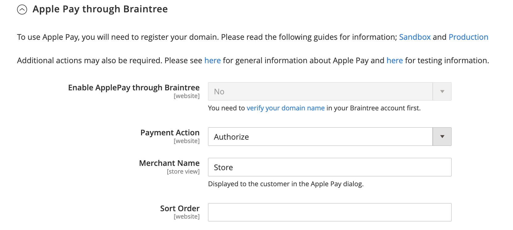

# Braintree

Braintree offre une expérience de paiement entièrement personnalisable avec la détection des fraudes et l’intégration de PayPal. Elle prend en charge [!DNL Apple Pay], [!DNL Google Pay], ACH, Venmo et modes de paiement locaux. Braintree réduit la charge de conformité PCI pour les commerçants, car la transaction a lieu sur le système de Braintree. L’intégration des paiements Braintree est développée par [GENE Commerce](https://www.gene.co.uk/gene-braintree-payments/).

>[!NOTE]
>
>Si vous effectuez une mise à niveau vers la version 2.4.x à partir d’une version antérieure d’Adobe Commerce ou d’un Magento Open Source avec l’extension Braintree de Commerce Marketplace installée, reportez-vous à la section [Notes de mise à niveau 2.4](#24-upgrade-notes) à la fin de cette page.

{{beta2-updates}}

## Étape 1 : Obtention des informations d’identification de votre Braintree

Accédez à [Paiements Braintree][1] et inscrivez-vous à un compte.

## Étape 2 : définition des paramètres de base

1. Sur le _Administration_ barre latérale, accédez à **[!UICONTROL Stores]** > _[!UICONTROL Settings]_>**[!UICONTROL Configuration]**.

1. Dans le panneau de gauche, développez **[!UICONTROL Sales]** et choisissez **[!UICONTROL Payment Methods]**.

   - Si votre installation Commerce comporte plusieurs sites web, magasins ou vues, dans le coin supérieur gauche, sélectionnez la variable **[!UICONTROL Store View]** où la configuration s’applique.

   - Dans le _[!UICONTROL Merchant Location]_, vérifiez que **[!UICONTROL Merchant Country]**est défini sur l’emplacement de votre entreprise.

1. Sous _[!UICONTROL Recommended Solutions]_, dans la variable_[!UICONTROL Braintree Payments (by GENE Commerce v4.5.0)]_ , cliquez sur **[!UICONTROL Configure]**.

   {width="600" zoomable="yes"}

1. Pour **[!UICONTROL Title]**, saisissez un titre qui identifie Braintree comme option de paiement lors de l’extraction.

1. Définir l’opération en cours **[!UICONTROL Environment]** pour les transactions Braintree à `Sandbox` ou `Production`

   Lors du test de la configuration dans un environnement de test, utilisez uniquement [numéros de carte de crédit][2] qui sont recommandés par le Braintree. Lorsque vous êtes prêt à passer en production avec Braintree, définissez **[!UICONTROL Environment]** to `Production`.

   {width="600" zoomable="yes"}

1. Définir **[!UICONTROL Payment Action]** à l’une des options suivantes :

   - `Authorize Only` - Valide l&#39;achat et met un frein aux fonds. Le montant n’est pas retiré du compte bancaire du client tant que la vente n’a pas eu lieu. _capturé_ par le marchand.|
   - `Intent Sale`  - Le montant de l’achat est autorisé et immédiatement retiré du compte du client. **_Remarque :_** Cette valeur était  _Autoriser et capturer_ dans les versions 2.3.x et antérieures.|

1. Saisissez le **[!UICONTROL Sandbox Merchant ID / Merchant ID]** de votre compte de Braintree.

1. Saisissez les informations d’identification suivantes à partir de votre compte de Braintree :

   - **[!UICONTROL Sandbox Public Key / Public Key]**
   - **[!UICONTROL Sandbox Private Key / Private Key]**

   >[!NOTE]
   >
   >Il existe des champs distincts pour les deux **(Environnement de test et production)** et les autres champs sont générés en fonction de l’environnement sélectionné.

1. Avant d’enregistrer la configuration, cliquez sur **[!UICONTROL Validate Credentials]** pour valider vos identifiants.

1. Définir **[!UICONTROL Enable Card Payments]** to `Yes`.

   {width="600" zoomable="yes"}

   Si vous souhaitez pouvoir stocker les informations sur les clients en toute sécurité, afin que les clients n’aient pas à y revenir chaque fois qu’ils effectuent un achat, définissez **[!UICONTROL Enable Vault for Card Payments]** to `Yes`.

## Étape 3 : définition des paramètres avancés

1. Développer  la valeur **[!UICONTROL Advanced Braintree Settings]** .

   {width="550" zoomable="yes"}

1. Pour **[!UICONTROL Vault Title]**, saisissez un titre descriptif pour votre référence qui identifie le coffre dans lequel les informations de votre carte client sont stockées.

1. Saisissez le **[!UICONTROL Merchant Account ID]** de votre compte de Braintree.

   Si vous ne spécifiez pas le compte marchand à utiliser, Braintree traite la transaction à l’aide de votre compte marchand par défaut.

1. Si vous souhaitez empêcher l’envoi de la transaction pour évaluation dans le cadre des contrôles des outils avancés de fraude, définissez sur les commandes passées par l’intermédiaire de l’administrateur. **[!UICONTROL Skip Fraud Checks on Admin Orders]** to `Yes`.

1. Définissez la variable **[!UICONTROL Bypass Fraud Protection Threshold]** afin que la variable `Advanced Fraud Protection` les contrôles sont contournés lorsque le seuil est atteint ou dépassé.

   Si vous laissez ce champ vide, cette option est désactivée.

1. Si vous souhaitez que le système enregistre un fichier journal des interactions entre votre magasin et votre Braintree, définissez **[!UICONTROL Debug]** to `Yes`.

1. Pour obliger les clients à fournir le code de sécurité à trois chiffres à partir de l’arrière d’une carte de crédit, définissez **[!UICONTROL CVV Verification]** to `Yes`.

   Si vous utilisez la vérification CVV, veillez à activer les AVS et/ou CVV dans la variable _Paramètres/traitement_ de votre compte de Braintree.

1. Pour envoyer les articles du panier pour tous les modes de paiement, définissez **[!UICONTROL Send Card Line Items]** to `Yes`.

1. Pour **[!UICONTROL Credit Card Types]**, sélectionnez chaque carte de crédit acceptée par votre boutique comme paiement par l’intermédiaire de Braintree.

   Pour sélectionner plusieurs types de carte, maintenez la touche Ctrl (PC) ou la touche Commande (Mac) enfoncée, puis cliquez sur chaque option.

1. Pour **[!UICONTROL Sort Order]**, saisissez un nombre afin de déterminer l’ordre dans lequel le Braintree apparaît lorsqu’il est répertorié avec d’autres méthodes de paiement lors du passage en caisse.

## Étape 4 : Définition des paramètres du webhook du Braintree

{width="600" zoomable="yes"}

1. Définir **[!UICONTROL Enable Webhook]** to `Yes` pour activer la fonctionnalité webhook pour la protection anti-fraude, les paiements ACH et les méthodes de paiement locales.

1. Copiez l’URL dans le **[!UICONTROL Fraud Protection URL]** et l’ajouter à votre compte de Braintree en tant que _[!UICONTROL Webhook Destination URL]_.

   >[!IMPORTANT]
   >
   >Cette URL doit être sécurisée et accessible au public.

1. Définissez la variable **[!UICONTROL Fraud Protection Approve Order Status]** pour déterminer quand la protection contre la fraude est approuvée par Braintree.

   L’état de la commande sélectionnée est affecté à la commande Commerce.

1. Définissez la variable **[!UICONTROL Fraud Protection Reject Order Status]** pour déterminer quand la protection contre la fraude est refusée par le Braintree.

   L’état de la commande sélectionnée est affecté à la commande Commerce.

## Étape 5 : Renseigner les paramètres spécifiques au pays

1. Définir **[!UICONTROL Payment from Applicable Countries]** à l’une des options suivantes :

   - `All Allowed Countries` - Clients de tous les [pays](../getting-started/store-details.md#country-options) spécifié dans votre configuration de magasin peut utiliser ce mode de paiement.
   - `Specific Countries` - Après avoir choisi cette option, la variable _[!UICONTROL Payment from Specific Countries]_s’affiche. Maintenez la touche Ctrl (PC) ou Commande (Mac) enfoncée et sélectionnez chaque pays de la liste dans lequel les clients peuvent effectuer des achats dans votre boutique.

   {width="600" zoomable="yes"}

1. Pour configurer **[!UICONTROL Country Specific Credit Card Types]**:

   - Cliquez sur **[!UICONTROL Add]**.

   - Définissez la variable **[!UICONTROL Country]** et choisissez chacun **[!UICONTROL Allowed Credit Card Type]**.

   - Répétez cette procédure pour identifier les cartes de crédit acceptées dans chaque pays.

## Étape 6 : achèvement de l’ACCÈS via les paramètres du Braintree

{width="600" zoomable="yes"}

1. Pour inclure ACH comme option de paiement avec Braintree, définissez **[!UICONTROL Enable ACH Direct Debit]** to `Yes`.

1. Pour **[!UICONTROL Sort Order]**, saisissez un nombre afin de déterminer l’ordre dans lequel l’option de paiement ACH du Braintree apparaît lorsqu’elle est répertoriée avec d’autres options de paiement lors du passage en caisse.

## Étape 7 : exécutez la [!UICONTROL Apple Pay] par le biais des paramètres du Braintree

{width="600" zoomable="yes"}

1. À inclure [!DNL Apple Pay] comme option de paiement avec Braintree, définissez **[!UICONTROL Enable ApplePay through Braintree]** to `Yes`.

   Veillez à [vérification du nom de domaine ;](https://developer.paypal.com/braintree/docs/guides/apple-pay/configuration/javascript/v3) dans votre compte de Braintree en premier.

1. Définir **[!UICONTROL Payment Action]** à l’une des options suivantes :

   - `Authorize Only` - Valide l&#39;achat et met un frein aux fonds. Le montant n’est pas retiré du compte bancaire du client tant que la vente n’a pas eu lieu. _capturé_ par le marchand.
   - `Intent Sale` - Le montant de l’achat est autorisé et immédiatement retiré du compte du client.

1. Pour **[!UICONTROL Merchant Name]**, saisissez le texte qui spécifie le libellé affiché pour les clients dans la boîte de dialogue Payer Apple.

1. Pour **[!UICONTROL Sort Order]**, saisissez un nombre pour déterminer la séquence dans laquelle [!DNL Apple Pay] l’option de paiement s’affiche lorsqu’elle est répertoriée avec d’autres options de paiement lors du passage en caisse.

## Etape 8 : paramétrage des modes de paiement locaux

1. Pour inclure les modes de paiement locaux comme option de paiement avec le Braintree, définissez **[!UICONTROL Enable Local Payment Methods]** to `Yes`.

1. Pour **[!UICONTROL Title]**, saisissez le texte à utiliser pour le libellé qui apparaît dans la section Mode de paiement de passage en caisse (valeur par défaut : `Local Payments`).

1. Pour **[!UICONTROL Allowed Payment Methods]**, sélectionnez le mode de paiement local à activer.

   Options : `Bancontact` / `EPS` / `giropay` / `iDeal` / `Klarna Pay Now` / `SOFORT` / `MyBank` / `P24` / `SEPA/ELV Direct Debit` (pas encore pris en charge)

   {width="600" zoomable="yes"}

   >[!NOTE]
   >
   >L’extension de Braintree groupé ne prend pas en charge tous les modes de paiement locaux répertoriés dans la variable [Documentation destinée aux développeurs Braintree](https://developer.paypal.com/braintree/docs/guides/local-payment-methods/overview). D&#39;autres modes de paiement locaux sont en cours de développement et seront pris en charge dans les prochaines versions.

1. Pour **[!UICONTROL Sort Order]**, saisissez un nombre afin de déterminer l’ordre dans lequel le mode de paiement local apparaît lorsqu’il est répertorié avec d’autres options de paiement lors du passage en caisse.

## Étape 9 : exécutez la [!DNL Google Pay] par le biais des paramètres du Braintree

{width="600" zoomable="yes"}

1. À inclure [!DNL Google Pay] comme option de paiement avec Braintree, définissez **[!UICONTROL Enable GooglePay Through Braintree]** to `Yes`.

1. Définir **[!UICONTROL Payment Action]** à l’une des options suivantes :

   - `Authorize Only` - Valide l&#39;achat et met un frein aux fonds. Le montant n’est pas retiré du compte bancaire du client tant que la vente n’a pas eu lieu. _capturé_ par le marchand.
   - `Intent Sale`  - Le montant de l’achat est autorisé et immédiatement retiré du compte du client.

1. Définir **[!UICONTROL Button Color]** pour déterminer la couleur de la variable [!DNL Google Pay] button : `White` ou `Black`

1. Pour **[!UICONTROL Merchant ID]**, saisissez votre MerchantID (fourni par Google).

1. Pour **[!UICONTROL Accepted Cards]**, sélectionnez le type de carte qu’un client peut utiliser pour passer une commande à l’aide de [!DNL Google Pay].

   Options : `Visa` / `MasterCard` / `AMEX` / `Discover` / `JCB`

1. Pour **[!UICONTROL Sort Order]**, saisissez un nombre pour déterminer la séquence dans laquelle [!DNL Google Pay] apparaît lorsqu’il est répertorié avec d’autres options de paiement lors du passage en caisse.

## Étape 10 : achèvement de Venmo via les paramètres du Braintree

1. Pour inclure Venmo en tant qu’option de paiement avec Braintree, définissez **[!UICONTROL Enable Venmo through Braintree]** to `Yes`.

   {width="600" zoomable="yes"}

1. Définir **[!UICONTROL Payment Action]** à l’une des options suivantes :

   - `Authorize Only` - Valide l&#39;achat et met un frein aux fonds. Le montant n’est pas retiré du compte bancaire du client tant que la vente n’a pas eu lieu. _capturé_ par le marchand.
   - `Intent Sale`  - Le montant de l’achat est autorisé et immédiatement retiré du compte du client.

1. Pour **[!UICONTROL Sort Order]**, saisissez un nombre afin de déterminer l’ordre dans lequel Venmo apparaît lorsqu’il est répertorié avec d’autres options de paiement lors du passage en caisse.

## Étape 11 : achèvement de PayPal via les paramètres du Braintree

{width="550" zoomable="yes"}

1. Pour inclure PayPal en tant qu’option de paiement avec Braintree, définissez **[!UICONTROL Enable PayPal through Braintree]** to `Yes`.

1. Spécifiez votre méthode de paiement PayPal par Braintree :

   >[!NOTE]
   >
   >Soit **[!DNL PayPal Credit]** ou **[!DNL PayPal PayLater]** peut être activé. Les deux méthodes ne peuvent pas être activées en même temps.

   - À inclure [!DNL PayPal Credit] comme option de paiement avec Braintree, définissez **[!UICONTROL Enable PayPal Credit through Braintree]** to `Yes`.

     When **Activer PayPal via Braintree** est défini sur `Yes`, seul ce champ s’affiche.

     >[!NOTE]
     >
     >PayPal Credit est disponible uniquement aux États-Unis et au Royaume-Uni. Le crédit PayPal est désactivé si la valeur sélectionnée pour la variable _[!UICONTROL Merchant Country]_champ n’est pas `US` ou `UK`.

   - À inclure [!DNL PayPal PayLater] comme option de paiement avec Braintree, définissez **[!UICONTROL Enable PayPal PayLater through Braintree]** to `Yes`.

     When **[!UICONTROL Enable PayPal PayLater through Braintree]** est défini sur `Yes`, seul ce champ s’affiche.

     Vous pouvez afficher des messages PayLater sur votre site pour les offres, telles que _Payer dans 3_, ce qui permet aux clients de payer trois mensualités sans intérêts. L’intégration de Braintree peut afficher des messages sur votre site pour promouvoir cette fonctionnalité. Vous ne pouvez pas promouvoir des offres PayLater avec tout autre contenu, contenu marketing ou matériel.

1. Pour **[!UICONTROL Title]**, saisissez un titre qui identifie l’option Paiement par le Braintree par PayPal lors du passage en caisse.

1. Définir **[!UICONTROL Vault Title]** to `Yes` pour permettre l’utilisation d’un coffre sécurisé afin de stocker les informations de carte de crédit des clients.

1. Pour **[!UICONTROL Sort Order]**, saisissez un nombre afin de déterminer l’ordre dans lequel l’option de paiement PayPal du Braintree apparaît lorsqu’elle est répertoriée avec d’autres options de paiement lors du passage en caisse.

1. Pour afficher votre nom commercial différemment de ce qui est défini dans votre [configuration du magasin](../getting-started/store-details.md#store-information), saisissez le nom dans le champ **[!UICONTROL Override Merchant Name]** comme vous souhaitez qu’il s’affiche.

1. Définir **[!UICONTROL Payment Action]** à l’une des options suivantes :

   - `Authorize Only` - Valide l&#39;achat et met un frein aux fonds. Le montant n’est pas retiré du compte bancaire du client tant que la vente n’a pas eu lieu. _capturé_ par le marchand.
   - `Authorize and Capture` - Le montant de l’achat est autorisé et immédiatement retiré du compte du client.

1. Définir **[!UICONTROL Payment from Applicable Countries]** à l’une des opérations suivantes pour les transactions Braintree traitées par PayPal :

   - `All Allowed Countries` - Clients de tous les [pays](../getting-started/store-details.md#country-options) spécifié dans votre configuration de magasin peut utiliser ce mode de paiement.
   - `Specific Countries` - Après avoir choisi cette option, la variable _[!UICONTROL Payment from Specific Countries]_s’affiche. Maintenez la touche Ctrl (PC) ou Commande (Mac) enfoncée et sélectionnez chaque pays de la liste dans lequel les clients peuvent effectuer des achats dans votre boutique.

1. Pour obliger les clients à fournir une adresse de facturation, définissez **[!UICONTROL Require Customer's Billing Address]** to `Yes`.

   >[!NOTE]
   >
   >Cette fonctionnalité doit être activée pour votre compte par le support technique de PayPal.

1. Pour enregistrer un fichier journal des interactions entre votre boutique et PayPal via Braintree, définissez **[!UICONTROL Debug]** to `Yes`.

1. Pour afficher le bouton PayPal sur la page du mini panier et du panier, définissez **[!UICONTROL Display on Shopping Cart]** to `Yes`.

## Étape 12 : Définition des paramètres de style

1. Pour **[!UICONTROL Location]**, choisissez l’emplacement de rendu des boutons et messages PayPal : `Mini-Cart and Cart Page`, `Checkout Page`, ou `Product Page`

   {width="600" zoomable="yes"}

### [!UICONTROL Mini-Cart and Cart Page]

Les options et paramètres de cette section varient en fonction du paramètre défini dans la variable _[!UICONTROL Location]_champ .

1. Définir **[!UICONTROL PayPal Button Type]** à l’un des trois types de boutons : `PayPal Button` / `PayPal Pay Later Button` / `PayPal Credit Button`

**[!UICONTROL PayPal Button]**

Les options et paramètres de cette section varient en fonction du type de bouton sélectionné dans la variable _[!UICONTROL PayPal Button Type]_champ .

1. Pour afficher le bouton PayPal sur le storefront à l’emplacement sélectionné, définissez **[!UICONTROL Show PayPal Button]** to `Yes`.

1. Pour **[!UICONTROL Button Label]**, sélectionnez le libellé du bouton PayPal : `Paypal`, `Checkout`, `Buynow`, ou `Pay`

1. Pour **[!UICONTROL Color]**, sélectionnez la couleur du bouton PayPal : `Blue`, `Black`, `Gold`, ou `Silver`

1. Pour **[!UICONTROL Shape]**, sélectionnez la forme du bouton PayPal : `Pill` ou `Rectangle`

1. Pour **[!UICONTROL Size]**, sélectionnez la taille du bouton PayPal : `Medium`, `Large`, ou `Responsive`

**[!UICONTROL PayLater Messaging]**

1. Pour afficher [!DNL PayLater] messages sur le storefront à l’emplacement sélectionné, définissez **[!UICONTROL Show PayLater Messaging]** to `Yes`.

   Ce message comprend l’affichage de la variable [!DNL PayLater] messages pour les offres disponibles ([restrictions](https://developer.paypal.com/docs/checkout/pay-later/us/)).

1. Pour **[!UICONTROL Message Layout]**, sélectionnez la variable [!DNL PayLater] mise en page du message : `Text` ou `Flex`

1. Pour **[!UICONTROL Logo]**, sélectionnez le type de logo PayPal : `Inline`, `Primary`, `Alternative`, ou `None`

1. Pour **[!UICONTROL Logo Position]**, sélectionnez la position du logo PayPal : `Left`, `Right`, ou `Top`

1. Pour **[!UICONTROL Text Color]**, sélectionnez la variable [!DNL PayLater] couleur du texte du message : `Black`, `White`, `Monochrome`, ou `Grayscale`

Lorsque ces options sont définies, vous pouvez voir l’aperçu des boutons PayPal et des messages PayLater. Vous pouvez utiliser des commandes pour appliquer les paramètres ou réinitialiser les valeurs :

- Pour stocker les paramètres de style sélectionnés pour les boutons et la messagerie PayLater et les appliquer à l’emplacement actuel et au type de bouton actuel, cliquez sur **[!UICONTROL Apply]**.

- pour stocker les paramètres de style sélectionnés pour les boutons et les valeurs de messagerie PayLater et les appliquer à tous les types de boutons et emplacements, cliquez sur **[!UICONTROL Apply to All Buttons]**.

- Pour renvoyer les paramètres de style aux valeurs par défaut recommandées pour les boutons et la messagerie PayLater et les appliquer à tous les types de boutons et emplacements, cliquez sur **[!UICONTROL Reset to Recommended Defaults]**.

## Étape 13 : définition des paramètres de vérification 3D

1. Si vous souhaitez ajouter une étape de vérification pour les clients qui utilisent des cartes de crédit qui sont inscrits à un programme de vérification (comme _Vérifié par VISA_), définie **[!UICONTROL 3D Secure Verification]** to `Yes`.

   Au cours du processus, le montant de la transaction qui est soumis à vérification est comparé au montant envoyé pour autorisation.

2. Pour toujours contester la requête sécurisée 3D pour toutes les transactions, définissez **[!UICONTROL Always request 3DS]** to `Yes`.

3. Pour **[!UICONTROL Threshold Amount]**, saisissez le montant minimum de commande requis pour déclencher la vérification 3D.

4. Définir **[!UICONTROL Verify for Applicable Countries]** à l’une des options suivantes :

   - `All Allowed Countries` - Clients de tous les [pays](../getting-started/store-details.md#country-options) spécifié dans votre configuration de magasin peut utiliser ce mode de paiement.
   - `Specific Countries` - Après avoir choisi cette option, la variable _[!UICONTROL Verify for Specific Countries]_s’affiche. Maintenez la touche Ctrl (PC) ou Commande (Mac) enfoncée et sélectionnez chaque pays de la liste dans lequel les clients peuvent effectuer des achats dans votre boutique.

   {width="600" zoomable="yes"}

## Étape 14 : configuration des descripteurs dynamiques du Braintree

Les descripteurs suivants sont utilisés pour identifier les achats sur les relevés de carte de crédit client. Vous pouvez réduire le nombre de rebonds en identifiant clairement la société associée à chaque achat. Si les descripteurs dynamiques ne sont pas activés pour votre compte, contactez l’assistance du Braintree.

{width="600" zoomable="yes"}

1. Saisissez le descripteur dynamique pour la variable **[!UICONTROL Name]**, **[!UICONTROL Phone]**, et **[!UICONTROL URL]** selon les directives suivantes :

   - **[!UICONTROL Name]** - Le descripteur de nom comporte deux parties, séparées par un astérisque (*). Par exemple :

     `company*myproduct`

     La première partie du descripteur identifie la société ou l’application de données côté serveur et la deuxième partie identifie le produit. La longueur de la variable `company` et `product` les parties du descripteur peuvent être attribuées de la manière suivante, pour une longueur combinée pouvant aller jusqu’à 22 caractères.

     **_Caractères dans le descripteur de nom_**

     _Option 1 :_ `Company` doit comporter trois caractères, `Product` peut contenir jusqu’à 18 caractères

     _Option 2 :_ `Company` doit comporter sept caractères, `Product` peut contenir jusqu’à 14 caractères

     _Option 3_: `Company` doit comporter 12 caractères, `Product` peut contenir jusqu’à neuf caractères

   - **[!UICONTROL Phone]** - Le descripteur de téléphone doit comporter de 10 à 14 caractères et ne peut contenir que des nombres, des tirets, des parenthèses et des points. Par exemple :

     `9999999999`

     `(999) 999-9999`

     `999.999.9999`

   - **[!UICONTROL URL]** - Le descripteur d’URL représente votre nom de domaine et peut contenir jusqu’à 13 caractères. Par exemple :

     `company.com`

1. Une fois la configuration du Braintree terminée, cliquez sur **[!UICONTROL Save Config]**.

## Notes de mise à niveau 2.4

Avant d’effectuer une mise à niveau vers Commerce 2.4 à partir de la version 2.3, il est recommandé que les marchands remplacent l’intégration principale du Braintree Commerce par l’extension officielle du Braintree à partir de [Commerce Marketplace](https://commercemarketplace.adobe.com/catalogsearch/result/?q=braintree). À partir d’Adobe Commerce et de Magento Open Source 2.4.0, l’extension Braintree est incluse dans la version.

Si vous effectuez une migration vers Commerce 2.4.x à partir d’une version antérieure à 2.4.0 dans laquelle l’extension de Braintree Marketplace est installée, vous devez désinstaller cette extension (`paypal/module-braintree` ou `gene/module-braintree`) et mettre à jour toutes les personnalisations de code pour utiliser la variable `PayPal_Braintree` espace de noms au lieu de `Magento_Braintree`. Les paramètres de configuration de l’extension principale du Braintree de commerce Les paiements regroupés et l’extension distribuée sur le Commerce Marketplace persistent et les paiements placés avec ces versions précédentes peuvent toujours être capturés, annulés ou remboursés normalement.

[1]: https://www.braintreepayments.com/
[2]: https://developers.braintreepayments.com/reference/general/testing/php
