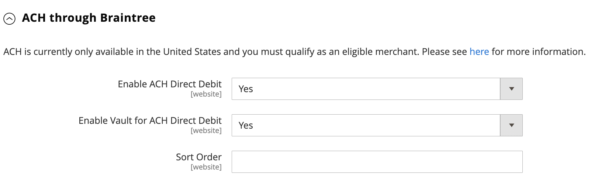

# Braintree

Braintree offre une expérience de paiement entièrement personnalisable avec détection des fraudes et intégration PayPal. Il prend en charge [!DNL Apple Pay], [!DNL Google Pay], ACH, Venmo et les modes de paiement locaux. Le Braintree réduit la charge de conformité PCI pour les commerçants, car la transaction a lieu sur le système de Braintree. L’intégration des paiements Braintree est développée par [GENE Commerce](https://www.gene.co.uk/gene-braintree-payments/).

>[!NOTE]
>
>Si vous effectuez une mise à niveau vers la version 2.4.x à partir d’une version antérieure d’Adobe Commerce ou d’un Magento Open Source avec l’extension de Braintree du Commerce Marketplace installé, consultez la [Notes de mise à niveau vers 2.4](#24-upgrade-notes) à la fin de cette page.

## Étape 1 : obtenir les informations d’identification de votre Braintree

Accéder à [Paiements Braintree][1] et vous inscrire à un compte.

## Étape 2 : définition des paramètres de base

1. Le _Admin_ barre latérale, accéder à **[!UICONTROL Stores]** > _[!UICONTROL Settings]_>**[!UICONTROL Configuration]**.

1. Dans le panneau de gauche, développez **[!UICONTROL Sales]** et choisissez **[!UICONTROL Payment Methods]**.

   - Si votre installation Commerce comporte plusieurs sites web, boutiques ou vues, dans le coin supérieur gauche, choisissez l’option **[!UICONTROL Store View]** où la configuration s’applique.

   - Dans le _[!UICONTROL Merchant Location]_, vérifiez que **[!UICONTROL Merchant Country]**est défini sur l’emplacement de votre entreprise.

1. Sous _[!UICONTROL Recommended Solutions]_, dans le_[!UICONTROL Braintree Payments] (par [GENE Commerce](https://www.gene.co.uk/gene-braintree-payments/) v4.6.1 - [Notes de mise à jour](https://support.gene.co.uk/support/solutions/articles/35000228529)_, cliquez sur **[!UICONTROL Configure]**.

   {width="600" zoomable="yes"}

1. Pour **[!UICONTROL Title]**, saisissez un titre qui identifie Braintree comme option de paiement lors du passage en caisse.

1. Définir le fonctionnement actuel **[!UICONTROL Environment]** pour les transactions Braintree vers `Sandbox` ou `Production`

   Lors du test de la configuration dans un sandbox, utilisez uniquement [numéros de carte de crédit][2] recommandés par Braintree. Lorsque vous êtes prêt à passer en production avec Braintree, définissez **[!UICONTROL Environment]** vers `Production`.

   {width="600" zoomable="yes"}

1. Définir **[!UICONTROL Payment Action]** à l’un des éléments suivants :

   - `Authorize Only` - Valide l&#39;achat et bloque les fonds. Le montant n&#39;est pas retiré du compte bancaire du client tant que la vente n&#39;est pas _capturé_ par le marchand.|
   - `Intent Sale`  - Le montant de l&#39;achat est autorisé et immédiatement retiré du compte du client. **_Remarque :_** Cette valeur était  _Autoriser et capturer_ dans 2.3.x et les versions antérieures.|

1. Saisir le **[!UICONTROL Sandbox Merchant ID / Merchant ID]** à partir de votre compte de Braintree.

1. Saisissez les informations d’identification suivantes à partir du compte de votre Braintree :

   - **[!UICONTROL Sandbox Public Key / Public Key]**
   - **[!UICONTROL Sandbox Private Key / Private Key]**

   >[!NOTE]
   >
   >Il existe des champs distincts pour les deux **(Sandbox et production)** et les autres champs s’affichent en fonction de l’environnement sélectionné.

1. Avant d’enregistrer la configuration, cliquez sur **[!UICONTROL Validate Credentials]** pour valider vos informations d’identification.

1. Définir **[!UICONTROL Enable Card Payments]** vers `Yes`.

   {width="600" zoomable="yes"}

   Si vous souhaitez pouvoir stocker les informations client en toute sécurité, afin que les clients n’aient pas à les saisir à chaque achat, définissez **[!UICONTROL Enable Vault for Card Payments]** vers `Yes`.

## Étape 3 : définition des paramètres avancés

1. Développer  le **[!UICONTROL Advanced Braintree Settings]** section.

   {width="550" zoomable="yes"}

1. Pour **[!UICONTROL Vault Title]**, saisissez un titre descriptif pour votre référence qui identifie le coffre dans lequel vos informations de carte client sont stockées.

1. Saisir le **[!UICONTROL Merchant Account ID]** à partir de votre compte de Braintree.

   Si vous ne spécifiez pas le compte marchand à utiliser, Braintree traite la transaction à l&#39;aide de votre compte marchand par défaut.

1. Pour offrir une expérience de paiement plus rapide avec les options de paiement express au début du processus de paiement, notamment PayPal, PayLater, Apple Pay et Google Pay, définissez **[!UICONTROL Enable Checkout Express Payments]** vers `Yes`.

1. Pour empêcher l&#39;envoi de la transaction pour évaluation dans le cadre des contrôles des outils antifraude avancés, sur les commandes passées via l&#39;administrateur, définissez **[!UICONTROL Skip Fraud Checks on Admin Orders]** vers `Yes`.

1. Définir le **[!UICONTROL Bypass Fraud Protection Threshold]** afin que le `Advanced Fraud Protection` les contrôles sont ignorés lorsque le seuil est atteint ou dépassé.

   Si vous ne renseignez pas ce champ, cette option est désactivée.

1. Si vous souhaitez que le système enregistre un fichier journal des interactions entre votre magasin et votre Braintree, définissez **[!UICONTROL Debug]** vers `Yes`.

1. Pour demander aux clients de fournir le code de sécurité à trois chiffres au verso d’une carte de crédit, définissez **[!UICONTROL CVV Verification]** vers `Yes`.

   Si vous utilisez la vérification CVV, veillez à activer AVS et/ou CVV dans le _Paramètres/Traitement_ de votre compte de Braintree.

1. Pour envoyer les articles de la ligne de panier pour tous les modes de paiement, définissez **[!UICONTROL Send Card Line Items]** vers `Yes`.

1. Pour **[!UICONTROL Credit Card Types]**, sélectionnez chaque carte de crédit acceptée par votre boutique en tant que paiement par Braintree.

   Pour sélectionner plusieurs types de carte, maintenez la touche Ctrl (PC) ou Commande (Mac) enfoncée et cliquez sur chaque option.

1. Pour **[!UICONTROL Sort Order]**, saisissez un nombre pour déterminer l&#39;ordre dans lequel le Braintree apparaît lorsqu&#39;il est indiqué avec d&#39;autres modes de paiement lors du passage en caisse.

## Étape 4 : définir les paramètres du Webhook du Braintree

{width="600" zoomable="yes"}

1. Définir **[!UICONTROL Enable Webhook]** vers `Yes` pour activer la fonctionnalité webhook pour la protection contre la fraude, les paiements ACH et les méthodes de paiement locales.

1. Copiez l’URL dans le **[!UICONTROL Fraud Protection URL]** et ajoutez-le à votre compte de Braintree en tant que _[!UICONTROL Webhook Destination URL]_.

   >[!IMPORTANT]
   >
   >Cette URL doit être sécurisée et accessible au public.

1. Définir le **[!UICONTROL Fraud Protection Approve Order Status]** pour déterminer quand la protection contre la fraude est approuvée par le Braintree.

   Le statut de la commande sélectionnée est affecté à la commande Commerce.

1. Définir le **[!UICONTROL Fraud Protection Reject Order Status]** champ permettant de déterminer à quel moment la protection contre la fraude est rejetée par le Braintree.

   Le statut de la commande sélectionnée est affecté à la commande Commerce.

## Étape 5 : définition des paramètres spécifiques au pays

1. Définir **[!UICONTROL Payment from Applicable Countries]** à l’un des éléments suivants :

   - `All Allowed Countries` - Clients de tous les [pays](../getting-started/store-details.md#country-options) spécifié dans la configuration de votre boutique peut utiliser ce mode de paiement.
   - `Specific Countries` - Après avoir choisi cette option, le _[!UICONTROL Payment from Specific Countries]_La liste s’affiche. Maintenez la touche Ctrl (PC) ou Commande (Mac) enfoncée et sélectionnez chaque pays dans la liste où les clients peuvent effectuer des achats dans votre boutique.

   {width="600" zoomable="yes"}

1. À configurer **[!UICONTROL Country Specific Credit Card Types]**:

   - Clic **[!UICONTROL Add]**.

   - Définir le **[!UICONTROL Country]** et choisissez chaque **[!UICONTROL Allowed Credit Card Type]**.

   - Répétez cette opération pour identifier les cartes de crédit acceptées dans chaque pays.

## Étape 6 : terminer l&#39;ACH via les paramètres du Braintree

{width="600" zoomable="yes"}

1. Pour inclure ACH comme option de paiement avec Braintree, définissez **[!UICONTROL Enable ACH Direct Debit]** vers `Yes`.

1. Les clients peuvent mettre en coffre leur méthode de paiement par prélèvement automatique ACH à usage unique et la stocker pour une utilisation ultérieure. Une fois voûté, le client peut réutiliser ACH Direct Debit sans avoir à entrer à nouveau ou authentifier ses informations de paiement si elles sont définies **[!UICONTROL Enable Vault for ACH Direct Debit]** vers `Yes`.

1. Pour **[!UICONTROL Sort Order]**, saisissez un nombre pour déterminer l&#39;ordre dans lequel l&#39;option de paiement ACH Braintree apparaît lorsqu&#39;elle est répertoriée avec d&#39;autres options de paiement lors du passage en caisse.

## Étape 7 : effectuez l’opération [!UICONTROL Apple Pay] via les paramètres du Braintree

{width="600" zoomable="yes"}

1. À inclure [!DNL Apple Pay] comme option de paiement avec Braintree, définissez **[!UICONTROL Enable ApplePay through Braintree]** vers `Yes`.

   Veillez à [vérifier votre nom de domaine](https://developer.paypal.com/braintree/docs/guides/apple-pay/configuration/javascript/v3) dans votre compte de Braintree en premier.

1. Si vous souhaitez pouvoir stocker les informations client en toute sécurité, afin que les clients n’aient pas à les saisir à chaque fois qu’ils effectuent un achat avec Apple Pay, définissez **[!UICONTROL Enable Vault for ApplePay]** vers `Yes`.

1. Définir **[!UICONTROL Payment Action]** à l’un des éléments suivants :

   - `Authorize Only` - Valide l&#39;achat et bloque les fonds. Le montant n&#39;est pas retiré du compte bancaire du client tant que la vente n&#39;est pas _capturé_ par le marchand.
   - `Intent Sale` - Le montant de l&#39;achat est autorisé et immédiatement retiré du compte du client.

1. Pour **[!UICONTROL Merchant Name]**, saisissez le texte qui spécifie le libellé affiché pour les clients dans la boîte de dialogue Apple Pay.

1. Pour **[!UICONTROL Sort Order]**, saisissez un nombre pour déterminer l’ordre dans lequel [!DNL Apple Pay] l’option de paiement apparaît lorsqu’elle est répertoriée avec d’autres options de paiement lors du passage en caisse.

## Etape 8 : Renseigner les paramètres des modes de paiement locaux

1. Pour inclure les modes de paiement locaux comme option de paiement avec Braintree, définissez **[!UICONTROL Enable Local Payment Methods]** vers `Yes`.

1. Pour **[!UICONTROL Title]**, saisissez le texte à utiliser pour le libellé qui apparaît dans la section mode de paiement de la commande (valeur par défaut : `Local Payments`).

1. Pour **[!UICONTROL Fallback Button Text]**, saisissez le texte à utiliser pour le bouton qui s’affiche sur la page du Braintree de secours afin de renvoyer le client sur le site web (par exemple, `Complete Checkout`).

1. Pour **[!UICONTROL Redirect on Fail]**, saisissez l&#39;URL vers laquelle les clients doivent être redirigés lorsque les transactions du mode de paiement local sont annulées, échouent ou rencontrent des erreurs. Il doit s’agir de la page de paiement de la commande (par exemple, `https://www.domain.com/checkout#payment`).

1. Pour **[!UICONTROL Allowed Payment Methods]**, sélectionnez le mode de paiement local à activer.

   Options : `Bancontact` / `EPS` / `giropay` / `iDeal` / `Klarna Pay Now` / `SOFORT` / `MyBank` / `P24` / `SEPA/ELV Direct Debit` (pas encore pris en charge)

   {width="600" zoomable="yes"}

   >[!NOTE]
   >
   >L’extension de Braintree groupé ne prend pas en charge tous les modes de paiement locaux répertoriés dans le [Documentation destinée aux développeurs de Braintree](https://developer.paypal.com/braintree/docs/guides/local-payment-methods/overview). D’autres méthodes de paiement locales sont en cours de développement et seront prises en charge dans les prochaines versions.

1. Pour **[!UICONTROL Sort Order]**, saisissez un numéro pour déterminer l&#39;ordre dans lequel le mode de paiement local apparaît lorsqu&#39;il est répertorié avec d&#39;autres options de paiement lors du passage en caisse.

## Étape 9 : effectuez l’opération [!DNL Google Pay] via les paramètres du Braintree

{width="600" zoomable="yes"}

1. À inclure [!DNL Google Pay] comme option de paiement avec Braintree, définissez **[!UICONTROL Enable GooglePay Through Braintree]** vers `Yes`.

1. Si vous souhaitez pouvoir stocker les informations client en toute sécurité, afin que les clients n’aient pas à les saisir à chaque fois qu’ils effectuent un achat avec Google Pay, définissez **[!UICONTROL Enable Vault for GooglePay]** vers `Yes`.

1. Définir **[!UICONTROL Payment Action]** à l’un des éléments suivants :

   - `Authorize Only` - Valide l&#39;achat et bloque les fonds. Le montant n&#39;est pas retiré du compte bancaire du client tant que la vente n&#39;est pas _capturé_ par le marchand.
   - `Intent Sale`  - Le montant de l&#39;achat est autorisé et immédiatement retiré du compte du client.

1. Définir **[!UICONTROL Button Color]** pour déterminer la couleur du [!DNL Google Pay] bouton : `White` ou `Black`

1. Pour **[!UICONTROL Merchant ID]**, saisissez votre MerchantID (fourni par Google).

1. Pour **[!UICONTROL Accepted Cards]**, sélectionnez le type de cartes qu’un client peut utiliser pour passer une commande [!DNL Google Pay].

   Options : `Visa` / `MasterCard` / `AMEX` / `Discover` / `JCB`

1. Pour **[!UICONTROL Sort Order]**, saisissez un nombre pour déterminer l’ordre dans lequel [!DNL Google Pay] apparaît lorsqu’elle est répertoriée avec d’autres options de paiement lors du passage en caisse.

## Étape 10 : terminer Venmo via les paramètres du Braintree

1. Pour inclure Venmo comme option de paiement avec Braintree, définissez **[!UICONTROL Enable Venmo through Braintree]** vers `Yes`.

1. Définir **[!UICONTROL Enable Vault for Venmo]** vers `Yes` pour permettre l’utilisation d’un coffre sécurisé afin de stocker le compte Venmo des clients et clientes, de sorte qu’ils n’aient plus à se connecter à leur compte Venmo pour de futures transactions.

   {width="600" zoomable="yes"}

1. Définir **[!UICONTROL Payment Action]** à l’un des éléments suivants :

   - `Authorize Only` - Valide l&#39;achat et bloque les fonds. Le montant n&#39;est pas retiré du compte bancaire du client tant que la vente n&#39;est pas _capturé_ par le marchand.
   - `Intent Sale`  - Le montant de l&#39;achat est autorisé et immédiatement retiré du compte du client.

1. Pour **[!UICONTROL Sort Order]**, saisissez un nombre pour déterminer l&#39;ordre dans lequel Venmo apparaît lorsqu&#39;il est mis en vente avec d&#39;autres options de paiement lors du passage en caisse.

## Étape 11 : Compléter PayPal via les paramètres du Braintree

{width="550" zoomable="yes"}

1. Pour inclure PayPal comme option de paiement avec Braintree, définissez **[!UICONTROL Enable PayPal through Braintree]** vers `Yes`.

1. Spécifiez votre PayPal par le biais du mode de paiement par Braintree :

   >[!NOTE]
   >
   >Soit **[!DNL PayPal Credit]** ou **[!DNL PayPal PayLater]** peut être activé. Les deux méthodes ne peuvent pas être activées simultanément.

   - À inclure [!DNL PayPal Credit] comme option de paiement avec Braintree, définissez **[!UICONTROL Enable PayPal Credit through Braintree]** vers `Yes`.

     Lorsque **Activer PayPal via Braintree** est défini sur `Yes`, seul ce champ apparaît.

     >[!NOTE]
     >
     >PayPal Credit est disponible uniquement aux États-Unis et au Royaume-Uni. Le crédit PayPal est désactivé si la valeur sélectionnée pour _[!UICONTROL Merchant Country]_le champ n’est pas `US` ou `UK`.

   - À inclure [!DNL PayPal PayLater] comme option de paiement avec Braintree, définissez **[!UICONTROL Enable PayPal PayLater through Braintree]** vers `Yes`.

     Lorsque **[!UICONTROL Enable PayPal PayLater through Braintree]** est défini sur `Yes`, seul ce champ apparaît.

     Vous pouvez afficher des messages PayLater sur votre site pour des offres telles que : _Payer en 3_, qui permet aux clients de payer avec trois mensualités sans intérêt. L’intégration du Braintree peut afficher des messages sur votre site pour promouvoir cette fonctionnalité. Vous ne pouvez pas promouvoir des offres PayLater avec tout autre contenu, marketing ou matériel.

1. Pour **[!UICONTROL Title]**, saisissez un titre qui identifie le paiement du Braintree par PayPal lors du passage en caisse.

1. Définir **[!UICONTROL Vault Enabled]** vers `Yes` pour permettre l’utilisation d’un coffre sécurisé pour stocker le compte PayPal des clients. Un compte PayPal sécurisé peut être utilisé pour les transactions futures, ce qui réduit le nombre d&#39;étapes pour les clients.

1. Définir **[!UICONTROL Send Cart Line Items for PayPal]** vers `Yes` pour envoyer les objets de ligne (objets de commande) à PayPal avec les cartes-cadeaux, l&#39;emballage-cadeau pour les objets, l&#39;emballage-cadeau pour la commande, le crédit de magasin, l&#39;expédition et la taxe comme objets de ligne.

1. Pour **[!UICONTROL Sort Order]**, saisissez un nombre pour déterminer l&#39;ordre dans lequel l&#39;option de paiement PayPal du Braintree apparaît lorsqu&#39;elle est répertoriée avec d&#39;autres options de paiement lors du passage en caisse.

1. Pour afficher le nom de votre commerçant différemment de ce qui est défini dans votre [configuration du magasin](../getting-started/store-details.md#store-information), saisissez le nom dans le champ **[!UICONTROL Override Merchant Name]** champ tel que vous souhaitez qu’il apparaisse.

1. Définir **[!UICONTROL Payment Action]** à l’un des éléments suivants :

   - `Authorize Only` - Valide l&#39;achat et bloque les fonds. Le montant n&#39;est pas retiré du compte bancaire du client tant que la vente n&#39;est pas _capturé_ par le marchand.
   - `Authorize and Capture` - Le montant de l&#39;achat est autorisé et immédiatement retiré du compte du client.

1. Définir **[!UICONTROL Payment from Applicable Countries]** à l&#39;une des options suivantes pour les transactions de Braintree traitées par PayPal :

   - `All Allowed Countries` - Clients de tous les [pays](../getting-started/store-details.md#country-options) spécifié dans la configuration de votre boutique peut utiliser ce mode de paiement.
   - `Specific Countries` - Après avoir choisi cette option, le _[!UICONTROL Payment from Specific Countries]_La liste s’affiche. Maintenez la touche Ctrl (PC) ou Commande (Mac) enfoncée et sélectionnez chaque pays dans la liste où les clients peuvent effectuer des achats dans votre boutique.

1. Pour demander aux clients de fournir une adresse de facturation, définissez **[!UICONTROL Require Customer's Billing Address]** vers `Yes`.

   >[!NOTE]
   >
   >Cette fonctionnalité doit être activée pour votre compte par le support technique PayPal.

1. Pour enregistrer un fichier journal des interactions entre votre boutique et PayPal par Braintree, définissez **[!UICONTROL Debug]** vers `Yes`.

1. Pour afficher le bouton PayPal sur la page du mini panier et du panier, définissez **[!UICONTROL Display on Shopping Cart]** vers `Yes`.

## Étape 12 : définir les paramètres de style

1. Pour **[!UICONTROL Location]**, choisissez l’emplacement où les boutons et messages PayPal sont rendus : `Mini-Cart and Cart Page`, `Checkout Page`, ou `Product Page`

   {width="600" zoomable="yes"}

### [!UICONTROL Mini-Cart and Cart Page]

Les options et paramètres de cette section varient en fonction du paramètre du _[!UICONTROL Location]_champ .

1. Définir **[!UICONTROL PayPal Button Type]** sur l’un des trois types de boutons : `PayPal Button` / `PayPal Pay Later Button` / `PayPal Credit Button`

**[!UICONTROL PayPal Button]**

Les options et paramètres de cette section varient en fonction du type de bouton sélectionné dans le _[!UICONTROL PayPal Button Type]_champ .

1. Pour afficher le bouton PayPal sur le storefront à l&#39;emplacement sélectionné, définissez **[!UICONTROL Show PayPal Button]** vers `Yes`.

1. Pour **[!UICONTROL Button Label]**, sélectionnez le libellé du bouton PayPal : `Paypal`, `Checkout`, `Buynow`, ou `Pay`

1. Pour **[!UICONTROL Color]**, sélectionnez la couleur du bouton PayPal : `Blue`, `Black`, `Gold`, ou `Silver`

1. Pour **[!UICONTROL Shape]**, sélectionnez la forme du bouton PayPal : `Pill` ou `Rectangle`

1. Pour **[!UICONTROL Size (Deprecated)]**, sélectionnez la taille du bouton PayPal : `Medium`, `Large`, ou `Responsive`

>[!NOTE]
>
>Le **[!DNL Size(Deprecated)]** Le champ de configuration est obsolète et n&#39;est pas utilisé pour appliquer un style aux boutons PayPal.

**[!UICONTROL PayLater Messaging]**

1. À afficher [!DNL PayLater] messagerie sur le storefront à l&#39;emplacement sélectionné, définissez **[!UICONTROL Show PayLater Messaging]** vers `Yes`.

   Ce message inclut l’affichage de [!DNL PayLater] messagerie pour les offres disponibles ([restrictions s’appliquent](https://developer.paypal.com/docs/checkout/pay-later/us/)).

1. Pour **[!UICONTROL Message Layout]**, sélectionnez le [!DNL PayLater] disposition du message : `Text` ou `Flex`

1. Pour **[!UICONTROL Logo]**, sélectionnez le type de logo PayPal : `Inline`, `Primary`, `Alternative`, ou `None`

1. Pour **[!UICONTROL Logo Position]**, sélectionnez la position du logo PayPal : `Left`, `Right`, ou `Top`

1. Pour **[!UICONTROL Text Color]**, sélectionnez le [!DNL PayLater] couleur du texte du message : `Black`, `White`, `Monochrome`, ou `Grayscale`

Lorsque ces options sont définies, vous pouvez voir l&#39;aperçu des boutons PayPal et des messages PayLater. Vous pouvez utiliser certaines commandes pour appliquer les paramètres ou réinitialiser les valeurs :

- Pour stocker les paramètres de style sélectionnés pour les boutons et les messages PayLater et les appliquer à l&#39;emplacement actuel et au type de bouton actuel, cliquez sur **[!UICONTROL Apply]**.

- pour stocker les paramètres de style sélectionnés pour les boutons et les valeurs de message PayLater et les appliquer à tous les types de boutons et emplacements, cliquez sur **[!UICONTROL Apply to All Buttons]**.

- Pour rétablir les paramètres de style aux valeurs par défaut recommandées pour les boutons et les messages PayLater et les appliquer à tous les types de boutons et emplacements, cliquez sur **[!UICONTROL Reset to Recommended Defaults]**.

## Étape 13 : compléter les paramètres de vérification 3D

1. Si vous souhaitez ajouter une étape de vérification pour les clients utilisant des cartes de crédit qui sont inscrits à un programme de vérification (tel que _Vérifié par VISA_), défini **[!UICONTROL 3D Secure Verification]** vers `Yes`.

   Au cours du processus, le montant de la transaction qui est soumis à vérification est vérifié par rapport au montant qui est envoyé pour autorisation.

2. Pour toujours contester la requête 3D Secure pour toutes les transactions, définissez **[!UICONTROL Always request 3DS]** vers `Yes`.

3. Pour **[!UICONTROL Threshold Amount]**, saisissez le montant de commande minimal requis pour déclencher la vérification 3D.

4. Définir **[!UICONTROL Verify for Applicable Countries]** à l’un des éléments suivants :

   - `All Allowed Countries` - Clients de tous les [pays](../getting-started/store-details.md#country-options) spécifié dans la configuration de votre boutique peut utiliser ce mode de paiement.
   - `Specific Countries` - Après avoir choisi cette option, le _[!UICONTROL Verify for Specific Countries]_La liste s’affiche. Maintenez la touche Ctrl (PC) ou Commande (Mac) enfoncée et sélectionnez chaque pays dans la liste où les clients peuvent effectuer des achats dans votre boutique.

   {width="600" zoomable="yes"}

## Étape 14 : configurer les descripteurs dynamiques du Braintree

Les descripteurs suivants sont utilisés pour identifier les achats sur les relevés de carte de crédit du client. Vous pouvez réduire le nombre de refacturations en identifiant clairement la société associée à chaque achat. Si les descripteurs dynamiques ne sont pas activés pour votre compte, contactez l’assistance du Braintree.

{width="600" zoomable="yes"}

1. Saisissez le descripteur dynamique pour le **[!UICONTROL Name]**, **[!UICONTROL Phone]**, et **[!UICONTROL URL]** conformément à ces directives :

   - **[!UICONTROL Name]** - Le descripteur de nom comporte deux parties, séparées par un astérisque (*). Par exemple :

     `company*myproduct`

     La première partie du descripteur identifie la société ou l&#39;administrateur de base de données, et la seconde partie identifie le produit. La longueur du `company` et `product` les parties du descripteur peuvent être attribuées des manières suivantes, pour une longueur combinée maximale de 22 caractères.

     **_Caractères dans le descripteur de nom_**

     _Option 1 :_ `Company` doit contenir trois caractères, `Product` 18 caractères maximum

     _Option 2 :_ `Company` doit contenir sept caractères, `Product` 14 caractères maximum

     _Option 3_: `Company` doit contenir 12 caractères, `Product` peut contenir neuf caractères maximum

   - **[!UICONTROL Phone]** - Le descripteur de téléphone doit comporter entre 10 et 14 caractères et ne peut contenir que des chiffres, des tirets, des parenthèses et des points. Par exemple :

     `9999999999`

     `(999) 999-9999`

     `999.999.9999`

   - **[!UICONTROL URL]** - Le descripteur d’URL représente votre nom de domaine et peut contenir jusqu’à 13 caractères. Par exemple :

     `company.com`

1. Une fois la configuration du Braintree terminée, cliquez sur **[!UICONTROL Save Config]**.

## Notes de mise à niveau vers 2.4

À partir d’Adobe Commerce et de Magento Open Source 2.4.0, l’extension de Braintree est incluse dans la version. Si vous migrez vers Commerce 2.4.x à partir d’une version antérieure à 2.4.0 sur laquelle l’extension de Braintree Marketplace est installée, vous devez désinstaller cette extension (`paypal/module-braintree` ou `gene/module-braintree`) et mettez à jour toutes les personnalisations de code pour utiliser `PayPal_Braintree` espace de noms au lieu de `Magento_Braintree`. Les paramètres de configuration de l’extension principale Commerce Braintree Payments et de l’extension distribuée sur Commerce Marketplace persistent et les paiements placés avec ces versions précédentes peuvent toujours être capturés, annulés ou remboursés normalement.

[1]: https://www.braintreepayments.com/
[2]: https://developers.braintreepayments.com/reference/general/testing/php
