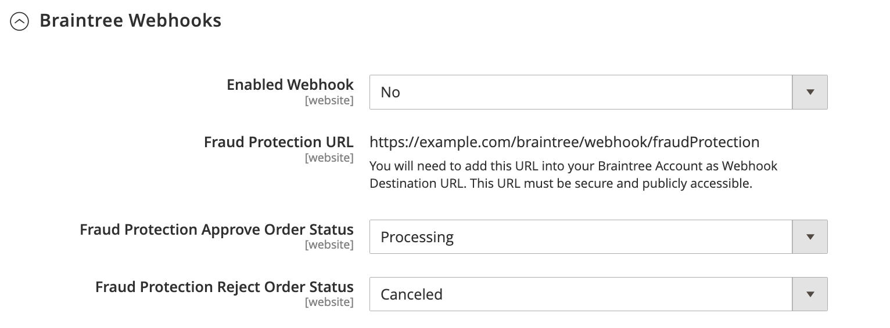

# Braintree

>[!IMPORTANT]
>
>Si vous avez besoin d&#39;aide pour régler des frais imprévus sur votre carte, consultez la page [annuler l&#39;abonnement](https://helpx.adobe.com/manage-account/using/cancel-subscription.html) pour obtenir de l&#39;aide.

Braintree offre une expérience de paiement entièrement personnalisable avec détection des fraudes et intégration PayPal. Il prend en charge les méthodes de paiement [!DNL Apple Pay], [!DNL Google Pay], ACH, Venmo et locales. Braintree réduit la charge de conformité PCI pour les commerçants, car la transaction a lieu sur le système Braintree. L’intégration de Braintree Payments est développée par [GENE Commerce](https://www.gene.co.uk/gene-braintree-payments/).

>[!NOTE]
>
>Si vous effectuez une mise à niveau vers la version 2.4.x à partir d’une version antérieure d’Adobe Commerce ou de Magento Open Source avec l’extension Braintree de Commerce Marketplace installée, consultez les notes de mise à niveau de la version [2.4](#24-upgrade-notes) à la fin de cette page.

## Étape 1 : obtenir vos informations d’identification Braintree

Accédez à [Braintree Payments][1] et inscrivez-vous à un compte.

## Étape 2 : définition des paramètres de base

1. Dans la barre latérale _Admin_, accédez à **[!UICONTROL Stores]** > _[!UICONTROL Settings]_>**[!UICONTROL Configuration]**.

1. Dans le panneau de gauche, développez **[!UICONTROL Sales]** et choisissez **[!UICONTROL Payment Methods]**.

   - Si votre installation Commerce comporte plusieurs sites web, boutiques ou vues, dans le coin supérieur gauche, choisissez la **[!UICONTROL Store View]** où s’applique la configuration.

   - Dans la section _[!UICONTROL Merchant Location]_, vérifiez que **[!UICONTROL Merchant Country]**est défini sur l’emplacement de votre entreprise.

1. Sous _[!UICONTROL Recommended Solutions]_, dans la section_[!UICONTROL Braintree Payments] (par [GENE Commerce](https://www.gene.co.uk/gene-braintree-payments/) v4.7.0 - [Notes de mise à jour](https://support.gene.co.uk/support/solutions/articles/35000278668)_, cliquez sur **[!UICONTROL Configure]**.

   {width="600" zoomable="yes"}

1. Par **[!UICONTROL Title]**, saisissez un titre qui identifie Braintree comme option de paiement lors du passage en caisse.

1. Définissez la **[!UICONTROL Environment]** d’exploitation actuelle pour les transactions Braintree sur `Sandbox` ou `Production`

   Lors du test de la configuration dans un sandbox, utilisez uniquement les [numéros de carte de crédit][2] recommandés par Braintree. Lorsque vous êtes prêt à passer en production avec Braintree, définissez **[!UICONTROL Environment]** sur `Production`.

   {width="600" zoomable="yes"}

1. Définissez **[!UICONTROL Payment Action]** sur l’une des options suivantes :

   - `Authorize Only` - Valide l&#39;achat et met un blocage sur les fonds. Le montant n&#39;est pas retiré du compte bancaire du client tant que la vente n&#39;est pas _capturée_ par le commerçant.|
   - `Intent Sale` - Le montant de l&#39;achat est autorisé et immédiatement retiré du compte du client. **_Remarque :_** cette valeur était _Autoriser et capturer_ dans la version 2.3.x et les versions antérieures.|

1. Saisissez le **[!UICONTROL Sandbox Merchant ID / Merchant ID]** de votre compte Braintree.

1. Saisissez les informations d’identification suivantes à partir de votre compte Braintree :

   - **[!UICONTROL Sandbox Public Key / Public Key]**
   - **[!UICONTROL Sandbox Private Key / Private Key]**

   >[!NOTE]
   >
   >Il existe des champs distincts pour les deux environnements **(Sandbox et Production)** et les autres champs s’affichent en fonction de l’environnement sélectionné.

1. Avant d’enregistrer la configuration, cliquez sur **[!UICONTROL Validate Credentials]** pour valider vos informations d’identification.

1. Définissez **[!UICONTROL Enable Card Payments]** sur `Yes`.

1. Si vous souhaitez pouvoir stocker les informations client en toute sécurité, afin que les clients n’aient pas à les saisir à nouveau chaque fois qu’ils effectuent un achat, définissez **[!UICONTROL Enable Vault for Card Payments]** sur `Yes`.

1. Si vous souhaitez qu’un client vérifie le numéro CVV de sa carte voûtée à chaque achat, définissez **[!UICONTROL Enable Vault CVV Re-verification]** sur `Yes`.

## Étape 3 : définition des paramètres avancés

1. Développez  la section **[!UICONTROL Advanced Braintree Settings]** .

   {width="550" zoomable="yes"}

1. Par **[!UICONTROL Vault Title]**, saisissez un titre descriptif pour votre référence qui identifie le coffre dans lequel vos informations de carte client sont stockées.

1. Saisissez le **[!UICONTROL Merchant Account ID]** de votre compte Braintree.

   Si vous ne spécifiez pas le compte commerçant à utiliser, Braintree traite la transaction à l’aide de votre compte commerçant par défaut.

1. Pour offrir une expérience de paiement plus rapide avec les options de paiement express au début du processus de paiement, y compris PayPal, PayLater, Apple Pay et Google Pay, définissez **[!UICONTROL Enable Checkout Express Payments]** sur `Yes`.

1. Si vous souhaitez empêcher que la transaction ne soit envoyée pour évaluation dans le cadre des contrôles des outils avancés de lutte contre la fraude, pour les commandes passées via l’administrateur, définissez **[!UICONTROL Skip Fraud Checks on Admin Orders]** sur `Yes`.

1. Définissez le **[!UICONTROL Bypass Fraud Protection Threshold]** de sorte que les vérifications de `Advanced Fraud Protection` soient contournées lorsque le seuil est atteint ou dépassé.

   Si vous ne renseignez pas ce champ, cette option est désactivée.

1. Si vous souhaitez que le système enregistre un fichier journal des interactions entre votre magasin et Braintree, définissez **[!UICONTROL Debug]** sur `Yes`.

1. Pour demander aux clients de fournir le code de sécurité à trois chiffres à l’arrière d’une carte de crédit, définissez **[!UICONTROL CVV Verification]** sur `Yes`.

   Si vous utilisez la vérification CVV, veillez à activer AVS et/ou CVV dans la section _Paramètres/Traitement_ de votre compte Braintree.

1. Pour envoyer les articles de la ligne de panier pour tous les modes de paiement, définissez **[!UICONTROL Send Card Line Items]** sur `Yes`.

1. Par **[!UICONTROL Credit Card Types]**, sélectionnez chaque carte de crédit acceptée par votre boutique en tant que paiement via Braintree.

   Pour sélectionner plusieurs types de carte, maintenez la touche Ctrl (PC) ou Commande (Mac) enfoncée et cliquez sur chaque option.

1. Par **[!UICONTROL Sort Order]**, saisissez un nombre pour déterminer l&#39;ordre dans lequel Braintree apparaît lorsqu&#39;il est répertorié avec d&#39;autres modes de paiement lors du passage en caisse.

## Étape 4 : définition des paramètres du webhook Braintree

{width="600" zoomable="yes"}

1. Définissez **[!UICONTROL Enable Webhook]** sur `Yes` pour activer la fonctionnalité webhook pour la protection contre la fraude, les paiements ACH et les modes de paiement locaux.

1. Copiez l’URL dans le champ **[!UICONTROL Fraud Protection URL]** et ajoutez-la à votre compte Braintree en tant que _[!UICONTROL Webhook Destination URL]_.

   >[!IMPORTANT]
   >
   >Cette URL doit être sécurisée et accessible au public.

1. Définissez le champ **[!UICONTROL Fraud Protection Approve Order Status]** pour déterminer à quel moment la protection contre la fraude est approuvée par Braintree.

   Le statut de la commande sélectionnée est affecté à la commande Commerce.

1. Définissez le champ **[!UICONTROL Fraud Protection Reject Order Status]** pour déterminer à quel moment Braintree rejette la protection contre la fraude.

   Le statut de la commande sélectionnée est affecté à la commande Commerce.

## Étape 5 : remplir les paramètres spécifiques au pays

1. Définissez **[!UICONTROL Payment from Applicable Countries]** sur l’une des options suivantes :

   - `All Allowed Countries` - Les clients de tous les [pays](../getting-started/store-details.md#country-options) spécifiés dans la configuration de votre boutique peuvent utiliser ce mode de paiement.
   - `Specific Countries` - Après avoir choisi cette option, la liste des _[!UICONTROL Payment from Specific Countries]_s’affiche. Maintenez la touche Ctrl (PC) ou Commande (Mac) enfoncée et sélectionnez chaque pays dans la liste où les clients peuvent effectuer des achats dans votre boutique.

   {width="600" zoomable="yes"}

1. Pour configurer **[!UICONTROL Country Specific Credit Card Types]** :

   - Cliquez sur **[!UICONTROL Add]**.

   - Définissez la **[!UICONTROL Country]** et choisissez chaque **[!UICONTROL Allowed Credit Card Type]**.

   - Répétez cette opération pour identifier les cartes de crédit acceptées dans chaque pays.

## Étape 6 : terminer l&#39;ACH via les paramètres Braintree

{width="600" zoomable="yes"}

1. Pour inclure ACH comme option de paiement avec Braintree, définissez **[!UICONTROL Enable ACH Direct Debit]** sur `Yes`.

1. Les clients peuvent mettre en coffre leur méthode de paiement par prélèvement automatique ACH à usage unique et la stocker pour une utilisation ultérieure. Une fois la chambre forte utilisée, les clients peuvent réutiliser ACH Direct Debit sans avoir à entrer à nouveau ou authentifier leurs informations de paiement si elles sont définies **[!UICONTROL Enable Vault for ACH Direct Debit]** sur `Yes`.

1. Par **[!UICONTROL Sort Order]**, saisissez un nombre pour déterminer l&#39;ordre dans lequel l&#39;option de paiement Braintree ACH apparaît lorsqu&#39;elle est répertoriée avec d&#39;autres options de paiement lors du passage en caisse.

## Étape 7 : terminer la [!UICONTROL Apple Pay] via les paramètres de Braintree

{width="600" zoomable="yes"}

1. Pour inclure le [!DNL Apple Pay] en tant qu’option de paiement avec Braintree, définissez **[!UICONTROL Enable ApplePay through Braintree]** sur `Yes`.

   Veillez d’abord à [vérifier votre nom de domaine](https://developer.paypal.com/braintree/docs/guides/apple-pay/configuration/javascript/v3) dans votre compte Braintree.

1. Si vous souhaitez pouvoir stocker les informations client en toute sécurité, afin que les clients n’aient pas à les saisir à nouveau chaque fois qu’ils effectuent un achat avec Apple Pay, définissez **[!UICONTROL Enable Vault for ApplePay]** sur `Yes`.

1. Définissez **[!UICONTROL Payment Action]** sur l’une des options suivantes :

   - `Authorize Only` - Valide l&#39;achat et met un blocage sur les fonds. Le montant n&#39;est pas retiré du compte bancaire du client tant que la vente n&#39;est pas _saisie_ par le commerçant.
   - `Intent Sale` - Le montant de l&#39;achat est autorisé et immédiatement retiré du compte du client.

1. Par **[!UICONTROL Merchant Name]**, saisissez le texte qui spécifie le libellé affiché pour les clients dans la boîte de dialogue Apple Pay.

1. Par **[!UICONTROL Sort Order]**, saisissez un nombre pour déterminer l&#39;ordre dans lequel [!DNL Apple Pay]&#39;option de paiement apparaît lorsqu&#39;elle est répertoriée avec d&#39;autres options de paiement lors du passage en caisse.

## Étape 8 : Complétez les paramètres pour les modes de paiement locaux

1. Pour inclure les modes de paiement locaux en tant qu&#39;option de paiement avec Braintree, définissez **[!UICONTROL Enable Local Payment Methods]** sur `Yes`.

1. Par **[!UICONTROL Title]**, saisissez le texte à utiliser pour le libellé qui apparaît dans la section Mode de paiement de la commande (valeur par défaut : `Local Payments`).

1. Par **[!UICONTROL Fallback Button Text]**, saisissez le texte à utiliser pour le bouton qui s’affiche sur la page Braintree de secours pour renvoyer le client sur le site web (par exemple, `Complete Checkout`).

1. Par **[!UICONTROL Redirect on Fail]**, saisissez l&#39;URL vers laquelle les clients doivent être redirigés lorsque des transactions de mode de paiement local sont annulées, échouent ou rencontrent des erreurs. Il doit s’agir de la page de paiement de la commande (par exemple, `https://www.domain.com/checkout#payment`).

1. Par **[!UICONTROL Allowed Payment Methods]**, sélectionnez le mode de paiement local à activer.

   Options : `Bancontact` / `EPS` / `giropay` / `iDeal` / `Klarna Pay Now` / `SOFORT` / `MyBank` / `P24` / `SEPA/ELV Direct Debit` (pas encore pris en charge)

   {width="600" zoomable="yes"}

   >[!NOTE]
   >
   >L’extension Braintree groupée ne prend pas en charge tous les modes de paiement locaux répertoriés dans la [documentation du développeur Braintree](https://developer.paypal.com/braintree/docs/guides/local-payment-methods/overview). D’autres méthodes de paiement locales sont en cours de développement et seront prises en charge dans les prochaines versions.

1. Par **[!UICONTROL Sort Order]**, saisissez un nombre pour déterminer l&#39;ordre dans lequel le mode de paiement local apparaît lorsqu&#39;il est répertorié avec d&#39;autres options de paiement pendant le passage en caisse.

## Étape 9 : terminer la [!DNL Google Pay] via les paramètres de Braintree

{width="600" zoomable="yes"}

1. Pour inclure le [!DNL Google Pay] en tant qu’option de paiement avec Braintree, définissez **[!UICONTROL Enable GooglePay Through Braintree]** sur `Yes`.

1. Si vous souhaitez pouvoir stocker les informations client en toute sécurité, afin que les clients n’aient pas à les saisir à nouveau chaque fois qu’ils effectuent un achat avec Google Pay, définissez **[!UICONTROL Enable Vault for GooglePay]** sur `Yes`.

1. Définissez **[!UICONTROL Payment Action]** sur l’une des options suivantes :

   - `Authorize Only` - Valide l&#39;achat et met un blocage sur les fonds. Le montant n&#39;est pas retiré du compte bancaire du client tant que la vente n&#39;est pas _saisie_ par le commerçant.
   - `Intent Sale` - Le montant de l&#39;achat est autorisé et immédiatement retiré du compte du client.

1. Définissez **[!UICONTROL Button Color]** pour déterminer la couleur du bouton [!DNL Google Pay] : `White` ou `Black`

1. Par **[!UICONTROL Merchant ID]**, saisissez votre MerchantID (fourni par Google).

1. Par **[!UICONTROL Accepted Cards]**, sélectionnez le type de cartes qu’un client peut utiliser pour passer une commande à l’aide de [!DNL Google Pay].

   Options : `Visa` / `MasterCard` / `AMEX` / `Discover` / `JCB`

1. Par **[!UICONTROL Sort Order]**, saisissez un nombre pour déterminer l&#39;ordre dans lequel le [!DNL Google Pay] apparaît lorsqu&#39;il est répertorié avec d&#39;autres options de paiement lors du passage en caisse.

## Étape 10 : terminer Venmo via les paramètres de Braintree

1. Pour inclure Venmo en tant qu&#39;option de paiement avec Braintree, définissez **[!UICONTROL Enable Venmo through Braintree]** sur `Yes`.

1. Définissez **[!UICONTROL Enable Vault for Venmo]** sur `Yes` pour permettre l’utilisation d’un coffre sécurisé pour stocker le compte Venmo des clients, afin qu’ils n’aient plus besoin de se connecter à leur compte Venmo pour les transactions futures.

   {width="600" zoomable="yes"}

1. Définissez **[!UICONTROL Payment Action]** sur l’une des options suivantes :

   - `Authorize Only` - Valide l&#39;achat et met un blocage sur les fonds. Le montant n&#39;est pas retiré du compte bancaire du client tant que la vente n&#39;est pas _saisie_ par le commerçant.
   - `Intent Sale` - Le montant de l&#39;achat est autorisé et immédiatement retiré du compte du client.

1. Par **[!UICONTROL Sort Order]**, saisissez un nombre pour déterminer l&#39;ordre dans lequel Venmo apparaît lorsqu&#39;il est répertorié avec d&#39;autres options de paiement pendant le passage en caisse.

## Étape 11 : Compléter PayPal via les paramètres Braintree

{width="550" zoomable="yes"}

1. Pour inclure PayPal comme option de paiement avec Braintree, définissez **[!UICONTROL Enable PayPal through Braintree]** sur `Yes`.

1. Spécifiez votre PayPal via le mode de paiement Braintree :

   >[!NOTE]
   >
   >**[!DNL PayPal Credit]** ou **[!DNL PayPal PayLater]** peuvent être activés. Les deux méthodes ne peuvent pas être activées simultanément.

   - Pour inclure le [!DNL PayPal Credit] en tant qu’option de paiement avec Braintree, définissez **[!UICONTROL Enable PayPal Credit through Braintree]** sur `Yes`.

     Lorsque l’option **Activer PayPal via Braintree** est définie sur `Yes`, seul ce champ s’affiche.

     >[!NOTE]
     >
     >PayPal Credit est disponible uniquement aux États-Unis et au Royaume-Uni. Le crédit PayPal est désactivé si la valeur sélectionnée pour le champ _[!UICONTROL Merchant Country]_n&#39;est pas `US` ou `UK`.

   - Pour inclure le [!DNL PayPal PayLater] en tant qu’option de paiement avec Braintree, définissez **[!UICONTROL Enable PayPal PayLater through Braintree]** sur `Yes`.

     Lorsque **[!UICONTROL Enable PayPal PayLater through Braintree]** est défini sur `Yes`, seul ce champ apparaît.

     Vous pouvez afficher la messagerie PayLater sur votre site pour les offres, comme _Pay in 3_, qui permet aux clients de payer avec trois paiements mensuels sans intérêt. L’intégration de Braintree peut afficher des messages sur votre site pour promouvoir cette fonctionnalité. Vous ne pouvez pas promouvoir des offres PayLater avec tout autre contenu, marketing ou matériel.

1. Par **[!UICONTROL Title]**, saisissez un titre qui identifie l&#39;option de paiement Braintree par PayPal lors du passage en caisse.

1. Définissez **[!UICONTROL Vault Enabled]** sur `Yes` pour permettre l’utilisation d’un coffre sécurisé pour stocker le compte PayPal des clients. Un compte PayPal sécurisé peut être utilisé pour les transactions futures, ce qui réduit le nombre d&#39;étapes pour les clients.

1. Définissez **[!UICONTROL Send Cart Line Items for PayPal]** sur `Yes` pour envoyer les objets de ligne (objets de commande) à PayPal avec les cartes-cadeaux, l&#39;emballage-cadeau pour les objets, l&#39;emballage-cadeau pour la commande, le crédit de magasin, l&#39;expédition et la taxe comme objets de ligne.

1. Par **[!UICONTROL Sort Order]**, saisissez un nombre pour déterminer l&#39;ordre dans lequel l&#39;option de paiement Braintree PayPal apparaît lorsqu&#39;elle est répertoriée avec d&#39;autres options de paiement lors du passage en caisse.

1. Pour afficher le nom de votre commerçant différemment de ce qui est défini dans la configuration de votre [boutique](../getting-started/store-details.md#store-information), saisissez le nom tel que vous souhaitez qu’il apparaisse dans le champ **[!UICONTROL Override Merchant Name]**.

1. Définissez **[!UICONTROL Payment Action]** sur l’une des options suivantes :

   - `Authorize Only` - Valide l&#39;achat et met un blocage sur les fonds. Le montant n&#39;est pas retiré du compte bancaire du client tant que la vente n&#39;est pas _saisie_ par le commerçant.
   - `Authorize and Capture` - Le montant de l&#39;achat est autorisé et immédiatement retiré du compte du client.

1. Définissez **[!UICONTROL Payment from Applicable Countries]** sur l&#39;une des valeurs suivantes pour les transactions Braintree traitées par PayPal :

   - `All Allowed Countries` - Les clients de tous les [pays](../getting-started/store-details.md#country-options) spécifiés dans la configuration de votre boutique peuvent utiliser ce mode de paiement.
   - `Specific Countries` - Après avoir choisi cette option, la liste des _[!UICONTROL Payment from Specific Countries]_s’affiche. Maintenez la touche Ctrl (PC) ou Commande (Mac) enfoncée et sélectionnez chaque pays dans la liste où les clients peuvent effectuer des achats dans votre boutique.

   {width="550" zoomable="yes"}

1. Pour demander aux clients de fournir une adresse de facturation, définissez **[!UICONTROL Require Customer's Billing Address]** sur `Yes`.

   >[!NOTE]
   >
   >Cette fonctionnalité doit être activée pour votre compte par le support technique PayPal.

1. Pour ignorer la page d&#39;examen des commandes PayPal Express, définissez **[!UICONTROL Skip Order Review Step]** sur `Yes`.

   Pour les clients qui paient avec PayPal Express : si vous souhaitez que les clients soient redirigés vers une page de révision avant d&#39;effectuer le paiement, définissez ce paramètre sur `No`. Si vous préférez que les clients ignorent la page de révision, définissez-la sur `Yes`.

1. Pour enregistrer un fichier journal des interactions entre votre boutique et PayPal via Braintree, définissez **[!UICONTROL Debug]** sur `Yes`.

1. Pour afficher le bouton PayPal sur la page du mini panier et du panier, définissez **[!UICONTROL Display on Shopping Cart]** sur `Yes`.

1. Pour envoyer des informations de suivi des packages à PayPal, définissez **[!UICONTROL Send Package Tracking]** sur `Yes`.

   Les informations de suivi des packages seront envoyées à PayPal pour les transactions/commandes PayPal uniquement. Vous devez activer le champ de configuration [!UICONTROL Send Cart Line Items for PayPal] pour que la fonction [!UICONTROL Package Tracking] fonctionne correctement.

1. Pour avertir un acheteur ou un payeur par PayPal des mises à jour du suivi des packages, définissez **[!UICONTROL Use PayPal's "Notify Payer" functionality]** sur `Yes`.

## Étape 12 : définir les paramètres de style

1. Par **[!UICONTROL Location]**, choisissez l’emplacement où les boutons et messages PayPal sont rendus : `Mini-Cart and Cart Page`, `Checkout Page` ou `Product Page`

   {width="600" zoomable="yes"}

### [!UICONTROL Mini-Cart and Cart Page]

Les options et paramètres de cette section varient en fonction du paramètre du champ _[!UICONTROL Location]_.

1. Définissez **[!UICONTROL PayPal Button Type]** sur l’un des trois types de boutons : `PayPal Button` / `PayPal Pay Later Button` / `PayPal Credit Button`

**[!UICONTROL PayPal Button]**

Les options et paramètres de cette section varient en fonction du type de bouton sélectionné dans le champ _[!UICONTROL PayPal Button Type]_.

1. Pour afficher le bouton PayPal sur le storefront à l&#39;emplacement sélectionné, définissez **[!UICONTROL Show PayPal Button]** sur `Yes`.

1. Par **[!UICONTROL Button Label]**, sélectionnez le libellé du bouton PayPal : `Paypal`, `Checkout`, `Buynow` ou `Pay`

1. Par **[!UICONTROL Color]**, sélectionnez la couleur du bouton PayPal : `Blue`, `Black`, `Gold` ou `Silver`

1. Par **[!UICONTROL Shape]**, sélectionnez la forme du bouton PayPal : `Pill` ou `Rectangle`

1. Par **[!UICONTROL Size (Deprecated)]**, sélectionnez la taille du bouton PayPal : `Medium`, `Large` ou `Responsive`

>[!NOTE]
>
>Le champ de configuration **[!DNL Size(Deprecated)]** est obsolète et n&#39;est pas utilisé pour appliquer un style aux boutons PayPal.

Lorsque ces options sont définies, vous pouvez voir l&#39;aperçu des boutons PayPal. Vous pouvez utiliser certaines commandes pour appliquer les paramètres ou réinitialiser les valeurs :

- Pour stocker les paramètres de style sélectionnés pour les boutons et les messages PayLater et les appliquer à l&#39;emplacement et au type de bouton actuels, cliquez sur **[!UICONTROL Apply]**.

- Pour stocker les paramètres de style sélectionnés pour les boutons et les valeurs de message PayLater et les appliquer à tous les types de boutons et emplacements, cliquez sur **[!UICONTROL Apply to All Buttons]**.

- Pour rétablir les paramètres de style aux valeurs par défaut recommandées pour les boutons et les messages PayLater et les appliquer à tous les types de boutons et emplacements, cliquez sur **[!UICONTROL Reset to Recommended Defaults]**.

## Étape 13 : messagerie de paiement différé

**[!UICONTROL Product Page]**

{width="600" zoomable="yes"}

1. Pour afficher [!DNL Pay Later] message sur le storefront à la page produit, définissez **[!UICONTROL Show PayLater Messaging]** sur `Yes`.

   Affiche le message Payer plus tard pour les offres disponibles. Des restrictions s’appliquent. Voir [la documentation de PayPal](https://developer.paypal.com/studio/checkout/pay-later/us).

1. Par **[!UICONTROL Message Layout]**, sélectionnez la disposition [!DNL Pay Later] du message : `Text` ou `Flex`

1. Par **[!UICONTROL Logo]**, sélectionnez le type de logo PayPal : `Inline`, `Primary`, `Alternative` ou `None`

1. Par **[!UICONTROL Logo Position]**, sélectionnez la position du logo PayPal : `Left`, `Right` ou `Top`

1. Par **[!UICONTROL Text Color]**, sélectionnez la couleur de texte du message [!DNL PayLater] : `Black`, `White`, `Monochrome` ou `Grayscale`

**[!UICONTROL Cart]**

{width="600" zoomable="yes"}

1. Pour afficher [!DNL Pay Later] message sur la vitrine au niveau de la page du mini-panier ou du panier, définissez **[!UICONTROL Show PayLater Messaging]** sur `Yes`.

   Affiche le message Payer plus tard pour les offres disponibles. Des restrictions s’appliquent. Voir [la documentation de PayPal](https://developer.paypal.com/studio/checkout/pay-later/us).

1. Par **[!UICONTROL Message Layout]**, sélectionnez la disposition [!DNL Pay Later] du message : `Text` ou `Flex`

1. Par **[!UICONTROL Logo]**, sélectionnez le type de logo PayPal : `Inline`, `Primary`, `Alternative` ou `None`

1. Par **[!UICONTROL Logo Position]**, sélectionnez la position du logo PayPal : `Left`, `Right` ou `Top`

1. Par **[!UICONTROL Text Color]**, sélectionnez la couleur de texte du message [!DNL PayLater] : `Black`, `White`, `Monochrome` ou `Grayscale`

**[!UICONTROL Checkout]**

{width="600" zoomable="yes"}

1. Pour afficher [!DNL Pay Later] message sur le storefront au moment du passage en caisse, définissez **[!UICONTROL Show PayLater Messaging]** sur `Yes`.

   Affiche le message Payer plus tard pour les offres disponibles. Des restrictions s’appliquent. Voir [la documentation de PayPal](https://developer.paypal.com/studio/checkout/pay-later/us).

1. Par **[!UICONTROL Text Align]**, sélectionnez l’alignement du texte pour [!DNL Pay Later] message : `Text` ou `Center` ou `Right`

1. Par **[!UICONTROL Text Color]**, sélectionnez la couleur du texte du message [!DNL Pay Later] : `Black`, `White`

## Étape 14 : compléter les paramètres de vérification 3D

1. Si vous souhaitez ajouter une étape de vérification pour les clients utilisant des cartes de crédit qui sont inscrits à un programme de vérification (tel que _Vérifié par VISA_), définissez **[!UICONTROL 3D Secure Verification]** sur `Yes`.

   Au cours du processus, le montant de la transaction soumis à vérification est comparé au montant envoyé pour autorisation.

2. Pour toujours contester la requête 3D Secure pour toutes les transactions, définissez **[!UICONTROL Always request 3DS]** sur `Yes`.

3. Par **[!UICONTROL Threshold Amount]**, saisissez le montant minimum de commande requis pour déclencher la vérification 3D.

4. Définissez **[!UICONTROL Verify for Applicable Countries]** sur l’une des options suivantes :

   - `All Allowed Countries` - Les clients de tous les [pays](../getting-started/store-details.md#country-options) spécifiés dans la configuration de votre boutique peuvent utiliser ce mode de paiement.
   - `Specific Countries` - Après avoir choisi cette option, la liste des _[!UICONTROL Verify for Specific Countries]_s’affiche. Maintenez la touche Ctrl (PC) ou Commande (Mac) enfoncée et sélectionnez chaque pays dans la liste où les clients peuvent effectuer des achats dans votre boutique.

   Paramètres de vérification {width="600" zoomable="yes"}

## Étape 15 : configurer les descripteurs dynamiques Braintree

Les descripteurs suivants sont utilisés pour identifier les achats sur les relevés de carte de crédit du client. Vous pouvez réduire le nombre de refacturations en identifiant clairement la société associée à chaque achat. Si les descripteurs dynamiques ne sont pas activés pour votre compte, contactez l’assistance Braintree.

{width="600" zoomable="yes"}

1. Saisissez le descripteur dynamique pour le **[!UICONTROL Name]**, le **[!UICONTROL Phone]** et le **[!UICONTROL URL]** conformément à ces instructions :

   - **[!UICONTROL Name]** - Le descripteur de nom comporte deux parties, séparées par un astérisque (*). Par exemple :

     `company*myproduct`

     La première partie du descripteur identifie la société ou l&#39;administrateur de base de données, et la seconde partie identifie le produit. La longueur des parties `company` et `product` du descripteur peut être attribuée comme suit, pour une longueur combinée maximale de 22 caractères.

     **_Caractères dans le descripteur de nom_**

     _Option 1 :_ `Company` doit comporter trois caractères, `Product` 18 caractères au maximum

     _Option 2 :_ `Company` doit comporter sept caractères, `Product` 14 caractères au maximum

     _Option 3_ : `Company` doit comporter 12 caractères, `Product` peut contenir jusqu&#39;à neuf caractères

   - **[!UICONTROL Phone]** - Le descripteur de téléphone doit comporter entre 10 et 14 caractères et ne peut contenir que des chiffres, des tirets, des parenthèses et des points. Par exemple :

     `9999999999`

     `(999) 999-9999`

     `999.999.9999`

   - **[!UICONTROL URL]** - Le descripteur d’URL représente votre nom de domaine et peut contenir jusqu’à 13 caractères. Par exemple :

     `company.com`

1. Une fois la configuration de Braintree terminée, cliquez sur **[!UICONTROL Save Config]**.

## Notes de mise à niveau vers 2.4

À partir d’Adobe Commerce et de Magento Open Source 2.4.0, l’extension Braintree est incluse dans la version. Si vous migrez vers Commerce 2.4.x à partir d’une version antérieure à la version 2.4.0 sur laquelle l’extension Marketplace Braintree est installée, vous devez désinstaller cette extension (`paypal/module-braintree` ou `gene/module-braintree`) et mettre à jour toutes les personnalisations de code pour utiliser l’espace de noms `PayPal_Braintree` au lieu de `Magento_Braintree`. Les paramètres de configuration de l’extension principale Commerce Braintree Payments et de l’extension distribuée sur Commerce Marketplace persistent et les paiements placés avec ces versions précédentes peuvent toujours être capturés, annulés ou remboursés normalement.

[1]: https://www.braintreepayments.com/
[2]: https://developers.braintreepayments.com/reference/general/testing/php
