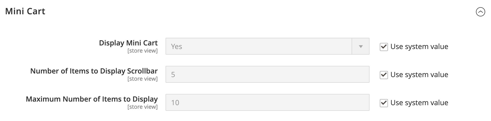
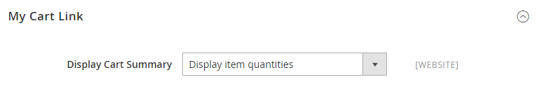
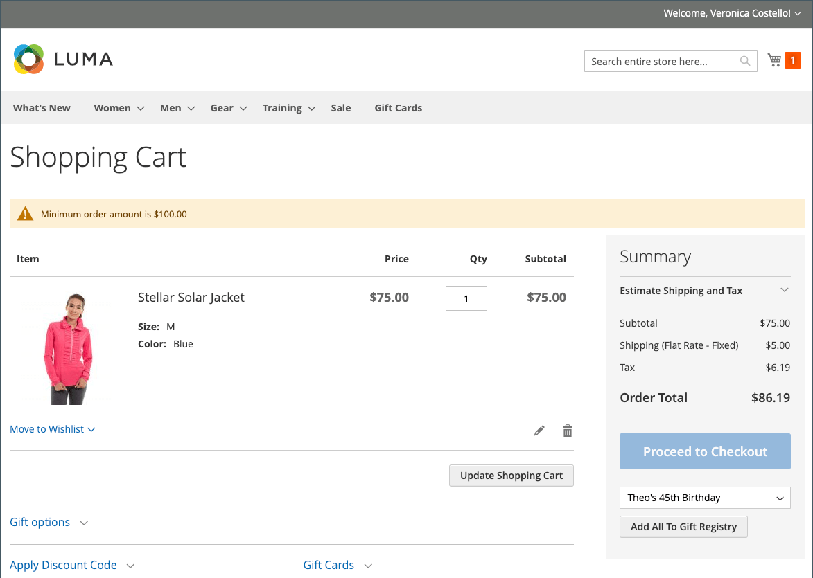
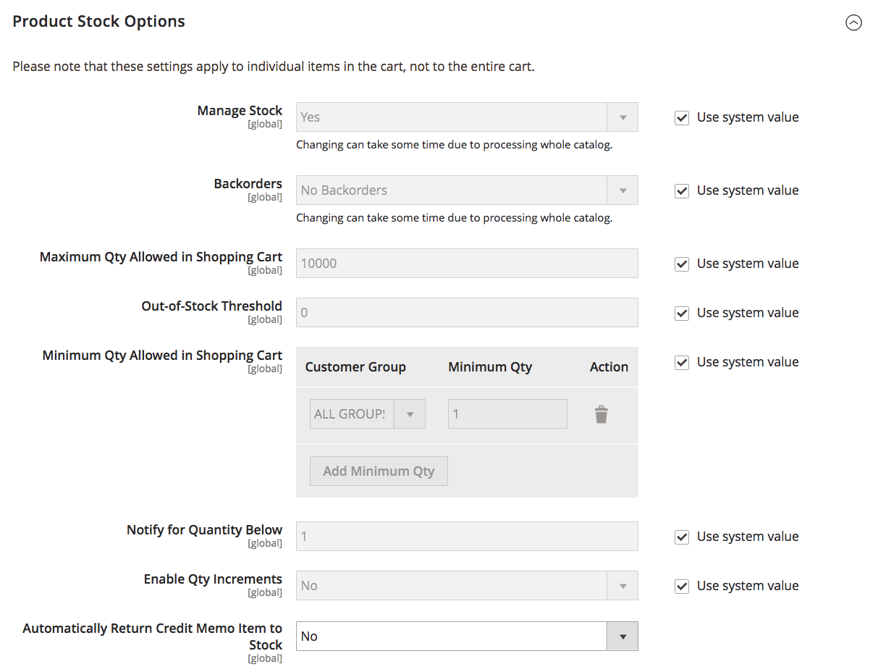
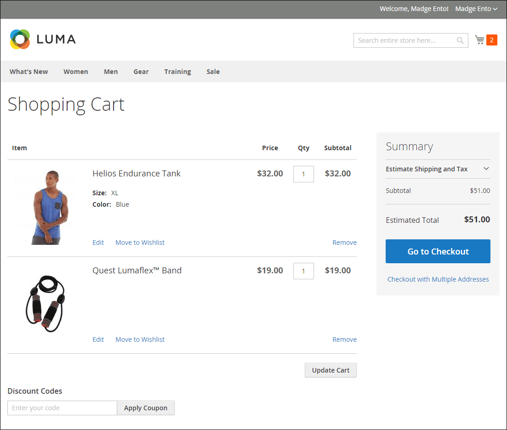
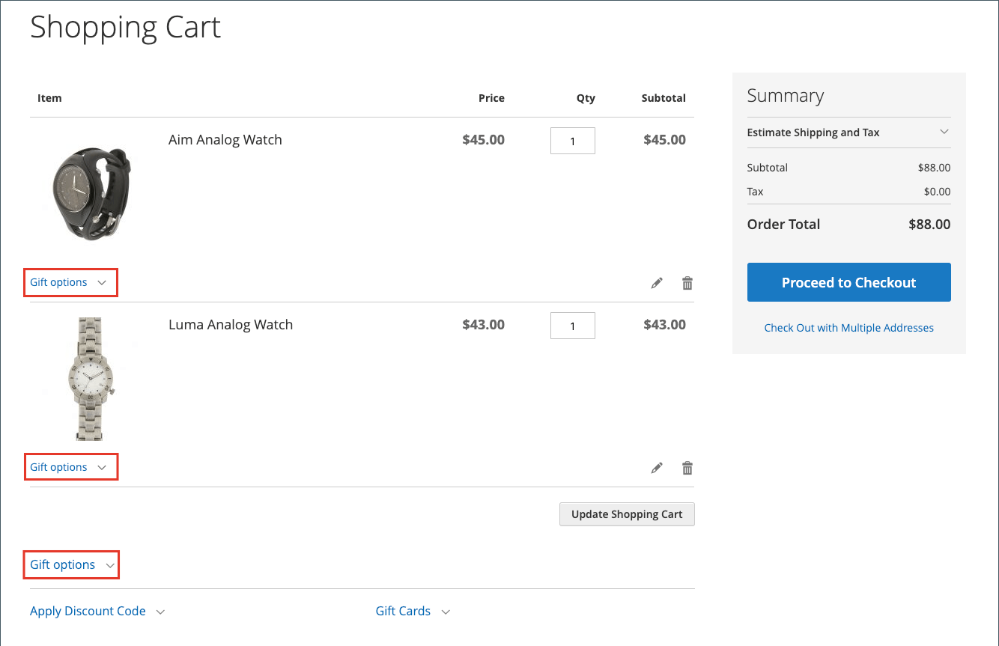
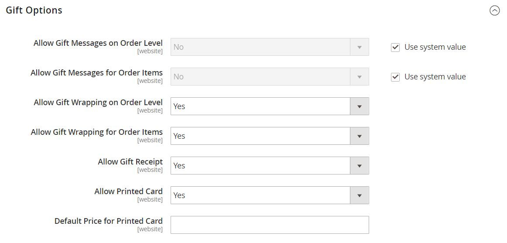
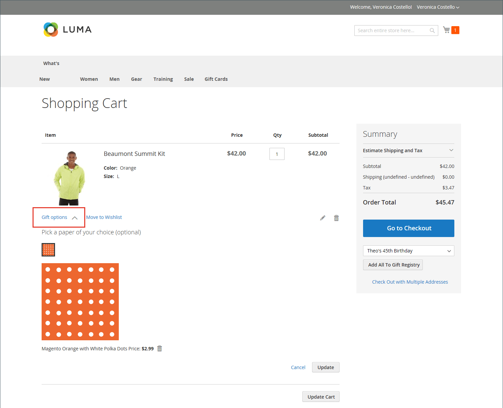
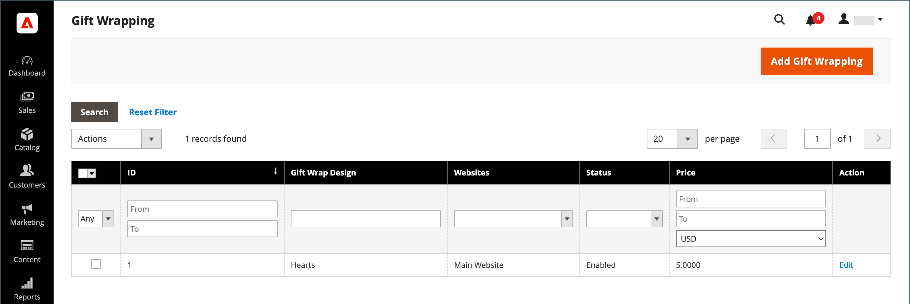

# Configuration du panier

La configuration du panier détermine le fonctionnement du panier pour vos clients de boutique, y compris le moment où le client est redirigé vers la page du panier et les images utilisées pour les miniatures de produit. Vous pouvez également exiger qu&#39;une commande atteigne un montant minimum avant le début du processus de passage en caisse, spécifier le nombre de jours pendant lesquels les prix cotés restent valides et spécifier l&#39;ordre des articles dans la section _Totaux des commandes_.

[**Mini panier**](#mini-cart) - Configurez cette option pour déterminer si le lien/l’icône du panier affiche le nombre de produits différents (ou SKU) dans le panier, ou la quantité totale de tous les articles.

[**Lien du mini panier**](#configure-the-cart-link) - Configurez cette option pour déterminer si le mini panier s’affiche lorsqu’un client ou une cliente clique sur le nombre d’articles dans l’icône du panier en haut d’une page de boutique.

[**Rediriger vers le panier**](#redirect-to-cart)- Configurez cette option pour déterminer si la page du panier s’affiche chaque fois qu’un article est ajouté au panier ou uniquement lorsqu’un client choisit d’accéder à la page.

[**Durée de vie du devis**](#quote-lifetime) - Configurez cette option pour spécifier la durée de validité d’un prix.

[**Montant minimum de la commande**](#minimum-order-amount) - Configurez ces options pour spécifier un montant minimum, une fois les remises appliquées, auquel les sous-totaux de la commande doivent répondre et le message affiché dans le panier.

[**Quantité minimale de commande**](#minimum-order-quantity) - Configurez ces options pour spécifier un nombre minimal d’articles requis pour passer une commande.

[**Miniatures du panier**](#cart-thumbnails) - Configurez les options des miniatures du panier pour déterminer les miniatures affichées dans le panier pour les produits regroupés ou configurables.

[**Options de cadeau**](#gift-options) - Configurez les options de cadeau pour déterminer si les clients peuvent ajouter un message cadeau ou une carte de vœux, et si des options d’emballage de cadeau sont disponibles.

>[!NOTE]
>
>Pour plus d’informations sur la configuration du processus de passage en caisse, voir [Options de paiement](checkout-process.md).

## Mini panier

Le _mini panier_ affiche un résumé des articles du panier. Elle est activée par défaut et s’affiche lorsque vous cliquez sur le lien Panier en haut de la page.
Le lien peut être configuré pour afficher le nombre de produits différents (ou SKU) dans le panier, ou la quantité totale de tous les articles.

{width="700" zoomable="yes"}

>[!NOTE]
>
>Pour un client _enregistré_, il existe des cas où le mini panier peut ne pas être synchronisé automatiquement sur plusieurs appareils et navigateurs. Dans ce cas, pour synchroniser le panier, le client peut simplement ouvrir la page [ Panier ](cart.md) sur cet appareil ou navigateur.

### Configuration du mini panier

1. Dans la barre latérale _Admin_, accédez à **[!UICONTROL Stores]** > _[!UICONTROL Settings]_>**[!UICONTROL Configuration]**.

1. Dans le panneau de gauche, développez **[!UICONTROL Sales]** et choisissez **[!UICONTROL Checkout]**.

1. Développez  la section _[!UICONTROL Mini Cart]_.

   {width="600" zoomable="yes"}

1. Si le paramètre concerne une vue de magasin spécifique, [choisissez la vue de magasin](../configuration-reference/scope-change.md#set-the-scope) où la configuration s’applique.

   Lorsque vous y êtes invité, cliquez sur **[!UICONTROL OK]** pour continuer.

1. Définissez **[!UICONTROL Display Mini Cart]** sur l’une des options suivantes :

   - `Yes` - Affiche le mini panier sur les pages de la boutique. L’aspect de la barre latérale dépend du thème.
   - `No` - Désactive l’affichage du mini panier sur les pages de la boutique.

1. Si l’affichage est activé, mettez à jour les autres options pour configurer l’affichage :

   - Par **[!UICONTROL Number of Items to Display Scrollbar]**, saisissez le nombre d’éléments pouvant apparaître dans la barre latérale avant le déclenchement de la barre de défilement.
   - Par **[!UICONTROL Maximum Display Recently Added Item(s)]**, saisissez le nombre maximal d’articles récemment ajoutés que vous souhaitez voir apparaître dans le mini panier.

1. Cliquez sur **[!UICONTROL Save Config]**.

### Configurer le lien du panier

1. Dans la barre latérale _Admin_, accédez à **[!UICONTROL Stores]** > _[!UICONTROL Settings]_>**[!UICONTROL Configuration]**.

1. Dans le panneau de gauche, développez **[!UICONTROL Sales]** et choisissez **[!UICONTROL Checkout]**.

1. Développez  la section **[!UICONTROL My Cart Link]** .

1. Définissez **[!UICONTROL Display Cart Summary]** sur l’un des paramètres suivants :

   - `Display item quantities` - Ce paramètre affiche le nombre total de produits du panier, en ajoutant les quantités de chaque produit.
   - `Display number of items in cart` - Ce paramètre affiche le nombre d’articles du panier, quelle que soit la quantité.

   {width="600" zoomable="yes"}

1. Cliquez sur **[!UICONTROL Save Config]**.

## Rediriger vers le panier

La page du panier peut être configurée pour s’afficher chaque fois qu’un article est ajouté au panier ou uniquement lorsque les clients choisissent d’accéder à la page. Les informations de base sur les articles actuellement dans le panier sont toujours disponibles dans le [mini panier](#mini-cart). La décision est une question d&#39;équilibre entre les avantages de permettre aux clients de continuer à acheter, avec les avantages d&#39;encourager les clients à passer en caisse. Ce pourrait être une simple question de préférence personnelle. Cependant, si vous souhaitez la sauvegarder avec des chiffres, vous pouvez exécuter un test A/B pour voir quelle approche produit un taux de conversion plus élevé.

**_Pour configurer l’affichage du panier:_**

1. Dans la barre latérale _Admin_, accédez à **[!UICONTROL Stores]** > _[!UICONTROL Settings]_>**[!UICONTROL Configuration]**.

1. Dans le panneau de gauche, développez **[!UICONTROL Sales]** et choisissez **[!UICONTROL Checkout]**.

1. Développez  la section **[!UICONTROL Shopping Cart]** .

   {width="600" zoomable="yes"}

1. Si le paramètre concerne une vue de magasin spécifique, [choisissez la vue de magasin](../configuration-reference/scope-change.md#set-the-scope) où la configuration s’applique.

   Lorsque vous y êtes invité, cliquez sur **[!UICONTROL OK]** pour continuer.

1. Définissez **[!UICONTROL After Adding a Product Redirect to Shopping Cart]** sur l’une des options suivantes :

   - `Yes` - Affiche la page du panier immédiatement après l’ajout d’un produit au panier.
   - `No` - Désactive la redirection vers le panier après un ajout de produit au panier.

1. Cliquez sur **[!UICONTROL Save Config]**.

## Durée de vie du devis

Grâce à l’installation et à l’activation d’Adobe Commerce B2B, vous pouvez ajouter la prise en charge de la fonctionnalité _Quotes_. Cette fonctionnalité permet aux acheteurs autorisés de lancer le processus de négociation des prix en soumettant une demande depuis le panier. La grille _Devis_ répertorie chaque devis reçu et conserve un historique de la communication entre l&#39;acheteur et le vendeur. Pour plus d’informations sur les fonctionnalités B2B, consultez [Devis négociés](../b2b/quotes.md) dans le _Guide de l’utilisateur B2B d’Adobe Commerce_.

Vous pouvez déterminer la durée de validité d’un prix en définissant la durée de vie du devis du panier dans la configuration . Par exemple, si un acheteur laisse un panier sans surveillance après plusieurs jours, le prix proposé pour certains articles peut ne plus être le même. Par défaut, la durée de vie du devis est définie sur 30 jours.

**_Pour configurer la durée de vie du devis:_**

1. Dans la barre latérale _Admin_, accédez à **[!UICONTROL Stores]** > _[!UICONTROL Settings]_>**[!UICONTROL Configuration]**.

1. Dans le panneau de gauche, développez **[!UICONTROL Sales]** et choisissez **[!UICONTROL Checkout]**.

1. Développez  la section **[!UICONTROL Shopping Cart]** .

   {width="600" zoomable="yes"}

1. Si le paramètre concerne une vue de magasin spécifique, [choisissez la vue de magasin](../configuration-reference/scope-change.md#set-the-scope) où la configuration s’applique.

   Lorsque vous y êtes invité, cliquez sur **[!UICONTROL OK]** pour continuer.

1. Par **[!UICONTROL Quote Lifetime (days)]**, saisissez le nombre de jours pendant lesquels un prix proposé reste valide.

1. Cliquez sur **[!UICONTROL Save Config]**.

## Montant minimal de la commande

La configuration vous permet de spécifier un montant minimum, une fois les remises appliquées, que les sous-totaux de commande doivent respecter. Les commandes expédiées à plusieurs adresses peuvent être requises pour respecter le montant minimum de commande par adresse. Le bouton Passer en caisse n’est disponible qu’une fois le montant minimal de la commande atteint.

{width="700" zoomable="yes"}

**_Pour configurer un montant minimum de commande:_**

1. Dans la barre latérale _Admin_, accédez à **[!UICONTROL Stores]** > _[!UICONTROL Settings]_>**[!UICONTROL Configuration]**.

1. Dans le panneau de gauche, développez **[!UICONTROL Sales]** et choisissez **[!UICONTROL Sales]** en dessous.

1. Développez  la section **[!UICONTROL Minimum Order Amount]** .

   {width="600" zoomable="yes"}

1. Pour exiger un montant de commande minimal, définissez **[!UICONTROL Enable]** sur `Yes`.

1. Si l’ordre minimum est activé, définissez les options suivantes pour configurer le besoin :

   - Permet d&#39;entrer le **[!UICONTROL Minimum Amount]** requis pour le sous-total, une fois les remises appliquées.

   - Définissez **[!UICONTROL Include Discount Amount]** sur l’une des options suivantes :

      - `Yes` - Exige que le sous-total atteigne le montant minimum avec les remises incluses. À titre d’exemple d’un minimum de 50 $, si le panier contient un haut de 60 $ avec une remise de 25 % appliquée, le sous-total obtenu est de 45 $ et le panier ne répond pas au minimum.
      - `No` - Exige que le sous-total atteigne le montant minimum sans escompte.

   - Définissez **[!UICONTROL Include Tax to Amount]** sur l’une des options suivantes :

      - `Yes` - Nécessite que le sous-total corresponde au montant minimum avec taxe incluse.
      - `No` - Nécessite que le sous-total atteigne le montant minimum sans taxe.

1. Vous pouvez éventuellement personnaliser les paramètres de message concernant le montant minimal de commande :

   - Par **[!UICONTROL Description Message]**, saisissez le texte à utiliser pour personnaliser le message qui s&#39;affiche en haut du panier lorsque le sous-total n&#39;est pas conforme à la quantité minimale.

   - Par **[!UICONTROL Error to Show in Shopping Cart]**, saisissez le texte à utiliser pour personnaliser le message d’erreur du panier.

   Laissez les champs de description des messages vides pour utiliser les messages par défaut.

1. Si nécessaire, configurez le paramètre de montant minimum de commande pour les commandes à plusieurs adresses :

   - Pour exiger que chaque adresse d’une commande multi-adresses corresponde au montant minimal de la commande, définissez **[!UICONTROL Validate Each Address Separately in Multi-address Checkout]** sur `Yes`.

   - Vous pouvez éventuellement personnaliser les paramètres de message concernant le montant minimal de commande :

      - **[!UICONTROL Multi-address Description Message]** - Saisissez le texte à utiliser pour personnaliser le message qui s’affiche en haut du panier pour les commandes à plusieurs adresses qui ne répondent pas au minimum.

      - **[!UICONTROL Multi-address Error to Show in Shopping Cart]** - Saisissez le texte que vous souhaitez utiliser pour personnaliser le message d’erreur du panier pour les commandes à plusieurs adresses qui ne répondent pas au minimum. Saisissez le texte dans la zone.

     Laissez les champs de description des messages vides pour utiliser les messages par défaut.

1. Cliquez sur **[!UICONTROL Save Config]**.

## Quantité de commande minimale

Vous pouvez définir la quantité minimale autorisée pour une commande. La quantité minimale peut également être configurée en fonction de chaque groupe de clients.

1. Accédez à **[!UICONTROL Stores]** > _[!UICONTROL Settings]_>**[!UICONTROL Configuration]**.

1. Dans le panneau de gauche, développez **[!UICONTROL Catalog]** et choisissez **[!UICONTROL Inventory]**.

1. Développez  la section **[!UICONTROL Product Stock Options]** .

   {width="600" zoomable="yes"}

1. Par **[!UICONTROL Minimum Qty Allowed in Shopping Cart]**, définissez la quantité minimale du produit pour une commande.

   Si nécessaire, décochez la case **[!UICONTROL Use system value]** pour modifier ces paramètres.

   - Remplacez le paramètre **[!UICONTROL Customer Group]** par un groupe spécifique et saisissez le **[!UICONTROL Minimum Qty]** de ce groupe. Pour ajouter une autre limite de groupe et de quantité, cliquez sur **[!UICONTROL Add Minimum Qty]**.

   - Pour définir la même limite de quantité minimale pour tous les clients, conservez la sélection `ALL GROUPS` et saisissez la **[!UICONTROL Minimum Qty]**.

1. Cliquez sur **[!UICONTROL Save Config]**.

   {width="700" zoomable="yes"}

## Miniatures du panier

 (Adobe Commerce uniquement)

Les miniatures affichées dans le panier donnent aux clients un aperçu rapide des articles qu’ils sont sur le point d’acheter. Cependant, pour les produits comportant plusieurs options, l’image peut ne pas correspondre à la variation du produit qui se trouve dans le panier. Si le client achète un article d’une couleur spécifique, idéalement, la miniature du panier doit correspondre.

L’image miniature des produits groupés et configurables peut être définie pour afficher l’image à partir du produit « parent » ou de la variation de produit.

{width="700" zoomable="yes"}

**_Pour configurer les miniatures de panier:_**

1. Dans la barre latérale _Admin_, accédez à **[!UICONTROL Stores]** > _[!UICONTROL Settings]_>**[!UICONTROL Configuration]**.

1. Dans le panneau de gauche, développez **[!UICONTROL Sales]** et choisissez **[!UICONTROL Checkout]**.

1. Développez  la section **[!UICONTROL Shopping Cart]** .

   {width="600" zoomable="yes"}

1. Définissez **[!UICONTROL Grouped Product Image]** pour déterminer la miniature utilisée dans le panier pour les [produits groupés](../catalog/product-create-grouped.md) :

   - `Product Thumbnail Itself` - Utilise la miniature affectée à la variation de produit ajoutée au panier.
   - `Parent Product Thumbnail` - Utilise la miniature affectée au produit parent.

1. Définissez **[!UICONTROL Configurable Product Image]** pour déterminer la miniature utilisée dans le panier pour les [produits configurables](../catalog/product-create-configurable.md) :

   - `Product Thumbnail Itself` - Utilise la miniature affectée à la variation de produit ajoutée au panier.
   - `Parent Product Thumbnail` - Utilise la miniature affectée au produit parent.

1. Cliquez sur **[!UICONTROL Save Config]**.

## Options de cadeau

La sélection des options de cadeau disponibles apparaît dans le panier avant le début du processus de passage en caisse. La configuration des options de cadeau détermine si les clients peuvent ajouter un message cadeau ou une carte de vœux, et si des options d’emballage cadeau sont disponibles. Chaque article de la commande peut avoir un message et un emballage cadeau distincts. Lorsqu’ils sont appliqués à l’ensemble de la commande, les clients peuvent également ajouter un reçu cadeau et une carte de vœux.

{width="700" zoomable="yes"}

La configuration Options du cadeau s’applique à l’ensemble du site web, mais peut être remplacée au niveau du produit.

### Activer les options de cadeau

1. Dans la barre latérale _Admin_, accédez à **[!UICONTROL Stores]** > _[!UICONTROL Settings]_>**[!UICONTROL Configuration]**.

1. Dans le panneau de gauche, développez **[!UICONTROL Sales]** et choisissez **[!UICONTROL Sales]** en dessous.

1. Développez  **[!UICONTROL Gift Options]** sur la page.

   {width="600" zoomable="yes"}

1. Définissez les options de message cadeau en fonction de vos préférences :

   - Par **[!UICONTROL Allow Gift Messages on Order Level]**, sélectionnez `Yes` pour activer un message cadeau unique pour l’ensemble de la commande.
   - Par **[!UICONTROL Allow Gift Messages for Order Items]**, sélectionnez `Yes` pour activer l’ajout de messages cadeau distincts pour chaque article du panier du client.

1.  (Adobe Commerce uniquement) Définissez les options d’emballage-cadeau selon vos préférences :

   - Par **[!UICONTROL Allow Gift Wrapping on Order Level]**, sélectionnez `Yes` pour activer un emballage cadeau unique pour l’ensemble de la commande.
   - Par **[!UICONTROL Allow Gift Wrapping for Order Items]**, sélectionnez `Yes` pour activer l’ajout d’un emballage cadeau individuel à chaque article du panier du client.

   Vous pouvez également définir différentes [conceptions d’emballage-cadeau](#gift-wrap) afin que les clients puissent choisir l’emballage.

1.  (Adobe Commerce uniquement) Pour offrir aux clients la possibilité d’inclure un reçu cadeau, définissez **[!UICONTROL Allow Gift Receipt]** sur `Yes`.

1.  (Adobe Commerce uniquement) Pour offrir aux clients la possibilité d’inclure une carte imprimée, définissez **[!UICONTROL Allow Printed Card]** sur `Yes`.

1.  (Adobe Commerce uniquement) Saisissez le **[!UICONTROL Default Price for Printed Card]**.

1. Cliquez sur **[!UICONTROL Save Config]**.

### Emballage cadeau

 (Adobe Commerce uniquement)

L&#39;emballage cadeau est disponible pour tout produit qui peut être expédié, et peut être offert pour des articles individuels ou pour la commande entière. Vous pouvez facturer un prix distinct pour chaque modèle d’emballage-cadeau et charger une image miniature pour chaque modèle qui apparaît en tant qu’option pour un produit dans le panier. Lorsqu’un client clique sur la miniature de l’emballage-cadeau, une image en taille réelle s’affiche. Lors de la vérification du passage en caisse, les frais d&#39;emballage du cadeau apparaissent avec les autres [totaux de passage en caisse](checkout-totals-sort-order.md) dans la section _Résumé de la commande_.

L&#39;image d&#39;emballage cadeau doit être un échantillon qui montre le motif de répétition, et peut également inclure un échantillon du ruban à utiliser. Vous pouvez scanner le papier ou prendre une photo d&#39;un paquet emballé. L’image chargée peut être une image GIF, JPG ou PNG et doit être carrée. Dans l’exemple suivant, l’image d’emballage-cadeau chargée est de 230 x 230 pixels.

{width="700" zoomable="yes"}

#### Ajouter un design d’emballage-cadeau

1. Dans la barre latérale _Admin_, accédez à **[!UICONTROL Stores]** > _[!UICONTROL Other Settings]_>**[!UICONTROL Gift Wrapping]**.

   {width="700" zoomable="yes"}

1. Dans le coin supérieur droit, cliquez sur **[!UICONTROL Add Gift Wrapping]**.

1. Saisissez le nom de l’**[!UICONTROL Gift Wrapping Design]** qui apparaîtra lors du passage en caisse.

   Si nécessaire, vous pouvez modifier la **[!UICONTROL Scope]** et configurer un nom différent pour chaque vue du magasin.

1. Sélectionnez l’**[!UICONTROL Websites]** où le design d’emballage-cadeau est disponible.

1. Définissez **[!UICONTROL Status]** sur `Enabled`.

   Si vous disposez d’une option d’habillage saisonnier, vous pouvez la définir sur `Disabled` lorsque vous ne souhaitez pas que cette option soit disponible.

1. Saisissez le **[!UICONTROL Price]** du design de l’emballage-cadeau.

   Ce paramètre peut être remplacé par le prix de l’emballage-cadeau défini au niveau du produit.

   {width="600" zoomable="yes"}

1. Pour charger une vignette **[!UICONTROL Image]** de l’emballage du cadeau, cliquez sur **[!UICONTROL Choose File]** et sélectionnez le fichier à charger dans votre répertoire.

   Une miniature de l’image s’affiche dans le _[!UICONTROL Gift Wrapping Information]_après l’enregistrement.

1. Cliquez sur **[!UICONTROL Save]**.

#### Modifier un design d’emballage-cadeau

1. Dans la barre latérale _Admin_, accédez à **[!UICONTROL Stores]** > _[!UICONTROL Other Settings]_>**[!UICONTROL Gift Wrapping]**.

1. Recherchez l&#39;enregistrement d&#39;emballage-cadeau dans la liste.

1. Dans la colonne _Action_, cliquez sur **[!UICONTROL Edit]**.

   {width="600" zoomable="yes"}

1. Effectuez les modifications nécessaires.

1. Cliquez sur **[!UICONTROL Save]**.

#### Supprimer les conceptions d&#39;emballage cadeau

Avec la grille _Gift Wrapping_ ouverte, utilisez l’une de ces méthodes pour supprimer les conceptions d’emballage.

**_Méthode 1 : supprimer un modèle d&#39;emballage cadeau unique_**

1. Ouvrez la conception d’emballage-cadeau en mode d’édition.

1. Dans la partie supérieure de l’espace de travail, cliquez sur **[!UICONTROL Delete]**.

1. Lorsque vous y êtes invité, cliquez sur **[!UICONTROL OK]** pour confirmer.

**_Méthode 2 : Supprimer plusieurs modèles d&#39;emballage cadeau_**

1. Dans la grille _Emballage cadeau_, cochez la case de chaque conception d&#39;emballage cadeau à supprimer.

1. Définissez la commande **[!UICONTROL Actions]** sur `Delete`.

1. Cliquez sur **[!UICONTROL Submit]**.

### Taxe sur les options de cadeau

 (Adobe Commerce uniquement)

L’emballage du cadeau et les prix des cartes-cadeaux imprimées peuvent être configurés pour inclure ou exclure la taxe, ou pour afficher les deux options. Vous pouvez également définir une classe de taxe pour ces articles, au niveau global ou au niveau du site web.

**_Pour configurer les taxes sur les options de cadeau:_**

1. Dans la barre latérale _Admin_, accédez à **[!UICONTROL Stores]** > _[!UICONTROL Settings]_>**[!UICONTROL Configuration]**.

1. Dans le panneau de gauche, développez **[!UICONTROL Sales]** et choisissez **[!UICONTROL Tax]**.

1. Développez  la section **[!UICONTROL Tax Classes]** .

   {width="600" zoomable="yes"}

1. Définissez **[!UICONTROL Tax Class for Gift Options]** sur la classe de taxe applicable.

1. Développez  la section **[!UICONTROL Orders, Invoices, Credit Memos Display Settings]** .

   {width="600" zoomable="yes"}

1. Définissez **[!UICONTROL Display Gift Wrapping Prices]** sur l’une des options suivantes :

   - `Excluding Tax`
   - `Including Tax`
   - `Including and Excluding Tax`

1. Définissez **[!UICONTROL Display Printed Card Prices]** sur l’une des options suivantes :

   - `Excluding Tax`
   - `Including Tax`
   - `Including and Excluding Tax`

1. Cliquez sur **[!UICONTROL Save Config]**.
