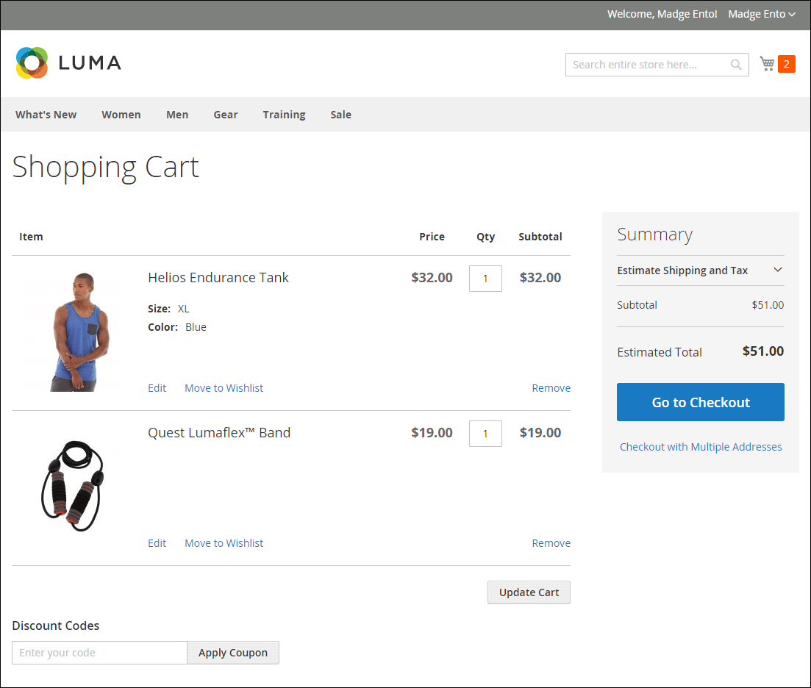

# Configuration du panier

La configuration du panier détermine le fonctionnement du panier pour vos clients de magasin, notamment le moment où le client est redirigé vers la page du panier et les images utilisées pour les miniatures de produit. Vous pouvez également exiger une commande pour atteindre un montant minimum avant le début du processus de passage en caisse, indiquer le nombre de jours pendant lesquels les prix entre guillemets restent valides et spécifier l’ordre des articles dans la variable _Totaux des commandes_ .

[**Mini panier**](#mini-cart) - Configurez cette option pour déterminer si le lien ou l’icône du panier affiche le nombre de produits (ou SKU) différents dans le panier ou la quantité totale de tous les articles.

[**Lien du mini panier**](#configure-the-cart-link) - Configurez cette option pour déterminer si le mini panier s’affiche lorsqu’un client clique sur le nombre d’articles dans l’icône de panier en haut d’une page de magasin.

[**Redirection vers le panier**](#redirect-to-cart)- Configurez cette option pour déterminer si la page du panier s’affiche chaque fois qu’un article est ajouté au panier ou uniquement lorsqu’un client choisit d’accéder à la page.

[**Durée de vie des citations**](#quote-lifetime) - Configurez cette option pour indiquer la durée de validité d’un prix.

[**Montant minimum de la commande**](#minimum-order-amount) - Configurez ces options pour spécifier un montant minimum, une fois les remises appliquées, les sous-totaux de la commande à respecter et les messages affichés dans le panier.

[**Quantité de commande minimale**](#minimum-order-quantity) - Configurez ces options pour spécifier un nombre minimum d’éléments requis pour passer une commande.

[**Miniatures du panier**](#cart-thumbnails)  - Configurez les options des miniatures de panier afin de déterminer les miniatures affichées dans le panier pour les produits regroupés ou configurables.

[**Options de cadeau**](#gift-options) - Configurez les options de cadeau pour déterminer si les clients peuvent ajouter un message cadeau ou une carte de voeux, et si des options d’emballage cadeau sont disponibles.

>[!NOTE]
>
>Pour plus d’informations sur la configuration du processus de passage en caisse, voir [Options de passage en caisse](checkout-process.md).

## Mini panier

La variable _mini-panier_ affiche un résumé des éléments du panier. Elle est activée par défaut et s’affiche lorsque vous cliquez sur le lien Panier en haut de la page.
Le lien peut être configuré pour afficher le nombre de produits (ou SKU) différents dans le panier, ou la quantité totale de tous les articles.

{width="700" zoomable="yes"}

>[!NOTE]
>
>Pour un _registered_ client, il arrive que le mini-panier ne soit pas synchronisé automatiquement sur les différents appareils et navigateurs. Pour synchroniser le mini-panier dans ce cas, le client peut simplement ouvrir la [Panier](cart.md) sur ce périphérique ou navigateur.

### Configuration du mini panier

1. Sur le _Administration_ barre latérale, accédez à **[!UICONTROL Stores]** > _[!UICONTROL Settings]_>**[!UICONTROL Configuration]**.

1. Dans le panneau de gauche, développez **[!UICONTROL Sales]** et choisissez **[!UICONTROL Checkout]**.

1. Développer  la valeur _[!UICONTROL Mini Cart]_.

   {width="600" zoomable="yes"}

1. Si le paramètre est destiné à une vue de magasin spécifique, [choix de la vue magasin](../configuration-reference/scope-change.md#set-the-scope) où la configuration s’applique.

   Lorsque vous y êtes invité, cliquez sur **[!UICONTROL OK]** pour continuer.

1. Définir **[!UICONTROL Display Mini Cart]** à l’une des options suivantes :

   - `Yes` : affiche le mini panier sur les pages de magasin. L’aspect de la barre latérale dépend du thème.
   - `No` - Désactive l’affichage du mini-panier sur les pages de magasin.

1. Si l’affichage est activé, mettez à jour les autres options pour configurer l’affichage :

   - Pour **[!UICONTROL Number of Items to Display Scrollbar]**, saisissez le nombre d’éléments pouvant apparaître dans la barre latérale avant le déclenchement de la barre de défilement.
   - Pour **[!UICONTROL Maximum Display Recently Added Item(s)]**, saisissez le nombre maximal d’éléments récemment ajoutés que vous souhaitez voir apparaître dans le mini panier.

1. Cliquez sur **[!UICONTROL Save Config]**.

### Configuration du lien du panier

1. Sur le _Administration_ barre latérale, accès à **[!UICONTROL Stores]** > _[!UICONTROL Settings]_>**[!UICONTROL Configuration]**.

1. Dans le panneau de gauche, développez **[!UICONTROL Sales]** et choisissez **[!UICONTROL Checkout]**.

1. Développer  la valeur **[!UICONTROL My Cart Link]** .

1. Définir **[!UICONTROL Display Cart Summary]** à l’un des paramètres suivants :

   - `Display item quantities` - Ce paramètre affiche le nombre total de produits dans le panier, en ajoutant les quantités pour chaque produit.
   - `Display number of items in cart` - Ce paramètre affiche le nombre d’articles dans le panier, quelle que soit la quantité.

   {width="600" zoomable="yes"}

1. Cliquez sur **[!UICONTROL Save Config]**.

## Redirection vers le panier

La page Panier peut être configurée pour s’afficher chaque fois qu’un article est ajouté au panier ou uniquement lorsque les clients choisissent d’accéder à la page. Les informations de base sur les articles actuellement dans le panier sont toujours disponibles dans la variable [mini-panier](#mini-cart). Il s’agit d’équilibrer les avantages de laisser les clients continuer à faire leurs achats, avec les avantages d’encourager les clients à effectuer leur passage en caisse. Cela peut être une simple question de préférence personnelle. Cependant, si vous souhaitez la sauvegarder avec des nombres, vous pouvez exécuter un test A/B pour déterminer quelle approche produit un taux de conversion plus élevé.

**_Pour configurer le moment où le panier apparaît :_**

1. Sur le _Administration_ barre latérale, accédez à **[!UICONTROL Stores]** > _[!UICONTROL Settings]_>**[!UICONTROL Configuration]**.

1. Dans le panneau de gauche, développez **[!UICONTROL Sales]** et choisissez **[!UICONTROL Checkout]**.

1. Développer  la valeur **[!UICONTROL Shopping Cart]** .

   {width="600" zoomable="yes"}

1. Si le paramètre est destiné à une vue de magasin spécifique, [choix de la vue magasin](../configuration-reference/scope-change.md#set-the-scope) où la configuration s’applique.

   Lorsque vous y êtes invité, cliquez sur **[!UICONTROL OK]** pour continuer.

1. Définir **[!UICONTROL After Adding a Product Redirect to Shopping Cart]** à l’une des options suivantes :

   - `Yes` - Affiche la page du panier immédiatement après l’ajout d’un produit au panier.
   - `No` - Désactive la redirection vers le panier après l’ajout d’un produit au panier.

1. Cliquez sur **[!UICONTROL Save Config]**.

## Durée de vie des citations

Avec l’installation et l’activation d’Adobe Commerce B2B, vous pouvez ajouter la prise en charge de la variable _Guillemets_ fonction . Cette fonctionnalité permet aux acheteurs autorisés d’initier le processus de négociation des prix en envoyant une demande à partir du panier. La variable _Guillemets_ grid répertorie chaque devis reçu et garde un historique de la communication entre l&#39;acheteur et le vendeur. Pour plus d’informations sur les fonctionnalités B2B, voir [Citations négociées](../b2b/quotes.md) dans le _Guide de l’utilisateur d’Adobe Commerce B2B_.

Vous pouvez déterminer la durée de validité d’un prix en définissant la durée de vie du prix du panier dans la configuration. Par exemple, si un acheteur laisse un panier sans surveillance au bout de plusieurs jours, le prix des devis de certains articles peut ne plus être le même. Par défaut, la durée de vie du guillemet est définie sur 30 jours.

**_Pour configurer la durée de vie des guillemets :_**

1. Sur le _Administration_ barre latérale, accédez à **[!UICONTROL Stores]** > _[!UICONTROL Settings]_>**[!UICONTROL Configuration]**.

1. Dans le panneau de gauche, développez **[!UICONTROL Sales]** et choisissez **[!UICONTROL Checkout]**.

1. Développer  la valeur **[!UICONTROL Shopping Cart]** .

   {width="600" zoomable="yes"}

1. Si le paramètre est destiné à une vue de magasin spécifique, [choix de la vue magasin](../configuration-reference/scope-change.md#set-the-scope) où la configuration s’applique.

   Lorsque vous y êtes invité, cliquez sur **[!UICONTROL OK]** pour continuer.

1. Pour **[!UICONTROL Quote Lifetime (days)]**, indiquez le nombre de jours pendant lesquels un prix entre guillemets reste valide.

1. Cliquez sur **[!UICONTROL Save Config]**.

## Montant minimum de la commande

La configuration vous permet de spécifier un montant minimum, après application des remises, auquel les sous-totaux de la commande doivent être respectés. Les commandes envoyées à plusieurs adresses peuvent être requises pour respecter le montant minimal de la commande par adresse. Le bouton Passage en caisse n’est disponible qu’une fois le montant minimum de la commande atteint.

{width="700" zoomable="yes"}

**_Pour configurer un montant minimum de commande :_**

1. Sur le _Administration_ barre latérale, accédez à **[!UICONTROL Stores]** > _[!UICONTROL Settings]_>**[!UICONTROL Configuration]**.

1. Dans le panneau de gauche, développez **[!UICONTROL Sales]** et choisissez **[!UICONTROL Sales]** en-dessous.

1. Développer  la valeur **[!UICONTROL Minimum Order Amount]** .

   {width="600" zoomable="yes"}

1. Pour exiger un montant de commande minimal, définissez **[!UICONTROL Enable]** to `Yes`.

1. Si l’ordre minimum est activé, définissez les options suivantes pour configurer les exigences :

   - Saisissez le **[!UICONTROL Minimum Amount]** qui est requis pour le sous-total, après application des remises.

   - Définir **[!UICONTROL Include Discount Amount]** à l’une des options suivantes :

      - `Yes` - Nécessite que le sous-total corresponde au montant minimum avec toutes les remises incluses. En prenant l’exemple d’un montant minimum de 50 $, si le panier contient un supplément de 60 $ auquel une remise de 25 % est appliquée, le sous-total obtenu est de 45 $ et le panier ne satisfait pas le minimum.
      - `No` - Nécessite que le sous-total corresponde au montant minimum sans aucune remise.

   - Définir **[!UICONTROL Include Tax to Amount]** à l’une des options suivantes :

      - `Yes` - Nécessite que le sous-total corresponde au montant minimum avec taxe comprise.
      - `No` - Nécessite que le sous-total corresponde au montant minimum sans impôt.

1. Si vous le souhaitez, vous pouvez personnaliser les paramètres de message relatifs au montant minimum de la commande :

   - Pour **[!UICONTROL Description Message]**, saisissez le texte à utiliser pour personnaliser le message qui apparaît en haut du panier lorsque le sous-total ne correspond pas au montant minimum.

   - Pour **[!UICONTROL Error to Show in Shopping Cart]**, saisissez le texte à utiliser pour personnaliser le message d’erreur du panier.

   Laissez les champs de description du message vides pour utiliser les messages par défaut.

1. Si nécessaire, configurez le paramètre de quantité minimale de commande pour les commandes à plusieurs adresses :

   - Pour exiger que chaque adresse d’un ordre à plusieurs adresses respecte le montant minimal de la commande, définissez **[!UICONTROL Validate Each Address Separately in Multi-address Checkout]** to `Yes`.

   - Si vous le souhaitez, vous pouvez personnaliser les paramètres de message relatifs au montant minimum de la commande :

      - **[!UICONTROL Multi-address Description Message]** - Entrez le texte que vous souhaitez utiliser pour personnaliser le message qui apparaît en haut du panier pour les commandes à plusieurs adresses qui ne correspondent pas au minimum.

      - **[!UICONTROL Multi-address Error to Show in Shopping Cart]** - Saisissez le texte que vous souhaitez utiliser pour personnaliser le message d’erreur du panier pour les commandes à plusieurs adresses qui ne correspondent pas au minimum. Saisissez le texte dans la zone.

     Laissez les champs de description du message vides pour utiliser les messages par défaut.

1. Cliquez sur **[!UICONTROL Save Config]**.

## Quantité de commande minimale

Vous pouvez définir la quantité minimale autorisée pour une commande. La quantité minimale peut également être configurée en fonction de chaque groupe de clients.

1. Accédez à **[!UICONTROL Stores]** > _[!UICONTROL Settings]_>**[!UICONTROL Configuration]**.

1. Dans le panneau de gauche, développez **[!UICONTROL Catalog]** et choisissez **[!UICONTROL Inventory]**.

1. Développer  la valeur **[!UICONTROL Product Stock Options]** .

   {width="600" zoomable="yes"}

1. Pour **[!UICONTROL Minimum Qty Allowed in Shopping Cart]**, définissez la quantité minimale du produit pour une commande.

   Si nécessaire, effacez la variable **[!UICONTROL Use system value]** pour modifier ces paramètres.

   - Modifiez la variable **[!UICONTROL Customer Group]** pour un groupe spécifique et saisissez la variable **[!UICONTROL Minimum Qty]** pour ce groupe. Pour ajouter un autre groupe et une limite de quantité, cliquez sur **[!UICONTROL Add Minimum Qty]**.

   - Pour définir la même limite de quantité minimale pour tous les clients, conservez la variable `ALL GROUPS` et saisissez la **[!UICONTROL Minimum Qty]**.

1. Cliquez sur **[!UICONTROL Save Config]**.

   {width="700" zoomable="yes"}

## Miniatures du panier

 (Adobe Commerce uniquement)

Les miniatures affichées dans le panier donnent aux clients un aperçu rapide des articles qu’ils sont sur le point d’acheter. Toutefois, pour les produits avec plusieurs options, l’image peut ne pas correspondre à la variante du produit figurant dans le panier. Si le client achète un article dans une couleur spécifique, idéalement, la miniature du panier doit correspondre.

L’image miniature des produits regroupés et configurables peut être définie pour afficher l’image du produit &quot;parent&quot; ou de la variante de produit.

{width="700" zoomable="yes"}

**_Pour configurer les miniatures de panier :_**

1. Sur le _Administration_ barre latérale, accédez à **[!UICONTROL Stores]** > _[!UICONTROL Settings]_>**[!UICONTROL Configuration]**.

1. Dans le panneau de gauche, développez **[!UICONTROL Sales]** et choisissez **[!UICONTROL Checkout]**.

1. Développer  la valeur **[!UICONTROL Shopping Cart]** .

   {width="600" zoomable="yes"}

1. Définir **[!UICONTROL Grouped Product Image]** pour déterminer la miniature utilisée dans le panier pour [produits regroupés](../catalog/product-create-grouped.md):

   - `Product Thumbnail Itself` - Utilise la miniature affectée à la variation de produit ajoutée au panier.
   - `Parent Product Thumbnail` - Utilise la miniature affectée au produit parent.

1. Définir **[!UICONTROL Configurable Product Image]** pour déterminer la miniature utilisée dans le panier pour [produits configurables](../catalog/product-create-configurable.md):

   - `Product Thumbnail Itself` - Utilise la miniature affectée à la variation de produit ajoutée au panier.
   - `Parent Product Thumbnail` - Utilise la miniature affectée au produit parent.

1. Cliquez sur **[!UICONTROL Save Config]**.

## Options de cadeau

La sélection des options de cadeau disponibles s’affiche dans le panier avant le début du processus de passage en caisse. La configuration des options de cadeau détermine si les clients peuvent ajouter un message cadeau ou une carte de voeux, et si des options d’emballage de cadeau sont disponibles. Chaque article de la commande peut comporter un message distinct et un emballage cadeau. Lorsqu’ils sont appliqués à l’ensemble de la commande, les clients peuvent également ajouter un reçu cadeau et une carte de voeux.

{width="700" zoomable="yes"}

La configuration des options de cadeau s’applique à l’ensemble du site web, mais elle peut être remplacée au niveau du produit.

### Activation des options de cadeau

1. Sur le _Administration_ barre latérale, accédez à **[!UICONTROL Stores]** > _[!UICONTROL Settings]_>**[!UICONTROL Configuration]**.

1. Dans le panneau de gauche, développez **[!UICONTROL Sales]** et choisissez **[!UICONTROL Sales]** en-dessous.

1. Développer  **[!UICONTROL Gift Options]** sur la page.

   {width="600" zoomable="yes"}

1. Définissez les options du message cadeau en fonction de vos préférences :

   - Pour **[!UICONTROL Allow Gift Messages on Order Level]**, sélectionnez `Yes` pour activer un seul message cadeau pour l’ensemble de la commande.
   - Pour **[!UICONTROL Allow Gift Messages for Order Items]**, sélectionnez `Yes` pour activer l’ajout de messages cadeaux distincts pour des articles individuels dans le panier du client.

1.  (Adobe Commerce uniquement) Définissez les options d’encapsulage selon vos préférences :

   - Pour **[!UICONTROL Allow Gift Wrapping on Order Level]**, sélectionnez `Yes` pour activer un seul emballage cadeau pour toute la commande.
   - Pour **[!UICONTROL Allow Gift Wrapping for Order Items]**, sélectionnez `Yes` pour activer l’ajout individuel d’un emballage cadeau à chaque article du panier du client.

   Vous pouvez également définir différentes [conception d’emballage-cadeau](#gift-wrap) afin que les clients puissent choisir l’encapsulation.

1.  (Adobe Commerce uniquement) Pour offrir aux clients la possibilité d’inclure un reçu de cadeau, définissez **[!UICONTROL Allow Gift Receipt]** to `Yes`.

1.  (Adobe Commerce uniquement) Pour offrir aux clients la possibilité d’inclure une carte imprimée, définissez **[!UICONTROL Allow Printed Card]** to `Yes`.

1.  (Adobe Commerce uniquement) Saisissez la variable **[!UICONTROL Default Price for Printed Card]**.

1. Cliquez sur **[!UICONTROL Save Config]**.

### Placement de cadeau

 (Adobe Commerce uniquement)

L’emballage cadeau est disponible pour tout produit qui peut être livré et qui peut être proposé pour des articles individuels ou pour l’ensemble de la commande. Vous pouvez facturer un prix distinct pour chaque conception de retour à la ligne et charger une miniature pour chaque conception qui apparaît comme une option pour un produit du panier. Lorsqu’un client clique sur la miniature de retour à la ligne du cadeau, une image en taille réelle s’affiche. Lors de la révision du passage en caisse, les frais de retour à la ligne s’affichent avec l’autre [totaux de passage en caisse](checkout-totals-sort-order.md) dans le _Synthèse des commandes_ .

L’image de retour à la ligne du cadeau doit être un échantillon qui affiche le modèle répété et peut également inclure un échantillon du ruban à utiliser. Vous pouvez scanner le papier ou prendre une photo d&#39;un paquet emballé. L’image téléchargée peut être une image GIF, JPG ou PNG et doit être carrée. Dans l’exemple suivant, l’image de retour à la ligne du cadeau téléchargée fait 230 x 230 pixels.

{width="700" zoomable="yes"}

#### Ajouter une conception d’emballage cadeau

1. Sur le _Administration_ barre latérale, accédez à **[!UICONTROL Stores]** > _[!UICONTROL Other Settings]_>**[!UICONTROL Gift Wrapping]**.

   {width="700" zoomable="yes"}

1. Dans le coin supérieur droit, cliquez sur **[!UICONTROL Add Gift Wrapping]**.

1. Saisissez le nom du **[!UICONTROL Gift Wrapping Design]** s’affiche pendant le passage en caisse.

   Si nécessaire, vous pouvez modifier la variable **[!UICONTROL Scope]** et configurez un nom différent pour chaque vue de magasin.

1. Sélectionnez la variable **[!UICONTROL Websites]** où la conception de l’emballage cadeau est disponible.

1. Définir **[!UICONTROL Status]** to `Enabled`.

   Si vous disposez d’une option d’encapsulation saisonnière, vous pouvez la définir sur `Disabled` lorsque vous ne souhaitez pas que l’option soit disponible.

1. Saisissez le **[!UICONTROL Price]** de la conception de l’emballage cadeau.

   Ce paramètre peut être remplacé par le prix du emballage cadeau défini au niveau du produit.

   {width="600" zoomable="yes"}

1. Pour charger une miniature **[!UICONTROL Image]** de l’emballage cadeau, cliquez sur **[!UICONTROL Choose File]** et sélectionnez le fichier à télécharger dans votre répertoire.

   Une miniature de l’image s’affiche dans la _[!UICONTROL Gift Wrapping Information]_après l’enregistrement.

1. Cliquez sur **[!UICONTROL Save]**.

#### Modifier la conception d’un emballage cadeau

1. Sur le _Administration_ barre latérale, accédez à **[!UICONTROL Stores]** > _[!UICONTROL Other Settings]_>**[!UICONTROL Gift Wrapping]**.

1. Recherchez l’enregistrement d’emballage cadeau dans la liste.

1. Dans le _Action_ colonne, cliquez sur **[!UICONTROL Edit]**.

   {width="600" zoomable="yes"}

1. Effectuez les modifications nécessaires.

1. Cliquez sur **[!UICONTROL Save]**.

#### Supprimer des conceptions de retour à la ligne

Avec la variable _Remplissage des cadeaux_ grille ouverte, utilisez l’une de ces méthodes pour supprimer les conceptions de retour à la ligne.

**_Méthode 1 : suppression d’une seule conception de retour automatique à la ligne_**

1. Ouvrez la conception d’emballage cadeau en mode d’édition.

1. En haut de l’espace de travail, cliquez sur **[!UICONTROL Delete]**.

1. Lorsque vous y êtes invité, cliquez sur **[!UICONTROL OK]** pour confirmer.

**_Méthode 2 : suppression de plusieurs conceptions de retour automatique à la ligne de cadeau_**

1. Dans le _Remplissage des cadeaux_ , cochez la case de chaque conception de retour à la ligne que vous souhaitez supprimer.

1. Définissez la variable **[!UICONTROL Actions]** contrôler à `Delete`.

1. Cliquez sur **[!UICONTROL Submit]**.

### Taxe sur les options de cadeau

 (Adobe Commerce uniquement)

Les prix d’emballage de cadeau et de carte-cadeau imprimée peuvent être configurés pour inclure ou exclure la taxe, ou pour afficher les deux options. Vous pouvez également spécifier une classe fiscale pour ces éléments, au niveau global ou au niveau du site web.

**_Pour configurer les taxes des options de cadeau :_**

1. Sur le _Administration_ barre latérale, accédez à **[!UICONTROL Stores]** > _[!UICONTROL Settings]_>**[!UICONTROL Configuration]**.

1. Dans le panneau de gauche, développez **[!UICONTROL Sales]** et choisissez **[!UICONTROL Tax]**.

1. Développer  la valeur **[!UICONTROL Tax Classes]** .

   {width="600" zoomable="yes"}

1. Définir **[!UICONTROL Tax Class for Gift Options]** à la classe fiscale applicable.

1. Développer  la valeur **[!UICONTROL Orders, Invoices, Credit Memos Display Settings]** .

   {width="600" zoomable="yes"}

1. Définir **[!UICONTROL Display Gift Wrapping Prices]** à l’une des options suivantes :

   - `Excluding Tax`
   - `Including Tax`
   - `Including and Excluding Tax`

1. Définir **[!UICONTROL Display Printed Card Prices]** à l’une des options suivantes :

   - `Excluding Tax`
   - `Including Tax`
   - `Including and Excluding Tax`

1. Cliquez sur **[!UICONTROL Save Config]**.
