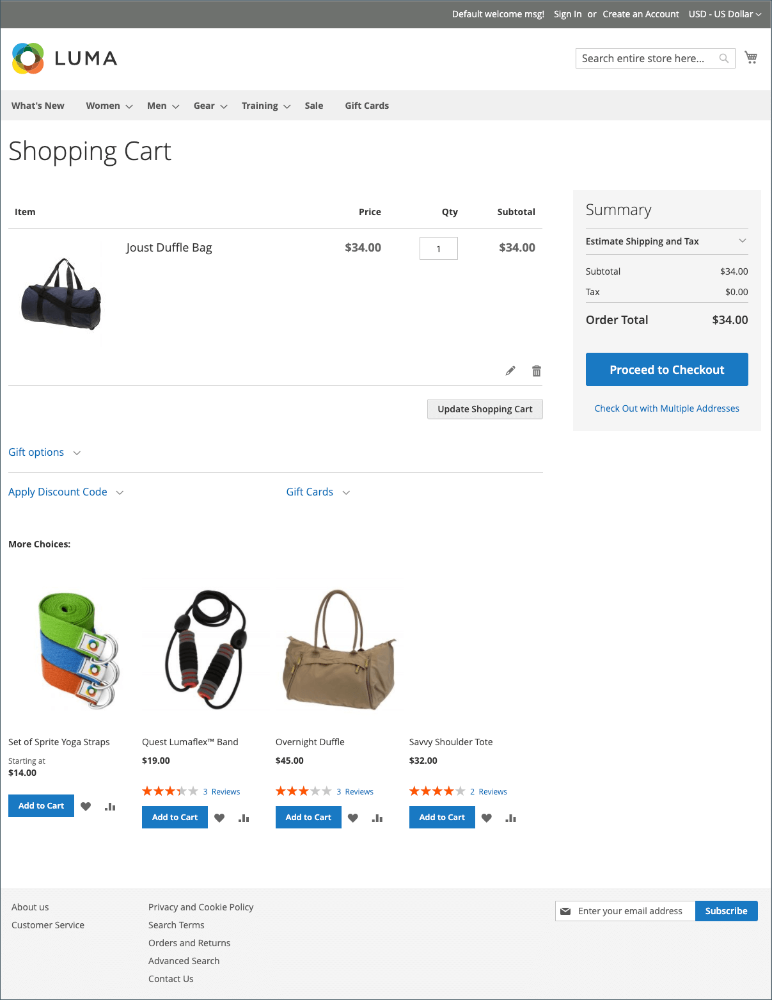

# Panier

Le panier est positionné à la fin du chemin d’achat, à l’intersection des pages _Acheter_ et _Abandonner_. Il s’agit de l’une des pages les plus importantes de votre magasin. Le panier est l’endroit où le total des commandes est calculé, ainsi que les coupons de réduction, l’expédition estimée et les taxes. C&#39;est un excellent endroit pour montrer vos insignes de confiance et vos sceaux, et une occasion idéale pour offrir un dernier article. Vous pouvez choisir les articles à proposer en tant qu&#39;achat impulsif de vente croisée chaque fois qu&#39;un article spécifique apparaît dans le panier.

{width="700" zoomable="yes"} de commande

- Configurez les [options de panier](cart-configuration.md) pour déterminer les outils disponibles pour les acheteurs et modifier l’affichage.
- Configurez le comportement [persistance du panier](cart-persistent.md) pour aider les acheteurs à conserver le contenu de leur panier.
- Ajoutez le widget [Classer par SKU](order-by-sku.md) pour faciliter la tâche à tous les acheteurs, ou uniquement à ceux de groupes de clients spécifiques, pour saisir directement les informations de SKU et de quantité dans une page.
