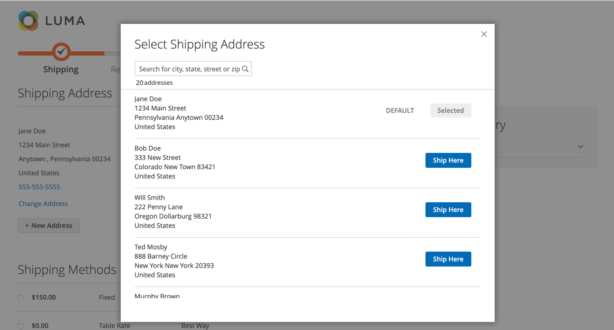

# Recherche d’adresses au passage en caisse

{{ee-feature}}

Vos clients peuvent avoir de nombreuses adresses et informations enregistrées dans leur carnet d’adresses, en particulier des clients réguliers, des clients réguliers ou des sociétés qui entrent dans plusieurs commandes et emplacements d’expédition. L’affichage de nombreuses adresses peut ralentir considérablement le chargement et les processus de passage en caisse, ce qui peut entraîner une expérience d’achat négative. Pour améliorer la réactivité du passage en caisse, il est recommandé d’activer et de configurer la recherche d’adresses pour votre site.

>[!NOTE]
>
>La recherche d’adresses n’est pas activée par défaut. Vous pouvez configurer cette fonction pour inclure la fonctionnalité sur votre site.

Lorsque cette fonction est activée et que le nombre d’adresses enregistrées du client respecte ou dépasse la limite configurée, les étapes _Expédition_ et _Révision et paiement_ n’affichent qu’une seule adresse (valeur par défaut). Le client peut modifier l’adresse sélectionnée en cliquant sur **Modifier l’adresse**, puis en recherchant l’adresse correcte par ville, état, rue ou fichier compressé. Cette fonctionnalité prend également en charge la sélection d’adresses pour le passage en caisse du registre des cadeaux.

{width="700" zoomable="yes"}

Si le client ne dispose pas d’une adresse de livraison par défaut, la page _Expédition_ affiche _Aucune adresse sélectionnée_. Dans ce cas, le client doit cliquer sur **Modifier l’adresse** pour sélectionner une adresse enregistrée ou cliquer sur **Nouvelle adresse** pour ajouter et sélectionner une adresse avant de poursuivre le passage en caisse. Si le client ne dispose pas d’adresse de facturation par défaut, la page _Révision et paiements_ affiche l’adresse sélectionnée pour l’expédition, avec l’option _Modifier l’adresse_ .

{width="600" zoomable="yes"}

## Recherche de guillemets dans l’adresse verrouillée

 (Disponible avec Adobe Commerce B2B uniquement)

L’activation de la recherche d’adresses affecte également l’extraction des commandes créées à partir de guillemets lorsque le nombre d’adresses enregistrées du client atteint ou dépasse la limite configurée. Lorsque le devis est terminé et que le client passe en caisse, seule l’adresse de livraison sélectionnée s’affiche. La page affiche également un message indiquant que l’adresse de livraison est verrouillée et ne peut être modifiée que dans le guillemet.

{width="600" zoomable="yes"}

## Activer la recherche d’adresses

1. Sur la barre latérale _Admin_, accédez à **[!UICONTROL Stores]** > _[!UICONTROL Settings]_>**[!UICONTROL Configuration]**.

1. Dans le panneau de gauche, développez **[!UICONTROL Sales]** et choisissez **[!UICONTROL Checkout]**.

1. Développez la section  sur **[!UICONTROL Checkout Options]** .

   {width="700" zoomable="yes"}

   Pour une description détaillée de chacun de ces paramètres de configuration, voir [Options de passage en caisse](../configuration-reference/sales/checkout.md#checkout-options) dans le _Guide de référence de configuration_.

1. Définissez **[!UICONTROL Enable Address Search]** sur `Yes`.

1. Pour spécifier le seuil d’inclusion de la fonction de recherche d’adresses, définissez l’option **[!UICONTROL Number of Customer Addresses Limit]**.

   Si nécessaire, décochez la case **[!UICONTROL Use system value]** pour apporter cette modification.

   Lorsque le nombre d’adresses enregistrées du client respecte ou dépasse cette limite, la page affiche soit l’adresse par défaut (si le client en a une), soit _Aucune adresse sélectionnée_ avec l’option _Modifier l’adresse_ . La limite par défaut est `10`.

1. Cliquez sur **[!UICONTROL Save Config]**.
