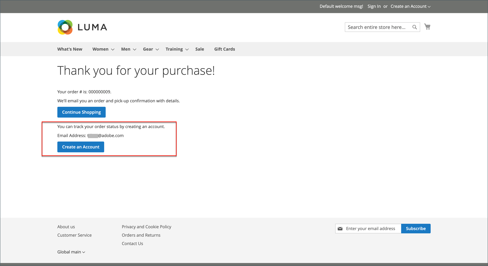

# Passage en caisse des invités

Votre boutique peut être configurée pour exiger des acheteurs qu’ils ouvrent un compte avant d’effectuer un achat. Le paramètre par défaut permet aux invités d’effectuer des achats, avec la possibilité de s’inscrire à un compte une fois le processus de passage en caisse terminé.

{width="600" zoomable="yes"}

**_Pour désactiver le passage en caisse des invités :_**

1. Sur le _Administration_ barre latérale, accédez à **[!UICONTROL Stores]** > _[!UICONTROL Settings]_>**[!UICONTROL Configuration]**.

1. Dans le panneau de gauche, développez **[!UICONTROL Sales]** et choisissez **[!UICONTROL Checkout]**.

1. Développer  la valeur **[!UICONTROL Checkout Options]** .

   {width="700" zoomable="yes"}

Pour une description détaillée de chacun de ces paramètres de configuration, voir [Options de passage en caisse](../configuration-reference/sales/checkout.md#checkout-options) dans le _Guide de référence de configuration_.

1. Si le paramètre est destiné à une vue de magasin spécifique, [choix de la vue magasin](../configuration-reference/scope-change.md#set-the-scope) où la configuration s’applique.

   Lorsque vous y êtes invité, cliquez sur **[!UICONTROL OK]** pour continuer.

1. Définir **[!UICONTROL Allow Guest Checkout]** to `No`.

   Si nécessaire, effacez le **[!UICONTROL Use system value]** pour activer les modifications apportées à ce paramètre.

1. Cliquez sur **[!UICONTROL Save Config]**.
