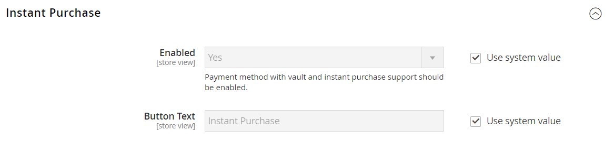

# Achat instantané

_Achat instantané_ permet aux clients d’accélérer le processus de passage en caisse à l’aide des informations enregistrées dans leur compte. Lorsqu’il est activé, le bouton _Achat instantané_ s’affiche sous le bouton _Ajouter au panier_ sur la page du produit pour les clients qui répondent aux exigences.

{width="700" zoomable="yes"}

## Exigences des clients

- Le client est [connecté](../customers/customer-sign-in.md) à son compte.

- Le compte client comporte une [adresse de facturation et d’expédition par défaut](../customers/account-dashboard-address-book.md).

- Au moins un [mode d&#39;expédition](delivery.md) est disponible pour le pays spécifié dans l&#39;adresse d&#39;expédition par défaut.

- Le compte client dispose d&#39;une méthode [paiement stocké](../stores-purchase/stored-payment-methods.md) avec coffre activé.

  Les modes de paiement suivants peuvent être utilisés pour fournir un accès sécurisé aux informations de carte de crédit enregistrées :

   - [Cartes de crédit Braintree &#x200B;](braintree.md) (l&#39;achat instantané ne peut pas être utilisé avec les cartes de crédit Braintree si 3D Secure est activé.)
   - [Braintree avec PayPal activé](braintree.md)
   - [PayPal Payflow Pro](paypal-payflow-pro.md)

## Achat instantané sur le storefront

1. Sur le storefront, le client accède à la page produit de l’article à acheter.

1. Sélectionne les options requises et clique sur **[!UICONTROL Instant Purchase]**.

   {width="500" zoomable="yes"}

1. Passe en revue les informations **[!UICONTROL Instant Purchase Confirmation]** et clique sur **[!UICONTROL OK]** pour terminer la transaction.

   Un message de confirmation et le numéro de commande s’affichent en haut de la page du produit.

## Configurer l’achat instantané

### Étape 1 : ouvrir la page de configuration

1. Dans la barre latérale _Admin_, accédez à **[!UICONTROL Stores]** > _[!UICONTROL Settings]_>**[!UICONTROL Configuration]**.

### Étape 2 : Configurer le coffre de méthodes de paiement

Vous pouvez utiliser l’achat instantané avec Braintree ou les services de paiement pour Adobe Commerce et Magento Open Source. Le stockage en chambre forte doit être activé pour qu’un acheteur puisse utiliser la fonction Achat instantané.

Découvrez comment configurer le mode de paiement et activer la mise en chambre forte pour Braintree ou les services de paiement :

- [Braintree](braintree.md)
- [Documentation sur les services de paiement](https://experienceleague.adobe.com/docs/commerce/payment-services/guide-overview.html)

### Étape 3 : activer l’achat instantané

1. Dans le panneau de gauche, sous la section _[!UICONTROL Sales]_, choisissez **[!UICONTROL Sales]**.

1. Développez  la section **[!UICONTROL Instant Purchase]** .

1. Si cette modification concerne une vue de magasin spécifique, [choisissez la vue de magasin](../configuration-reference/scope-change.md#set-the-scope) à laquelle la configuration s’applique.

   Lorsque vous y êtes invité, cliquez sur **[!UICONTROL OK]** pour continuer.

1. Définissez **[!UICONTROL Enabled]** sur `Yes`.

1. Saisissez le **[!UICONTROL Button Text]** qui doit apparaître sur le bouton.

   Le texte du bouton peut être modifié pour chaque vue de magasin ou langue. Par défaut, le texte du bouton est `Instant Purchase`.

   {width="600" zoomable="yes"}

   Pour obtenir une description détaillée de chacun de ces paramètres de configuration, consultez la section [Achat instantané](../configuration-reference/sales/sales.md#instant-purchase) du _Guide de référence de configuration_.

1. Cliquez sur **[!UICONTROL Save Config]**.

1. Lorsque vous êtes invité à mettre à jour le cache, cliquez sur **[!UICONTROL Cache Management]** dans le message système et suivez les instructions pour vider le cache.
