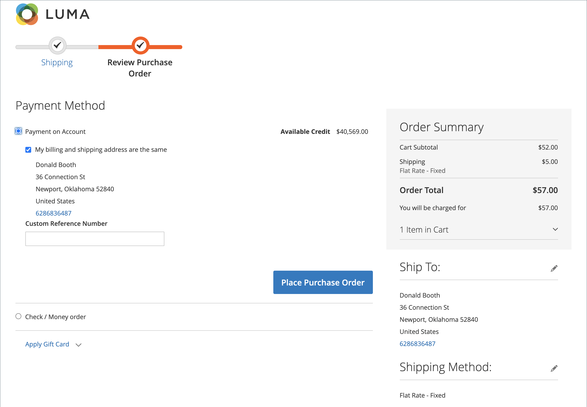
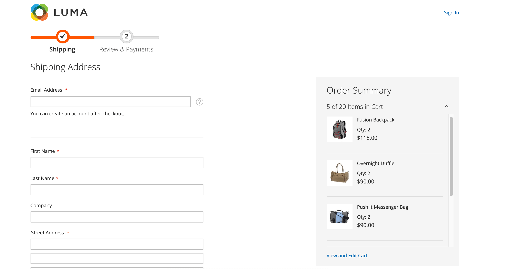

# Processus et options de paiement

Lorsque le processus de passage en caisse commence, la transaction passe à un canal sécurisé et chiffré. Un cadenas apparaît dans la barre d’adresse du navigateur et l’URL passe de `http` à `https`.

## Processus

Le processus de passage en caisse a pour but de recueillir les informations nécessaires à la conclusion de la transaction. La page _Passage en caisse_ guide le client à travers chaque étape du processus. Les clients connectés à leurs comptes peuvent passer rapidement en caisse, car la plupart des informations se trouvent déjà dans leurs comptes. Les clients associés à un compte de société qui utilise des commandes fournisseur ont un workflow légèrement différent.

### Expédition

La première étape du processus de passage en caisse consiste pour le client à compléter les informations d’adresse de livraison et à choisir le mode de livraison. Si le client possède un compte, l’adresse de livraison est saisie automatiquement, mais peut être modifiée si nécessaire.

 (Adobe Commerce uniquement) Le format de l’adresse postale du destinataire et de l’expéditeur est déterminé par les propriétés de l’attribut [adresse du client](../customers/address-attributes.md). Le paramètre de validation d’entrée détermine les caractères valides qui peuvent être utilisés dans une adresse d’expédition.

La barre de progression en haut de la page suit chaque étape du processus de passage en caisse et le récapitulatif de la commande indique les informations saisies à ce jour.

{width="600" zoomable="yes"}

#### Adresse de livraison différente

1. S&#39;il existe des entrées supplémentaires dans le carnet d&#39;adresses, le client trouve l&#39;adresse où la commande doit être expédiée.

1. Pour sélectionner l’adresse, cliquez sur **[!UICONTROL Ship Here]**.

#### Ajouter une adresse

1. Au bas de la section _[!UICONTROL Shipping Address]_, le client clique sur **[!UICONTROL + New Address]**.

1. Complète le formulaire _[!UICONTROL Shipping Address]_.

   Par défaut, le prénom et le nom du client apparaissent initialement dans le formulaire.

   {width="600" zoomable="yes"}

1. Pour enregistrer la nouvelle adresse dans le carnet d’adresses, le client coche la case située au bas du formulaire.

1. Effectue un clic sur **[!UICONTROL Save Address]**.

   La nouvelle adresse est désormais sélectionnée comme adresse de livraison.

   {width="600" zoomable="yes"}

#### Choisir le mode d’expédition

1. Dans la liste des méthodes [d’expédition](delivery.md), le client choisit l’option qu’il souhaite utiliser.

   {width="600" zoomable="yes"}

1. Clics **[!UICONTROL Next]** pour continuer.

### Vérification et paiements - Commande régulière

Au cours de la deuxième étape du processus de passage en caisse, le client choisit le [mode de paiement](payments.md) et applique tous les coupons avec des codes promotionnels à l’achat. Toutes les informations peuvent être examinées et modifiées si nécessaire. Si cette option est activée, le client doit accepter les termes et conditions de la vente avant de passer la commande.

>[!NOTE]
>
>Bien que Commerce permette de configurer plusieurs codes de coupon, un client ne peut appliquer qu’un seul code de coupon au panier. (Pour plus d’informations, voir la section [Codes de coupon](../merchandising-promotions/price-rules-cart-coupon.md)).

{width="700" zoomable="yes"}

### Vérification et paiements - Bon de commande

 (disponible avec Adobe Commerce B2B uniquement)

Lorsqu&#39;un client est associé à une société qui a activé [commandes fournisseur](../b2b/purchase-order-flow.md), toutes les commandes sont traitées comme des commandes fournisseur. Les modes de paiement disponibles sont déterminés par les paramètres du compte de la société.

1. Le client sélectionne un mode de paiement.

   Lors de l&#39;utilisation de la méthode _Paiement en compte_, le champ [!UICONTROL Custom Reference Number] peut être utilisé pour référencer un numéro de facture.

1. Le client clique sur **[!UICONTROL Place Purchase Order]**.

   La commande fournisseur est passée.

Si la société a configuré des [règles d&#39;approbation](../b2b/account-dashboard-approval-rules.md), la commande fournisseur passe par le processus d&#39;approbation. Sinon, il est traité immédiatement.

{width="700" zoomable="yes"}

### Nombre d&#39;articles affichés dans la synthèse des commandes

Les utilisateurs administrateurs peuvent modifier le nombre maximal d’éléments affichés dans la synthèse de la commande au moment du passage en caisse afin de rationaliser l’affichage avec moins de produits. Par défaut, cette valeur est définie sur 10.

{width="700" zoomable="yes"}

1. Dans la barre latérale _Admin_, accédez à **[!UICONTROL Stores]** > _[!UICONTROL Settings]_>**[!UICONTROL Configuration]**.

1. Dans le panneau de gauche, développez **[!UICONTROL Sales]** et choisissez **[!UICONTROL Checkout]**.

1. Développez  la section **[!UICONTROL Checkout Options]** .

1. Par **[!UICONTROL Maximum Number of Items to Display in Order Summary]**, saisissez le nombre maximal d’éléments à afficher.

1. Cliquez sur **[!UICONTROL Save Config]**.

   Avec cette mise à jour, la synthèse des commandes affichée lors du passage en caisse est limitée à la quantité d&#39;articles spécifiée.

### Confirmation de commande

La confirmation de commande s’affiche une fois la commande passée. Pour les clients enregistrés, la page inclut le numéro de commande avec un lien vers le compte du client et un lien pour générer un accusé de réception. Les clients enregistrés sont informés de la confirmation de commande et des informations de suivi par e-mail. Nous recommandons aux clients de créer un compte pour suivre la commande. Les clients enregistrés peuvent générer un accusé de réception en cliquant sur un lien.

La page de confirmation de commande, également appelée page _Succès_, est utilisée par les programmes d’analyse pour effectuer le suivi des conversions.

{width="700" zoomable="yes"}

## Options de passage en caisse

Les options de passage en caisse contrôlent divers attributs pour la page de passage en caisse, y compris la disposition. Vous pouvez configurer certaines options pour limiter le passage en caisse, notamment en autorisant le passage en caisse des invités et en appliquant un accord de termes et conditions. Il existe également des options pour contrôler l’affichage des informations pendant le processus de passage en caisse.

{width="700" zoomable="yes"}

Pour obtenir une description détaillée de chacun de ces paramètres de configuration, consultez [Options de paiement](../configuration-reference/sales/checkout.md#checkout-options) dans le _Guide de référence de configuration_.

### Modifier les options de passage en caisse

1. Dans la barre latérale _Admin_, accédez à **[!UICONTROL Stores]** > _[!UICONTROL Settings]_>**[!UICONTROL Configuration]**.
1. Dans le panneau de gauche, développez **[!UICONTROL Sales]** et choisissez **[!UICONTROL Checkout]**.
1. Définissez l’une des options suivantes dont vous avez besoin.
1. Cliquez sur **[!UICONTROL Save Config]**.

1. Développez  la section **[!UICONTROL Checkout Options]** .

1. Si les paramètres concernent une vue de magasin spécifique, [choisissez la vue de magasin](../configuration-reference/scope-change.md#set-the-scope) où la configuration s’applique.

   Lorsque vous y êtes invité, cliquez sur **[!UICONTROL OK]** pour continuer.

1. Définissez les options de passage en caisse.

1. Cliquez sur **[!UICONTROL Save Config]**.

### Options de passage en caisse disponibles

| Champ | [Portée](../getting-started/websites-stores-views.md#scope-settings) | Description |
|--- |--- |--- |
| [!UICONTROL Enable Onepage Checkout] | Affichage de la boutique | Détermine si [passage en caisse d’une page](checkout-one-page.md) est le format de passage en caisse par défaut. Options : Oui / Non |
| [!UICONTROL Allow Guest Checkout] | Affichage de la boutique | Détermine si les invités peuvent passer en caisse [sans s’enregistrer](checkout-guest.md) pour un compte dans votre boutique. Options : `Yes` / `No` |
| [!UICONTROL Enable Terms and Conditions] | Affichage de la boutique | Détermine si les clients sont tenus d&#39;accepter les [conditions générales](terms-and-conditions.md) de la vente avant d&#39;effectuer un achat. Options : `Yes` / `No` |
| [!UICONTROL Display Billing Address On] | Affichage de la boutique | Détermine l’emplacement de l’adresse de facturation lors du passage en caisse. Options : `Payment Method` / `Payment Page` |
| [!UICONTROL Maximum Number of Items to Display in Order Summary] | Affichage de la boutique | Détermine le nombre maximal d&#39;articles pouvant apparaître dans le récapitulatif de la commande lors du passage en caisse. La valeur par défaut est `10`. |
| [!UICONTROL Enable Address Search] | Site internet |  (Adobe Commerce uniquement) Détermine si les clients peuvent utiliser la fonctionnalité [recherche d’adresses](checkout-address-search.md) pour les étapes _Expédition_ et _Révision et paiements_. Lorsque cette fonction est activée, utilisez le _[!UICONTROL Number of Customer Addresses Limit]_&#x200B;pour définir le nombre d’adresses enregistrées requises pour activer cette fonctionnalité lors du passage en caisse. Options : `Yes` / `No` |
| [!UICONTROL Number of Customer Addresses Limit] | Site internet |  (Adobe Commerce uniquement) Lorsque la recherche d’adresses est **[!UICONTROL Enabled]**, détermine le nombre d’adresses enregistrées requises pour activer cette fonctionnalité lors du passage en caisse. Lorsque le nombre d&#39;adresses enregistrées du client atteint ou dépasse ce nombre, seule l&#39;adresse par défaut est rendue aux étapes _Expédition_ et _Révision et paiements_. Le client peut utiliser une fonction de recherche pour modifier l’adresse sélectionnée. La valeur par défaut est 10. |

{style="table-layout:auto"}
