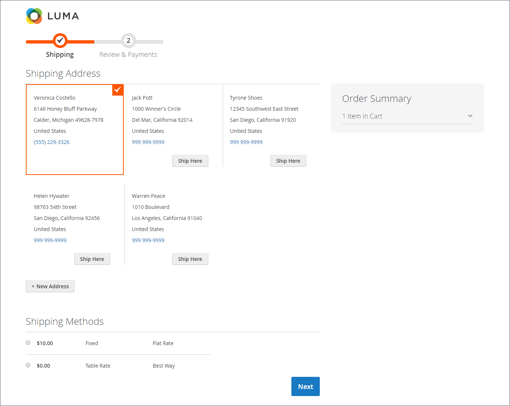

# Processus et options de passage en caisse

Lorsque le processus de passage en caisse commence, la transaction passe à un canal sécurisé et chiffré. Un symbole de cadenas s’affiche dans la barre d’adresse du navigateur et l’URL passe de `http` à `https`.

## Processus

L’objectif du processus de passage en caisse est de collecter les informations nécessaires pour terminer la transaction. La page _Passage en caisse_ permet au client de parcourir chaque étape du processus. Les clients qui sont connectés à leur compte peuvent effectuer rapidement l’extraction, car la plupart des informations se trouvent déjà dans leurs comptes. Les clients associés à un compte d’entreprise qui utilise des commandes d’achat ont un workflow légèrement différent.

### Expédition

La première étape du processus de passage en caisse est que le client remplisse les informations d’adresse de livraison et choisisse le mode de livraison. Si le client dispose d’un compte, l’adresse de livraison est saisie automatiquement, mais peut être modifiée si nécessaire.

 (Adobe Commerce uniquement) Le format de l’adresse postale du destinataire et de l’expéditeur est déterminé par les propriétés de l’ [&#x200B; attribut d’adresse du client &#x200B;](../customers/address-attributes.md). Le paramètre de validation d’entrée détermine les caractères valides qui peuvent être utilisés dans une adresse de livraison.

La barre de progression en haut de la page suit chaque étape du processus de passage en caisse, et le résumé de la commande indique que les informations saisies jusqu’à présent.

{width="600" zoomable="yes"}

#### Expéditeur à une autre adresse

1. S’il existe d’autres entrées dans le carnet d’adresses, le client trouve l’adresse à laquelle la commande doit être expédiée.

1. Pour sélectionner l’adresse, cliquez sur **[!UICONTROL Ship Here]**.

#### Ajouter une adresse

1. Au bas de la section _[!UICONTROL Shipping Address]_, le client clique sur **[!UICONTROL + New Address]**.

1. Complète le formulaire _[!UICONTROL Shipping Address]_.

   Par défaut, le prénom et le nom du client apparaissent initialement dans le formulaire.

   {width="600" zoomable="yes"}

1. Pour enregistrer la nouvelle adresse dans le carnet d’adresses, le client coche la case située au bas du formulaire.

1. Clics **[!UICONTROL Save Address]**.

   La nouvelle adresse est maintenant sélectionnée comme adresse de livraison.

   {width="600" zoomable="yes"}

#### Choix du mode de livraison

1. Dans la liste des méthodes [shipping](delivery.md), le client choisit l’option qu’il souhaite utiliser.

   {width="600" zoomable="yes"}

1. Cliquez sur **[!UICONTROL Next]** pour continuer.

### Révision et paiements - Ordre régulier

Lors de la deuxième étape du processus de passage en caisse, le client choisit le [mode de paiement](payments.md) et applique à l’achat tous les bons avec des codes promotionnels. Toutes les informations peuvent être examinées et modifiées si nécessaire. S’il est activé, le client doit accepter les conditions générales de la vente avant de passer la commande.

>[!NOTE]
>
>Bien que Commerce permette de configurer plusieurs codes de bon, un client ne peut appliquer qu’un seul code de bon au panier. (Pour plus d’informations, voir les [Codes de bon](../merchandising-promotions/price-rules-cart-coupon.md) .)

{width="700" zoomable="yes"}

### Révision et paiements - Bon de commande

 (Disponible avec Adobe Commerce B2B uniquement)

Lorsqu’un client est associé à une société qui a activé [commandes d’achat](../b2b/purchase-order-flow.md), toutes les commandes sont traitées comme des commandes d’achat. Les méthodes de paiement disponibles sont déterminées par les paramètres du compte de l’entreprise.

1. Le client sélectionne un mode de paiement.

   Lors de l&#39;utilisation de la méthode _Paiement sur compte_, le champ [!UICONTROL Custom Reference Number] peut être utilisé pour référencer un numéro de facture.

1. Le client clique sur **[!UICONTROL Place Purchase Order]**.

   Le bon de commande est passé.

Si l’entreprise a configuré des [règles d’approbation](../b2b/account-dashboard-approval-rules.md), la commande passe par le processus d’approbation. Sinon, il est traité immédiatement.

{width="700" zoomable="yes"}

### Nombre d’éléments affichés dans le résumé de la commande

Les utilisateurs administrateurs peuvent modifier le nombre maximal d’éléments affichés dans le résumé de la commande lors du passage en caisse afin de rationaliser l’affichage avec moins de produits. Par défaut, cette valeur est définie sur 10.

{width="700" zoomable="yes"}

1. Sur la barre latérale _Admin_, accédez à **[!UICONTROL Stores]** > _[!UICONTROL Settings]_>**[!UICONTROL Configuration]**.

1. Dans le panneau de gauche, développez **[!UICONTROL Sales]** et choisissez **[!UICONTROL Checkout]**.

1. Développez la section  sur **[!UICONTROL Checkout Options]** .

1. Pour **[!UICONTROL Maximum Number of Items to Display in Order Summary]**, saisissez le nombre maximal d’éléments à afficher.

1. Cliquez sur **[!UICONTROL Save Config]**.

   Avec cette mise à jour, le résumé de la commande affiché lors du passage en caisse est limité à la quantité spécifiée d’articles.

### Confirmation de commande

La confirmation de commande s’affiche une fois la commande passée. Pour les clients enregistrés, la page comprend le numéro de commande avec un lien vers le compte du client et un lien pour générer un reçu. Les clients enregistrés doivent s’attendre à recevoir par email des informations de confirmation de commande et de tracking. Nous vous recommandons de créer un compte pour suivre la commande. Les clients enregistrés peuvent générer un reçu en cliquant sur un lien.

La page de confirmation de commande est également appelée la page _Succès_ et est utilisée par les programmes d’analyse pour suivre les conversions.

{width="700" zoomable="yes"}

## Options de passage en caisse

Les options de passage en caisse contrôlent différents attributs pour la page de passage en caisse, y compris la mise en page. Vous pouvez configurer certaines options pour imposer des contraintes au passage en caisse, notamment autoriser le passage en caisse des invités et appliquer un accord de conditions générales. Il existe également des options pour contrôler l’affichage des informations pendant le processus de passage en caisse.

{width="700" zoomable="yes"}

Pour une description détaillée de chacun de ces paramètres de configuration, voir [Options de passage en caisse](../configuration-reference/sales/checkout.md#checkout-options) dans le _Guide de référence de configuration_.

### Modification des options de passage en caisse

1. Sur la barre latérale _Admin_, accédez à **[!UICONTROL Stores]** > _[!UICONTROL Settings]_>**[!UICONTROL Configuration]**.
1. Dans le panneau de gauche, développez **[!UICONTROL Sales]** et choisissez **[!UICONTROL Checkout]**.
1. Définissez l’une des options suivantes dont vous avez besoin.
1. Cliquez sur **[!UICONTROL Save Config]**.

1. Développez la section  sur **[!UICONTROL Checkout Options]** .

1. Si les paramètres correspondent à une vue de magasin spécifique, [choisissez la vue de magasin](../configuration-reference/scope-change.md#set-the-scope) où la configuration s’applique.

   Lorsque vous y êtes invité, cliquez sur **[!UICONTROL OK]** pour continuer.

1. Définissez les options de passage en caisse.

1. Cliquez sur **[!UICONTROL Save Config]**.

### Options de paiement disponibles

| Champ | [Portée](../getting-started/websites-stores-views.md#scope-settings) | Description |
|--- |--- |--- |
| [!UICONTROL Enable Onepage Checkout] | Affichage en magasin | Détermine si le format de passage en caisse par défaut est [une page](checkout-one-page.md). Options : Oui/Non |
| [!UICONTROL Allow Guest Checkout] | Affichage en magasin | Détermine si les invités peuvent effectuer un [passage en caisse sans s’enregistrer](checkout-guest.md) pour un compte auprès de votre boutique. Options : `Yes` / `No` |
| [!UICONTROL Enable Terms and Conditions] | Affichage en magasin | Détermine si les clients doivent accepter les [Conditions d’utilisation](terms-and-conditions.md) de la vente avant d’effectuer un achat. Options : `Yes` / `No` |
| [!UICONTROL Display Billing Address On] | Affichage en magasin | Détermine l’emplacement de l’adresse de facturation lors de l’extraction. Options : `Payment Method` / `Payment Page` |
| [!UICONTROL Maximum Number of Items to Display in Order Summary] | Affichage en magasin | Détermine le nombre maximal d’éléments qui peuvent apparaître dans le résumé de la commande lors de l’extraction. La valeur par défaut est `10`. |
| [!UICONTROL Enable Address Search] | Site Web |  (Adobe Commerce uniquement) Détermine si les clients peuvent utiliser la fonctionnalité [recherche d’adresses](checkout-address-search.md) pour la _livraison_ et les étapes _Révision et paiements_. Lorsque cette fonction est activée, utilisez _[!UICONTROL Number of Customer Addresses Limit]_&#x200B;pour définir le nombre d’adresses enregistrées requises pour activer cette fonctionnalité lors de l’extraction. Options : `Yes` / `No` |
| [!UICONTROL Number of Customer Addresses Limit] | Site Web |  (Adobe Commerce uniquement) Lorsque la recherche d’adresses est **[!UICONTROL Enabled]**, détermine le nombre d’adresses enregistrées requises pour activer cette fonctionnalité lors du passage en caisse. Lorsque le nombre d’adresses enregistrées du client correspond ou dépasse ce nombre, seule l’adresse par défaut est rendue sur les étapes _Expédition_ et _Révision et paiement_. Le client peut utiliser une fonction de recherche pour modifier l’adresse sélectionnée. La valeur par défaut est 10. |

{style="table-layout:auto"}
