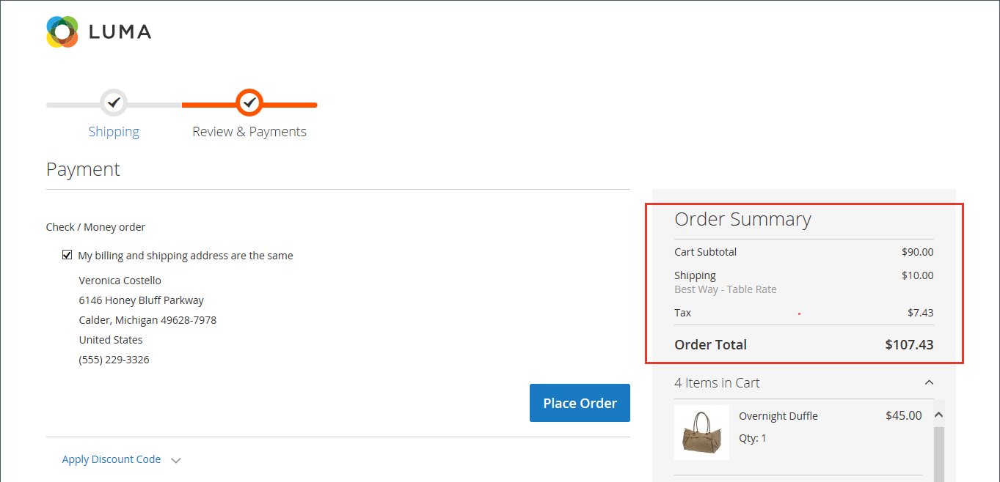

# Ordre de tri des totaux de passage en caisse

Lors de la révision de la commande, le total s’affiche au bas de la commande, avec les ajustements liés aux remises, aux frais d’expédition, au crédit de la boutique et à la taxe. L&#39;ordre de chaque article détermine l&#39;ordre des calculs et est défini dans la configuration par un numéro attribué à chaque article. Par exemple, le sous-total est le premier élément de la section et se voit attribuer la valeur 10. Le total général apparaît en dernier et se voit attribuer une valeur de 100. Une valeur est attribuée à tous les autres éléments de la section des totaux entre ces valeurs.

{width="700" zoomable="yes"}

**_Pour configurer l’ordre de tri des totaux de passage en caisse:_**

1. Dans la barre latérale _Admin_, accédez à **[!UICONTROL Stores]** > _[!UICONTROL Settings]_>**[!UICONTROL Configuration]**.

1. Dans le panneau de gauche, développez la section **[!UICONTROL Sales]** et choisissez **[!UICONTROL Sales]** en dessous.

1. Développez  la section **[!UICONTROL Checkout Totals Sort Order]** .

   {width="600" zoomable="yes"}

   Pour obtenir une description détaillée de chacun de ces paramètres de configuration, consultez [Ordre de tri des totaux de passage en caisse](../configuration-reference/sales/sales.md#checkout-totals-sort-order) dans le _Guide de référence de configuration_.

1. Si le paramètre concerne une vue de magasin spécifique, [choisissez la vue de magasin](../configuration-reference/scope-change.md#set-the-scope) où la configuration s’applique.

   Lorsque vous y êtes invité, cliquez sur **[!UICONTROL OK]** pour continuer.

1. Pour déterminer l&#39;ordre dans la section _Totaux_, modifiez le numéro attribué à chaque élément.

   Plus la valeur est faible, plus son emplacement dans la liste est précoce. Dans la configuration par défaut, le sous-total (`10`) est le premier et le total général (`100`) est le dernier.

   Si nécessaire, décochez la case **[!UICONTROL Use system value]** pour effectuer ces modifications.

1. Cliquez sur **[!UICONTROL Save Config]**.
