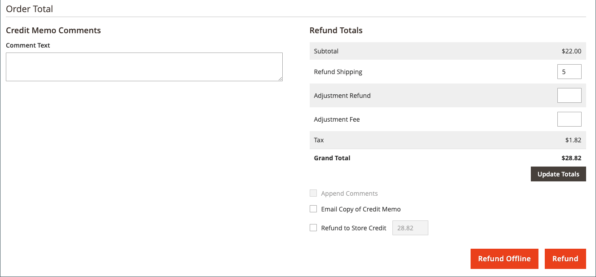

# Émettre un avoir

Avant de pouvoir imprimer un avoir, vous devez d&#39;abord le générer pour une [commande facturée](invoices.md#create-an-invoice). Vous pouvez émettre des remboursements en ligne et hors ligne (partiels ou complets) à partir d&#39;un avoir ouvert, selon le mode de paiement.

-  (Adobe Commerce uniquement) Des remboursements peuvent être appliqués pour stocker du crédit.
-  (disponible avec Adobe Commerce B2B) Les remboursements peuvent être appliqués au crédit de la société.
- Les achats effectués par carte de crédit peuvent être remboursés en ligne ou hors ligne.
- Les achats effectués par chèque ou mandat doivent être remboursés hors ligne.

Tout avoir dont le statut est [ouvert](order-status.md) fait l&#39;objet d&#39;un remboursement dû.

Avec les avoirs, vous pouvez :

- Rembourser le montant total d&#39;une facture.
- Rembourser un montant partiel d&#39;une facture.
- Rembourser plusieurs montants partiels d&#39;une facture.
- Rembourser plusieurs factures par commande, sans dépasser le montant total de la commande.
- Rembourser une partie de la quantité pour un article de ligne, comme trois des cinq chemises d&#39;une commande.

Voir [Créer une facture](invoices.md#create-an-invoice) pour plus d&#39;informations.

## Paramètre de l’action de paiement

Le workflow de remboursement des commandes payées par carte de crédit est déterminé par le paramètre [Action de paiement](../configuration-reference/sales/payment-methods.md#payment-actions) dans la configuration de chaque mode de paiement disponible. Les remboursements ne peuvent pas être émis tant que la transaction n&#39;est pas réglée.

{width="600" zoomable="yes"}

- Si l&#39;action de paiement correspondant au mode de paiement que vous avez configuré est définie sur `Authorize`, vous devez d&#39;abord générer la facture à partir de l&#39;administrateur avant de pouvoir créer un avoir.
- Si l&#39;action de paiement pour le mode de paiement que vous avez configuré est définie sur `Authorize and Capture`, la facture a déjà été générée par le processeur de paiements, mais les fonds ne sont pas disponibles tant que le mouvement n&#39;est pas réglé. Ce bref délai d&#39;attente est recommandé par de nombreux processeurs de paiement comme mesure de sécurité, et peut généralement être géré automatiquement. Les transactions peuvent également être réglées manuellement à partir de votre compte marchand avec le processeur de paiement.
-  (Adobe Commerce uniquement) Si vous créez un avoir pour une commande qui comprend des options cadeau, le remboursement de l&#39;emballage cadeau et/ou de la carte imprimée apparaît dans la section Totaux du remboursement de l&#39;avoir. Pour exclure ces coûts du montant à rembourser, entrez le montant en tant que commission d&#39;ajustement. Si plusieurs avoirs sont émis pour la même commande, le remboursement des options cadeau n&#39;apparaît que dans le premier avoir.

## Créer un avoir

Déterminez le type de remboursement que vous souhaitez émettre (pour un [achat créditeur](#issue-a-refund-for-a-credit-purchase) ou pour un [chèque ou mandat](#issue-an-offline-refund-for-check-or-money-order), générez l&#39;avoir et émettez un remboursement.

### Émettre un remboursement pour un achat à crédit

1. Dans la barre latérale _Admin_, accédez à **[!UICONTROL Sales]** > **[!UICONTROL Orders]**.

   {width="700" zoomable="yes"}

1. Recherchez l’ordre dans la grille, puis cliquez sur **[!UICONTROL View]**.

1. Si le bouton _[!UICONTROL Credit Memo]_est visible dans la barre de boutons, effectuez l’une des opérations suivantes :

   - Pour émettre un remboursement `offline`, passez à l&#39;étape #6.
   - Pour émettre un remboursement `online`, passez à l’étape #4.

   Voir [Avoirs](credit-memos.md) pour plus d&#39;informations sur les remboursements hors ligne et en ligne.

1. Cliquez sur **[!UICONTROL Invoices]** dans le panneau de gauche.

1. Recherchez la facture dans la grille et cliquez sur **[!UICONTROL View]**.

   {width="700" zoomable="yes"}

1. Faites défiler l’écran jusqu’à la section **[!UICONTROL Invoice Totals]** de la facture, vérifiez que la facture est définie sur `Capture Online`, puis cliquez sur **[!UICONTROL Submit Invoice]**.

   {width="600" zoomable="yes"}

   Si cette option n&#39;est pas disponible, la facture est déjà créée. Passez à l’étape suivante.

1. Dans la barre de boutons située en haut de la facture, cliquez sur **[!UICONTROL Credit Memo]**.

1. Vérifiez les informations de la section **[!UICONTROL Items to Refund]** et, le cas échéant, procédez comme suit :

   - Pour retourner le produit en stock, cochez la case **[!UICONTROL Return to Stock]**.

     Le produit retourne automatiquement en stock si _Options de stock de produit_ est défini sur `Automatically Return Credit Memo Item to Stock`. Lorsque [Inventory management est activé](../inventory-management/enable.md) l&#39;article retourne à la source qui a envoyé l&#39;expédition.

   - Mettez à jour la **[!UICONTROL Qty to Refund]**, puis cliquez sur **[!UICONTROL Update Qty's]**.

     {width="600" zoomable="yes"}

1. Mettez à jour la section **[!UICONTROL Refunds Totals]** comme suit :

   - Par **[!UICONTROL Refund Shipping]**, saisissez tout montant à rembourser sur les frais d&#39;expédition.

     Ce champ affiche initialement le montant total des frais d&#39;expédition de la commande pouvant faire l&#39;objet d&#39;un remboursement. Il est égal au montant d&#39;expédition total de la commande, moins tout montant d&#39;expédition qui a déjà été remboursé. Comme la quantité, la quantité peut être réduite, mais pas augmentée.

   - Par **[!UICONTROL Adjustment Refund]**, entrez une valeur à ajouter au montant total remboursé sous forme de remboursement supplémentaire qui ne s&#39;applique pas à une partie particulière de la commande (expédition, articles ou taxe). Il peut également être utilisé pour un remboursement partiel avec de l&#39;argent virtuel, comme une carte cadeau, lorsqu&#39;un administrateur souhaite d&#39;abord rembourser un mode de paiement non virtuel.

     Le montant saisi ne peut pas augmenter le remboursement total au-delà du montant payé.

   - Par **[!UICONTROL Adjustment Fee]**, saisissez une valeur à soustraire du montant total remboursé.

     Ce montant n’est pas soustrait d’une section spécifique de la commande telle que l’expédition, les articles ou la taxe.

1. Pour ajouter un commentaire, saisissez le texte dans la zone de **[!UICONTROL Credit Memo Comments]**.

   - Pour envoyer une notification par e-mail au client ou à la cliente, cochez la case **[!UICONTROL Email Copy of Credit Memo]** .

1. Cliquez sur **[!UICONTROL Update Totals]**.

1. Procédez comme suit, le cas échéant :

   -  (Adobe Commerce uniquement) Pour rembourser le montant au crédit de la boutique du client, cochez la case **[!UICONTROL Refund to Store Credit]**.

   -  (disponible avec Adobe Commerce B2B) Pour rembourser le montant au crédit de la société du client, cochez la case **[!UICONTROL Refund to Company Credit]**.

   - Pour effectuer un remboursement hors ligne, cliquez sur **[!UICONTROL Refund Offline]**.

   - Pour émettre un remboursement en ligne, cliquez sur **[!UICONTROL Refund]**.

   -  (disponible avec Adobe Commerce B2B) Si l’achat a été payé avec un crédit d’entreprise, cliquez sur **[!UICONTROL Refund to Company Credit]**.

   Voir [Avoirs](credit-memos.md) pour plus d&#39;informations sur les remboursements hors ligne et en ligne.

   {width="600" zoomable="yes"}

### Émettre un remboursement hors ligne pour un chèque ou un mandat

1. Dans la barre latérale _Admin_, accédez à **[!UICONTROL Sales]** > **[!UICONTROL Orders]**.

1. Recherchez la commande terminée dans la grille et ouvrez-la en cliquant sur le lien **[!UICONTROL View]**.

1. Dans la barre de boutons située en haut de la page, cliquez sur **[!UICONTROL Invoice]**.

1. Faites défiler la page vers le bas et cliquez sur **[!UICONTROL Submit Invoice]**.

1. Dans la barre de boutons située en haut de la facture, cliquez sur **[!UICONTROL Credit Memo]**.

   {width="600" zoomable="yes"}

1. Vérifiez les informations de la section **[!UICONTROL Items to Refund]** et, le cas échéant, procédez comme suit :

   {width="600" zoomable="yes"}

   - Cochez la case **[!UICONTROL Return to Stock]** si vous souhaitez retourner le produit retourné à l&#39;inventaire.

     Lorsqu’Inventory management est activé, la quantité en stock revient à l’origine qui a envoyé l’expédition. Le produit retourne automatiquement en stock si [Options de stock de produit](../inventory-management/enable.md) est défini sur `Automatically Return Credit Memo Item to Stock`.

   - Mettez à jour la **[!UICONTROL Qty to Refund]** et cliquez sur **[!UICONTROL Update Qty's]**.

     Le montant à créditer ne peut pas dépasser le montant maximal disponible pour le remboursement.

1. Mettez à jour la section **[!UICONTROL Refunds Totals]** selon vos besoins :

   - Par **[!UICONTROL Refund Shipping]**, saisissez tout montant à rembourser sur les frais d&#39;expédition.

     Ce champ affiche initialement le montant total des frais de livraison de la commande pouvant faire l&#39;objet d&#39;un remboursement. Il est égal au montant d&#39;expédition total de la commande, moins tout montant d&#39;expédition qui a déjà été remboursé. Comme la quantité, la quantité peut être réduite, mais pas augmentée.

   - Par **[!UICONTROL Adjustment Refund]**, entrez une valeur à ajouter au montant total remboursé sous forme de remboursement supplémentaire qui ne s&#39;applique pas à une partie particulière de la commande (expédition, articles ou taxe). Il peut également être utilisé pour un remboursement partiel avec de l&#39;argent virtuel, comme une carte cadeau, lorsqu&#39;un administrateur souhaite d&#39;abord rembourser un mode de paiement non virtuel.

     Le montant saisi ne peut pas augmenter le remboursement total au-delà du montant payé.

   - Par **[!UICONTROL Adjustment Fee]**, saisissez une valeur à soustraire du montant total remboursé.

     Ce montant n’est pas soustrait d’une section spécifique de la commande telle que l’expédition, les articles ou la taxe.

   - Si l&#39;achat a été payé avec un crédit de magasin, cochez la case **[!UICONTROL Refund to Store Credit]** pour créditer le montant au solde du compte client.

1. Pour ajouter un commentaire, saisissez le texte dans la zone de **[!UICONTROL Credit Memo Comments]** et procédez comme suit :

   - Pour envoyer une notification par e-mail au client ou à la cliente, cochez la case **[!UICONTROL Email Copy of Credit Memo]** .

   - Pour inclure les commentaires que vous avez saisis dans l’e-mail, cochez la case **[!UICONTROL Append Comments]** .

     Le statut d&#39;une notification d&#39;avoir apparaît dans l&#39;avoir terminé à côté du numéro d&#39;avoir.

     {width="600" zoomable="yes"}

1. Pour terminer le processus et émettre le remboursement, cliquez sur **[!UICONTROL Refund Offline]**.

## Descriptions des champs

### [!UICONTROL Order & Account Information]

| Champ | Description |
|--- |--- |
| [!UICONTROL Order Number] | Le numéro de commande s’affiche dans les _Informations sur la commande et le compte_, suivi d’une note indiquant si l’e-mail de confirmation a été envoyé. |
| [!UICONTROL Order Date] | Date et heure auxquelles la commande a été passée. |
| [!UICONTROL Order Status] | Indique le statut de la commande comme `Complete`. |
| [!UICONTROL Purchased From] | Indique l’affichage du site web, du magasin et du magasin dans lequel la commande a été passée. |
| [!UICONTROL Placed from IP] | Indique l&#39;adresse IP de l&#39;ordinateur à partir duquel la commande a été passée. |

{style="table-layout:auto"}

### [!UICONTROL Account Information]

| Champ | Description |
|--- |--- |
| [!UICONTROL Customer Name] | Nom du client ou de l’acheteur qui a passé la commande. Le nom du client est lié au profil du client. |
| [!UICONTROL Email] | Adresse e-mail du client ou de l’acheteur. L’adresse e-mail est liée pour ouvrir un nouvel e-mail. |
| [!UICONTROL Customer Group] | Nom du groupe de clients ou du catalogue partagé auquel le client est affecté. |
| [!UICONTROL Company Name] |  (disponible avec Adobe Commerce B2B) Nom de la société associée à l’acheteur et pour le compte de laquelle la commande est passée. Le nom de la société est lié au profil de la société. |

{style="table-layout:auto"}

### [!UICONTROL Address Information]

| Champ | Description |
|--- |--- |
| [!UICONTROL Billing Address] | Nom du client ou de l’acheteur qui a passé la commande, suivi de l’adresse de facturation, du numéro de téléphone et de la [TVA](vat.md), le cas échéant. Le numéro de téléphone est lié à la numérotation automatique sur un appareil mobile. |
| [!UICONTROL Shipping Address] | Nom de la personne à l’attention de laquelle la commande doit être expédiée, suivi de l’adresse d’expédition et du numéro de téléphone. Le numéro de téléphone est lié à la numérotation automatique sur un appareil mobile. |

{style="table-layout:auto"}

### [!UICONTROL Payment & Shipping Method]

| Champ | Description |
|--- |--- |
| [!UICONTROL Payment Information] | Mode de paiement à utiliser pour la commande et numéro de commande fournisseur, le cas échéant, suivi de la devise utilisée pour passer la commande. Si la commande est imputée au crédit de la société à l’aide de l’option [Paiement sur le compte](../b2b/enable-basic-features.md#configure-payment-on-account), le montant imputé au compte est indiqué. |
| [!UICONTROL Shipping & Handling Information] | La méthode d’expédition à utiliser et les frais de manutention applicables. |

{style="table-layout:auto"}

### [!UICONTROL Items to Refund]

| Champ | Description |
|--- |--- |
| [!UICONTROL Product] | Nom du produit, SKU et options (le cas échéant). |
| [!UICONTROL Price] | Prix d’achat de l’article. Pour Adobe Commerce B2B, cette valeur reflète toute remise appliquée à l’article du catalogue partagé, le cas échéant. |
| [!UICONTROL Qty] | Quantité commandée. |
| [!UICONTROL Return to Stock] | Case à cocher indiquant si l’article renvoyé doit être retourné en stock. |
| [!UICONTROL Qty to Refund] | Indique le nombre d’unités renvoyées par le produit. |
| [!UICONTROL Subtotal] | Le sous-total est le prix d&#39;achat multiplié par la quantité d&#39;unités de produit retournées. |
| [!UICONTROL Tax Amount] | Montant de taxe qui s&#39;applique à l&#39;article renvoyé sous forme de valeur décimale. |
| [!UICONTROL Tax Percent] | Pourcentage de taxe appliqué à l&#39;article retourné sous forme de pourcentage. |
| [!UICONTROL Discount Amount] | Toute remise qui s&#39;applique à l&#39;article retourné. |
| [!UICONTROL Row Total] | Total de l&#39;élément de ligne, y compris les taxes applicables dues pour le niveau de produit retourné, moins les remises. |
| _total commande_ |  |

{style="table-layout:auto"}

### [!UICONTROL Credit Memo Comments]

| Champ | Description |
|--- |--- |
| [!UICONTROL Comment Text] | Zone de texte utilisée pour saisir un commentaire à l&#39;intention du client à propos de l&#39;avoir. |

{style="table-layout:auto"}

### [!UICONTROL Refund Totals]

| Champ | Description |
|--- |--- |
| [!UICONTROL Refund Shipping] | Montant de l’expédition à rembourser. |
| [!UICONTROL Adjustment Refund] | Montant ajouté au montant total remboursé sous la forme d’un remboursement supplémentaire qui ne s’applique pas à une partie particulière de la commande, comme l’expédition, les articles ou les taxes. Le montant entré ne peut pas augmenter le remboursement total au-delà du montant payé. |
| [!UICONTROL Adjustment Fee] | Montant soustrait du montant total remboursé, tel que des frais de réapprovisionnement, ou un montant lié à l’emballage du cadeau ou aux options de cadeau. |
| [!UICONTROL Grand Total] | Montant total à rembourser |
| [!UICONTROL Append Comments] | Case à cocher qui détermine si les commentaires sont inclus dans l&#39;avoir. |
| [!UICONTROL Email Copy of Credit Memo] | Case à cocher qui détermine si une copie de l&#39;avoir est envoyée par e-mail. |
| [!UICONTROL Refund to Store Credit] |  (Adobe Commerce uniquement) Case à cocher qui détermine si le total doit être remboursé au [crédit de la boutique](../customers/store-credit-using.md). |
| [!UICONTROL Subtotal] |  (disponible avec Adobe Commerce B2B) Total de toutes les lignes à rembourser. |

{style="table-layout:auto"}

### Boutons de remboursement

Le mode de paiement utilisé pour la commande détermine les boutons de remboursement disponibles pour un avoir.

| Bouton | Description |
|--- |--- |
| **[!UICONTROL Refund]** | Si l&#39;achat d&#39;origine a été payé par carte de crédit par l&#39;intermédiaire d&#39;une passerelle de paiement, le montant du remboursement est géré par le processeur de paiement. Pour gérer les remboursements, consultez la documentation fournie par votre fournisseur de paiement. |
| **[!UICONTROL Refund Offline]** | Si l&#39;achat original a été payé par chèque ou mandat, le remboursement est payé directement au client, en émettant un chèque, une carte-cadeau ou de l&#39;argent si vous avez une vitrine en brique et mortier. L&#39;avoir sert d&#39;enregistrement de la transaction hors ligne. |
| **[!UICONTROL Refund to Company Credit]** |  (disponible avec Adobe Commerce B2B) Si l’achat a été imputé au crédit de la société, le remboursement est renvoyé au [compte de la société](../b2b/credit-company.md). |

{style="table-layout:auto"}

## Imprimer un avoir

Pour imprimer ou afficher l&#39;avoir terminé, un lecteur PDF doit être installé. Vous pouvez télécharger [Adobe Reader](https://www.adobe.com/acrobat/pdf-reader.html "Obtenir Adobe Reader") gratuitement.

1. Dans la barre latérale _Admin_, accédez à **[!UICONTROL Sales]** > _[!UICONTROL Operations]_>**[!UICONTROL Credit Memos]**.

1. Utilisez l&#39;une des méthodes suivantes pour imprimer l&#39;avoir :

### Méthode 1 : Imprimer l&#39;avoir actuel

1. Dans la grille, ouvrez l&#39;avoir.

1. Cliquez sur **[!UICONTROL Print]**.

   {width="600" zoomable="yes"}

### Méthode 2 : Imprimer plusieurs avoirs

1. Dans la liste, cochez la case de chaque avoir à imprimer.

1. Définissez la commande **[!UICONTROL Actions]** sur `PDF Credit Memos`, puis cliquez sur **[!UICONTROL Submit]**.

   {width="600" zoomable="yes"}

1. Lorsque vous y êtes invité, effectuez l’une des opérations suivantes :

   - Pour enregistrer le document, cliquez sur **[!UICONTROL Save]** et suivez les invites pour enregistrer le fichier sur votre ordinateur. Une fois le téléchargement terminé, ouvrez le PDF dans Adobe Reader et imprimez le document.

   - Pour afficher le document, cliquez sur **[!UICONTROL Open]**. L’avoir PDF prêt à être imprimé s’ouvre dans Adobe Reader. À partir de là, vous pouvez imprimer l&#39;avoir ou l&#39;enregistrer sur votre ordinateur.
