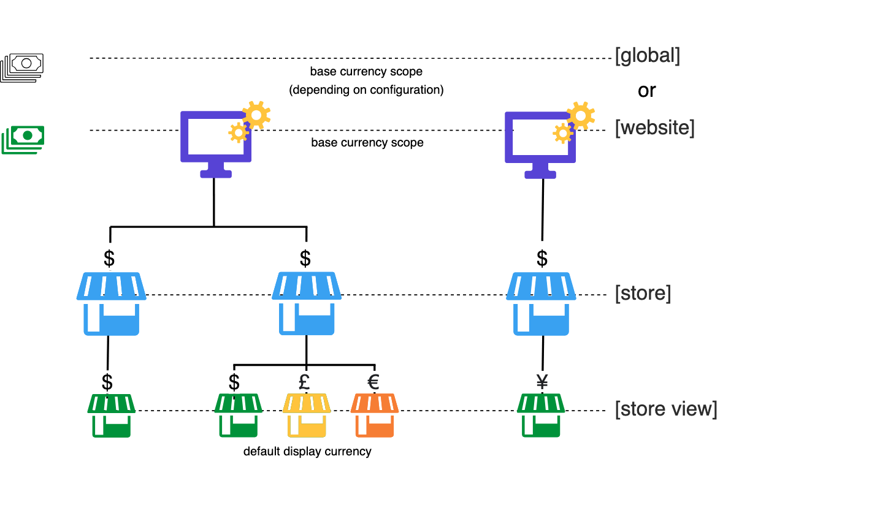
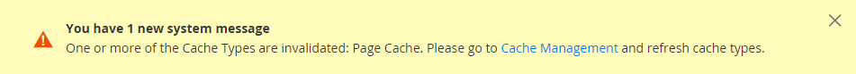

# Configuration de la devise

Avant de configurer des taux de change individuels, vous devez d&#39;abord définir la portée de la [devise de base](../configuration-reference/general/currency-setup.md). Il est défini sur global par défaut, ce qui applique le paramètre de devise de base à l’ensemble de la hiérarchie [&#x200B; magasin](../getting-started/websites-stores-views.md). Si vous disposez d’une installation Adobe Commerce ou Magento Open Source multisite, vous pouvez gérer plusieurs devises de base en définissant l’étendue au niveau du site web.

Vous spécifiez également les devises que vous acceptez et celle que vous souhaitez utiliser pour l’affichage des [prix](../catalog/catalog-price-scope.md) dans votre magasin. Dans le diagramme suivant, l’étendue de la devise de base est définie au niveau du site web. Chaque site web peut donc avoir une devise de base différente.

{width="600" zoomable="yes"}

## Etape 1 : Choisissez les devises acceptées

1. Dans la barre latérale _Admin_, accédez à **[!UICONTROL Stores]** > _[!UICONTROL Settings]_>**[!UICONTROL Configuration]**.

1. Dans le coin supérieur gauche, définissez **[!UICONTROL Scope]** sur la vue du magasin à laquelle la configuration s’applique.

1. Dans le panneau de gauche sous _Général_, choisissez **[!UICONTROL Currency Setup]**.

1. Développez  la section **[!UICONTROL Currency Options]** et définissez les options suivantes :

   - **[!UICONTROL Base Currency]** — Définit sur la devise principale utilisée pour les transactions en ligne.

   - **[!UICONTROL Default Display Currency]** — Définit sur la devise que vous utilisez pour afficher les prix dans la vue du magasin.

   - **[!UICONTROL Allowed Currencies]** — Sélectionnez toutes les devises que vous acceptez comme paiement dans la vue du magasin. Veillez également à sélectionner votre devise principale.

     Pour plusieurs devises, maintenez la touche Ctrl (PC) ou Commande (Mac) enfoncée et cliquez sur chaque option.

   {width="600" zoomable="yes"}

   Pour obtenir une description détaillée de chacun de ces paramètres de configuration, voir [Options de devise](../configuration-reference/general/currency-setup.md) dans le _Guide de référence de configuration_.

1. Lorsque vous êtes invité à actualiser le cache, cliquez sur _Fermer_ (  ) dans le coin supérieur droit du message système.

   Vous pourrez [actualiser le cache](../systems/cache-management.md) ultérieurement.

1. Définissez la portée de la devise de base :

   - Dans le panneau de gauche, développez **[!UICONTROL Catalog]** et choisissez **[!UICONTROL Catalog]** en dessous.

   - Faites défiler vers le bas et développez  la section **[!UICONTROL Price]** . (Cette section s’affiche uniquement si l’étendue est définie comme _Configuration par défaut_.)**[!UICONTROL Store View:]**

   - Définissez **[!UICONTROL Catalog Price Scope]** sur `Global` ou `Website`.

   {width="600" zoomable="yes"}

## Étape 2 : configurer la connexion d’importation

1. Faites défiler la page jusqu’en haut.

1. Dans le panneau de gauche, développez **[!UICONTROL General]** et choisissez **[!UICONTROL Currency Setup]**.

1. Configurez votre connexion au service monétaire :

   Il existe trois options de service : _[!UICONTROL Fixer.io (legacy)]_,_[!UICONTROL Fixer Api (APILayer)]_ et _[!UICONTROL Currency Converter API]_

   >[!IMPORTANT]
   >
   >À compter de la version 2.4.6, le service [[!DNL Fixer.io]](https://fixer.io/) est obsolète et remplacé par le service [[!DNL Fixer API] (APILayer)](https://apilayer.com/marketplace/fixer-api). Il est vivement recommandé d’utiliser un compte APILayer plutôt qu’un compte [!DNL Fixer.io] obsolète.

   - _Pour vous connecter au service [fixer.io](https://fixer.io/):_

      - Développez  la section **[!UICONTROL Fixer.io]** .

      - Entrez votre **[!UICONTROL API key]** fixer.io.

      - Par **[!UICONTROL Connection Timeout in Seconds]**, saisissez le nombre de secondes d’inactivité à autoriser avant l’expiration de la connexion.

     {width="600" zoomable="yes"}

   - _Pour vous connecter au [[!DNL Fixer Api (APILayer)] service](https://apilayer.com/):_

      - Développez  la section **[!UICONTROL Fixer Api (APILayer)]** .

      - Saisissez votre **[!UICONTROL API key]** de [!DNL APILayer].

      - Par **[!UICONTROL Connection Timeout in Seconds]**, saisissez le nombre de secondes d’inactivité à autoriser avant l’expiration de la connexion.

     {width="600" zoomable="yes"}

   - _Pour vous connecter au [[!DNL Currency Convertor API] service](https://free.currencyconverterapi.com/):_

      - Développez  la section **[!UICONTROL Currency Convertor API]** .

      - Saisissez votre **[!UICONTROL API key]** Convertisseur de devises.

      - Par **[!UICONTROL Connection Timeout in Seconds]**, saisissez le nombre de secondes d’inactivité à autoriser avant l’expiration de la connexion.

     {width="600" zoomable="yes"}

## Étape 3 : Configurer les paramètres d’importation planifiés

1. Continuez avec Configuration de la devise, développez  dans la section **[!UICONTROL Scheduled Import Settings]**.

   {width="600" zoomable="yes"}

1. Pour mettre automatiquement à jour les taux de change, définissez **[!UICONTROL Enabled]** sur `Yes`.

1. Définissez les options de mise à jour :

   - **[!UICONTROL Service]** — Défini sur le fournisseur de taux. La valeur par défaut est `Fixer.io (legacy)`.

   - **[!UICONTROL Start Time]** — Définit sur l&#39;heure, la minute et la seconde où les taux sont mis à jour selon le calendrier.

   - **[!UICONTROL Frequency]** — Pour déterminer la fréquence de mise à jour des taux, définissez l&#39;une des options suivantes :

      - `Daily`
      - `Weekly`
      - `Monthly`

   - **[!UICONTROL Error Email Recipient]** — Saisissez l&#39;adresse e-mail de la personne qui doit recevoir une notification par e-mail si une erreur se produit pendant le processus d&#39;importation.

     Pour saisir plusieurs adresses e-mail, séparez-les par une virgule.

   - **[!UICONTROL Error Email Sender]** — Définit sur le [&#x200B; contact de magasin &#x200B;](../getting-started/store-details.md#store-email-addresses) qui apparaît comme l&#39;expéditeur de la notification d&#39;erreur.

   - **[!UICONTROL Error Email Template]** — Définit sur le modèle d&#39;e-mail utilisé pour la notification d&#39;erreur.

1. Cliquez ensuite sur **[!UICONTROL Save Config]**.

1. Lorsque vous êtes invité à mettre à jour le cache, cliquez sur le lien **[!UICONTROL Cache Management]** et actualisez le cache non valide.

   {width="600" zoomable="yes"}

## Etape 4 : Mettre à jour les taux de change

Les taux de change doivent être mis à jour avec les valeurs actuelles avant leur entrée en vigueur. [Mettez à jour les taux](currency-update.md) manuellement ou pour importer les taux automatiquement.

## Étape 5 : Personnaliser les symboles de devise (facultatif)

La gestion des symboles de devise vous permet de personnaliser le symbole associé à chaque devise acceptée comme paiement dans votre boutique.

{width="600" zoomable="yes"}

1. Dans la barre latérale _Admin_, accédez à **[!UICONTROL Stores]** > _[!UICONTROL Currency]_>**[!UICONTROL Currency Symbols]**.

   Chaque devise activée pour votre boutique apparaît dans la liste _[!UICONTROL Currency]_.

1. Modifiez les paramètres de la liste selon vos besoins :

   - Saisissez un symbole personnalisé pour chaque devise que vous souhaitez utiliser ou cochez la case **[!UICONTROL Use Standard]** pour chaque devise.

   - Pour remplacer le symbole par défaut, décochez la case _[!UICONTROL Use Standard]_&#x200B;et saisissez le symbole à utiliser.

   >[!NOTE]
   >
   >Il n’est pas possible de modifier l’alignement du symbole de devise de la gauche vers la droite.

1. Cliquez ensuite sur **[!UICONTROL Save Currency Symbols]**.

1. Lorsque vous êtes invité à mettre à jour le cache, cliquez sur le lien **[!UICONTROL Cache Management]** et actualisez tout cache non valide.
