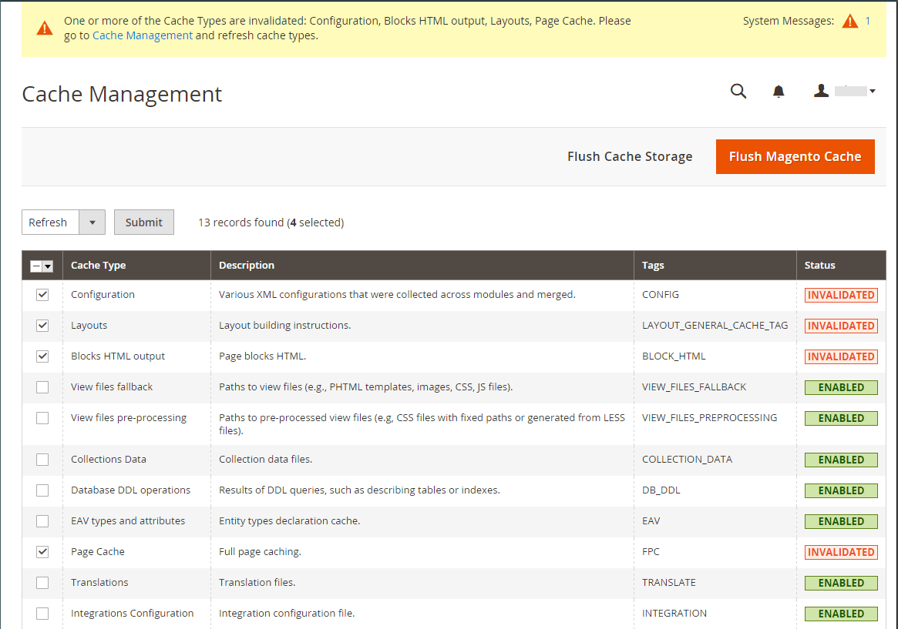

# Mettre à jour les taux de change

Les taux de change peuvent être définis manuellement ou importés dans le magasin. Pour vous assurer que votre boutique dispose des taux les plus récents, vous pouvez configurer les taux de change pour qu’ils soient automatiquement mis à jour selon le calendrier.

Avant d&#39;importer des taux de change, effectuez la [configuration des taux de change](currency-configuration.md) pour spécifier les devises que vous acceptez et pour établir la connexion et le planning d&#39;importation.

{width="600" zoomable="yes"}

## Mettre à jour manuellement un taux de change

1. Dans la barre latérale _Admin_, accédez à **[!UICONTROL Stores]** > _[!UICONTROL Currency]_>**[!UICONTROL Currency Rates]**.

1. Cliquez sur le taux que vous souhaitez modifier et saisissez la nouvelle valeur pour chaque devise prise en charge.

1. Cliquez ensuite sur **[!UICONTROL Save Currency Rates]**.

## Importer les taux de change

1. Dans la barre latérale _Admin_, accédez à **[!UICONTROL Stores]** > _[!UICONTROL Currency]_>**[!UICONTROL Currency Rates]**.

1. **[!UICONTROL Import Service]** au fournisseur de taux de change.

   Le fournisseur par défaut est `fixer.io (legacy)`.

   >[!IMPORTANT]
   >
   >À compter de la version 2.4.6, le service [[!DNL Fixer.io]](https://fixer.io/) est obsolète et remplacé par le service [[!DNL Fixer API] (APILayer)](https://apilayer.com/marketplace/fixer-api). Il est vivement recommandé d’utiliser un compte APILayer plutôt qu’un compte [!DNL Fixer.io] obsolète.

1. Cliquez sur **[!UICONTROL Import]**.

   Les taux mis à jour apparaissent dans la liste des _[!UICONTROL Currency Rates]_. Si les taux ont changé depuis la dernière mise à jour, l’ancien taux s’affiche ci-dessous à titre de référence.

1. Cliquez ensuite sur **[!UICONTROL Save Currency Rates]**.

1. Lorsque vous êtes invité à mettre à jour le cache, cliquez sur le lien **[!UICONTROL Cache Management]** et actualisez le cache non valide.

   {width="600" zoomable="yes"}

## Importer les taux de change selon le calendrier

1. Assurez-vous que la mention [Cron](../systems/cron.md) est activée pour votre boutique.

1. Pour spécifier les devises que vous acceptez et établir la connexion et le planning d&#39;importation, exécutez la [Configuration du taux de change](currency-configuration.md).

1. Pour vérifier que les taux sont importés selon le calendrier, consultez la liste des _[!UICONTROL Currency Rates]_.

1. Patientez pendant la période du paramètre de fréquence établi pour la planification et vérifiez à nouveau les taux.
