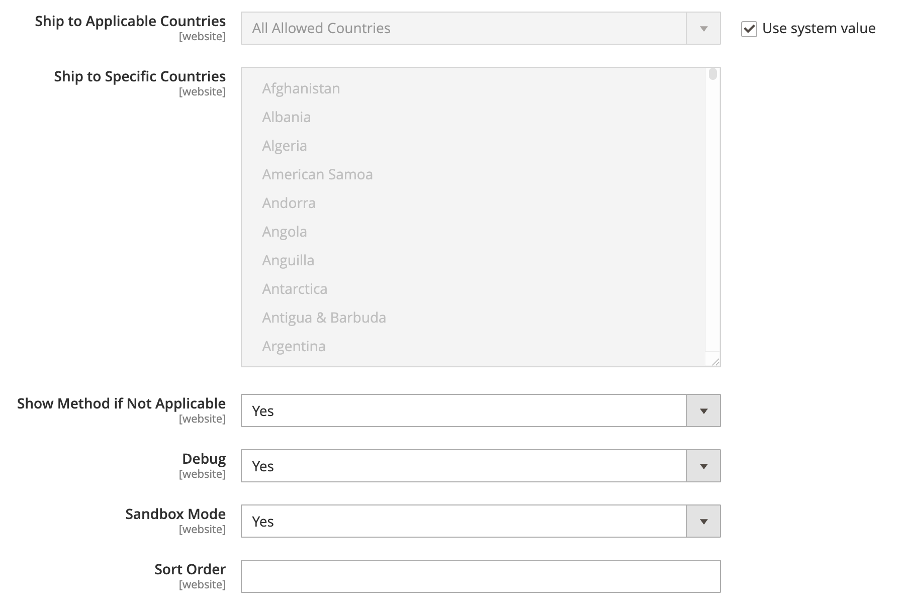

# DHL

DHL offre des services internationaux intégrés et des solutions personnalisées et axées sur les clients pour la gestion et le transport de lettres, de marchandises et d&#39;informations.

## Étape 1 : activer DHL

1. Dans la barre latérale _Admin_, accédez à **[!UICONTROL Stores]** > _[!UICONTROL Settings]_>**[!UICONTROL Configuration]**.

1. Dans le panneau de gauche, développez **[!UICONTROL Sales]** et choisissez **[!UICONTROL Delivery Methods]**.

1. Développez  la section **[!UICONTROL DHL]** .

   >[!NOTE]
   >
   >Si nécessaire, décochez d’abord la case **[!UICONTROL Use system value]** pour modifier les paramètres suivants comme décrit.

1. Définissez **[!UICONTROL Enabled for Checkout]** sur `Yes`.

1. Définissez **[!UICONTROL DHL Type]** sur `DHL REST` si vous utilisez l’API REST DHL.

   Si vous utilisez l’API XML DHL, définissez **[!UICONTROL DHL Type]** sur `DHL XML`.

   >[!NOTE]
   >
   >L’API REST DHL est la méthode préférée pour intégrer à DHL. L’API XML est obsolète et peut être supprimée dans les prochaines versions.

1. Utilisez les informations d’identification fournies par DHL pour remplir les champs suivants :

Si vous utilisez l’API REST DHL, vous devez fournir les informations d’identification suivantes :

    - **[!UICONTROL API KEY]**
    - **[!UICONTROL API SECRET]**

Si vous utilisez l’API XML DHL, vous devez fournir les informations d’identification suivantes :

    - **[!UICONTROL Access ID]**
    - **[!UICONTROL Password]**
    - **[!UICONTROL Account Number]**

{width="600" zoomable="yes"}

## Étape 2 : entrer la description du colis et les frais de manutention

1. Dans la liste **[!UICONTROL Content Type]**, sélectionnez l’option qui décrit le mieux le type de package à expédier :

   - `Documents`
   - `Non documents`

1. Configurez les options de frais de gestion en fonction de vos besoins.

   Les frais de manutention sont facultatifs et apparaissent comme des frais supplémentaires qui sont ajoutés aux frais d&#39;expédition DHL. Si vous souhaitez inclure des frais de manutention, procédez comme suit :

   - Par **[!UICONTROL Calculate Handling Fee]**, sélectionnez la méthode à utiliser pour calculer les frais de manutention :

      - `Fixed`
      - `Percentage`

   - Par **[!UICONTROL Handling Applied]**, sélectionnez le mode d’application des frais de gestion :

      - `Per Order`
      - `Per Package`

   - Par **[!UICONTROL Handling Fee]**, saisissez le montant à facturer, en fonction de la méthode que vous avez choisie pour calculer le montant.

     Par exemple, si les frais sont basés sur des frais fixes, saisissez le montant sous la forme d’une décimale, comme `4.90`. Toutefois, si les frais de gestion sont basés sur un pourcentage de la commande, saisissez le montant sous forme de pourcentage. Par exemple, si vous facturez six pour cent de la commande, saisissez la valeur `6`.

   - Pour permettre de diviser le poids total de la commande afin de garantir un calcul précis des frais d’expédition, définissez **[!UICONTROL Divide Order Weight]** sur `Yes`.

   - Définissez la **[!UICONTROL Weight Unit]** du package sur l’une des options suivantes :

      - `Pounds`
      - `Kilograms`

   - Définissez la **[!UICONTROL Size]** d’un package standard sur l’une des options suivantes :

      - `Regular`
      - `Specific`

     Si vous choisissez `Specific`, saisissez le **[!UICONTROL Height]**, le **[!UICONTROL Depth]** et le **[!UICONTROL Width]** du package en centimètres.

   >[!NOTE]
   >
   >Si aucune dimension n’est spécifiée, chacune d’elles aura par défaut une valeur minimale de 3.

   {width="600" zoomable="yes"}

## Étape 3 : spécifier les méthodes de diffusion autorisées

1. Par **[!UICONTROL Allowed Methods]**, choisissez chaque méthode que vous souhaitez mettre à la disposition des clients.

   Pour sélectionner plusieurs méthodes, maintenez la touche Ctrl (PC) ou Commande (Mac) enfoncée et cliquez sur chaque option.

   Pour afficher la liste correcte des modes de diffusion, vous devez d’abord spécifier le [pays d’origine](../configuration-reference/sales/shipping-settings.md).

1. Par **[!UICONTROL Ready Time]**, saisissez le nombre d&#39;heures suivant la soumission d&#39;une commande pour qu&#39;un colis soit prêt à être expédié.

1. Modifiez le **[!UICONTROL Displayed Error Message]** selon vos besoins.

   Ce message s’affiche lorsqu’une méthode sélectionnée n’est pas disponible.

1. Si vous souhaitez fournir une option [Livraison gratuite](shipping-free.md) via DHL, définissez les options de livraison gratuite.

   - Par **[!UICONTROL Free Method]**, choisissez la méthode que vous préférez utiliser pour la livraison gratuite.

   - Définir **[!UICONTROL Free Shipping Amount Threshold]** :

     `Enable` - Si vous proposez la livraison gratuite avec commande minimum, saisissez le **[!UICONTROL Minimum Order Amount for Free Shipping]**.

     `Disable` - N&#39;applique pas la livraison gratuite de DHL à toute commande.

     Ce paramètre est similaire à celui de la méthode standard _Livraison gratuite_, mais il apparaît dans la section DHL afin que les clients sachent quelle méthode est utilisée pour leur commande.

   - Par **[!UICONTROL Free Shipping Amount Threshold]**, saisissez le montant minimum pour une commande afin de bénéficier de la livraison gratuite.

     {width="600" zoomable="yes"}

## Étape 4 : Indiquez les pays applicables

1. Définissez **[!UICONTROL Ship to Applicable Countries]** sur l’une des options suivantes :

   - `All Allowed Countries`
   - `Specific Countries`

   Si vous effectuez une expédition vers des pays spécifiques, sélectionnez chaque pays dans la liste **[!UICONTROL Ship to Specific Countries]**.

1. Définir **[!UICONTROL Show Method if Not Applicable]** :

   `Yes` - Affiche DHL comme méthode d&#39;expédition lors du passage en caisse, même s&#39;il ne s&#39;applique pas à la commande.

   `No` : affiche DHL comme méthode d’expédition lors du passage en caisse uniquement, le cas échéant.

1. Pour créer un fichier journal avec les détails des expéditions DHL effectuées à partir de votre magasin, définissez **[!UICONTROL Debug]** sur `Yes`.

1. DHL offre une option de **[!UICONTROL sandbox mode]**. Si vous utilisez le mode sandbox, définissez **[!UICONTROL sandbox mode]** sur `Yes`.
Si vous utilisez le mode réel, définissez **[!UICONTROL sandbox mode]** sur `No`.

   >[!NOTE]
   >
   >Le mode Sandbox est utilisé à des fins de test uniquement. Il vous permet de tester votre intégration avec DHL sans affecter votre boutique en ligne.

1. Par **[!UICONTROL Sort Order]**, saisissez un nombre pour déterminer l’ordre dans lequel DHL apparaît lorsqu’il est répertorié avec d’autres méthodes de diffusion lors du passage en caisse.

   `0` = premier, `1` = deuxième, `2` = troisième, etc.

1. Cliquez sur **[!UICONTROL Save Config]**.

   {width="600" zoomable="yes"}
