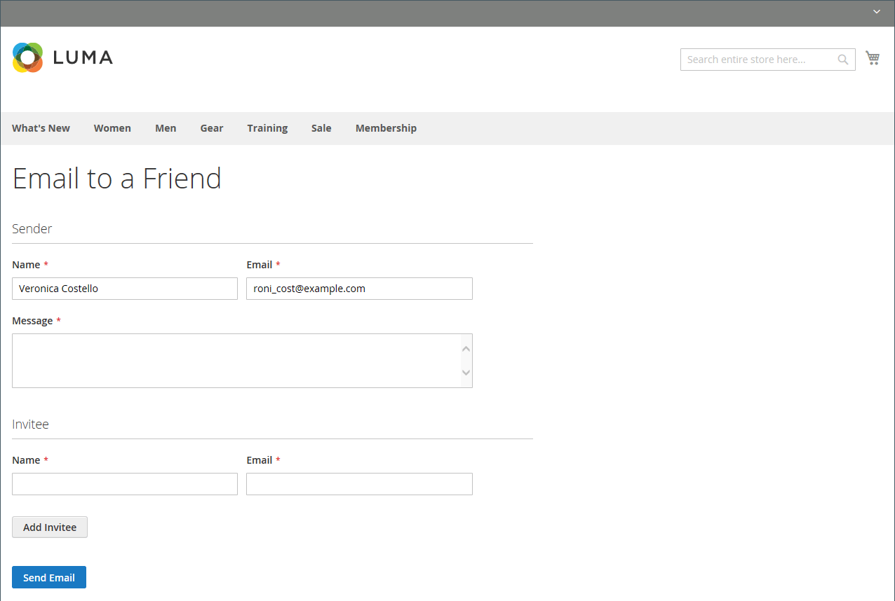

# Envoyer un email à un ami

Le lien Email permet à vos clients de partager facilement des liens vers des produits avec leurs amis. Dans la boutique de démonstration Luma, le lien Courrier électronique s’affiche sous la forme d’une icône d’enveloppe. Le modèle de message peut être personnalisé pour votre voix et votre marque. Pour éviter le spam, vous pouvez limiter le nombre de destinataires pour chaque email et le nombre de produits pouvant être partagés sur une période d&#39;une heure.

{width="700" zoomable="yes"}

## Configurer email-a-friend

1. Sur la barre latérale _Admin_, accédez à **[!UICONTROL Stores]** > _[!UICONTROL Settings]_>**[!UICONTROL Configuration]**.

1. Dans le panneau de gauche, développez **[!UICONTROL Catalog]** et choisissez **[!UICONTROL Email to a Friend]**.

1. Développez la section  et définissez les options suivantes :**[!UICONTROL Email Templates]**

   {width="600" zoomable="yes"}

   Pour une description détaillée de chacun de ces paramètres de configuration, voir [Modèles d’e-mail](../configuration-reference/catalog/email-to-a-friend.md) dans le _Guide de référence de configuration_.

   Pour modifier le paramètre par défaut d’un champ, décochez la case **[!UICONTROL Use system value]** pour que le champ soit modifiable.

   - Définissez **[!UICONTROL Enabled]** sur `Yes`.

   - Définissez **[!UICONTROL Select Email Template]** sur le modèle que vous souhaitez utiliser comme base des messages.

   - Si vous souhaitez que seuls les clients enregistrés puissent envoyer des emails à leurs amis, définissez **[!UICONTROL Allow for Guests]** sur `No`.

   - Pour **[!UICONTROL Max Recipients]**, saisissez le nombre maximal d’amis qui peuvent se trouver dans la liste de distribution pour un seul message.

   - Pour **[!UICONTROL Max Products Sent in 1 Hour]**, saisissez le nombre maximal de produits qu’un utilisateur unique peut partager avec des amis sur une période d’une heure.

   - Définissez **[!UICONTROL Limit Sending By]** sur l’une des méthodes suivantes pour identifier l’expéditeur des emails :

     `IP Address` - (Recommandé) Identifie l’expéditeur selon l’adresse IP de l’ordinateur qui est utilisé pour envoyer les emails.

     `Cookie (unsafe)` - Identifie l’expéditeur par cookie du navigateur. Cette méthode est moins efficace, car l’expéditeur peut supprimer le cookie pour contourner la limite.

1. Une fois l’opération terminée, cliquez sur **[!UICONTROL Save Config]**.

## Envoyer un email à un ami sur le storefront

Lorsque cette fonctionnalité est configurée, les clients du magasin suivent ces étapes pour partager des informations sur les produits avec leurs amis.

1. Sur une page de catalogue, le client clique sur le lien **[!UICONTROL Email]**.

1. Si la fonction est configurée uniquement pour les utilisateurs enregistrés, effectuez l’une des opérations suivantes :

   - Connectez-vous à votre compte client.
   - S’abonne à un nouveau compte.

1. Complète l’ **[!UICONTROL Message]** et entre le destinataire **[!UICONTROL Name]** et **[!UICONTROL Email Address]**.

   Si nécessaire, le client peut ajouter d’autres destinataires :

   - Clics **[!UICONTROL Add Invitee]**.

   - Entrez les **[!UICONTROL Name]** et **[!UICONTROL Email Address]** de la personne supplémentaire.

     Il peut envoyer le message à autant de personnes supplémentaires que la configuration le permet. Ils peuvent supprimer l’invitation ajoutée en cliquant sur le lien **[!DNL Remove]**.

1. Lorsque vous êtes prêt à envoyer le message, cliquez sur **[!UICONTROL Send Email]**.

   {width="700" zoomable="yes"}
