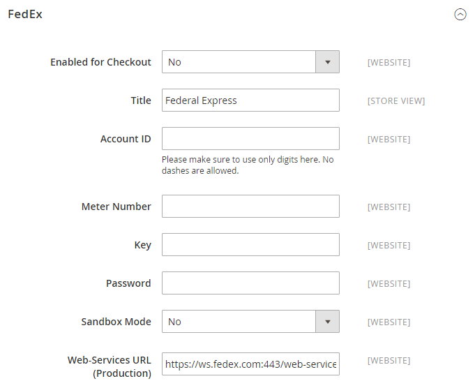
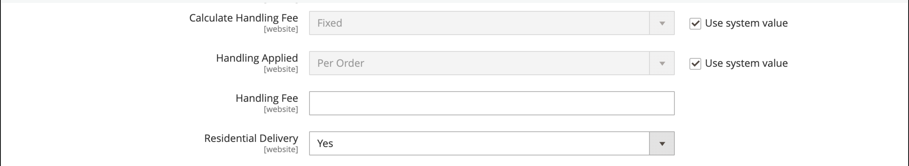
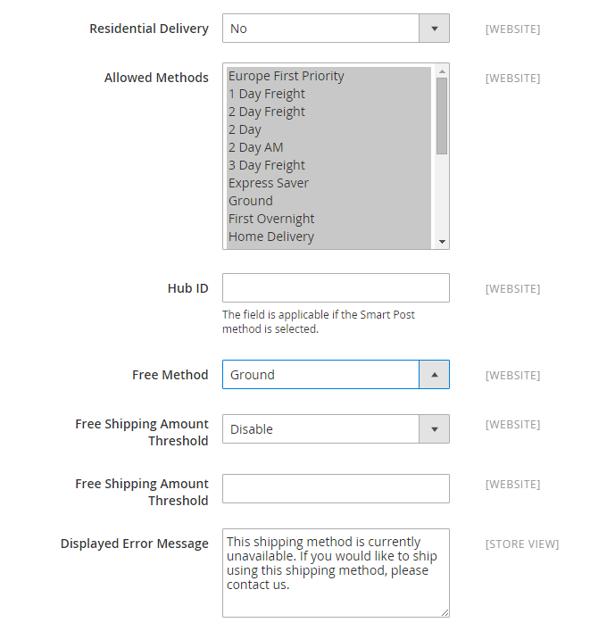

# FedEx

FedEx est l&#39;une des plus grandes sociétés de services de transport maritime au monde, fournissant des services aériens, de fret et de transport terrestre avec plusieurs niveaux de priorités.

{width="700" zoomable="yes"}

>[!NOTE]
>
>FedEx peut utiliser [poids dimensionnel](carriers.md#dimensional-weight) pour déterminer certains tarifs d&#39;expédition. Cependant, Adobe Commerce et Magento Open Source prennent uniquement en charge le calcul des frais d’expédition en fonction du poids.

## Étape 1 : S&#39;inscrire à la production de FedEx Web Services

Un compte de commerçant FedEx et l&#39;enregistrement pour l&#39;accès à la production des services Web FedEx sont requis. Après avoir créé un compte FedEx, lisez la page d&#39;information du compte de production, puis cliquez sur le lien _Obtenir la clé de production_ au bas de la page pour vous inscrire et obtenir une clé.

>[!NOTE]
>
>Veillez à copier ou écrire la clé d’authentification. Il est nécessaire de configurer FedEx dans vos paramètres d&#39;expédition Commerce.

## Étape 2 : activer FedEx pour votre Boutique

1. Dans la barre latérale _Admin_, accédez à **[!UICONTROL Stores]** > _[!UICONTROL Settings]_>**[!UICONTROL Configuration]**.

1. Dans le panneau de gauche, développez **[!UICONTROL Sales]** et choisissez **[!UICONTROL Delivery Methods]**.

1. Développez  la section **[!UICONTROL FedEx]** .

1. Définissez **[!UICONTROL Enabled for Checkout]** sur `Yes`.

1. Par **[!UICONTROL Title]**, saisissez un titre qui identifie la méthode d&#39;expédition FedEx lors du passage en caisse.

1. Saisissez les informations suivantes à partir de votre compte FedEx :

   - **[!UICONTROL Account ID]**
   - **[!UICONTROL Api Key]**
   - **[!UICONTROL Secret Key]**

1. Si vous disposez d’informations d’identification d’API de suivi distinctes, activez la configuration suivante :

   - **[!UICONTROL Enable Tracking API credentials]**

1. Saisissez les informations suivantes à partir de votre compte FedEx :

   - **[!UICONTROL Tracking API Key]**
   - **[!UICONTROL Tracking API Secret Key]**

1. Si vous avez configuré un sandbox FedEx et souhaitez travailler dans l’environnement de test, définissez **[!UICONTROL Sandbox Mode]** sur `Yes`.

   >[!NOTE]
   >
   >N&#39;oubliez pas de définir le mode Sandbox sur `No` lorsque vous êtes prêt à proposer FedEx comme méthode d&#39;expédition à vos clients.

   {width="600" zoomable="yes"}

## Étape 3 : description du package et frais de gestion

1. **[!UICONTROL Pickup Type]** la méthode de prélèvement utilisée pour les expéditions.

   - `DropOff at Fedex Location` - (par défaut) Indique que vous déposez des envois à votre station FedEx locale.
   - `Contact Fedex to Schedule` - Indique que vous contactez FedEx pour demander un retrait.
   - `Use Scheduled Pickup` - Indique que l&#39;expédition est récupérée dans le cadre d&#39;un ramassage régulier prévu.
   - `On Call` - Indique que la collecte est programmée en appelant FedEx.
   - `Package Return Program` - Indique que l&#39;expédition est récupérée par le Programme de retour des colis au sol de FedEx.
   - `Regular Stop` - Indique que l&#39;expédition est récupérée selon le calendrier de récupération standard.
   - `Tag` - Indique que le retrait de l&#39;expédition est spécifique à une demande de retrait de la balise Express ou de la balise Ground Call. Ceci s&#39;applique uniquement pour une étiquette d&#39;expédition de retour.

1. Par **[!UICONTROL Packages Request Type]**, sélectionnez le type de demande qui décrit le mieux vos préférences lors du fractionnement d&#39;une commande en plusieurs livraisons :

   - `Divide to equal weight (one request)`
   - `Use origin weight (few requests)`

1. Par **[!UICONTROL Packaging]**, sélectionnez le type d’emballage FedEx que vous utilisez généralement pour expédier des produits à partir de votre magasin.

1. Définissez **[!UICONTROL Weight Unit]** sur l’unité de mesure utilisée dans vos paramètres régionaux.

   - `Pounds`
   - `Kilograms`

1. Entrez le **[!UICONTROL Maximum Package Weight]** autorisé pour les expéditions FedEx.

   Le poids maximum par défaut de FedEx est de 150 livres. Consultez votre transporteur pour plus d&#39;informations. La valeur par défaut est recommandée, sauf si vous avez pris des dispositions spéciales avec FedEx. Voir [Poids dimensionnel](carriers.md#dimensional-weight) pour plus d’informations.

   {width="600" zoomable="yes"}

1. Configurez les options de frais de gestion en fonction de vos besoins.

   Les frais de gestion sont facultatifs et ne sont pas visibles lors du passage en caisse. Si vous souhaitez inclure des frais de manutention, procédez comme suit :

   - Définir **[!UICONTROL Calculate Handling Fee]** :

      - `Fixed Fee`
      - `Percentage`

   - Par **[!UICONTROL Handling Applied]**, choisissez l’une des méthodes suivantes pour gérer les frais de gestion :

      - `Per Order`
      - `Per Package`

   - Saisissez le **[!UICONTROL Handling Fee]** sous la forme d’un montant `fixed` ou d’un `percentage`, selon la méthode de calcul.

1. Définissez **[!UICONTROL Residential Delivery]** sur l’une des options suivantes, selon que vous vendez de l’entreprise au consommateur (B2C) ou de l’entreprise à l’entreprise (B2B).

   - `Yes` - Pour les diffusions résidentielles B2C.
   - `No` - Pour les diffusions résidentielles B2B.

   {width="600" zoomable="yes"}

## Étape 4 : Méthodes autorisées et pays applicables

1. **[!UICONTROL Allowed Methods]** à chaque mode d&#39;expédition que vous souhaitez proposer.

   Lorsque vous choisissez des méthodes, tenez compte de votre compte FedEx, de la fréquence et de la taille de vos envois, et si vous autorisez les envois internationaux. Vous pouvez proposer autant de méthodes que vous le souhaitez, ou en proposer autant, par exemple :

   - Priorité Europe
   - Options de jour de livraison : 1 jour de transport, 2 jours de transport, 2 jours, 2 jours d&#39;après-midi, 3 jours de transport
   - Options domestiques - Express Saver, Ground, First, Overnight, Home Delivery, Standard Overnight
   - Options internationales-Économie internationale, Intl Economy Freight, International First, International Ground, International, Priorité Intl
   - Options de priorité - Transport, Priorité du jour au lendemain
   - Smart Post-If offrant la méthode Smart Post (saisissez l’**identifiant de hub**)
   - Options de transport - Transport, transport national

1. Si vous souhaitez fournir une option [Livraison gratuite](shipping-free.md) via FedEx, définissez les options de livraison gratuite.

   - Définissez **[!UICONTROL Free Method]** sur la méthode que vous souhaitez utiliser pour la livraison gratuite. Si vous ne voulez pas offrir la livraison gratuite par FedEx, choisissez `None`.

   - Pour exiger un montant de commande minimum qui qualifie une commande pour une livraison gratuite avec FedEx, définissez **[!UICONTROL Enable Free Shipping Threshold]** sur `Enable`. Saisissez ensuite la valeur minimale en **[!UICONTROL Free Shipping Amount Threshold]**.

   Ce paramètre est similaire à celui de la méthode d&#39;expédition gratuite standard, mais il apparaît dans la section FedEx lors du passage en caisse, afin que les clients sachent quelle méthode est utilisée pour leur commande.

1. Si nécessaire, modifiez la **[!UICONTROL Displayed Error Message]**.

   Cette zone de texte est prédéfinie avec un message par défaut, mais vous pouvez saisir un message différent que vous souhaitez afficher si FedEx n&#39;est plus disponible.

   {width="600" zoomable="yes"}

1. Définir **[!UICONTROL Ship to Applicable Countries]** :

   - `All Allowed Countries` - Les clients de tous les [pays](../getting-started/store-details.md#country-options) spécifiés dans la configuration de votre boutique peuvent utiliser cette méthode de diffusion.

   - `Specific Countries` - Lorsque vous sélectionnez cette option, la liste _Livrer à des pays spécifiques_ s&#39;affiche. Sélectionnez dans la liste chaque pays où ce mode de diffusion peut être utilisé.

1. Si vous souhaitez conserver un journal de toutes les communications entre votre magasin et le système FedEx, définissez **[!UICONTROL Debug]** sur `Yes`.

1. Définir **[!UICONTROL Show Method if Not Applicable]** :

   - `Yes` - Affiche toutes les méthodes d&#39;expédition FedEx aux clients, quelle que soit leur disponibilité.
   - `No` - Affiche uniquement les méthodes d’expédition FedEx qui s’appliquent à la commande.

1. Par **[!UICONTROL Sort Order]**, saisissez un nombre pour déterminer l&#39;ordre dans lequel FedEx apparaît lorsqu&#39;il est répertorié avec d&#39;autres méthodes de diffusion lors du passage en caisse.

   `0` = premier, `1` = deuxième, `2` = troisième, etc.

1. Cliquez sur **[!UICONTROL Save Config]**.

   {width="600" zoomable="yes"}

>[!NOTE]
>
>Commerce déclare toujours le prix total de la commande à FedEx lors du calcul des frais d&#39;expédition. Ce comportement ne peut pas être modifié.
