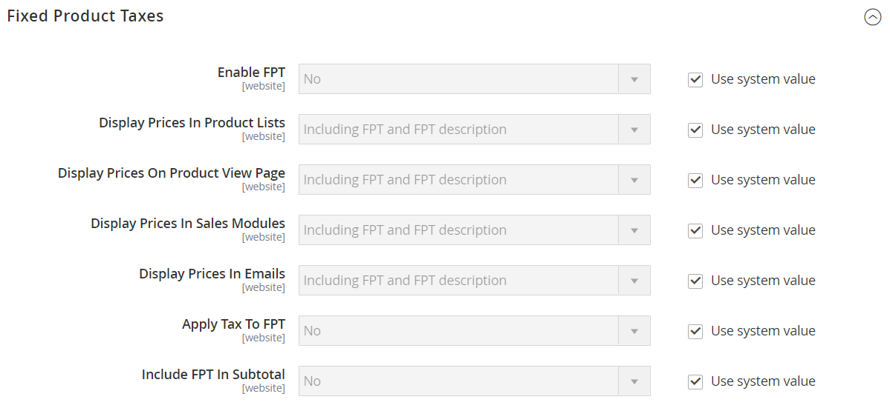
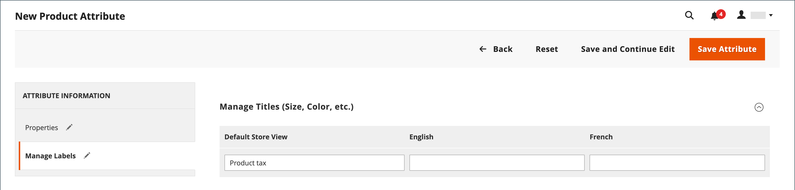

# Taxe fixe sur les produits (FPT)

Certaines juridictions fiscales ont une taxe fixe qui doit être ajoutée à certains types de produits. Vous pouvez configurer une _taxe sur les produits fixes_ (FPT) selon les besoins pour le calcul des taxes de votre magasin. Dans certains pays, le FPT peut être utilisé pour la mise en place d&#39;une taxe sur les déchets d&#39;équipements électriques et électroniques (EEE). Cette taxe est également connue sous le nom de _taxe écologique_ ou _taxe éco_, et est collecté sur certains types d&#39;appareils électroniques pour compenser le coût du recyclage. Il s’agit d’un montant fixe, plutôt que d’un pourcentage du prix du produit.

Les taxes sur les produits fixes s’appliquent au niveau de l’article, en fonction du produit. Dans certaines juridictions, cette taxe est sujette à un calcul d&#39;impôt supplémentaire pour cent. Votre juridiction fiscale peut également avoir des règles sur la façon dont le prix du produit apparaît aux clients, avec ou sans taxe. Veillez à bien comprendre les règles et à définir vos options d’affichage FPT en conséquence.

Soyez prudent lorsque vous citez les prix FPT dans un email, car la différence de prix peut affecter la confiance des clients dans leurs commandes. Par exemple, si vous affichez les prix de révision des commandes sans afficher le FPT, les clients qui achètent des articles avec le FPT associé voient un total qui inclut le montant de la taxe FPT, mais sans ventilation détaillée. La différence de prix peut amener certains clients à abandonner leur panier, car le total diffère du montant attendu.

## Prix d’affichage FPT

| FPT | Paramètre et calcul d’affichage | |
|--- |--- |---|
| Non taxé | **[!UICONTROL Excluding FPT]** | FPT apparaît comme une ligne distincte dans le panier et la valeur est utilisée dans les calculs d’impôts appropriés. |
| | **[!UICONTROL Including FPT]** | Le FPT est ajouté au prix de base d’un article, mais il n’est pas inclus dans les calculs basés sur des règles fiscales. |
| | **[!UICONTROL Excluding FPT, FPT Description, Final Price]** | Les prix apparaissent sans valeur FPT ni description. FPT n’est pas inclus dans les calculs basés sur des règles fiscales. |
| Taxé | **[!UICONTROL Excluding FPT]** | FPT apparaît comme une ligne distincte dans le panier et la valeur est utilisée dans les calculs d’impôts appropriés. |
| | **[!UICONTROL Including FPT]** | Le FPT est inclus dans le prix d’un article et aucun changement n’est nécessaire au calcul de la taxe. |
| | **[!UICONTROL Excluding FPT, FPT Description, Final Price]** | Les prix apparaissent sans le montant FPT ni la description. Cependant, FPT est inclus dans les calculs basés sur des règles fiscales. |

{style="table-layout:auto"}

## Configurer FPT

Taxe fixe sur les produits (FPT) [type d&#39;entrée](../catalog/attributes-input-types.md) crée une section de champs pour la gestion des impôts pour chaque région.

Les instructions suivantes expliquent comment configurer une taxe fixe sur les produits pour votre magasin, à l’aide de la &quot;taxe écologique&quot; comme exemple. Après avoir défini le périmètre de la taxe, ainsi que les pays et Etats dans lesquels la taxe s&#39;applique, et selon les options que vous choisissez, les champs de saisie peuvent changer en fonction des besoins locaux. Pour en savoir plus, voir [Création d’attributs de produit](../catalog/attribute-product-create.md).

### Étape 1 : Activer la taxe sur les produits fixes

1. Sur le _Administration_ barre latérale, accédez à **[!UICONTROL Stores]** > _[!UICONTROL Settings]_>**[!UICONTROL Configuration]**.

1. Dans le panneau de gauche, développez **[!UICONTROL Sales]** et choisissez **[!UICONTROL Tax]**.

1. Développer  la valeur **[!UICONTROL Fixed Product Taxes]** .

1. Définir **[!UICONTROL Enable FPT]** to `Yes`.

1. Pour déterminer comment les taxes sur les produits fixes sont utilisées dans les prix des magasins, sélectionnez le paramètre FPT pour chacun des emplacements d’affichage de prix suivants :

   - **[!UICONTROL Display Prices in Product Lists]**
   - **[!UICONTROL Display Prices on Product View Page]**
   - **[!UICONTROL Display Prices in Sales Modules]**
   - **[!UICONTROL Display Prices in Emails]**

   Options (identiques pour chacune) :

   - `Including FPT Only`
   - `Including FPT and FPT description`
   - `Excluding FPT. Including FPT description and final price`
   - `Excluding FPT`

1. Définir **[!UICONTROL Apply Tax to FPT]** selon les besoins.

1. Définir **[!UICONTROL Include FPT in Subtotal]** selon les besoins.

   {width="600" zoomable="yes"}

   Pour une description détaillée de chacun de ces paramètres de configuration, voir [Taxes sur les produits fixes](../configuration-reference/sales/tax.md#fixed-product-taxes) dans le _Guide de référence de configuration_.

1. Lorsque vous avez terminé, cliquez sur **[!UICONTROL Save Config]**.

### Étape 2 : création d’un attribut FPT

1. Sur le _Administration_ barre latérale, accédez à **[!UICONTROL Stores]** > _[!UICONTROL Attributes]_>**[!UICONTROL Product]**.

1. Dans le coin supérieur droit, cliquez sur **[!UICONTROL Add New Attribute]** et procédez comme suit :

   - Pour **[!UICONTROL Default Label]**, saisissez un libellé qui identifie l’attribut.

   - Définir **[!UICONTROL Catalog Input for Store Owner]** to `Fixed Product Tax`.

   {width="600" zoomable="yes"}

1. Développer  la valeur **[!UICONTROL Advanced Attribute Properties]** et définissez les options de propriété :

   - **[!UICONTROL Attribute Code]** - Saisissez un identifiant unique en minuscules, sans espaces ni caractères spéciaux. La longueur maximale est de 30 caractères. Vous pouvez laisser le champ vide au texte à partir du champ Libellé par défaut .

   - **[!UICONTROL Add to Column Options]** - Si vous souhaitez que le champ FPT apparaisse dans la variable [Liste de produits](../catalog/products-list.md), définissez sur `Yes`.

   - **[!UICONTROL Use in Filter Options]** - Si vous souhaitez pouvoir [filter](../getting-started/admin-workspace.md) produits dans la grille en fonction de la valeur du champ FPT, définie sur `Yes`.

   {width="600" zoomable="yes"}

1. (Facultatif) Dans le panneau de gauche, choisissez **[!UICONTROL Manage Labels]** et saisissez un libellé à utiliser au lieu du libellé par défaut pour chaque vue de magasin.

   {width="600" zoomable="yes"}

1. Lorsque vous avez terminé, cliquez sur **[!UICONTROL Save Attribute]**.

1. Lorsque vous y êtes invité, actualisez le [cache](../systems/cache-management.md).

### Étape 3 : Ajout de l’attribut FPT à un jeu d’attributs

1. Sur le _Administration_ barre latérale, accédez à **[!UICONTROL Stores]** > _[!UICONTROL Attributes]_>**[!UICONTROL Attribute Set]**.

1. Dans la liste, cliquez sur le jeu d’attributs pour ouvrir l’enregistrement en mode d’édition.

   {width="600" zoomable="yes"}

1. Faites glisser l’attribut FPT de la liste de **[!UICONTROL Unassigned Attributes]** à droite de **[!UICONTROL Groups]** dans la colonne du centre.

   Chaque dossier de groupe correspond à une section d’informations sur le produit. Vous pouvez placer l’attribut à l’endroit où vous souhaitez qu’il apparaisse lorsque le produit est ouvert en mode d’édition.

   {width="600" zoomable="yes"}

1. Lorsque vous avez terminé, cliquez sur **[!UICONTROL Save]**.

1. Répétez cette étape pour chaque jeu d’attributs qui doit inclure la taxe sur les produits fixes.

### Étape 4 : appliquer le protocole FPT à des produits spécifiques

1. Sur le _Administration_ barre latérale, accédez à **[!UICONTROL Catalog]** > **[!UICONTROL Products]**.

1. Ouvrez le produit qui nécessite une taxe sur les produits fixes en mode d’édition.

1. Recherchez le **[!UICONTROL FPT]** section des champs que vous avez ajoutés au jeu d’attributs et cliquez sur **[!UICONTROL Add Tax]**.

1. Indiquez la taxe applicable pour le produit :

   {width="600" zoomable="yes"}

   - Si votre instance Commerce comporte plusieurs sites web, choisissez la **[!UICONTROL Website]** et la devise de base. Dans cet exemple, le champ est défini par défaut sur `All Websites [USD]`.

   - Définir **[!UICONTROL Country/State]** à la région où s’applique la taxe sur les produits fixes.

   - Pour **[!UICONTROL Tax]**, saisissez la taxe sur les produits fixes comme montant décimal.

1. Pour ajouter d’autres taxes sur les produits fixes, cliquez sur **[!UICONTROL Add Tax]** et répétez le processus.

1. Lorsque vous avez terminé, cliquez sur **[!UICONTROL Save]**.
