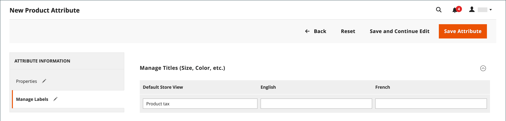
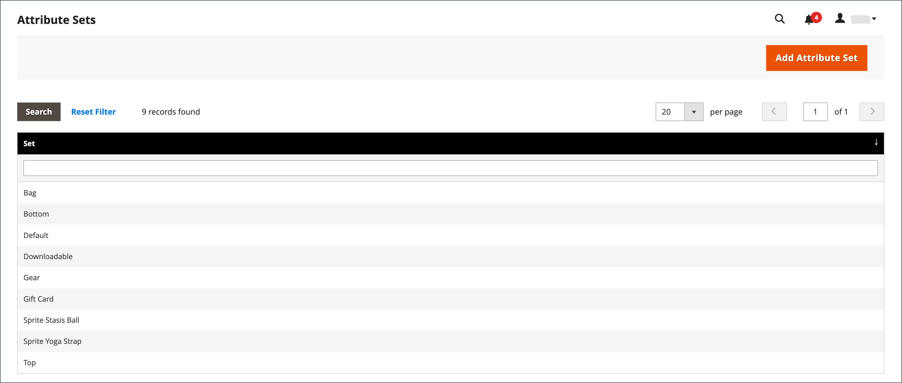
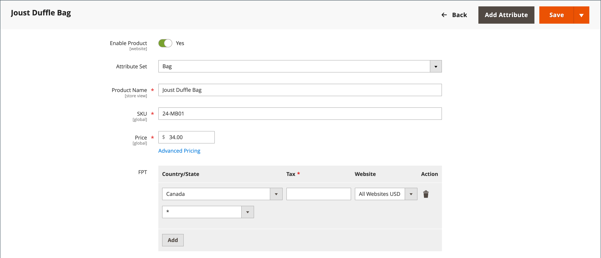

# Taxe fixe sur les produits (FPT)

Certaines juridictions fiscales ont une taxe fixe qui doit être ajoutée à certains types de produits. Vous pouvez configurer une _taxe fixe sur les produits_ (FPT) selon les besoins pour les calculs de taxe de votre magasin. Dans certains pays, le FPT peut être utilisé pour établir une taxe sur les déchets d&#39;équipements électriques et électroniques (DEEE). Cette taxe est également appelée _taxe écologique_ ou _écotaxe_ et est perçue sur certains types d&#39;appareils électroniques pour compenser le coût du recyclage. Il s’agit d’un montant fixe, plutôt que d’un pourcentage du prix du produit.

Les taxes fixes sur les produits s&#39;appliquent au niveau de l&#39;article, en fonction du produit. Dans certaines juridictions, cette taxe fait l&#39;objet d&#39;un calcul d&#39;impôt supplémentaire de %. Votre juridiction fiscale peut également avoir des règles sur la façon dont le prix du produit apparaît aux clients, avec ou sans taxe. Assurez-vous de comprendre les règles et de définir vos options d’affichage FPT en conséquence.

Faites preuve de prudence lorsque vous indiquez des prix FPT dans un e-mail, car la différence de prix peut affecter la confiance des clients dans leurs commandes. Par exemple, si vous affichez les prix de la révision des commandes sans afficher FPT, les clients qui achètent des articles avec FPT associé voient un total qui inclut le montant de taxe FPT, mais sans ventilation détaillée. La différence de prix peut conduire certains clients à abandonner leur panier car le total diffère du montant attendu.

## Prix d’affichage FPT

| FPT | Paramètre d’affichage et calcul | |
|--- |--- |---|
| Non taxé | **[!UICONTROL Excluding FPT]** | FPT apparaît comme une ligne distincte dans le panier et la valeur est utilisée dans les calculs de taxe appropriés. |
| | **[!UICONTROL Including FPT]** | FPT est ajouté au prix de base d&#39;un article, mais n&#39;est pas inclus dans les calculs basés sur des règles fiscales. |
| | **[!UICONTROL Excluding FPT, FPT Description, Final Price]** | Les prix apparaissent sans montant FPT ni description. FPT n&#39;est pas inclus dans les calculs basés sur des règles fiscales. |
| Imposé | **[!UICONTROL Excluding FPT]** | FPT apparaît comme une ligne distincte dans le panier et la valeur est utilisée dans les calculs de taxe appropriés. |
| | **[!UICONTROL Including FPT]** | FPT est inclus dans le prix d&#39;un article et aucune modification des calculs de taxe n&#39;est requise. |
| | **[!UICONTROL Excluding FPT, FPT Description, Final Price]** | Les prix apparaissent sans le montant FPT ni la description. Cependant, FPT est inclus dans les calculs basés sur des règles fiscales. |

{style="table-layout:auto"}

## Configurer FPT

La taxe sur les produits fixe (FPT) [type d&#39;entrée](../catalog/attributes-input-types.md) crée une section de champs pour gérer la taxe pour chaque région.

Les instructions suivantes expliquent comment configurer une taxe fixe sur les produits pour votre magasin, en utilisant « écotaxe » comme exemple. Après avoir défini le champ d&#39;application de la taxe, ainsi que les pays et états où la taxe s&#39;applique, et en fonction des options que vous choisissez, les champs de saisie peuvent changer en fonction des exigences locales. Pour en savoir plus, voir [Création d’attributs de produit](../catalog/attribute-product-create.md).

### Étape 1 : activer la taxe fixe sur les produits

1. Dans la barre latérale _Admin_, accédez à **[!UICONTROL Stores]** > _[!UICONTROL Settings]_>**[!UICONTROL Configuration]**.

1. Dans le panneau de gauche, développez **[!UICONTROL Sales]** et choisissez **[!UICONTROL Tax]**.

1. Développez  la section **[!UICONTROL Fixed Product Taxes]** .

1. Définissez **[!UICONTROL Enable FPT]** sur `Yes`.

1. Pour déterminer comment les taxes fixes sur les produits sont utilisées dans les prix de magasin, choisissez le paramètre FPT pour chacun des emplacements d&#39;affichage des prix suivants :

   - **[!UICONTROL Display Prices in Product Lists]**
   - **[!UICONTROL Display Prices on Product View Page]**
   - **[!UICONTROL Display Prices in Sales Modules]**
   - **[!UICONTROL Display Prices in Emails]**

   Options (identiques pour chacune) :

   - `Including FPT Only`
   - `Including FPT and FPT description`
   - `Excluding FPT. Including FPT description and final price`
   - `Excluding FPT`

1. Définissez **[!UICONTROL Apply Tax to FPT]** selon vos besoins.

1. Définissez **[!UICONTROL Include FPT in Subtotal]** selon vos besoins.

   {width="600" zoomable="yes"}

   Pour obtenir une description détaillée de chacun de ces paramètres de configuration, consultez [Taxes fixes sur les produits](../configuration-reference/sales/tax.md#fixed-product-taxes) dans le _Guide de référence de configuration_.

1. Cliquez ensuite sur **[!UICONTROL Save Config]**.

### Étape 2 : créer un attribut FPT

1. Dans la barre latérale _Admin_, accédez à **[!UICONTROL Stores]** > _[!UICONTROL Attributes]_>**[!UICONTROL Product]**.

1. Dans le coin supérieur droit, cliquez sur **[!UICONTROL Add New Attribute]** et procédez comme suit :

   - Par **[!UICONTROL Default Label]**, saisissez un libellé qui identifie l’attribut.

   - Définissez **[!UICONTROL Catalog Input for Store Owner]** sur `Fixed Product Tax`.

   {width="600" zoomable="yes"}

1. Développez  la section **[!UICONTROL Advanced Attribute Properties]** et définissez les options de propriété :

   - **[!UICONTROL Attribute Code]** - Saisissez un identifiant unique en minuscules, sans espaces ni caractères spéciaux. La longueur maximale est de 30 caractères. Vous pouvez laisser le champ vide pour le texte à partir du champ Libellé par défaut .

   - **[!UICONTROL Add to Column Options]** - Si vous souhaitez que le champ FPT apparaisse dans la [liste de produits](../catalog/products-list.md), définissez sur `Yes`.

   - **[!UICONTROL Use in Filter Options]** - Si vous souhaitez pouvoir [filtrer](../getting-started/admin-workspace.md) les produits dans la grille en fonction de la valeur du champ FPT, définissez sur `Yes`.

   {width="600" zoomable="yes"}

1. (Facultatif) Dans le panneau de gauche, choisissez **[!UICONTROL Manage Labels]** et saisissez un libellé à utiliser au lieu du libellé par défaut pour chaque vue de magasin.

   {width="600" zoomable="yes"}

1. Cliquez ensuite sur **[!UICONTROL Save Attribute]**.

1. Lorsque vous y êtes invité, actualisez le [cache](../systems/cache-management.md).

### Étape 3 : ajouter l’attribut FPT à un jeu d’attributs

1. Dans la barre latérale _Admin_, accédez à **[!UICONTROL Stores]** > _[!UICONTROL Attributes]_>**[!UICONTROL Attribute Set]**.

1. Dans la liste, cliquez sur le jeu d&#39;attributs pour ouvrir l&#39;enregistrement en mode d&#39;édition.

   {width="600" zoomable="yes"}

1. Faites glisser l’attribut FPT de la liste des **[!UICONTROL Unassigned Attributes]** à droite vers la liste des **[!UICONTROL Groups]** dans la colonne centrale.

   Chaque dossier de groupe correspond à une section d’informations sur les produits. Vous pouvez placer l’attribut où vous souhaitez qu’il apparaisse lorsque le produit est ouvert en mode d’édition.

   {width="600" zoomable="yes"}

1. Cliquez ensuite sur **[!UICONTROL Save]**.

1. Répétez cette étape pour chaque jeu d’attributs qui doit inclure la taxe fixe sur les produits.

### Étape 4 : appliquer FPT à des produits spécifiques

1. Dans la barre latérale _Admin_, accédez à **[!UICONTROL Catalog]** > **[!UICONTROL Products]**.

1. Ouvrez le produit qui nécessite une taxe fixe sur le produit en mode d’édition.

1. Recherchez la section **[!UICONTROL FPT]** des champs que vous avez ajoutés au jeu d’attributs et cliquez sur **[!UICONTROL Add Tax]**.

1. Indiquez la taxe applicable au produit :

   {width="600" zoomable="yes"}

   - Si votre instance Commerce comporte plusieurs sites web, choisissez la **[!UICONTROL Website]** et la devise de base appropriées. Dans cet exemple, le champ est défini par défaut sur `All Websites [USD]`.

   - Définissez **[!UICONTROL Country/State]** dans la région où la taxe fixe sur les produits s&#39;applique.

   - Par **[!UICONTROL Tax]**, saisissez la taxe fixe sur les produits sous la forme d&#39;un montant décimal.

1. Pour ajouter d&#39;autres taxes fixes sur les produits, cliquez sur **[!UICONTROL Add Tax]** et répétez le processus.

1. Cliquez ensuite sur **[!UICONTROL Save]**.
