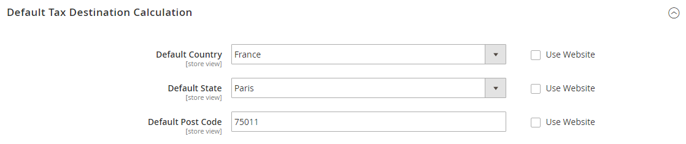

# Directives fiscales par pays

## Configuration fiscale aux États-Unis

Ces paramètres recommandés peuvent être utilisés pour la plupart des configurations de taxe pour les magasins situés aux États-Unis.

| Option fiscale | Recommandation |
|--- |--- |
| Charger les prix du catalogue | Hors taxe |
| FPT | Non, parce que FPT n&#39;est pas taxé. |
| Taxe basée sur | Origine de l’expédition |
| Calcul de l&#39;impôt | Au total |
| Expédition des taxes ? | Non |
| Appliquer la remise | Avant impôt |
| Commentaire | Toutes les zones fiscales ont la même priorité ; idéalement, une zone pour l&#39;état et une ou plusieurs zones pour la recherche de code postal. |

{style="table-layout:auto"}

### Classes d&#39;impôts

| Classe d&#39;imposition | Paramètre recommandé |
|--- |--- |
| Classe de taxe pour l&#39;expédition | Aucune |

{style="table-layout:auto"}

### Paramètres de calcul

| Option | Paramètre recommandé |
|--- |--- |
| [!UICONTROL Tax Calculation Method Based On] | `Total` |
| [!UICONTROL Tax Calculation Based On] | `Shipping Origin` |
| [!UICONTROL Catalog Prices] | `Excluding Tax` |
| [!UICONTROL Shipping Prices] | `Excluding Tax` |
| [!UICONTROL Apply Customer Tax] | `After Discount` |
| [!UICONTROL Apply Discount on Prices] | `Excluding Tax` |

{style="table-layout:auto"}

### Calcul de la destination de taxe par défaut

| Option | Paramètre recommandé |
|--- |--- |
| [!UICONTROL Default Country] | `United States` |
| [!UICONTROL Default State] | État dans lequel l’entreprise est située. |
| [!UICONTROL Default Post Code] | Code postal utilisé dans vos zones fiscales. |

{style="table-layout:auto"}

### Paramètres d’affichage des prix

| Option | Paramètre recommandé |
|--- |--- |
| [!UICONTROL Display Product Prices in Catalog] | `Excluding Tax` |
| [!UICONTROL Display Shipping Prices] | `Excluding Tax` |

{style="table-layout:auto"}

### Paramètres d’affichage du panier

| Option | Paramètre recommandé |
|--- |--- |
| [!UICONTROL Display Prices] | `Excluding Tax` |
| [!UICONTROL Display Subtotal] | `Excluding Tax` |
| [!UICONTROL Display Shipping Amount] | `Excluding Tax` |
| [!UICONTROL Display Gift Wrapping Prices] | `Excluding Tax` |
| [!UICONTROL Display Printed Card Prices] | `Excluding Tax` |
| [!UICONTROL Include Tax in Grand Total] | `Yes` |
| [!UICONTROL Display Full Tax Summary] | `Yes` |
| [!UICONTROL Display Zero Tax Subtotal] | `Yes` |

{style="table-layout:auto"}

### Commandes, factures, avoirs et paramètres d&#39;affichage

| Option | Paramètre recommandé |
|--- |--- |
| [!UICONTROL Display Prices] | `Excluding Tax` |
| [!UICONTROL Display Subtotal] | `Excluding Tax` |
| [!UICONTROL Display Shipping Amount] | `Excluding Tax` |
| [!UICONTROL Include Tax in Grand Total] | `Yes` |
| [!UICONTROL Display Full Tax Summary] | `Yes` |
| [!UICONTROL Display Zero Tax Subtotal] | `Yes` |

{style="table-layout:auto"}

### Taxes sur les produits fixes (FPT)

| Option | Paramètre recommandé |
|--- |--- |
| [!UICONTROL Enable FPT] | `No`, sauf en Californie. |

{style="table-layout:auto"}

## Configuration fiscale du Royaume-Uni

Ces paramètres recommandés peuvent être utilisés pour la plupart des configurations de taxe pour les magasins au Royaume-Uni.

### Configuration de la taxe B2C au Royaume-Uni

| Option fiscale | Recommandation |
|--- |--- |
| Charger les prix du catalogue | Hors taxe |
| FPT | Oui, y compris FPT et la description |
| Taxe basée sur | [!UICONTROL Shipping Address] |
| Calcul de l&#39;impôt | Au total |
| Expédition des taxes ? | Oui |
| Appliquer la remise | Avant taxe, remise sur les prix, taxes comprises. |
| Commentaire | Pour les commerçants qui marquent les factures fournisseur (TVA comprise). |

{style="table-layout:auto"}

### Configuration fiscale B2B au Royaume-Uni

| Option fiscale | Recommandation |
|--- |--- |
| Charger les prix du catalogue | Hors taxe |
| FPT | Oui, y compris FPT et la description |
| Taxe basée sur | [!UICONTROL Shipping Address] |
| Calcul de l&#39;impôt | Sur élément |
| Expédition des taxes ? | Oui |
| Appliquer la remise | Avant taxe, remise sur les prix, taxes comprises. |
| Commentaire | Pour que les commerçants B2B fournissent des considérations supply chain de TVA plus simples. Le calcul de la taxe sur la ligne est également valide. Vérifiez toutefois auprès de votre juridiction de taxation. Le programme d&#39;installation suppose qu&#39;un marchand se trouve dans le supply chain et que les marchandises vendues sont utilisées par d&#39;autres fournisseurs pour des remises de TVA et ainsi de suite. Cette définition permet de distinguer facilement la taxe par article pour accélérer la production des remboursements.   **_Note:_** Certaines juridictions exigent des stratégies d&#39;arrondi différentes qui ne sont pas actuellement prises en charge par Commerce, et toutes les juridictions n&#39;autorisent pas la taxe au niveau article ou ligne. |

{style="table-layout:auto"}

## Configuration fiscale du Canada

>[!IMPORTANT]
>
>Les commerçants qui se trouvent dans une province assujettie à la TPS/TVP (Montréal) devraient créer une règle fiscale et afficher un montant de taxe combiné. N&#39;oubliez pas de consulter une administration fiscale compétente si vous avez des questions.

| Option fiscale | Recommandation |
|--- |--- |
| Charger les prix du catalogue | Hors taxe |
| FPT | Oui, y compris FPT, description, et appliquer la taxe à FPT. |
| Taxe basée sur | Origine de l’expédition |
| Calcul de l&#39;impôt | Au total |
| Expédition des taxes ? | Oui |
| Appliquer la remise | Avant impôt |

{style="table-layout:auto"}

L’exemple suivant montre comment configurer les taux de la TPS pour le Canada et les taux de la TVP pour la Saskatchewan, avec des règles fiscales qui calculent et affichent les deux taux de taxe. Ces informations présentent un exemple de configuration ; veillez à vérifier les taux et règles de taxe corrects pour vos juridictions fiscales. Lors de la configuration des taxes, définissez la portée du magasin pour appliquer la configuration à tous les magasins et sites web applicables.

- La taxe fixe sur les produits est incluse pour les marchandises pertinentes en tant qu’attribut de produit.
- Au Québec, la TVP est appelée TVQ. Si vous voulez établir un tarif pour le Québec, veillez à utiliser TVQ comme identificateur.

### Etape 1 : Renseigner les paramètres de calcul de la taxe

1. Dans la barre latérale _Admin_, accédez à **[!UICONTROL Stores]** > _[!UICONTROL Settings]_>**[!UICONTROL Configuration]**.

1. Pour une configuration multisite, définissez **[!UICONTROL Store View]** sur le site web et le magasin cibles de la configuration.

1. Dans le panneau de gauche, développez **[!UICONTROL Sales]** et choisissez **[!UICONTROL Tax]**.

1. Cliquez pour développer chaque section de la page et effectuez les paramètres suivants :

#### Paramètres de calcul des taxes

| Champ | Paramètre recommandé |
|--- |--- |
| [!UICONTROL Tax Calculation Method Based On] | `Total` |
| [!UICONTROL Tax Calculation Based On] | `Shipping Address` |
| [!UICONTROL Catalog Prices] | `Excluding Tax` |
| [!UICONTROL Shipping Prices] | `Excluding Tax` |
| [!UICONTROL Apply Customer Tax] | `After Discount` |
| [!UICONTROL Apply Discount on Prices] | `Excluding Tax` |
| [!UICONTROL Apply Tax On] | `Custom Price` (si disponible) |

{style="table-layout:auto"}

#### Classes d&#39;impôts

| Champ | Paramètre recommandé |
|--- |--- |
| [!UICONTROL Tax Class for Shipping] | `Shipping` (l&#39;expédition est taxée) |

{style="table-layout:auto"}

#### Calcul de la destination de taxe par défaut

| Champ | Paramètre recommandé |
|--- |--- |
| [!UICONTROL Default Country] | `Canada` |
| [!UICONTROL Default State] | (le cas échéant) |
| [!UICONTROL Default Postal Code] | `*` (astérisque) |

{style="table-layout:auto"}

#### Paramètres d’affichage du panier

| Champ | Paramètre recommandé |
|--- |--- |
| [!UICONTROL Include Tax in Grand Total] | `Yes` |
| [!UICONTROL Display Full Tax Summary] | `Yes` |
| [!UICONTROL Display Zero in Tax Subtotal] | `Yes` |

{style="table-layout:auto"}

#### Taxes sur les produits fixes

| Champ | Paramètre recommandé |
|--- |--- |
| [!UICONTROL Enable FPT] | `Yes` |
| Tous les paramètres d’affichage FPT | `Including FPT and FPT description` |
| [!UICONTROL Apply Discounts to FPT] | `No` |
| [!UICONTROL Apply Tax to FPT] | `Yes` |
| [!UICONTROL Include FPT in Subtotal] | `No` |

{style="table-layout:auto"}

### Étape 2 : Configurer la taxe canadienne sur les produits et services (TPS)

Pour imprimer le numéro de TPS sur les factures et autres documents de vente, incluez-le au nom des taux de taxe applicables. La TPS apparaît dans le montant de la TPS sur toute synthèse de commande.

#### Gérer les zones fiscales et les taux

| Champ | Paramètre recommandé |
|--- |--- |
| [!UICONTROL Tax Identifier] | `Canada-GST` |
| [!UICONTROL Country] | `Canada` |
| [!UICONTROL State] | `*` (astérisque) |
| [!UICONTROL Zip/Post is Range] | `No` |
| [!UICONTROL Zip/Post Code] | `*` (astérisque) |
| [!UICONTROL Rate Percent] | `5.0000` |

{style="table-layout:auto"}

### Étape 3 : Configurer la taxe de vente provinciale canadienne (TVP)

Configurez un autre taux de taxe pour la province applicable.

#### Informations sur le taux de taxe

| Champ | Paramètre recommandé |
|--- |--- |
| [!UICONTROL Tax Identifier] | `Canada-SK-PST` |
| [!UICONTROL Country] | `Canada` |
| [!UICONTROL State] | `Saskatchewan` |
| [!UICONTROL Zip/Post is Range] | `No` |
| [!UICONTROL Zip/Post Code] | `*` (astérisque) |
| [!UICONTROL Rate Percent] | `5.0000` |

{style="table-layout:auto"}

### Étape 4 : Créer une règle de taxe GST

Pour éviter de cumuler la taxe et pour afficher correctement la taxe calculée comme des éléments de ligne distincts pour la TPS et la TVP, définissez des priorités différentes pour chaque règle et cochez la case **Calculer uniquement le sous-total**. Chaque taxe apparaît comme un élément de ligne distinct, mais les montants de taxe ne sont pas composés.

#### Informations sur la règle fiscale

| Champ | Paramètre recommandé |
|--- |--- |
| Nom | `Retail-Canada-GST` |
| [!UICONTROL Customer Tax Class] | `Retail Customer` |
| [!UICONTROL Product Tax Class] | `Taxable GoodsShipping` |
| [!UICONTROL Tax Rate] | `Canada-GST` |
| [!UICONTROL Priority] | `0` |
| [!UICONTROL Calculate off subtotal only] | Cochez cette case. |
| [!UICONTROL Sort Order] | `0` |

{style="table-layout:auto"}

### Étape 5 : Créer une règle de taxe de la TVP pour la Saskatchewan

Pour cette règle de taxe, veillez à définir la priorité sur 0 et à cocher la case **Calculer uniquement le sous-total**. Chaque taxe apparaît comme un élément de ligne distinct, mais les montants de taxe ne sont pas composés.

#### Informations sur la règle fiscale

| Champ | Paramètre recommandé |
|--- |--- |
| [!UICONTROL Name] | `Retail-Canada-PST` |
| [!UICONTROL Customer Tax Class] | `Retail Customer` |
| [!UICONTROL Product Tax Class] | `Taxable GoodsShipping` |
| [!UICONTROL Tax Rate] | `Canada-SK-PT` |
| [!UICONTROL Priority] | `1` |
| [!UICONTROL Calculate off subtotal only] | Cochez cette case. |
| [!UICONTROL Sort Order] | `0` |

{style="table-layout:auto"}

### Étape 6 : enregistrer et tester les résultats

1. Cliquez ensuite sur **[!UICONTROL Save Config]**.

1. Revenez à votre storefront et créez un exemple de commande pour tester les résultats.

## Configuration fiscale de l&#39;UE

L’exemple suivant illustre un magasin basé en France qui vend plus de 100 000 euros en France et plus de 100 000 euros en Allemagne.

- Les calculs d’impôt sont gérés au niveau du site web.
- Les options de conversion des devises et d’affichage des taxes sont contrôlées individuellement au niveau de l’affichage du magasin (cochez la case Utiliser le site web pour remplacer la valeur par défaut).
- En définissant le pays de taxe par défaut, vous pouvez afficher de manière dynamique la taxe correcte pour la juridiction.
- La taxe fixe sur les produits est incluse pour les marchandises pertinentes en tant qu’attribut de produit.
- Il peut être nécessaire de modifier le catalogue pour s’assurer qu’il s’affiche dans la bonne vue de catégorie/site web/magasin.

### Étape 1 : créer trois classes de taxe sur les produits

Pour cet exemple, on suppose que plusieurs classes de taxe sur les produits à TVA réduite ne sont pas nécessaires.

1. Créez une classe de taxe de produit standard TVA.

1. Créez une classe de taxe de produit TVA réduite.

1. Créez une classe de taxe sur les produits exempte de TVA.

### Étape 2 : Créer des taux d&#39;imposition pour la France et l&#39;Allemagne

Créez les taux de taxe suivants :

| Taux d&#39;imposition | Paramètres |
|--- |--- |
| France - TVA standard | Pays : France  État/Région : *  Code postal : *  Taux : 20% |
| France - TVA réduite | Pays : France  État/Région : *  Code postal : *  Taux : 5% |
| Allemagne - TVA standard | Pays : Allemagne  État/Région : *  Code postal : * Taux : 19% |
| Allemagne - TVA réduite | Pays : Allemagne  État/Région : *  Code postal : *  Taux : 7% |

{style="table-layout:auto"}

### Etape 3 : paramétrer les règles fiscales

Créez les règles fiscales suivantes :

| Règles fiscales | Paramètres |
|--- |--- |
| Vente au détail-France-TVA standard | Classe de clients : Client de vente au détail  Classe de taxe : TVA standard  Taux de taxe : France-StandardVAT  Priorité : 0  Ordre de tri : 0 |
| Vente au détail-France-TVA réduite | Classe de clients : Client de vente au détail  Classe de taxe : TVA réduite  Taux de taxe : France-TVA réduite Priorité : 0  Ordre de tri : 0 |
| Vente au détail - Allemagne - TVA standard | Classe de clients : Client de vente au détail  Classe de taxe : TVA standard  Taux de taxe : Allemagne-TVA standard  Priorité : 0  Ordre de tri : 0 |
| Vente au détail - Allemagne - TVA réduite | Classe de clients : Client de vente au détail  Classe de taxe : TVA réduite  Taux de taxe : Allemagne-TVA réduite  Priorité : 0  Ordre de tri : 0 |

{style="table-layout:auto"}

### Étape 4 : Configurer une vue de magasin pour l&#39;Allemagne

1. Dans la barre latérale _Admin_, accédez à **[!UICONTROL Stores]** > _[!UICONTROL Settings]_>**[!UICONTROL All Stores]**.

1. Sous le site web par défaut, créez une vue de magasin pour **[!UICONTROL Germany]**.

1. Procédez ensuite comme suit :

   - Dans la barre latérale _Admin_, accédez à **[!UICONTROL Stores]** > _[!UICONTROL Settings]_>**[!UICONTROL Configuration]**.

   - Dans le coin supérieur gauche, définissez **[!UICONTROL Default Config]** sur le magasin français .

   - Sur la page Général, développez  la section **[!UICONTROL Countries Options]** et définissez le pays par défaut sur `France`.

   - Renseignez les options de paramètres régionaux selon vos besoins.

1. Dans le coin supérieur gauche, choisissez l’**[!UICONTROL Store View]** Allemand .

1. Sur la page _Général_, développez le **[!UICONTROL Countries Options]**  et définissez le pays par défaut sur `Germany`.

1. Renseignez les options de paramètres régionaux selon vos besoins.

### Étape 5 : Configurer les paramètres fiscaux pour la France

Remplissez les paramètres généraux de taxe suivants :

| Champ | Paramètre recommandé |
|--- |--- |
| [[!UICONTROL Tax Classes]](../configuration-reference/sales/tax.md#tax-classes) |  |
| [!UICONTROL Tax Class for Shipping] | `Shipping` (l&#39;expédition est taxée) |
| [[!UICONTROL Calculation Settings]](../configuration-reference/sales/tax.md#calculation-settings) |  |
| [!UICONTROL Tax Calculation Method Based On] | `Total` |
| [!UICONTROL Tax Calculation Based On] | `Shipping Address` |
| [!UICONTROL Catalog Prices] | `Including Tax` |
| [!UICONTROL Shipping Prices] | `Including Tax` |
| [!UICONTROL Apply Customer Tax] | `After Discount` |
| [!UICONTROL Apply Discount on Prices] | `Including Tax` |
| [!UICONTROL Apply Tax On] | `Custom Price if available` |
| [[!UICONTROL Default Tax Destination Calculation]](../configuration-reference/sales/tax.md#default-tax-destination-calculation) |  |
| [!UICONTROL Default Country] | `France` |
| [!UICONTROL Default State] |  |
| [!UICONTROL Default Postal Code] | `*` (astérisque) |
| [[!UICONTROL Fixed Product taxes]](../configuration-reference/sales/tax.md#fixed-product-taxes) |  |
| [!UICONTROL Enable FPT] | `Yes` |
| [!UICONTROL All FPT Display Settings] | `Including FPT and FPT description` |
| [!UICONTROL Apply Discounts to FPT] | `No` |
| [!UICONTROL Apply Tax to FPT] | `Yes` |
| [!UICONTROL Include FPT in Subtotal] | `Yes` |

{style="table-layout:auto"}

### Étape 6 : Configurer les paramètres fiscaux pour l&#39;Allemagne

1. Dans la barre latérale _Admin_, accédez à **[!UICONTROL Stores]** > _[!UICONTROL Settings]_>**[!UICONTROL Configuration]**.

1. Dans le coin supérieur droit, définissez **[!UICONTROL Store View]** à la vue du magasin allemand et cliquez sur **[!UICONTROL OK]** pour confirmer.

1. Dans le panneau de gauche, développez **[!UICONTROL Sales]** et choisissez **[!UICONTROL Tax]**.

1. Dans la section **[!UICONTROL Default Tax Destination Calculation]**, procédez comme suit :

   - Décochez la case **[!UICONTROL Use Website]** après chaque champ,

   - Pour correspondre aux paramètres d’expédition de votre site [point d’origine](shipping-settings.md#point-of-origin), mettez à jour les valeurs suivantes :

      - Pays par défaut
      - État par défaut
      - Code postal par défaut

     Ce paramètre garantit que la taxe est calculée correctement lorsque les prix des produits incluent la taxe.

     {width="600" zoomable="yes"}

1. Cliquez ensuite sur **[!UICONTROL Save Config]**.
