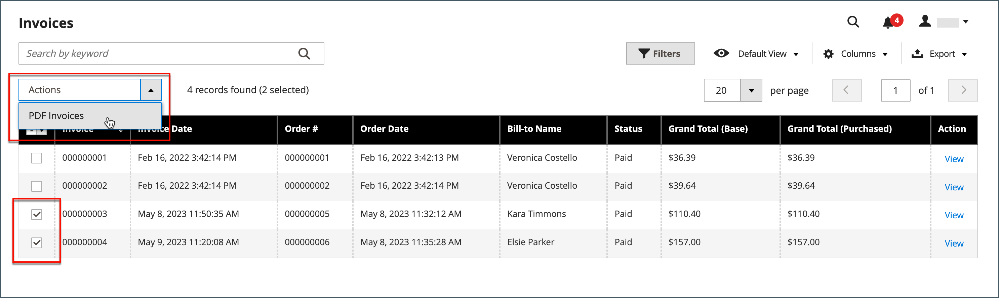

# Factures

Une facture est un enregistrement de l&#39;enregistrement du paiement d&#39;une commande. Plusieurs factures peuvent être [créées](#create-an-invoice) pour une seule commande, et chacune peut inclure autant ou aussi peu de produits achetés que vous spécifiez. Vous pouvez également créer des [factures PDF prêtes à être imprimées](#print-invoices) en tant que documents vente pour vos clients.

Dans la barre latérale _Admin_, accédez à **[!UICONTROL Sales]** > _Opérations_ > **Factures** pour ouvrir la grille _Factures_ et accéder à vos factures créées.

{width="700" zoomable="yes"}

## Descriptions des colonnes

| Colonne | Description |
|--- |--- |
| [!UICONTROL Select] | Cochez les cases des guillemets qui feront l&#39;objet d&#39;une action ou utilisez la commande de sélection dans l&#39;en-tête de colonne. Options : `Select All` / `Deselect All` |
| [!UICONTROL Invoice] | Identifiant numérique unique attribué lors de l’envoi d’une facture par l’administrateur. Lors de l&#39;affichage des détails de la facture, ce numéro apparaît en haut de la page, au lieu du nom du devis. |
| [!UICONTROL Invoice Date] | Date et heure de la première soumission de la facture par l’administrateur. |
| [!UICONTROL Order#] | Identifiant numérique unique attribué lorsqu&#39;une commande est passée par un acheteur. Lors de l&#39;affichage des détails de la facture, ce numéro apparaît sous forme de lien dans le bloc Informations sur la commande et le compte. |
| [!UICONTROL Order Date] | Date et heure de la première commande passée avec succès par le client. |
| [!UICONTROL Bill-to Name] | Nom de la personne responsable du paiement de la commande. |
| [!UICONTROL Status] | Indique le statut actuel d&#39;une facture. Le statut ne peut être modifié que par une action de l&#39;acheteur ou du vendeur. |
| [!UICONTROL Grand Total (Base)] | Prix total des produits à acheter. Le montant total s’affiche dans la devise de base du site web et dans la devise du storefront. |
| [!UICONTROL Grand Total (purchase)] | Total général des produits achetés dans la commande. Le montant total s’affiche dans la devise de base du site web et dans la devise du storefront. |
| [!UICONTROL Purchased From] | Vue de site web/magasin/magasin à partir de laquelle la facture a été créée. |
| [!UICONTROL Billing Address] | Adresse de facturation du client qui a passé la commande. |
| [!UICONTROL Shipping Address] | Adresse à laquelle la commande doit être expédiée. |
| [!UICONTROL Customer Name] | Prénom et nom du client recevant la facture. |
| [!UICONTROL Email] | Adresse e-mail du client recevant la facture. |
| [!UICONTROL Customer Group] | Groupe de clients affecté au client recevant la facture. |
| [!UICONTROL Payment Method] | Mode de paiement à utiliser pour le paiement. |
| [!UICONTROL Shipping Information] | Méthode à utiliser pour expédier la commande. |
| [!UICONTROL Subtotal] | Sous-total de la commande, sans expédition ni manutention, ni taxe. |
| [!UICONTROL Shipping and Handling] | Montant facturé pour l&#39;expédition et la manutention. |
| [!UICONTROL Action] | **[!UICONTROL View]** : ouvre la facture en mode d&#39;édition. |

{style="table-layout:auto"}

## Créer une facture

La création d&#39;une facture pour une commande la déplace à un état dans lequel elle ne peut pas être annulée ou modifiée. Une nouvelle page de facture ressemble à une commande terminée, avec quelques champs supplémentaires. Chaque activité liée à une commande est notée dans la section Commentaires de la facture.

Normalement, les commandes sont facturées et capturées au début du processus d’expédition. Si le mode de paiement est une commande fournisseur ou si l&#39;option [action de paiement](../configuration-reference/sales/payment-methods.md#payment-actions) est définie sur `Authorize and Capture`, la commande est facturée et le paiement est capturé lors du passage en caisse. Vous pouvez générer une facture avec un bon de livraison et imprimer des étiquettes d&#39;expédition à partir de votre compte de transporteur. Une seule commande peut être divisée en livraisons partielles, qui sont facturées séparément, si nécessaire.

Lorsque le statut des nouvelles commandes est défini sur `Processing`, l&#39;option _Facturer automatiquement tous les articles_ devient disponible dans la configuration. Certains modes de paiement par carte de crédit terminent l’étape de facturation dans le cadre du processus lorsque l’[action de paiement](../configuration-reference/sales/payment-methods.md#payment-actions) est définie sur `Authorize and Capture`. Dans ce cas, le bouton Facture n’apparaît pas et la commande est prête à être expédiée.

>[!NOTE]
>
>Les factures ne sont pas créées automatiquement pour les commandes passées à l&#39;aide de `Gift Card`, `Store Credit`, `Reward Points` ou d&#39;autres méthodes de paiement hors ligne.

Une facture pour la commande doit être générée avant de pouvoir être imprimée. Pour afficher ou imprimer le PDF, commencez par télécharger et installer un lecteur PDF tel que [Adobe Acrobat Reader](https://www.adobe.com/acrobat/pdf-reader.html "Obtenir Adobe Reader").

**_Facturer une commande:_**

1. Dans la barre latérale _Admin_, accédez à **[!UICONTROL Sales]** > _[!UICONTROL Operations]_>**[!UICONTROL Orders]**.

1. Recherchez la commande client avec le statut `Processing` dans la grille. Procédez ensuite comme suit :

1. Dans la colonne _Action_, cliquez sur **[!UICONTROL View]**.

1. Dans l&#39;en-tête de la commande client, choisissez l&#39;option **[!UICONTROL Invoice]**.

   >[!NOTE]
   >
   >L’option _[!UICONTROL Invoice]_&#x200B;n’apparaît pas lorsque l’option [action de paiement](../configuration-reference/sales/payment-methods.md#payment-actions) pour votre [mode de paiement](../configuration-reference/sales/payment-methods.md) spécifique est définie sur `Authorize and Capture`, ce qui génère automatiquement une facture. C&#39;est également le cas si la commande est passée et que l&#39;action de paiement pour votre mode de paiement est définie sur `Authorize` et que la commande est facturée.

   {width="700" zoomable="yes"}

   La nouvelle page de facture ressemble à une page de commande terminée, avec des champs supplémentaires qui peuvent être modifiés.

1. Si les articles sont prêts à être expédiés, générez un bon de livraison pour l&#39;expédition au moment où vous créez la facture :

   - Dans la section _Informations d&#39;expédition_, cochez la case **[!UICONTROL Create Shipment]** pour la sélectionner.

     L&#39;enregistrement d&#39;expédition est créé en même temps que la facture.

   - Inclure un numéro de tracking :

      - Cliquez sur **[!UICONTROL Add Tracking Number]**.
      - Saisissez les informations de suivi : _[!UICONTROL Carrier]_,_[!UICONTROL Title]_ et _[!UICONTROL Number]_

     {width="600" zoomable="yes"}

   - Le cas échéant, générez une facture partielle :

      - Dans la section _Articles à facturer_, mettez à jour la colonne **[!UICONTROL Qty to Invoice]** pour n&#39;inclure que des articles spécifiques sur la facture.
      - Cliquez ensuite sur **[!UICONTROL Update Qty's]**.

        {width="600" zoomable="yes"}

1. Si un mode de paiement en ligne a été utilisé pour la commande, définissez **[!UICONTROL Amount]** sur l’option appropriée.

1. Pour avertir les clients par e-mail lorsque la facture est générée, procédez comme suit :

   - Cochez la case **[!UICONTROL Email Copy of Invoice]** .

   - Saisissez n’importe quelle **[!UICONTROL Invoice Comments]**. Pour inclure les commentaires dans l’e-mail de notification, cochez la case **[!UICONTROL Append Comments]** .

1. Une fois l’opération terminée, cliquez sur **[!UICONTROL Submit Invoice]** au bas de la page.

   **_Mode de paiement en ligne:_**

   {width="600" zoomable="yes"}

   **_Mode de paiement hors ligne:_**

   {width="600" zoomable="yes"}

   Le statut de la commande passe de `Pending` à `Complete`.

   {width="600" zoomable="yes"}

## Imprimer les factures

Les factures peuvent être imprimées individuellement ou en lot. Toutefois, avant qu&#39;une facture puisse être imprimée, elle doit d&#39;abord être générée pour la commande. Vous pouvez charger un logo haute résolution pour une facture PDF prête à être imprimée et inclure l’[ID de commande](../stores-purchase/sales-documents.md#add-reference-ids) dans l’en-tête. Pour personnaliser le modèle de facture avec votre logo et votre adresse, consultez [Conditions requises pour le logo PDF](../stores-purchase/sales-documents.md#image-formats).

>[!NOTE]
>
>Pour afficher ou imprimer le PDF, vous devez disposer d’un lecteur PDF. Vous pouvez télécharger [Adobe Reader](https://www.adobe.com/acrobat/pdf-reader.html "Obtenir Adobe Reader") gratuitement.

### Imprimer une seule facture

1. Dans la barre latérale _Admin_, accédez à **[!UICONTROL Sales]** > _[!UICONTROL Operations]_>**[!UICONTROL Invoices]**.

1. Dans la grille de _[!UICONTROL Invoices]_, recherchez la facture et cliquez sur **[!UICONTROL View]**&#x200B;dans la colonne_ Action _.

1. Dans la partie supérieure de la facture, cliquez sur **[!UICONTROL Print]** pour générer un PDF de la facture.

1. Enregistrez le PDF généré dans un fichier ou imprimez-le.

### Imprimer plusieurs factures

1. Dans la barre latérale _Admin_, accédez à **[!UICONTROL Sales]** > _[!UICONTROL Operations]_>**[!UICONTROL Invoices]**.

1. Dans la grille de _[!UICONTROL Invoices]_, cochez la case correspondant à chaque facture à imprimer.

1. Définissez la commande **[!UICONTROL Actions]** sur `PDF Invoices`.

   {width="600" zoomable="yes"}

Les factures sont enregistrées dans un seul fichier PDF qui peut être envoyé à une imprimante ou enregistré.

## Quantités de capture personnalisées

[!BADGE SaaS uniquement]{type=Positive url="https://experienceleague.adobe.com/en/docs/commerce/user-guides/product-solutions" tooltip="S’applique uniquement aux projets Adobe Commerce as a Cloud Service (infrastructure SaaS gérée par Adobe)."}

Pour offrir aux commerçants une plus grande flexibilité pour les captures partielles et les scénarios de paiement spécialisés, l’API Invoice prend en charge les montants de capture personnalisés à l’aide d’attributs d’extension.

Vous pouvez effectuer des appels REST pour capturer un montant personnalisé lors de la création d’une facture.  Utilisez le point d’entrée REST [`POST V1/order/:orderId/invoice`](https://developer.adobe.com/commerce/webapi/reference/rest/saas/) et spécifiez le montant personnalisé dans le champ `extension_attributes.custom_capture_amount` de la payload.

>[!NOTE]
>
>Contactez votre représentant de l’assistance technique pour activer cette fonctionnalité.
>
>En raison de restrictions légales, le montant de la capture personnalisée n&#39;est disponible que dans la région Amérique du Nord (NA) et d&#39;autres régions où la surcapture des paiements est autorisée.
