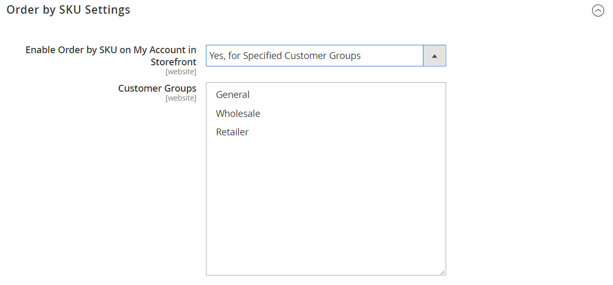
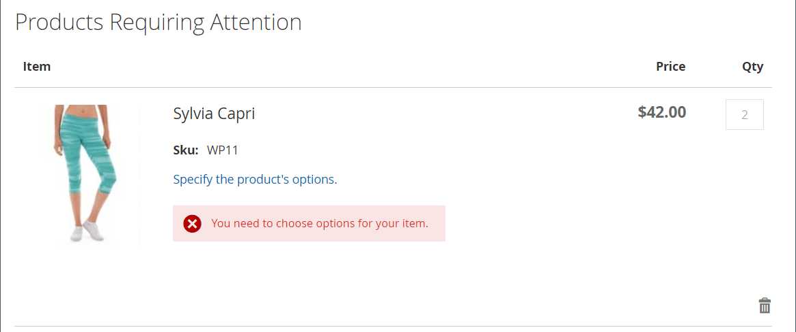

# Classer par SKU

{{ee-feature}}

Un « SKU » est une « unité de gestion des stocks ». Les SKU aident généralement les vendeurs en ligne à identifier les caractéristiques de produits les plus importantes, telles que la taille, la couleur, le prix et le matériau. Les ID de produit sont différents des SKU :

- La `Product ID` est une série séquentielle de nombres utilisés en interne pour identifier les produits et qui ne sont pas disponibles pour les clients.
- Le `SKU` est généré par le vendeur, normalement en fonction du nom et des attributs du produit pour le marketing ou le suivi interne. Par exemple : Un T-shirt bleu, en coton, taille moyenne : T-COT-MED-BL. Le SKU peut être modifié par le vendeur si nécessaire.

Normalement, un SKU comprend un ensemble d’abréviations indiquant les caractéristiques distinctives du produit. La longueur maximale de SKU est de 64 caractères. Les SKU sont importants pour suivre et gérer efficacement les stocks. Il est donc essentiel de les configurer correctement pour le commerce électronique.

Le _commande par SKU_ est un [widget](../content-design/widgets.md) qui peut être affiché dans le magasin pour faciliter la tâche à tous les acheteurs ou qui n’est disponible que pour les acheteurs de groupes de clients spécifiques. Les acheteurs peuvent saisir le SKU et les informations sur la quantité directement dans le bloc Commander par SKU ou charger un fichier CSV à partir de leur compte client. Quelle que soit la configuration, la commande par SKU est toujours disponible pour les administrateurs de magasin.

{width="700" zoomable="yes"}

## Configurer la commande par SKU

1. Dans la barre latérale _Admin_, accédez à **[!UICONTROL Stores]** > _[!UICONTROL Settings]_>**[!UICONTROL Configuration]**.

1. Dans le panneau de gauche, développez la section **[!UICONTROL Sales]** et choisissez **[!UICONTROL Sales]** en dessous.

1. Développez  la section **[!UICONTROL Order by SKU Settings]** .

1. Définissez **[!UICONTROL Enable Order by SKU on my Account in Storefront]** sur l’une des options suivantes :

   - `Yes, for Everyone` - Le bloc Commander par SKU est disponible dans la boutique pour chaque acheteur.
   - `Yes, for Specified Customer Groups` - La commande par SKU n’est disponible que pour les membres d’un groupe de clients spécifique, comme `Wholesale`.
   - `No` - Le bloc Classer par SKU n’apparaît pas dans le storefront et la page Classer par SKU n’est pas disponible dans le compte client.

   {width="600" zoomable="yes"}

1. Cliquez sur **[!UICONTROL Save Config]**.

 (Adobe Commerce B2B uniquement) _**Pour activer la fonction Order by SKU, désactivez la fonction Quick Order :**_

1. Accédez à **[!UICONTROL Stores]** > _[!UICONTROL Settings]_>**[!UICONTROL Configuration]**.

1. Dans le panneau de gauche sous _[!UICONTROL General]_, choisissez **[!UICONTROL B2B Features]**

1. Développez  la section **[!UICONTROL B2B Features]** .

1. Définissez **[!UICONTROL Enable Quick Order]** sur `No`.

   La [fonction de commande rapide](../b2b/quick-order.md) permet aux clients et aux invités de passer rapidement des commandes en fonction du SKU ou du nom du produit.

## Expérience Storefront

Lorsque la fonctionnalité est configurée pour la boutique, les clients peuvent commander par SKU à partir de n’importe quelle page qui inclut le widget _Commander par SKU_ ou à partir du tableau de bord de leur compte.

### Classer par SKU à partir du bloc de page

1. Dans le bloc _Classer par SKU_, le client saisit le **[!UICONTROL SKU]** et le **[!UICONTROL Qty]** de l’article à commander.

1. Pour ajouter un autre élément, cliquez sur **[!UICONTROL Add Row]** et répétez le processus.

1. Effectue un clic sur **[!UICONTROL Add to Cart]**.

### Classer par SKU à partir d’un compte client

1. À partir du storefront, le client se connecte à son compte.

1. Dans le panneau de gauche, choisissez **[!UICONTROL Order by SKU]**.

1. Ajoute des éléments individuels en fonction des préférences :

   _**Ajoute chaque élément par SKU :**_

   - Saisit le **[!UICONTROL SKU]** et le **[!UICONTROL Qty]** de l’article à commander.

   - Pour ajouter d’autres éléments selon vos besoins, cliquez sur _Ajouter une ligne_  et répétez l’opération pour autant d’éléments que nécessaire.

   - Effectue un clic sur **[!UICONTROL Add to Cart]**.

   _**Télécharge un fichier CSV contenant plusieurs éléments :**_

   - Prépare un fichier [import data CSV](../systems/data-csv.md) (valeurs séparées par des virgules) contenant des colonnes pour les `SKU` et les `Qty`.

   {width="500" zoomable="yes"}

   - Pour charger le fichier CSV, cliquez sur **[!UICONTROL Choose File]** et sélectionnez le fichier à charger.

   - Effectue un clic sur **[!UICONTROL Add to Cart]**.

   Si l’un des produits comporte des options supplémentaires, le client est invité à quitter le panier pour signaler que le produit nécessite une attention particulière.

   {width="600" zoomable="yes"}

   >[!NOTE]
   >
   >S’il existe des SKU en double, les quantités sont combinées dans un seul article du panier. Le client peut modifier la quantité de n&#39;importe quel article et cliquer sur **[!UICONTROL Update Shopping Cart]** pour recalculer les totaux.

