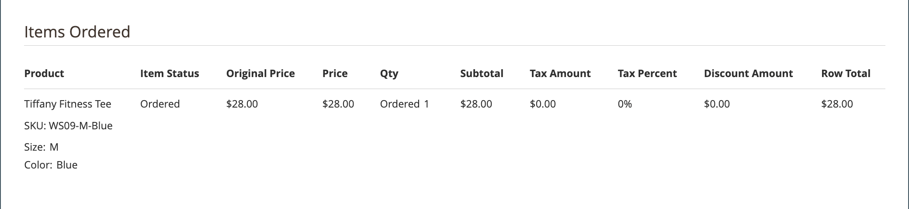

# Workflow et traitement des commandes

Lorsqu&#39;un client passe une commande, une commande client est créée comme enregistrement temporaire de la transaction. Dans la grille Commandes, les commandes client ont initialement le statut « En attente » et peuvent être annulées à tout moment jusqu&#39;à ce que le paiement soit traité. Une fois le paiement confirmé, la commande peut être facturée et expédiée.

**Étape 1 : passer une commande** - Le processus de passage en caisse commence lorsque l’acheteur clique sur **[!UICONTROL Go to Checkout]** page du panier ou [passe une nouvelle commande](reorders-allow.md) directement depuis son compte client.

**Étape 2 : Commande en attente** - L’état initial de la commande client est `Pending`. Dans cet état, le paiement n’a pas été traité et la commande peut toujours être modifiée ou annulée. Cet état se produit lorsque le mode de paiement est configuré pour le mode d’autorisation.

**Étape 3 : Recevoir le paiement** - Le statut de la commande change en fonction de la réception ou de l’autorisation `Processing` du paiement. Selon le mode de paiement, vous pouvez recevoir une notification lorsque la transaction est autorisée ou traitée. Cet état se produit automatiquement lorsque le mode de paiement est configuré pour le mode de capture ou de vente intentionnelle.

**Étape 4 : Commande de facture** - Une commande est généralement facturée après réception du paiement. Le mode de paiement détermine les options de facturation nécessaires pour la commande. Une fois la facture générée et soumise, une copie est envoyée au client. Si le mode de paiement est configuré avec l&#39;action de paiement `capture` ou `intent sale`, une facture est générée automatiquement lorsque le paiement est autorisé et capturé.

>[!NOTE]
>
>Les factures ne sont pas créées automatiquement pour les commandes passées à l&#39;aide de `Gift Card`, `Store Credit`, `Reward Points` ou d&#39;autres méthodes de paiement hors ligne.

**Étape 5 : Enregistrer une expédition unique** - Le statut de la commande devient `Complete` lorsque les détails de l&#39;expédition sont terminés, que l&#39;expédition est enregistrée et que l&#39;expédition est définie. L&#39;exigence d&#39;expédition est satisfaite avec un bon de livraison imprimé et une étiquette d&#39;expédition ou l&#39;option _Notifier prêt pour le retrait_ est sélectionnée (méthode de livraison en magasin). Le client reçoit une notification et le colis est expédié. Si des numéros de suivi sont utilisés, l&#39;expédition peut être suivie à partir du compte du client.

>[!NOTE]
>
>Pour plus d&#39;informations sur le statut de la commande et les options de configuration du mode de paiement, voir [Statut de la commande](order-status.md) et [Paiements](payments.md).

## Afficher une commande

1. Dans la barre latérale _Admin_, accédez à **[!UICONTROL Sales]** > _[!UICONTROL Operations]_>**[!UICONTROL Orders]**.

1. Recherchez la commande dans la grille.

1. Dans la colonne _[!UICONTROL Action]_, cliquez sur **[!UICONTROL View]**.

1. Vérifiez l’état de la commande :

   - Une `Pending` commande peut être modifiée, mise en attente, annulée ou facturée et expédiée.

   - Une `Processing` commande ne peut plus être modifiée ou annulée de manière substantielle, mais l’adresse de facturation et de livraison peut être modifiée.

   - Il est possible de réorganiser une `Completed` commande.

L’e-mail du client peut être modifié à tout moment dans le flux de travail de commande en modifiant le client. L’e-mail ne peut pas être modifié si la commande a été passée par un invité.

Le panneau de gauche pour une commande ouverte donne accès à différents types d’informations liées à la commande.

{width="700" zoomable="yes"}

## Traitement d’une commande

Lorsqu’un client passe une commande, une commande client est créée en tant qu’enregistrement temporaire de la transaction. La commande client a le statut jusqu’à `Pending` réception du paiement. Lorsqu’elles sont en `Pending` état, les commandes peuvent être modifiées ou annulées jusqu’au moment où le paiement est reçu et qu’une facture est générée. Une façon facile d’y penser est que les commandes deviennent des factures et que les factures deviennent des expéditions. La grille Commandes répertorie toutes les commandes, quel que soit leur emplacement dans le workflow. Pour savoir comment aider les clients avec une commande, voir [Mettre à jour une commande](order-update.md).

{width="700" zoomable="yes"}

Pour ouvrir un ordre de `Pending`, cliquez sur **[!UICONTROL Edit]** dans le coin supérieur droit.

>[!NOTE]
>
>Les commandes ne peuvent être modifiées que lorsqu’elles ont le statut `Pending`. Le bouton Modifier n&#39;est pas visible pour les commandes dont le statut est différent ou pour les commandes basées sur un [devis négocié](../b2b/quotes.md).

{width="600" zoomable="yes"}

Passez en revue les sections suivantes de la commande client, en utilisant les descriptions de champ comme référence.

### Description des modes de commande

| Onglet | Description |
|--- |--- |
| [!UICONTROL Information] | Affichez des informations détaillées sur la commande et le compte, y compris les adresses de facturation et d’expédition, les modes de paiement et de livraison, les articles, les commandes, les totaux et les notes. |
| [!UICONTROL Invoices] | Répertorie chaque facture associée à la commande. |
| [!UICONTROL Credit Memos] | Répertorie chaque note de crédit associée à la commande. |
| [!UICONTROL Shipments] | Répertorie chaque enregistrement d&#39;expédition associé à la commande. |
| [!UICONTROL Comments History] | Répertorie toutes les notes liées à la commande. |

{style="table-layout:auto"}

>[!NOTE]
>
>Un utilisateur administrateur doit disposer de **[!UICONTROL Sales / Archive]** [autorisations](../systems/permissions-user-roles.md) pour la portée de son rôle afin d’afficher les onglets _Factures_, _Avoirs_ et _Livraisons_ Commande.

### Barre de boutons

| Bouton | Description |
|--- |--- |
| **[!UICONTROL Back]** | Retourne à la page Commandes sans enregistrer les modifications. |
| **[!UICONTROL Cancel]** | Annule la commande client. |
| **[!UICONTROL Send Email]** | Envoie un e-mail sur la commande au client. |
| **[!UICONTROL Hold]** / **[!UICONTROL Unhold]** | Définit le statut de la commande client sur `On Hold`. Pour libérer la suspension de la commande client, choisissez **[!UICONTROL Unhold]**. |
| **[!UICONTROL Invoice]** | Crée une facture à partir de la commande client en convertissant la commande en facture. |
| **[!UICONTROL Ship]** | Crée un enregistrement d’expédition pour la commande. |
| **[!UICONTROL Notify Order is Ready for Pickup]** | S’affiche uniquement lorsqu’une commande est passée en tant que livraison en magasin. Avise le client que la commande est prête à être ramassée. |
| **[!UICONTROL Reorder]** | Crée une commande client en fonction de la commande actuelle. |
| **[!UICONTROL Edit]** | Ouvre une commande en attente en mode d’édition. Le bouton Modifier n’est pas visible pour les commandes ayant un statut de `Processing`, ni pour les commandes basées sur des devis négociés. |

{style="table-layout:auto"}

### Annuler une commande

Vous pouvez [annuler](order-update.md) les commandes qui ne sont pas encore facturées. Un [ avoir ](credit-memos.md) doit être émis si un client souhaite annuler une commande après sa facturation (le paiement est capturé).

Si une commande est `Pending` ou `Processing` et que le paiement n&#39;est pas saisi ou n&#39;est pas entièrement saisi, vous pouvez [annuler la commande](#void-an-order) au lieu de l&#39;annuler.

Pour restaurer une commande annulée, cliquez sur le **[!UICONTROL Reorder]** bouton et une nouvelle commande est créée avec l’état `Pending`.

>[!NOTE]
>
>L’annulation d’une commande entraîne également une annulation, mais l’annulation d’une commande ne déclenche pas d’annulation.

### Annuler une commande

Seules les commandes client qui ne sont pas facturées, qui ont un statut de , et un [paramètre d’intégration de `Processing`paiement de `Authorize`](../configuration-reference/sales/payment-methods.md#payment-actions), peuvent être [annulées](order-update.md#void-a-processing-order). Après avoir annulé une commande, vous pouvez l’annuler.

### [!UICONTROL Order and Account Information]

{width="600" zoomable="yes"}

#### Informations sur la commande

| Champ | Description |
|--- |--- |
| [!UICONTROL Order Number] | Le numéro de commande apparaît en haut de la commande client, suivi d&#39;une note indiquant si l&#39;e-mail de confirmation a été envoyé. |
| [!UICONTROL Order Date] | Date et heure auxquelles la commande a été passée. |
| [!UICONTROL Purchased From] | Indique l’affichage du site web, du magasin et du magasin dans lequel la commande a été passée. |
| [!UICONTROL Placed from IP] | Indique l&#39;adresse IP de l&#39;ordinateur à partir duquel la commande a été passée. |
| [!UICONTROL Order Placed from Quote] |  (disponible avec Adobe Commerce B2B) Indique le [devis](../b2b/quotes.md) à partir duquel la commande a été générée, le cas échéant. Le nom du devis est lié au devis. |

{style="table-layout:auto"}

#### Informations sur le compte

| Champ | Description |
|--- |--- |
| [!UICONTROL Customer Name] | Le nom du client ou de l’acheteur qui a passé la commande. Le nom du client est lié au profil du client. |
| [!UICONTROL Email] | L’adresse électronique du client ou de l’acheteur. L’adresse email est liée pour ouvrir un nouveau message email. |
| [!UICONTROL Customer Group] | Nom du groupe de clients ou du catalogue partagé auquel le client est affecté. |
| [!UICONTROL Company Name] |  (Disponible avec Adobe Commerce B2B) Le nom de la société à laquelle l’acheteur est associé et pour le compte de laquelle la commande est passée. Le nom de l’entreprise est lié au profil](../b2b/account-companies.md) de l’entreprise[. |

{style="table-layout:auto"}

### [!UICONTROL Address Information]

{width="600" zoomable="yes"}

| Champ | Description |
|--- |--- |
| [!UICONTROL Billing Address] | Le nom du client ou de l’acheteur qui a passé la commande, suivi de l’adresse de facturation, du numéro de téléphone et [de la TVA](vat.md), le cas échéant. Le numéro de téléphone est lié à la numérotation automatique sur un appareil mobile. |
| [!UICONTROL Shipping Address] | Nom de la personne à l’attention de laquelle la commande doit être expédiée, suivi de l’adresse d’expédition et du numéro de téléphone. Le numéro de téléphone est lié à la numérotation automatique sur un appareil mobile. |

{style="table-layout:auto"}

### [!UICONTROL Payment & Shipping Method]

{width="600" zoomable="yes"}

| Champ | Description |
|--- |--- |
| [!UICONTROL Payment Information] | Mode de paiement à utiliser pour la commande et numéro de commande fournisseur, le cas échéant, suivi de la devise utilisée pour passer la commande. Si la commande est imputée au crédit de la société à l’aide de l’option [Paiement sur le compte](../b2b/enable-basic-features.md#configure-payment-on-account), le montant imputé au compte est indiqué. |
| [!UICONTROL Shipping & Handling Information] | Le mode d’expédition à utiliser et les frais de manutention applicables. |

{style="table-layout:auto"}

### Vérifier les articles commandés

{width="600" zoomable="yes"}

Dans cette **[!UICONTROL Order Total]** section, procédez comme suit :

1. Entrez un à **[!UICONTROL Comment]** inclure dans la commande.

1. Si vous souhaitez envoyer le commentaire par courrier électronique au client, cochez la **[!UICONTROL Notify Customer by Email]** case.

1. Si vous souhaitez que le commentaire soit visible dans le compte client, cochez la **[!UICONTROL Visible on Storefront]** case.

   {width="600" zoomable="yes"}

1. Si vous êtes prêt à facturer la commande, cliquez **[!UICONTROL Invoice]** et suivez les instructions pour [créer une facture](invoices.md#create-an-invoice).

#### [!UICONTROL Items Ordered]

| Champ | Description |
|--- |--- |
| [!UICONTROL Product] | Nom du produit, SKU et options, le cas échéant. |
| [!UICONTROL Item Status] | Indique le statut de l’élément. Valeur : `Ordered` |
| [!UICONTROL Original Price] | Prix catalogue initial de l&#39;article avant remises. |
| [!UICONTROL Price] | Prix d’achat de l’article. Cette valeur reflète toute remise appliquée à l&#39;article du catalogue partagé, le cas échéant. |
| [!UICONTROL Qty] | La quantité commandée. |
| [!UICONTROL Subtotal] | Le sous-total est le prix d’achat multiplié par la quantité. |
| [!UICONTROL Tax Amount] | Montant de la taxe qui s’applique à l’article en tant que valeur décimale. |
| [!UICONTROL Tax Percent] | Pourcentage de la taxe appliquée à cet article en pourcentage. |
| [!UICONTROL Discount Amount] | La réduction qui s’applique à cet article. La valeur de remise est nulle si la commande est basée sur un devis. |
| [!UICONTROL Row Total] | Total de l’article, y compris les taxes applicables dues au niveau du produit, moins les remises. |

{style="table-layout:auto"}

#### [!UICONTROL Notes for this Order]

| Champ | Description |
|--- |--- |
| [!UICONTROL Status] | Affiche le statut de la commande client. |
| [!UICONTROL Comment] | Zone de texte utilisée pour saisir un commentaire à l’intention du client qui accompagne la commande.  **[!UICONTROL Notify Customer by Email]**- Cochez la case si vous souhaitez envoyer le commentaire au client sous forme d’e-mail distinct. **[!UICONTROL Visible on Storefront]** - Cochez la case si vous souhaitez que le commentaire soit visible à partir du compte du client.  **[!UICONTROL Update]**- Ajoute le commentaire et envoie un courriel, le cas échéant. |

{style="table-layout:auto"}

#### [!UICONTROL Order Totals]

| Champ | Description |
|--- |--- |
| [!UICONTROL Shipping & Handling] | Le montant facturé pour les frais d’expédition et de manutention. |
| [!UICONTROL Tax] | Le montant de la taxe appliquée à la commande, le cas échéant. |
| [!UICONTROL Grand Total] | Total de la commande. |
| [!UICONTROL Total Paid] | Montant total payé pour la commande, le cas échéant. |
| [!UICONTROL Total Refunded] | Montant total remboursé de la commande, le cas échéant. |
| [!UICONTROL Total Due] | Montant total dû. |
| [!UICONTROL Store Credit] |  (Adobe Commerce uniquement) Montant du crédit de magasin disponible appliqué à la commande, le cas échéant. |
| [!UICONTROL Catalog Total Price] |  (Disponible avec Adobe Commerce B2B) Le prix total des articles dans le devis hors taxe, en fonction des prix dans le catalogue partagé ou le catalogue standard qui est utilisé comme base du devis. Si la devise d’affichage du storefront diffère de la devise de base, la valeur s’affiche dans les deux devises, le storefront s’affichant entre crochets. |
| [!UICONTROL Negotiated Discount] |  (disponible avec Adobe Commerce B2B) Remise résultant d&#39;un devis négocié entre l&#39;acheteur et le vendeur. Si la devise d’affichage du storefront diffère de la devise de base, la valeur s’affiche dans les deux devises, le storefront s’affichant entre crochets. |
| [!UICONTROL Subtotal] |  (disponible avec Adobe Commerce B2B) Prix total du catalogue moins la remise négociée. |

{style="table-layout:auto"}

## Démonstration du traitement des commandes

Regardez cette vidéo pour en savoir plus sur le traitement et le statut des commandes :

>[!VIDEO](https://video.tv.adobe.com/v/343935/?quality=12&learn=on)
