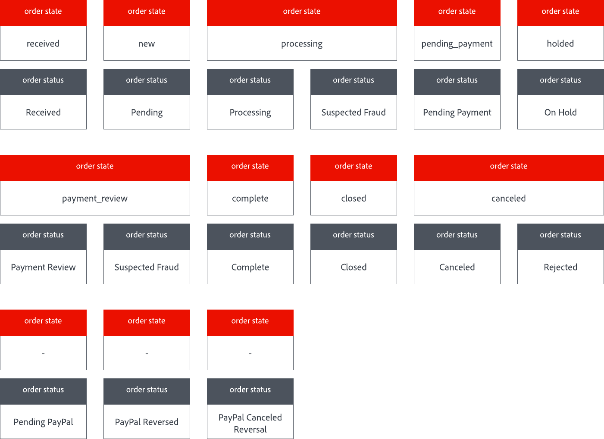
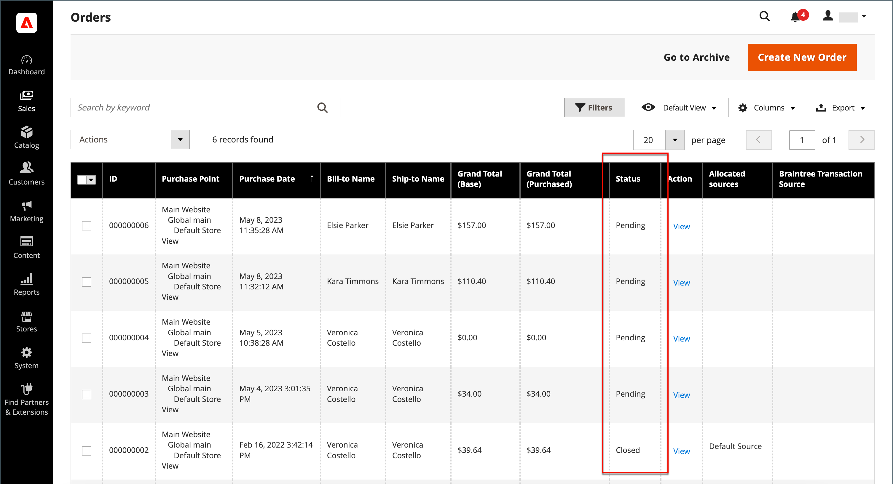
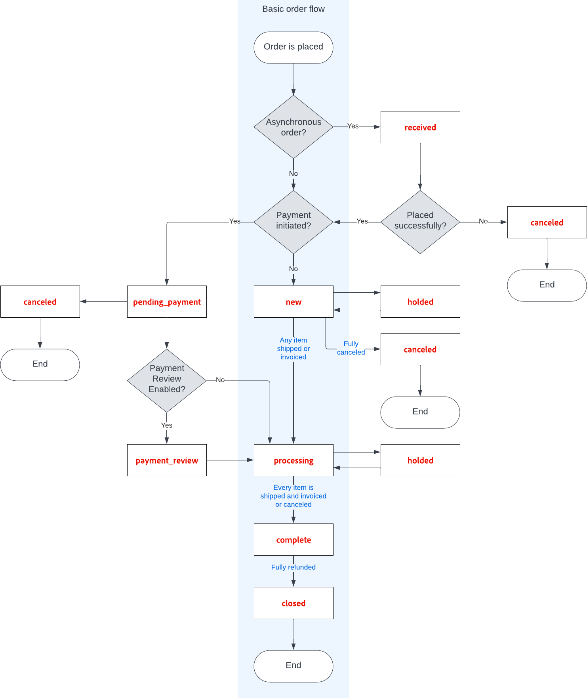
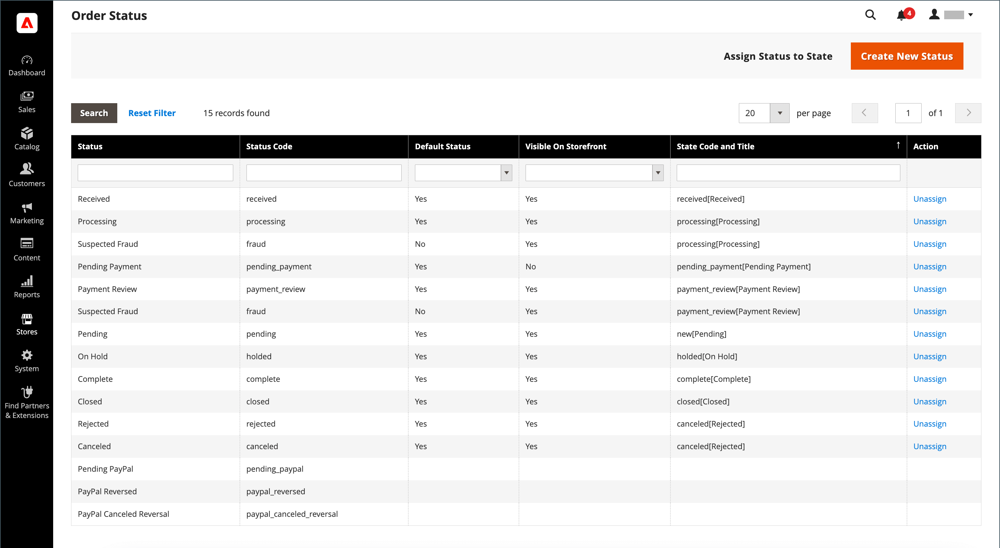
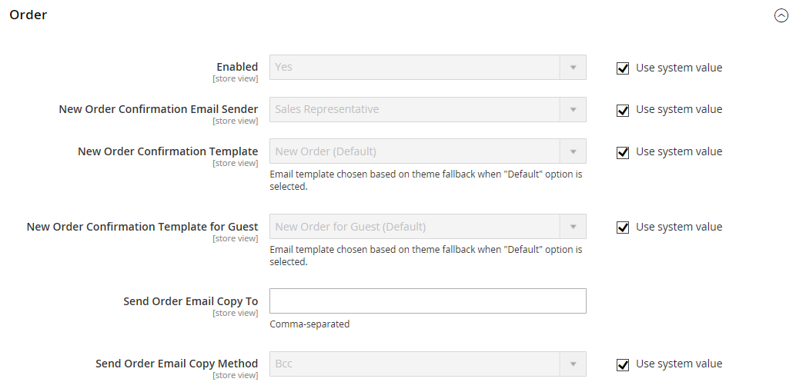

# Statut de la commande

Toutes les commandes ont un statut de commande associé à une étape du traitement des commandes [workflow](order-processing.md).\
La différence entre les états de commande et les états de commande réside dans le fait que les **[!UICONTROL order states]** sont utilisés par programmation. Ils ne le sont pas
visible par les clients ou les utilisateurs administrateurs. Ils déterminent le flux d’un ordre et les opérations possibles pour un
commande dans un certain état.\
Les **[!UICONTROL Order statuses]** sont utilisées pour communiquer le statut d’une commande aux clients et aux utilisateurs administrateurs.
Vous pouvez créer d’autres statuts de commande pour vous aligner sur vos besoins opérationnels. Les statuts de commande sont faciles à afficher
progression en dehors d&#39;Adobe Commerce, par exemple prélèvement de commande et progression de la diffusion. Ils n’ont aucun impact sur la commande
workflow de traitement.\
Chaque statut de commande est associé à un statut de commande. Votre boutique dispose d’un ensemble de statuts de commande prédéfinis et
paramètres d’état de la commande.

{width="700" zoomable="yes"}

Le statut de chaque commande est affiché dans la colonne _Statut_ de la grille _Commandes_.

{width="700" zoomable="yes"}

>[!TIP]
>
>Une commande partiellement remboursée reste dans `Processing` état jusqu&#39;à ce que **_tous_** les articles commandés (y compris les articles remboursés) soient expédiés. Le statut de la commande ne passe pas à `Complete` tant que chaque article n&#39;a pas été expédié.

## Workflow d’état de commande

## Statut prédéfini

| Statut de la commande | Code de statut |                                                                                                                                                                                                                                                                                        |
|--------------------------|----------------------------|----------------------------------------------------------------------------------------------------------------------------------------------------------------------------------------------------------------------------------------------------------------------------------------|
| Received | `received` | Ce statut est le statut initial des commandes passées lorsque le placement de commande asynchrone est activé. |
| Présomption De Fraude | `fraud` | Parfois, les commandes payées via PayPal ou une autre passerelle de paiement sont marquées comme _fraude présumée_. Ce statut signifie que la commande n’a pas de facture émise et que l’e-mail de confirmation n’est pas non plus envoyé. |
| En cours de traitement | `processing` | Lorsque le statut des nouvelles commandes est défini sur &#39;Traitement&#39;, l&#39;option _Facturer automatiquement tous les articles_ devient disponible dans la configuration. Les factures ne sont pas créées automatiquement pour les commandes passées à l’aide d’une carte cadeau, d’un crédit de boutique, de points de récompense ou d’autres méthodes de paiement hors ligne. |
| En attente de paiement | `pending_payment` | Ce statut est utilisé si la commande est créée et que PayPal ou un mode de paiement similaire est utilisé. Cela signifie que le client a été redirigé vers le site Web de la passerelle de paiement, mais aucune information sur le retour n&#39;a encore été reçue. Ce statut change lorsque le client paie. |
| Examen des paiements | `payment_review` | Ce statut s&#39;affiche lorsque la vérification des paiements PayPal est activée. |
| En attente | `pending` | Ce statut indique qu&#39;aucune facture et aucun envoi n&#39;ont été soumis. |
| En attente | `holded` | Ce statut ne peut être attribué que manuellement. Vous pouvez mettre n&#39;importe quel ordre en attente. |
| Terminé | `complete` | Ce statut signifie que la commande est créée, payée et expédiée au client. |
| Fermée | `closed` | Ce statut indique qu&#39;un avoir a été attribué à une commande et que le client a reçu un remboursement. |
| Annulé | `canceled` | Ce statut est attribué manuellement dans l’administrateur ou, pour certaines passerelles de paiement, lorsque le client ne paie pas dans le délai spécifié. |
| Rejetés | `rejected` | Ce statut signifie qu&#39;une commande a été rejetée lors d&#39;un traitement asynchrone des commandes. Cela se produit lorsqu’une erreur se produit lors du placement asynchrone des commandes. |
| Annulation de l&#39;annulation PayPal | `paypay_canceled_reversal` | Ce statut signifie que PayPal a annulé l&#39;annulation. |
| PayPal en attente | `pending_paypal` | Ce statut signifie que la commande a été reçue par PayPal, mais que le paiement n&#39;a pas encore été traité. |
| PayPal annulé | `paypal_reversed` | Ce statut signifie que PayPal a annulé la transaction. |

{style="table-layout:auto"}

## Statut de commande personnalisé

Outre les paramètres prédéfinis de statut de la commande, vous pouvez créer vos propres paramètres personnalisés de statut de la commande, les affecter à des états de commande et définir des états de commande par défaut pour les états de commande. L’état de commande indique la position de la commande dans le workflow de traitement de commande et l’état de commande affecte un libellé traduisible significatif à la position de la commande. Par exemple, vous avez peut-être besoin d’un statut de commande personnalisé, tel que `packaging"`, `backordered` ou d’un statut spécifique à vos besoins. Vous pouvez créer un nom explicite pour le statut personnalisé et l’affecter au statut de commande associé dans le workflow.

>[!NOTE]
>
>Seules les valeurs par défaut du statut de commande personnalisé sont utilisées dans le workflow de commande. Les valeurs de statut personnalisées qui ne sont pas définies par défaut ne peuvent être utilisées que dans la section des commentaires de la commande.

{width="700" zoomable="yes"}

### Création d’un statut de commande personnalisé

1. Dans la barre latérale _Admin_, accédez à **[!UICONTROL Stores]** > _[!UICONTROL Settings]_>**[!UICONTROL Order Status]**.

1. Dans le coin supérieur droit, cliquez sur **[!UICONTROL Create New Status]**.

   {width="600" zoomable="yes"}

1. Mettez à jour la section _[!UICONTROL Order Status Information]_:

   - Saisissez un **[!UICONTROL Status Code]** pour référence interne. Le premier caractère doit être une lettre (a-z), et le reste peut être n&#39;importe quelle combinaison de lettres et de chiffres (0-9). Utilisez le caractère de soulignement au lieu d’un espace.

   - Par **[!UICONTROL Status Label]**, saisissez un libellé qui identifie le paramètre de statut dans l’administration et le storefront.

1. Dans la section _[!UICONTROL Store View Specific Labels]_, saisissez les libellés nécessaires pour les différentes vues de la boutique.

1. Cliquez sur **[!UICONTROL Save Status]**.

### Attribuer un statut de commande à un état

1. Sur la page _Statut de la commande_, cliquez sur **[!UICONTROL Assign Status to State]**.

   {width="600" zoomable="yes"}

1. Mettez à jour la section **[!UICONTROL Assignment Information]**, procédez comme suit :

   - Choisissez le **[!UICONTROL Order Status]** que vous souhaitez affecter. Ils sont répertoriés par libellé de statut.

   - Définissez **[!UICONTROL Order State]** à l’emplacement du statut de la commande dans le workflow.

     >[!NOTE]
     >
     >**_[!UICONTROL Order State]_** liste inclut les statuts de commande affectée par défaut. Par exemple, le statut de commande par défaut `Pending` s’affiche au lieu de la valeur d’état de commande `New`.

   - Pour que ce statut soit le statut par défaut du statut de la commande, cochez la case **[!UICONTROL Use Order Status as Default]** .

     >[!NOTE]
     >
     >Seuls les statuts de commande par défaut sont utilisés dans le workflow de commande. Les statuts non par défaut ne peuvent être définis que dans la section **[!UICONTROL Order Comments]** de l’Administration.

   - Pour rendre ce statut visible depuis le storefront, cochez la case **[!UICONTROL Visible On Storefront]** .

   {width="600" zoomable="yes"}

1. Cliquez sur **[!UICONTROL Save Status Assignment]**.

### Modifier le statut d’une commande existante

1. Dans la grille de _[!UICONTROL Order Status]_, ouvrez l’enregistrement de statut en mode d’édition.

1. Mettez à jour les paramètres de statut si nécessaire.

1. Cliquez sur **[!UICONTROL Save Status]**.

### Supprimer un statut de commande d’un état affecté

>[!NOTE]
>
>L’affectation d’un paramètre de statut à un état ne peut pas être annulée si le statut est en cours d’utilisation.

1. Dans la grille de _[!UICONTROL Order Status]_, recherchez l&#39;enregistrement de statut de la commande à laquelle annuler l&#39;affectation.

1. Dans la colonne _[!UICONTROL Action]_tout à droite de la ligne, cliquez sur le lien **[!UICONTROL Unassign]**.

   Un message s’affiche en haut de l’espace de travail indiquant que l’affectation du statut de la commande a été annulée. Bien que le libellé Statut de la commande apparaisse toujours dans la liste, il n’est plus affecté à un état. Les paramètres de statut de la commande ne peuvent pas être supprimés.

>[!NOTE]
>
>Si le statut de commande par défaut n’est pas affecté à partir du statut de commande, _**un autre**_ statut de commande est _**défini automatiquement**_ par défaut pour ce statut de commande.

## Notification

Les clients peuvent suivre le statut de leurs commandes par [flux RSS](../merchandising-promotions/social-rss.md) si le flux RSS de commandes est activé dans la configuration. Lorsqu&#39;il est activé, un lien vers le flux RSS s&#39;affiche sur chaque commande.

### Activer la notification du statut de la commande

1. Dans la barre latérale _Admin_, accédez à **[!UICONTROL Stores]** > _[!UICONTROL Settings]_>**[!UICONTROL Configuration]**.

1. Dans le panneau de gauche, développez **[!UICONTROL Catalog]** et choisissez **[!UICONTROL RSS Feeds]** en dessous.

1. Développez  la section **[!UICONTROL Order]** .

1. Définissez **[!UICONTROL Customer Order Status Notification]** sur `Enable`.

   {width="600" zoomable="yes"}

1. Cliquez ensuite sur **[!UICONTROL Save Config]**.

### Configurer des notifications par e-mail de nouvelle commande

1. Dans la barre latérale _Admin_, accédez à **[!UICONTROL Stores]** > _[!UICONTROL Settings]_>**[!UICONTROL Configuration]**.

1. Dans le panneau de gauche, développez **[!UICONTROL Sales]** et choisissez **[!UICONTROL Sales Emails]** en dessous.

1. Développez  la section **[!UICONTROL Order]** .

   {width="600" zoomable="yes"}

1. Définissez **[!UICONTROL New Order Confirmation Email Sender]** sur l’une des options suivantes :

   - `General Contact`
   - `Sales Representative`
   - `Customer Support`
   - `Custom Email 1`
   - `Custom Email 2`

1. Choisissez les modèles à utiliser pour chaque type de client :

   - **[!UICONTROL New Order Confirmation Template]** - Choisissez un modèle à utiliser pour les clients disposant d’un compte de boutique enregistré.
   - **[!UICONTROL New Order Confirmation Template for Guest]** - Choisissez un modèle à utiliser pour les clients invités qui ne disposent pas d’un compte de boutique enregistré.

1. Pour informer une autre personne (un responsable d’entreprise, par exemple) de la nouvelle commande, saisissez l’adresse e-mail à **[!UICONTROL Send Order Email Copy To]**.

   Vous pouvez ajouter plusieurs adresses e-mail si plusieurs destinataires sont requis.

1. Définissez la **[!UICONTROL Send Order Email Copy Method]** sur l’une des options suivantes :

   - `Bcc` - Un seul e-mail sur la nouvelle commande est envoyé à la fois au client et au destinataire supplémentaire, mais le client ne voit pas que l’e-mail reçu a également été envoyé au destinataire supplémentaire.
   - `Separate Email` - Deux e-mails distincts sont envoyés : l’un au destinataire et l’autre au client.

1. Cliquez ensuite sur **[!UICONTROL Save Config]**.
