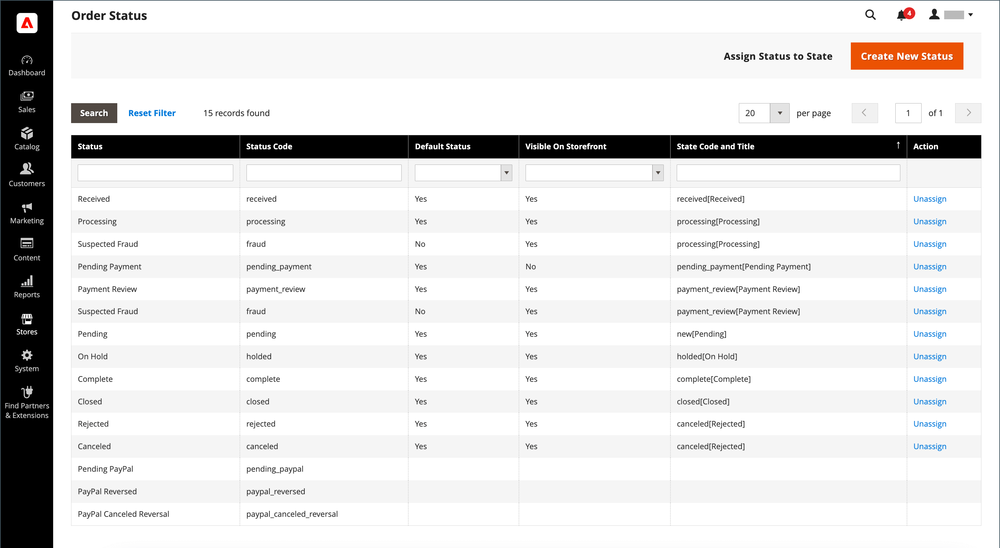

# État de la commande

Toutes les commandes ont un état de commande associé à une étape dans le [workflow](order-processing.md) de traitement des commandes.\
La différence entre les états de commande et les états de commande est que **[!UICONTROL order states]** sont utilisés par programmation. Ils ne sont pas
visible pour les clients ou les utilisateurs administrateurs. Ils déterminent le flux d’une commande et les opérations possibles pour une
commande dans un certain état.\
**[!UICONTROL Order statuses]** sont utilisés pour communiquer l’état d’une commande aux clients et aux utilisateurs administrateurs.
Vous pouvez créer d’autres statuts de commande afin de répondre à vos besoins opérationnels. L’affichage des statuts des commandes est pratique
la progression en dehors d’Adobe Commerce, par exemple la progression de la sélection et de la diffusion des commandes. Ils n&#39;ont aucun impact sur la commande.
workflow de traitement.\
Chaque état de commande est associé à un état de commande. Votre magasin dispose d’un état de commande prédéfini et
paramètres d’état de la commande.

{width="700" zoomable="yes"}

L’état de chaque commande est indiqué dans la colonne _Status_ de la grille _Commandes_.

{width="700" zoomable="yes"}

>[!TIP]
>
>Une commande partiellement remboursée reste à l&#39;état `Processing` jusqu&#39;à ce que **_tous les_** articles commandés (y compris les articles remboursés) soient expédiés. L’état de la commande ne passe pas à `Complete` tant que chaque article de la commande n’a pas été expédié.

## Workflow d’état de commande

## État prédéfini

| État de la commande | Code d’état |                                                                                                                                                                                                                                                                                        |
|--------------------------|----------------------------|----------------------------------------------------------------------------------------------------------------------------------------------------------------------------------------------------------------------------------------------------------------------------------------|
| Reçu | `received` | Cet état est l’état initial des commandes qui sont placées lorsque le placement de commande asynchrone est activé. |
| Fraude présumée | `fraud` | Parfois, les commandes effectuées via PayPal ou une autre passerelle de paiement sont marquées comme _Fraude suspectée_. Ce statut signifie que la commande n&#39;a pas émis de facture et que l&#39;email de confirmation n&#39;est pas non plus envoyé. |
| En cours de traitement | `processing` | Lorsque l’état des nouvelles commandes est défini sur &quot;Traitement&quot;, l’option _Facturer automatiquement tous les éléments_ devient disponible dans la configuration. Les factures ne sont pas créées automatiquement pour les commandes passées à l’aide de la carte cadeau, du crédit de magasin, des points de récompense ou d’autres modes de paiement hors ligne. |
| En attente de paiement | `pending_payment` | Cet état est utilisé si la commande est créée et que PayPal ou un mode de paiement similaire est utilisé. Cela signifie que le client a été dirigé vers le site web de la passerelle de paiement, mais qu’aucune information de retour n’a encore été reçue. Ce statut change lorsque le client paie. |
| Révision des paiements | `payment_review` | Cet état s’affiche lorsque la révision des paiements PayPal est activée. |
| En attente | `pending` | Ce statut indique qu&#39;aucune facture et aucun envoi n&#39;ont été soumis. |
| En attente | `holded` | Cet état ne peut être attribué que manuellement. Vous pouvez suspendre n&#39;importe quel ordre. |
| Terminer | `complete` | Ce statut signifie que la commande est créée, payante et expédiée au client. |
| Fermé | `closed` | Ce statut indique qu’une note de crédit a été attribuée à une commande et que le client a reçu un remboursement. |
| Annulé | `canceled` | Ce statut est attribué manuellement dans l’administrateur ou, pour certaines passerelles de paiement, lorsque le client ne paie pas dans le délai spécifié. |
| Rejetés | `rejected` | Ce statut signifie qu’une commande a été rejetée lors du traitement asynchrone des commandes. Cela se produit lorsqu’une erreur se produit lors du placement de commande asynchrone. |
| Revirement annulé de PayPal | `paypay_canceled_reversal` | Ce statut signifie que PayPal a annulé l&#39;annulation. |
| En attente de PayPal | `pending_paypal` | Ce statut signifie que la commande a été reçue par PayPal, mais que le paiement n&#39;a pas encore été traité. |
| PayPal inversé | `paypal_reversed` | Ce statut signifie que PayPal a annulé la transaction. |

{style="table-layout:auto"}

## Statut de la commande personnalisée

Outre les paramètres prédéfinis d’état de commande, vous pouvez créer vos propres paramètres personnalisés d’état de commande, les affecter à l’état de la commande et définir les états de commande par défaut pour les états de commande. L’état de la commande indique la position de la commande dans le workflow de traitement des commandes et l’état de la commande attribue un libellé traduisible significatif à la position de la commande. Par exemple, vous pouvez avoir besoin d’un état de commande personnalisé tel que `packaging"`, `backordered` ou d’un état spécifique à vos besoins. Vous pouvez créer un nom explicite pour le statut personnalisé et l’affecter à l’état de commande associé dans le workflow.

>[!NOTE]
>
>Seules les valeurs d’état de commande personnalisée par défaut sont utilisées dans le workflow de commande. Les valeurs d’état personnalisées qui ne sont pas définies par défaut ne peuvent être utilisées que dans la section des commentaires de la commande.

{width="700" zoomable="yes"}

### Création d’un état de commande personnalisé

1. Sur la barre latérale _Admin_, accédez à **[!UICONTROL Stores]** > _[!UICONTROL Settings]_>**[!UICONTROL Order Status]**.

1. Dans le coin supérieur droit, cliquez sur **[!UICONTROL Create New Status]**.

   {width="600" zoomable="yes"}

1. Mettez à jour la section _[!UICONTROL Order Status Information]_:

   - Saisissez un **[!UICONTROL Status Code]** pour référence interne. Le premier caractère doit être une lettre (a-z) et le reste peut être n’importe quelle combinaison de lettres et de nombres (0-9). Utilisez le caractère de soulignement au lieu d’un espace.

   - Pour **[!UICONTROL Status Label]**, saisissez un libellé qui identifie le paramètre d’état dans Admin et storefront.

1. Dans la section _[!UICONTROL Store View Specific Labels]_, saisissez les étiquettes nécessaires pour différentes vues de magasin.

1. Cliquez sur **[!UICONTROL Save Status]**.

### Attribuer un état de commande à un état

1. Sur la page _État de la commande_, cliquez sur **[!UICONTROL Assign Status to State]**.

   {width="600" zoomable="yes"}

1. Mettez à jour la section **[!UICONTROL Assignment Information]**, procédez comme suit :

   - Sélectionnez le **[!UICONTROL Order Status]** à affecter. Elles sont répertoriées par libellé d’état.

   - Définissez **[!UICONTROL Order State]** sur l’emplacement du workflow auquel appartient l’état de la commande.

     >[!NOTE]
     >
     >La liste **_[!UICONTROL Order State]_** comprend les états de commande attribués par défaut. Par exemple, l’état de commande par défaut `Pending` s’affiche à la place de la valeur d’état de commande `New`.

   - Pour que cet état soit défini par défaut pour l’état de la commande, cochez la case **[!UICONTROL Use Order Status as Default]** .

     >[!NOTE]
     >
     >Seuls les états de commande par défaut sont utilisés dans le workflow de commande. Les états autres que par défaut ne peuvent être définis que dans la section **[!UICONTROL Order Comments]** de l’administrateur.

   - Pour rendre cet état visible à partir du storefront, cochez la case **[!UICONTROL Visible On Storefront]** .

   {width="600" zoomable="yes"}

1. Cliquez sur **[!UICONTROL Save Status Assignment]**.

### Modifier un état de commande existant

1. Dans la grille _[!UICONTROL Order Status]_, ouvrez l’enregistrement d’état en mode d’édition.

1. Mettez à jour les paramètres d’état si nécessaire.

1. Cliquez sur **[!UICONTROL Save Status]**.

### Supprimer un état de commande d’un état affecté

>[!NOTE]
>
>Un paramètre d’état ne peut pas être annulé si l’état est en cours d’utilisation.

1. Dans la grille _[!UICONTROL Order Status]_, recherchez l’enregistrement d’état de commande à ne pas attribuer.

1. Dans la colonne _[!UICONTROL Action]_&#x200B;située à l’extrémité droite de la ligne, cliquez sur le lien **[!UICONTROL Unassign]**.

   Un message s’affiche en haut de l’espace de travail pour indiquer que l’état de la commande n’a pas été attribué. Bien que le libellé d’état de la commande apparaisse toujours dans la liste, il n’est plus affecté à un état. Les paramètres d’état de la commande ne peuvent pas être supprimés.

>[!NOTE]
>
>Si l’état de commande par défaut n’est pas attribué de l’état de commande, l’état de commande _&#x200B;**another**&#x200B;_ est _&#x200B;**défini automatiquement**&#x200B;_ comme état par défaut pour cet état de commande.

## Notification

Les clients peuvent suivre l’état de leurs commandes par [flux RSS](../merchandising-promotions/social-rss.md) si le flux RSS de commande est activé dans la configuration. Lorsque cette option est activée, un lien vers le flux RSS s’affiche dans chaque commande.

### Activer la notification d’état de commande

1. Sur la barre latérale _Admin_, accédez à **[!UICONTROL Stores]** > _[!UICONTROL Settings]_>**[!UICONTROL Configuration]**.

1. Dans le panneau de gauche, développez **[!UICONTROL Catalog]** et sélectionnez **[!UICONTROL RSS Feeds]** sous .

1. Développez la section  sur **[!UICONTROL Order]** .

1. Définissez **[!UICONTROL Customer Order Status Notification]** sur `Enable`.

   {width="600" zoomable="yes"}

1. Une fois l’opération terminée, cliquez sur **[!UICONTROL Save Config]**.

### Configuration des notifications par courrier électronique de nouvelle commande

1. Sur la barre latérale _Admin_, accédez à **[!UICONTROL Stores]** > _[!UICONTROL Settings]_>**[!UICONTROL Configuration]**.

1. Dans le panneau de gauche, développez **[!UICONTROL Sales]** et sélectionnez **[!UICONTROL Sales Emails]** sous .

1. Développez la section  sur **[!UICONTROL Order]** .

   {width="600" zoomable="yes"}

1. Définissez **[!UICONTROL New Order Confirmation Email Sender]** sur l’une des options suivantes :

   - `General Contact`
   - `Sales Representative`
   - `Customer Support`
   - `Custom Email 1`
   - `Custom Email 2`

1. Choisissez les modèles à utiliser pour chaque type de client :

   - **[!UICONTROL New Order Confirmation Template]** - Choisissez un modèle à utiliser pour les clients disposant d’un compte de magasin enregistré.
   - **[!UICONTROL New Order Confirmation Template for Guest]** - Choisissez un modèle à utiliser pour les clients invités sans compte de magasin enregistré.

1. Pour notifier une autre personne (un responsable de l’entreprise, par exemple) de la nouvelle commande, saisissez l’adresse électronique à **[!UICONTROL Send Order Email Copy To]**.

   Vous pouvez ajouter plusieurs adresses électroniques si plusieurs destinataires sont requis.

1. Définissez le **[!UICONTROL Send Order Email Copy Method]** sur l’une des options suivantes :

   - `Bcc` - Un seul email concernant la nouvelle commande est envoyé au client et au destinataire supplémentaire, mais le client ne voit pas que l&#39;email qu&#39;il a reçu a également été envoyé au destinataire supplémentaire.
   - `Separate Email` - Deux emails distincts sont envoyés : un au destinataire et un au client.

1. Une fois l’opération terminée, cliquez sur **[!UICONTROL Save Config]**.
