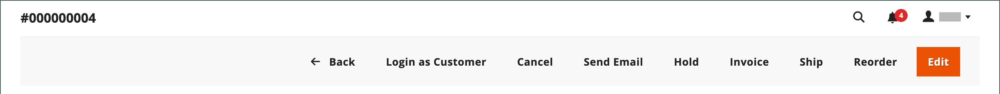
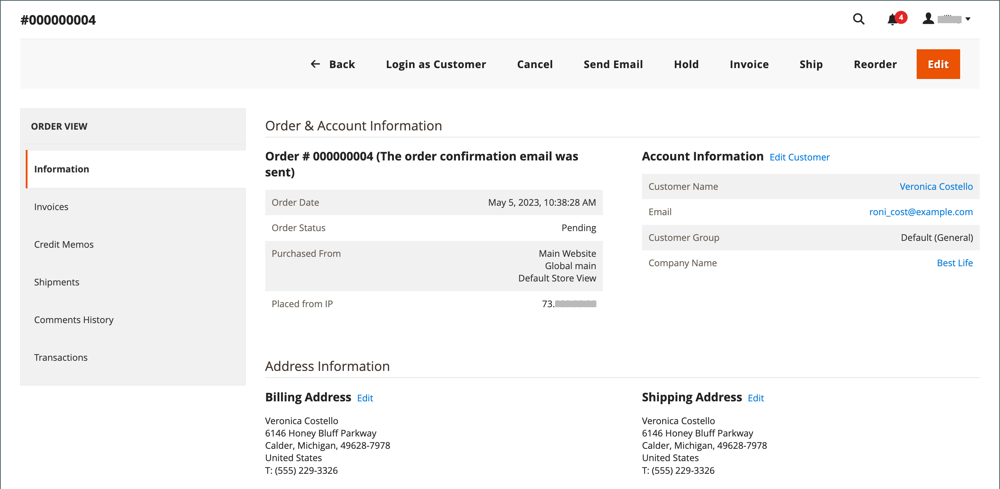

# Mettre à jour une commande

Lorsque vous aidez un client qui a passé une commande, vous devez déterminer le statut de la commande. Les options disponibles pour un ordre de `Pending` sont différentes de celles d’un ordre de `Processing`. Pour plus d’informations, voir [Traitement d’une commande](order-processing.md).

## Commandes en attente

Une fois qu’un client a passé une commande, mais avant la réception du paiement, la commande a le statut `Pending`. Vous pouvez modifier la commande, la mettre en attente ou l’annuler entièrement. La barre de boutons d’une commande en attente répertorie les actions disponibles pour une commande.

{width="600" zoomable="yes"}

Si vous modifiez des parties importantes d’une commande, la commande d’origine est annulée et une nouvelle commande est générée. Vous pouvez toutefois modifier l&#39;adresse de facturation ou d&#39;expédition sans générer de nouvelle commande.

| Bouton | Description |
|--- |--- |
| **[!UICONTROL Back]** | Retourne à la page Commandes sans enregistrer les modifications. |
| **[!UICONTROL Login as Customer]** | Permet à un utilisateur administrateur d’aider les clients avec leurs commandes. |
| **[!UICONTROL Cancel]** | Annule la commande en attente. |
| **[!UICONTROL Send Email]** | Envoie un e-mail sur la commande en attente au client. |
| **[!UICONTROL Hold]** / **[!UICONTROL Unhold]** | Modifie le statut de la commande en attente en `On Hold`. Pour lever le blocage, choisissez _[!UICONTROL Unhold]_. |
| **[!UICONTROL Invoice]** | Crée une [facture](invoices.md#create-an-invoice) à partir de la commande en attente en la convertissant en facture et en modifiant le statut de la commande sur `processing`. |
| **[!UICONTROL Ship]** | Crée un enregistrement [ expédition ](shipments.md#create-a-shipment) pour la commande. |
| **[!UICONTROL Reorder]** | Crée un nouvel ordre en attente qui est un doublon de l&#39;ordre en attente actuel. |
| **[!UICONTROL Edit]** | Ouvre une commande en attente en mode d&#39;édition. Le bouton Modifier est uniquement disponible pour les commandes en attente ou pour les commandes basées sur des [devis](../b2b/quotes.md) négociés. |

{style="table-layout:auto"}

## Ordres de traitement

Une commande passe à l’état `Processing` lorsque :

* Le paiement d&#39;une commande est reçu/capturé et la facture est générée, lorsque l&#39;action de paiement est définie sur `Authorize and Capture`.
* Une transaction de commande est autorisée, mais le paiement n&#39;est pas encore capturé, lorsque l&#39;action de paiement est définie sur `Authorize`.

La [configuration des actions de paiement](../configuration-reference/sales/payment-methods.md#payment-actions) détermine les actions de commande disponibles une fois la commande créée.

Vous ne pouvez pas modifier de manière substantielle une commande `Processing`, mais vous pouvez modifier l’adresse de facturation et d’expédition.

{width="600" zoomable="yes"}

>[!NOTE]
>
>Lorsque l&#39;action de paiement du mode de paiement est définie sur `Authorize and Capture`, une facture est automatiquement créée lorsque le client passe une commande. Dans ce cas, vous pouvez rembourser des fonds à l&#39;aide d&#39;un [avoir](credit-memo-create.md), mais vous ne pouvez pas [annuler](#cancel-a-pending-order) ni [annuler](#void-a-processing-order) la commande.

| Bouton | Description |
|--- |--- |
| **[!UICONTROL Back]** | Retourne à la page Commandes sans enregistrer les modifications. |
| **[!UICONTROL Send Email]** | Envoie un e-mail sur la commande au client. |
| **[!UICONTROL Void]** | [Annulation](#void-a-processing-order) d&#39;une transaction de commande ou d&#39;une transaction de commande partielle. |
| **[!UICONTROL Credit Memo]** | Lance le processus de création d&#39;un [avoir](credit-memo-create.md). |
| **[!UICONTROL Hold]** / **[!UICONTROL Unhold]** | Modifie le statut de la commande client en `On Hold`. Pour lever le blocage de la commande client, choisissez _[!UICONTROL Unhold]_. |
| **[!UICONTROL Reorder]** | Crée une nouvelle commande en attente à partir de la commande actuelle. |
| **[!UICONTROL Create Returns]** |  (Adobe Commerce uniquement) Lance le processus de [retour](returns.md) d’un ou de plusieurs articles de la commande. |

{style="table-layout:auto"}

## Annuler un ordre de traitement

Lorsqu’une commande est toujours dans un statut `Processing` et que l’intégration de paiement est définie sur `Authorize` (et non `Authorize and Capture`), vous pouvez uniquement annuler une transaction ou annuler une commande. [Annuler une commande](#cancel-a-pending-order) annule également l&#39;autorisation.

Lorsqu&#39;une commande est passée à l&#39;aide d&#39;un mode de paiement avec l&#39;action de paiement définie sur `Authorize and Capture`, vous pouvez rembourser les fonds via un avoir, mais vous ne pouvez pas l&#39;annuler car elle est facturée et le paiement est capturé.

Votre mode de paiement détermine les actions de paiement disponibles. Voir [Actions de paiement](../configuration-reference/sales/payment-methods.md#payment-actions) pour plus d’informations.

**_Pour annuler une commande:_**

1. Dans la barre latérale _Admin_, accédez à **[!UICONTROL Sales]** > _[!UICONTROL Operations]_>**[!UICONTROL Orders]**.

1. Dans la colonne **[!UICONTROL Action]** de l’ordre d’édition, cliquez sur **[!UICONTROL View]**.

1. Cliquez sur **[!UICONTROL Void]** pour annuler la commande.

1. À l’invite, cliquez sur **[!UICONTROL OK]** pour annuler la commande.

Vous pouvez émettre les remboursements nécessaires à l&#39;aide d&#39;un [avoir](credit-memo-create.md) une fois les fonds saisis. Vous pouvez également créer une [autorisation de retour de marchandises (RMA)](returns.md) émise pour les retours de produits. Pour en savoir plus, voir [Traitement d’une commande](order-processing.md).

## Modification d’une commande en attente

1. Dans la barre latérale _Admin_, accédez à **[!UICONTROL Sales]** > _[!UICONTROL Operations]_>**[!UICONTROL Orders]**.

1. Dans la colonne **[!UICONTROL Action]** de l’ordre d’édition, cliquez sur **[!UICONTROL View]**.

1. Cliquez sur **[!UICONTROL Edit]**.

   {width="600" zoomable="yes"}

1. À l’invite, cliquez sur **[!UICONTROL OK]** pour continuer la modification.

1. Mettez à jour la commande si nécessaire.

1. Appliquez vos modifications :
   * Pour enregistrer les modifications apportées à l’adresse de facturation ou d’expédition, cliquez sur **[!UICONTROL Save]**.
   * Pour enregistrer les modifications apportées aux éléments de ligne et retraiter la commande, cliquez sur **[!UICONTROL Submit Order]**.

## Mettre une commande en attente

Si le mode de paiement préféré du client n&#39;est pas disponible ou si l&#39;article est temporairement en rupture de stock, vous pouvez mettre la commande en attente.

1. Dans la grille _Commandes_, recherchez la commande `Pending` que vous souhaitez mettre en attente.

1. Dans la colonne _Action_, cliquez sur **[!UICONTROL View]**.

1. Cliquez sur **[!UICONTROL Hold]** pour mettre la commande en attente.

Pour supprimer le blocage d’une commande, modifiez à nouveau la commande et cliquez sur **[!UICONTROL Unhold]**.

## Annuler une commande en attente

L’annulation d’une commande change son statut de `Pending` à `Canceled`.

1. Dans la grille de _[!UICONTROL Orders]_, recherchez la commande en attente à annuler.

1. Dans la colonne _[!UICONTROL Action]_, cliquez sur **[!UICONTROL View]**.

1. Cliquez sur **[!UICONTROL Cancel]** pour annuler la commande.

Le statut de la commande est maintenant `Canceled`.
