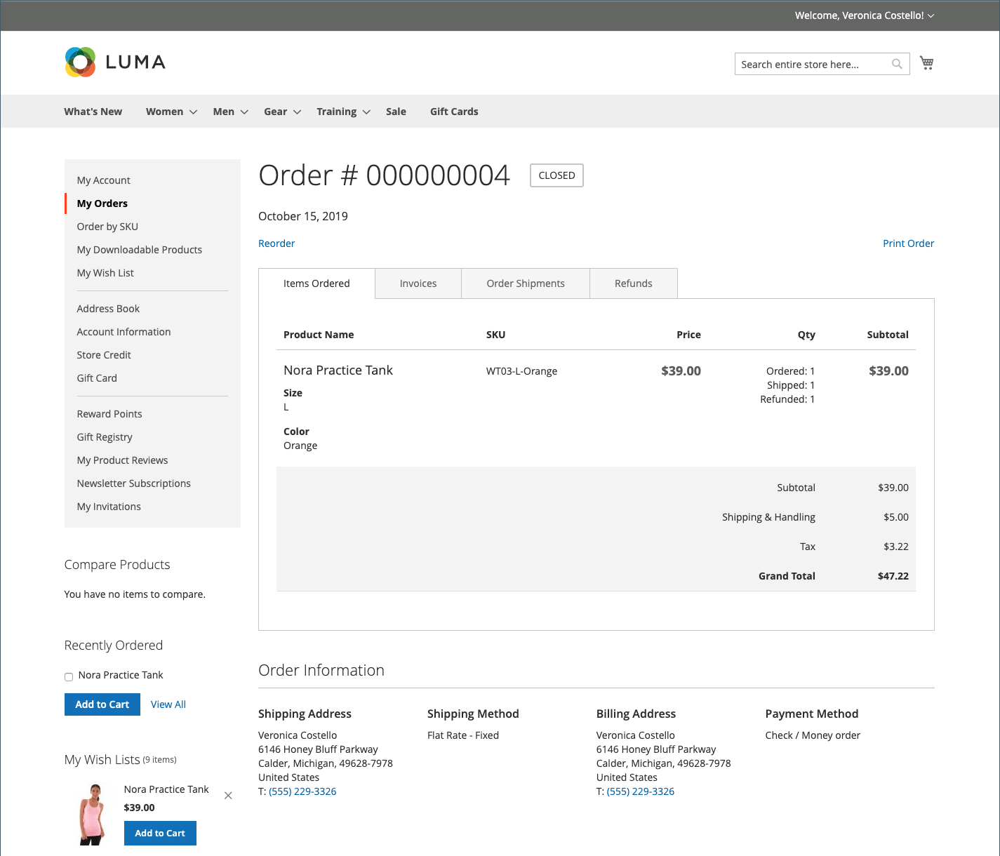
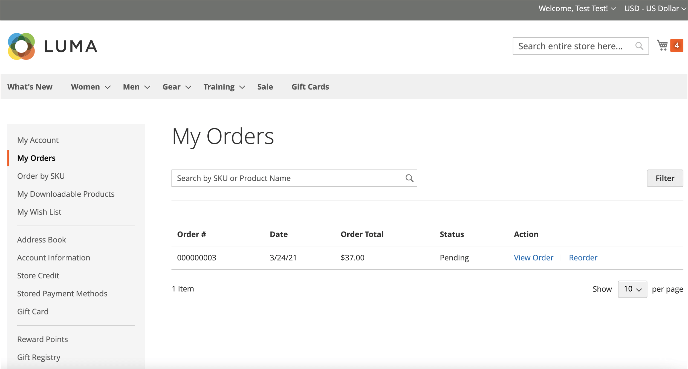
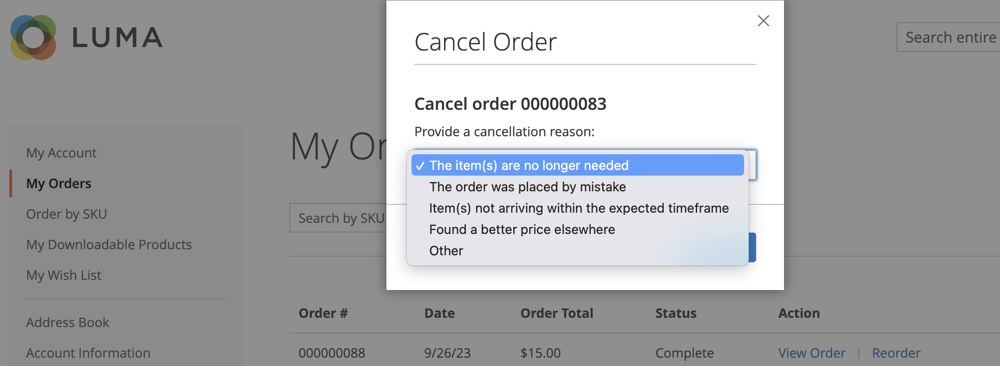

# Gestion des commandes du storefront

Les clients ont accès à toutes leurs commandes depuis leur compte . Les commandes peuvent être affichées, filtrées, suivies et soumises à nouveau en tant que nouvelles commandes. Selon l’état de la commande, les clients peuvent imprimer leurs commandes, factures, envois et enregistrements de remboursement.

## Filtrage des commandes

{{b2b-feature}}

Vos résultats _[!UICONTROL My Orders]_initiaux contiennent également les commandes correspondantes d’utilisateurs subordonnés de tous les sites web de l’instance de commerce. Un client associé à un compte d’entreprise peut filtrer la liste des commandes afin de trouver rapidement des enregistrements dans les résultats. Pour afficher les options de filtre, le client clique sur **[!UICONTROL Filter]**, puis sur **[!UICONTROL Close]**pour masquer les filtres.

{width="700" zoomable="yes"}

| Filtrer | Description |
| ------ | ----------- |
| [!UICONTROL SKU or Product Name] | Entrez un SKU ou un nom de produit. |
| [!UICONTROL Order Number] | Il peut s’agir d’un numéro de commande complet ou partiel. |
| [!UICONTROL Order Status] | Choisit une valeur dans la liste déroulante pour filtrer par état. |
| [!UICONTROL Invoice Number] | Saisissez un numéro de facture complet ou partiel. |
| [!UICONTROL Order Date] | Définit un ou les deux champs de date à filtrer par date de commande. |
| [!UICONTROL Created by] | Filtre les commandes de la société par le créateur de commandes. |
| [!UICONTROL Order Total] | Définit les valeurs min, max ou les deux valeurs à filtrer par total de commande. |

## Afficher une commande

Un client trouve la commande dans la liste et clique sur **[!UICONTROL View Order]**. Dans l’ordre d’ouverture, ils peuvent effectuer l’une des opérations suivantes :

{width="700" zoomable="yes"}

### Afficher les produits récemment commandés

Le bloc **[!UICONTROL Recent Orders]** s’affiche dans la barre latérale et sur la page **[!UICONTROL My Account]** pour les clients connectés après avoir passé une commande. Il affiche cinq produits du dernier achat.

Le client peut lire les produits dans le panier en sélectionnant les produits et en cliquant sur **[!UICONTROL Add to Cart]**. Ils peuvent également afficher la dernière commande en cliquant sur **[!UICONTROL View all]**, qui redirige vers la page _[!UICONTROL My Account]_et le bloc **[!UICONTROL Recent Orders]**.

### Ordre d’impression

1. Le client clique sur **[!UICONTROL Print Order]**.

1. Suivez les instructions de la boîte de dialogue Imprimer pour terminer l’impression.

### Imprimer les factures

1. Sur l’onglet **[!UICONTROL Invoices]**, le client clique sur l’un des éléments suivants :

   - **[!UICONTROL Print All Invoices]**

   - **[!UICONTROL Print Invoice]**

   {width="700" zoomable="yes"}

1. Utilise la boîte de dialogue Imprimer pour terminer l’impression.

### Imprimer les envois

1. Sur l’onglet **[!UICONTROL Order Shipments]**, le client clique sur l’un des éléments suivants :

   - **[!UICONTROL Print All Shipments]**

   - **[!UICONTROL Print Shipment]**

   {width="700" zoomable="yes"}

1. Utilise la boîte de dialogue Imprimer pour terminer l’impression.

### Tracker une diffusion

1. Sur l’onglet **[!UICONTROL Order Shipments]**, cliquez sur **[!UICONTROL Track this Shipment]**.

   Toutes les informations de suivi disponibles s’affichent dans une fenêtre contextuelle.

1. Une fois prêt, le client clique sur **[!UICONTROL Close Window]**.

### Rôles d’impression

1. Sur l’onglet **Remboursements**, le client clique sur l’un des éléments suivants :

   - **Imprimer tous les remboursements**

   - **Imprimer le remboursement**

   {width="700" zoomable="yes"}

1. Utilise la boîte de dialogue Imprimer pour terminer l’impression.

Les réordres sont disponibles pour les clients lorsque l’option de configuration [_Autoriser la réorganisation_](reorders-allow.md) est activée.

Un client peut lancer la fonctionnalité de réorganisation d’une commande spécifique à partir de deux pages :

- Ma page Commandes
- Page Afficher la commande

## Révisions

Le lien _[!UICONTROL Reorder]_s&#39;affiche dans la liste avec les commandes à proximité du lien_[!UICONTROL View]_.

{width="700" zoomable="yes"}

**Cas 1.** Tous les produits de la commande peuvent être réorganisés.

Le client est redirigé vers le panier et tous les produits sont ajoutés au panier.

**Cas 2.** Certains/tous les produits de la commande ne peuvent pas être réorganisés.

>[!NOTE]
>
>Il est possible de réorganiser des produits `Not Visible Individually`.

Le lien _[!UICONTROL Reorder]_n&#39;apparaît pas sur les pages_[!UICONTROL My Orders]_ et _[!UICONTROL View Order]_.

{width="700" zoomable="yes"}

>[!TIP]
>
>Si le panier n’est pas vide et que le client clique sur **[!UICONTROL Reorder]** (à partir de la page [!UICONTROL My Orders] ou [!UICONTROL Order View]), les produits existants restent dans le panier avec les produits de réorganisation ajoutés.

## Annuler les commandes

Annuler est disponible pour les clients lorsque l’option de configuration [_Autoriser l’annulation_](cancel-allow.md) est activée.

Un client peut lancer la fonctionnalité d’annulation d’une commande spécifique à partir de trois pages :

- Ma page Commandes
- Page Afficher la commande
- Page Mon compte

Le lien _[!UICONTROL Cancel Order]_s’affiche près du lien_[!UICONTROL Reorder]_. Si la commande ne peut pas être annulée, le lien ne s’affiche pas.

{width="700" zoomable="yes"}

Pour annuler, le client :

1. Clics **[!UICONTROL Cancel Order]**

1. Fournit un motif d’annulation

   {width="700" zoomable="yes"}

   Vous pouvez personnaliser les raisons de l’annulation sur la page [_Autoriser l’annulation_](cancel-allow.md).

1. Clics **[!UICONTROL Confirm]**

   {width="700" zoomable="yes"}

   Après l’annulation, les commandes ayant eu l’état _[!UICONTROL Pending]_, le statut_[!UICONTROL Canceled]_, les commandes ayant eu l’état _[!UICONTROL Processing]_, le statut_[!UICONTROL Closed]_ et un remboursement seront traités.

   Une fois l’annulation terminée, un email est envoyé au client.

   {width="700" zoomable="yes"}

   Les informations d&#39;annulation sont ajoutées à l&#39;historique des commandes du client. Il apparaît dans les notes de l’ordre et dans l’onglet Historique des commentaires.

   {width="700" zoomable="yes"}

   {width="700" zoomable="yes"}

   Si, pour une raison quelconque, la commande a été remplacée par un état qui ne peut pas être annulé et que le client n’a pas actualisé la page, le lien d’annulation de la commande apparaît toujours. Cependant, lorsqu’ils tentent d’annuler, un message d’erreur s’affiche.

   {width="700" zoomable="yes"}

   Après avoir actualisé la page, vous pouvez constater que la commande était déjà terminée, ce qui explique pourquoi l’annulation n’a pas fonctionné.

   {width="700" zoomable="yes"}
