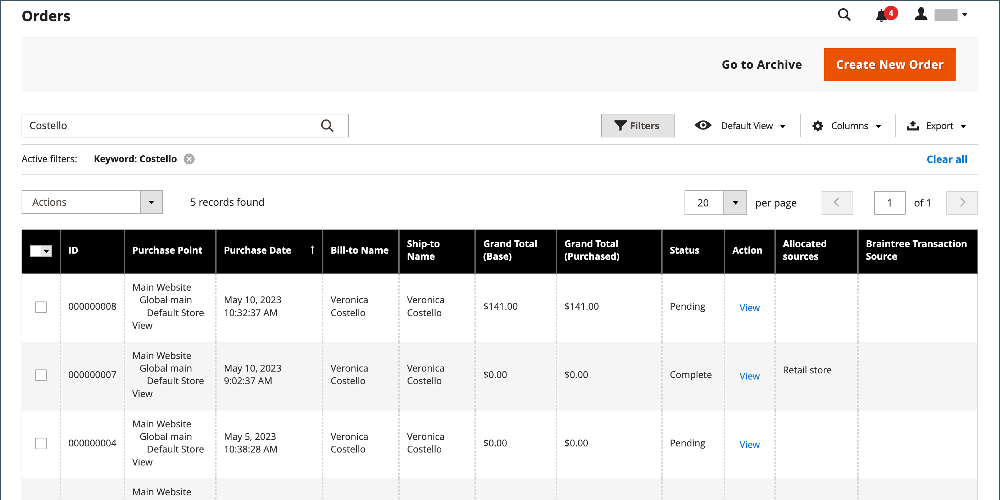

# Commandes

La variable _Commandes_ grid répertorie toutes les commandes en cours et suit leur progression et [état de la commande](order-status.md) par le biais du [workflow](order-processing.md). Un moyen facile de comprendre le processus de base est qu’une commande devient une [facture](invoices.md), et une facture devient [envoi](shipments.md). La grille représente la première étape du processus et est l’endroit où vous pouvez [update](order-update.md) commandes existantes et créer des commandes.

En règle générale, les commandes sont créées lorsque les clients terminent le processus de passage en caisse à partir du storefront. Cependant, si un client a besoin d’aide, vous pouvez également accéder à [panier](shopping-assisted-cart-manage.md) ou [création d’une commande](customer-account-create-order.md) soit à partir de _Commandes_ ou directement à partir de leur compte client.

## Espace de travail des commandes

L’espace de travail Commandes répertorie toutes les commandes en cours et vous permet de modifier les commandes existantes. [create](customer-account-create-order.md) commandes. Chaque ligne de la grille représente une commande client et chaque colonne représente un attribut, ou un champ de données. Utilisez la méthode standard [contrôles](../getting-started/admin-grid-controls.md) pour trier et filtrer la liste, rechercher des commandes et appliquer des [actions](../getting-started/admin-actions-control.md) aux commandes sélectionnées. Utilisez les onglets situés au-dessus des commandes de pagination pour filtrer la liste, modifier la vue par défaut, modifier et réorganiser les colonnes et exporter les données.

{width="700" zoomable="yes"}

### Grille

La sélection des colonnes et leur ordre dans la grille peuvent être modifiés selon vos préférences. La nouvelle mise en page peut être enregistrée en tant que grille. _view_. Par défaut, seules neuf des 20 colonnes disponibles sont incluses dans la grille.

{width="600" zoomable="yes"}

#### Modifier la sélection de colonnes

Dans le coin supérieur droit, cliquez sur le bouton _Colonnes_ (  ) contrôlent et effectuent les opérations suivantes :

- Cochez la case d’une colonne que vous souhaitez ajouter à la grille.
- Décochez la case de toute colonne que vous souhaitez supprimer de la grille.

#### Réinitialiser la sélection des colonnes

1. Cliquez sur le bouton _Colonnes_ (  ).

1. Pour réinitialiser les colonnes de la grille, cliquez sur **[!UICONTROL Reset]**.

   La mise en page de la grille s’affiche uniquement [colonnes par défaut](#column-descriptions).

#### Déplacer une colonne

1. Cliquez sur l’en-tête de la colonne et maintenez-le enfoncé.

1. Faites glisser la colonne vers la nouvelle position et la nouvelle version.

#### Enregistrer une vue de grille

1. Cliquez sur le bouton **[!UICONTROL View]** (  ).

1. Cliquez sur **[!UICONTROL Save Current View]**.

1. Saisissez un **[!UICONTROL name]** pour la vue.

1. Pour enregistrer toutes les modifications, cliquez sur la flèche (  ).

   Le nom de la vue s’affiche désormais sous la forme de la vue actuelle.

#### Modification de la vue

Cliquez sur le bouton **[!UICONTROL View]** (  ). Ensuite, effectuez l’une des opérations suivantes :

- Pour utiliser une autre vue, cliquez sur le nom de la vue.

- Pour modifier le nom d’une vue, cliquez sur le bouton _Modifier_ (  ) et mettez à jour le nom.

### Contrôles Workspace

| Contrôle | Description |
|--- |--- |
| [!UICONTROL Create New Order] | Crée une commande. Voir [Création d’une commande](customer-account-create-order.md) pour plus d’informations. |
| [!UICONTROL Go to Archive] | Affiche la liste des commandes archivées. |
| [!UICONTROL Search] | Lance une recherche de commandes en fonction des filtres actuels. |
| [!UICONTROL Filters] | Définit un ensemble de paramètres de recherche utilisés pour filtrer les enregistrements qui apparaissent dans la grille. |
| [!UICONTROL Default View] | Détermine la disposition des colonnes par défaut de la grille. |
| [!UICONTROL Columns] | Détermine la sélection des colonnes et leur ordre dans la grille. La mise en page des colonnes peut être modifiée et enregistrée en tant que _view_. Par défaut, seules certaines colonnes sont incluses dans la grille. |
| [!UICONTROL Export] | Exporte les enregistrements sélectionnés au format CSV ou XML Excel. |

{style="table-layout:auto"}

### Actions

Pour appliquer une action à des commandes spécifiques, cochez la case dans la première colonne de chaque commande. Pour sélectionner ou désélectionner toutes les commandes, utilisez le contrôle en haut de la colonne.

{width="600" zoomable="yes"}

| Contrôle | Description |
|--- |--- |
| [!UICONTROL Actions] | Répertorie toutes les actions qui peuvent être appliquées aux commandes sélectionnées. Pour appliquer une action à une commande ou à un groupe de commandes, cochez la case dans la première colonne de chaque commande.  Actions de commande : `Cancel` / `Hold` / `Unhold` / `Print Invoices` / `Print Packing Slips` / `Print Credit Memos` / `Print All` / `Print Shipping Labels` / `Move to Archive`  (Adobe Commerce uniquement) |
| [!UICONTROL Mass Actions] | Peut être utilisé pour sélectionner plusieurs enregistrements comme cible d’action. Cochez la case dans la première colonne de chaque enregistrement soumis à l’action. Options : `Select All` / `Unselect All` / `Select Visible` / `Unselect Visible` |
| [!UICONTROL Submit] | Applique l’action en cours aux enregistrements de commande sélectionnés. |
| [!UICONTROL Edit] | Ouvre l’ordre en mode d’édition. |

{style="table-layout:auto"}

### Descriptions des colonnes

| Colonne | Description |
|--- |--- |
| [!UICONTROL Select] | Cochez les cases pour que les guillemets soient soumis à une action ou utilisez le contrôle de sélection dans l’en-tête de colonne. Options : Tout sélectionner/Tout désélectionner |
| [!UICONTROL ID] | Numéro séquentiel unique attribué lorsqu’une nouvelle commande est enregistrée pour la première fois. |
| [!UICONTROL Purchase Point] | Identifie la vue du magasin où la commande a été passée. |
| [!UICONTROL Purchase Date] | Date et heure auxquelles la commande a été passée. Il est toujours affiché en fonction du fuseau horaire par défaut. |
| [!UICONTROL Bill-to Name] | Nom de la personne chargée de payer la commande. |
| [!UICONTROL Ship-to Name] | Nom de la personne à qui la commande doit être expédiée. |
| [!UICONTROL Grand Total (Base)] | Total général de la commande. |
| [!UICONTROL Grand Total (Purchased)] | Total général des produits achetés dans la commande. |
| [!UICONTROL Status] | État actuel de la commande. |
| [!UICONTROL Action] | _[!UICONTROL View]_ouvre l’ordre en mode d’édition. |
| [!UICONTROL Allocated sources] | Les sources allouées à cet ordre spécifique. |

{style="table-layout:auto"}

Colonnes supplémentaires disponibles :

| Colonne | Description |
|--- |--- |
| [!UICONTROL Billing Address] | Adresse de facturation du client qui a passé la commande. |
| [!UICONTROL Shipping Address] | Adresse à laquelle la commande doit être expédiée. |
| [!UICONTROL Shipping Information] | Méthode à utiliser pour envoyer la commande. |
| [!UICONTROL Customer Email] | Adresse électronique de la personne qui a passé la commande. |
| [!UICONTROL Customer Group] | Groupe de clients auquel la personne qui a passé la commande est affectée. |
| [!UICONTROL Subtotal] | Sous-total de la commande, sans frais d’expédition et de gestion, ni taxes. |
| [!UICONTROL Shipping and Handling] | Montant imputé à l’expédition et à la manipulation. |
| [!UICONTROL Customer Name] | Prénom et nom du client qui a passé la commande. |
| [!UICONTROL Payment Method] | Mode de paiement à utiliser pour la commande. |
| [!UICONTROL Total Refunded] | Tout montant de la commande qui doit être remboursé au client. |
| [!UICONTROL Refunded to Store Credit] |  (Adobe Commerce uniquement) Tout montant de la commande qui doit être remboursé au crédit de magasin du client. |
| [!UICONTROL Company Name] |  (Disponible avec B2B pour Adobe Commerce) Nom de la variable [société](../b2b/account-companies.md) qui a passé la commande. |

{style="table-layout:auto"}

## Recherche de commande

La zone de recherche située en haut à gauche de la grille Commandes permet de rechercher des commandes spécifiques par mot-clé ou de filtrer les enregistrements de commande de la grille.

{width="600" zoomable="yes"}

### Rechercher une correspondance

1. Saisissez un terme de recherche dans la zone de recherche de page.

1. Pour afficher les résultats, cliquez sur _Rechercher_ (  ).

### Filtrage de la recherche

1. Pour afficher la sélection des filtres de recherche, cliquez sur le bouton _Filtres_ (  ).

   {width="600" zoomable="yes"}

1. Complétez autant de filtres que vous souhaitez décrire les commandes que vous souhaitez trouver.

1. Cliquez sur **[!UICONTROL Apply Filters]** pour afficher les résultats.

### Filtres de recherche

| Filtrer | Description |
|--- |--- |
| [!UICONTROL Purchase Date] | Filtre la recherche en fonction de la date d’achat. Pour rechercher des commandes dans une plage de dates, saisissez la variable **[!UICONTROL from]** et **[!UICONTROL to]** dates. |
| [!UICONTROL ID] | Filtre la recherche en fonction de l’identifiant de commande. |
| [!UICONTROL Grand Total (Base)] | Filtre la recherche en fonction du total général de chaque commande, qui inclut tous les crédits appliqués à la commande. |
| [!UICONTROL Grand Total (Purchased)] | Filtre la recherche en fonction du total général des articles achetés dans chaque commande. |
| [!UICONTROL Bill-to Name] | Filtre la recherche en fonction du nom de la personne chargée de payer la commande. |
| [!UICONTROL Ship-to Name] | Filtre la recherche en fonction du nom de la personne à qui chaque commande est envoyée. |
| [!UICONTROL Purchase Point] | Filtre la recherche par site web, magasin ou vue de magasin où la commande a été passée. |
| [!UICONTROL Status] | Filtre la recherche en fonction de l’état de la commande. Options : `Canceled` / `Closed` / `Complete` / `Suspected Fraud` / `On Hold` / `Payment Review` / `PayPal Canceled Reversal` /` PayPal Reversed` /` Pending` / `Pending Payment` / `Pending PayPal` / `Processing` |
| [!UICONTROL Braintree Transaction Source] | Filtre la recherche en fonction de la source de la transaction. |

{style="table-layout:auto"}

### Outils de recherche

| Outil | Description |
|--- |--- |
| [!UICONTROL Apply Filters] | Applique tous les filtres aux résultats de la recherche. |
| [!UICONTROL Cancel] | Annule la recherche en cours. |
| [!UICONTROL Clear All] | Efface tous les filtres de recherche. |

{style="table-layout:auto"}

## Ressources de dépannage

Pour obtenir de l’aide sur la résolution des problèmes de commande, reportez-vous aux articles suivants de la base de connaissances de l’assistance clientèle de Commerce :

- [Erreur d&#39;affichage des commandes](https://experienceleague.adobe.com/docs/commerce-knowledge-base/kb/troubleshooting/storefront/magento-2.4.0-known-issue-orders-display-error.html)
- [Erreur 10415 des commandes en double PayPal](https://experienceleague.adobe.com/docs/commerce-knowledge-base/kb/support-tools/patches/v1-0-6/mdva-31006-magento-patch-paypal-duplicate-orders-10415-error.html)
- [Les nouvelles commandes sont envoyées dans l’archive](https://experienceleague.adobe.com/docs/commerce-knowledge-base/kb/troubleshooting/known-issues-patches-attached/new-orders-are-sent-to-archive.html)
- [Commandes non affichées dans la grille Commandes de l’Admin](https://experienceleague.adobe.com/docs/commerce-knowledge-base/kb/troubleshooting/known-issues-patches-attached/orders-not-displayed-in-the-orders-grid-in-the-admin.html)
- [État de la commande : envoi incorrect créé via l’API REST](https://experienceleague.adobe.com/docs/commerce-knowledge-base/kb/support-tools/patches/v1-0-7/mdva-30972-magento-patch-order-status-incorrect-shipment-created-via-rest-api.html)
