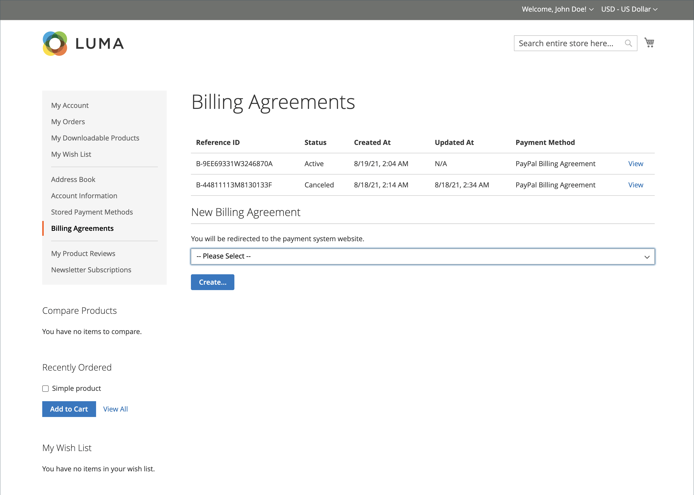

# Contrats de facturation PayPal

Pour simplifier le processus de passage en caisse, les clients peuvent conclure un accord de facturation avec PayPal comme fournisseur de services de paiement. Lors du passage en caisse, le client choisit le contrat de facturation comme mode de paiement. Le système de paiement vérifie le contrat de facturation par son numéro unique et facture le compte client. Avec un accord de facturation en place, il n’est plus nécessaire pour le client de saisir des informations de paiement pour chaque achat. Les clients peuvent gérer leurs contrats de facturation à partir du tableau de bord de leur compte client, où le statut de chacun s’affiche comme _Actif_ ou _Annulé_. Lorsqu’un accord de facturation est annulé, il ne peut pas être réactivé.

## Workflow du contrat de facturation

1. **Le client s’inscrit à un contrat de facturation**. Une fois qu’un accord de facturation est en place, les accords de facturation supplémentaires ne peuvent être ajoutés qu’à partir du compte client. Le nombre de contrats de facturation qu’un client peut créer n’est pas limité. Les clients peuvent utiliser l’une des méthodes suivantes pour s’inscrire à des contrats de facturation :

   - **S’inscrire à un compte client** - Les clients peuvent s’inscrire à un accord de facturation à partir de leurs comptes clients.
   - **Inscrivez-vous au passage en caisse** - Les clients qui paient pour un achat avec PayPal Express Checkout peuvent cocher une case pour créer un accord de facturation. Bien que le contrat de facturation ne soit pas utilisé pour la commande actuelle, il devient disponible en tant qu&#39;option de mode de paiement la prochaine fois que le client passe une commande.
   - **Inscription par l’administrateur de boutique** - À la demande du client, l’administrateur de boutique peut créer une commande client à l’aide du contrat de facturation du client.

1. **PayPal vérifie et enregistre le contrat**. Lorsque le client passe la commande avec paiement par contrat de facturation, l&#39;identifiant de référence du contrat de facturation et les détails de paiement de la commande client sont transférés à PayPal et enregistrés dans le compte client, avec les informations de référence. Si le paiement est autorisé, une commande est créée dans Commerce. L’ID de référence du contrat de facturation est envoyé au client et au magasin.

## Gérer les accords de facturation

La page _[!UICONTROL Billing Agreements]_répertorie tous les accords de facturation entre votre magasin et ses clients. Les commerçants peuvent filtrer les enregistrements en fonction du client ou des informations sur l’accord de facturation, y compris l’identifiant de référence de l’accord de facturation, le statut et la date de création. Chaque enregistrement contient des informations générales sur le contrat de facturation et toutes les commandes client qui l&#39;ont utilisé comme mode de paiement. Vous pouvez afficher, annuler ou supprimer des contrats de facturation client. Un contrat de facturation annulé ne peut être supprimé que par l’administrateur du magasin.

### Afficher un accord de facturation

1. Dans la barre latérale _Admin_, accédez à **[!UICONTROL Sales]** > _[!UICONTROL Operations]_>**[!UICONTROL Billing Agreements]**.

1. Recherchez le contrat de facturation dans la liste et cliquez pour l’ouvrir.

Chaque page de contrat de facturation se compose de deux onglets : _[!UICONTROL General Information]_et_[!UICONTROL Related Orders]_.

#### Informations générales

Cet onglet contient des informations générales sur le contrat de facturation :

- [!UICONTROL Reference ID] : identifiant numérique unique attribué au contrat de facturation en cours.
- [!UICONTROL Customer] : compte du client affecté au contrat de facturation actuel.
- [!UICONTROL Status] : statut du contrat de paiement.
- [!UICONTROL Created At] : Date de création.
- [!UICONTROL Updated At] : date de mise à jour.

{width="600" zoomable="yes"}

#### Commandes connexes

Cet onglet affiche la liste des commandes passées à l&#39;aide du contrat de facturation actuel.

{width="600" zoomable="yes"}

### Annuler un contrat de facturation

1. Dans la barre latérale _Admin_, accédez à **[!UICONTROL Sales]** > _[!UICONTROL Operations]_>**[!UICONTROL Billing Agreements]**.

1. Recherchez le contrat de facturation dans la liste et cliquez pour l’ouvrir.

1. Dans le coin supérieur droit, cliquez sur **[!UICONTROL Cancel]**.

1. Pour confirmer l’action, cliquez sur **[!UICONTROL OK]**.

### Supprimer un accord de facturation

1. Dans la barre latérale _Admin_, accédez à **[!UICONTROL Sales]** > _[!UICONTROL Operations]_>**[!UICONTROL Billing Agreements]**.

1. Recherchez le contrat de facturation dans la liste et cliquez pour l’ouvrir.

1. Dans le coin supérieur droit, cliquez sur **[!UICONTROL Delete]**.

1. Pour confirmer l’action, cliquez sur **[!UICONTROL OK]**.

### Descriptions des colonnes

| Colonne | Description |
|--- |--- |
| [!UICONTROL ID] | Identifiant numérique unique attribué à chaque accord de facturation |
| [!UICONTROL Email] | E-mail du contact d’un client |
| [!UICONTROL First Name] | Prénom d&#39;un client |
| [!UICONTROL Last Name] | Nom de famille d’un client |
| [!UICONTROL Reference ID] | Identifiant de référence numérique unique attribué à chaque accord de facturation |
| [!UICONTROL Status] | Statut du contrat de paiement. Options : `Active` ou `Canceled` |
| [!UICONTROL Created] | Date de création |
| [!UICONTROL Updated] | Date de mise à jour |

{style="table-layout:auto"}

## Expérience Storefront

Les clients qui concluent un accord de facturation avec un fournisseur de services de paiement peuvent effectuer des achats maintenant et les payer plus tard, conformément à l&#39;accord. Le

{width="700" zoomable="yes"}

| Colonne | Description |
|--- |--- |
| [!UICONTROL Reference ID] | Identifiant de référence numérique unique attribué à chaque accord de facturation |
| [!UICONTROL Status] | Statut du contrat de paiement. Options : `Active` ou `Canceled` |
| [!UICONTROL Created At] | Date de création |
| [!UICONTROL Updated At] | Date de mise à jour |
| [!UICONTROL Payment Method] | Prestataire de paiement d&#39;un contrat de facturation |
| [!UICONTROL View] | Bouton utilisé pour afficher les accords de facturation |

{style="table-layout:auto"}

### Créer un accord de facturation

1. Dans le tableau de bord de son compte, le client sélectionne **[!UICONTROL Billing Agreements]**.

1. Sous **[!UICONTROL New Billing Agreement]**, sélectionne un fournisseur de paiement.

1. Cliquez sur **[!UICONTROL Create]**.

Cette action redirige le client vers le site Web du système de paiement.

{width="700" zoomable="yes"}

### Afficher un accord de facturation

1. Dans le tableau de bord de son compte, le client sélectionne **[!UICONTROL Billing Agreements]**.

1. Sélectionne le contrat de facturation et clique sur **[!UICONTROL View]**.

{width="700" zoomable="yes"}

### Annuler un contrat de facturation

1. Dans le tableau de bord de son compte, le client sélectionne **[!UICONTROL Billing Agreements]**.

1. Sélectionne le contrat de facturation et clique sur **[!UICONTROL View]**.

1. Dans le coin supérieur droit, cliquez sur **[!UICONTROL Cancel]** puis sur **[!UICONTROL OK]** pour confirmer.

>[!NOTE]
>
>Si un utilisateur administrateur (commerçant) annule le contrat de facturation, il ne peut pas être annulé sur le storefront. Le statut _Annulé_ s&#39;affiche pour cet accord.
