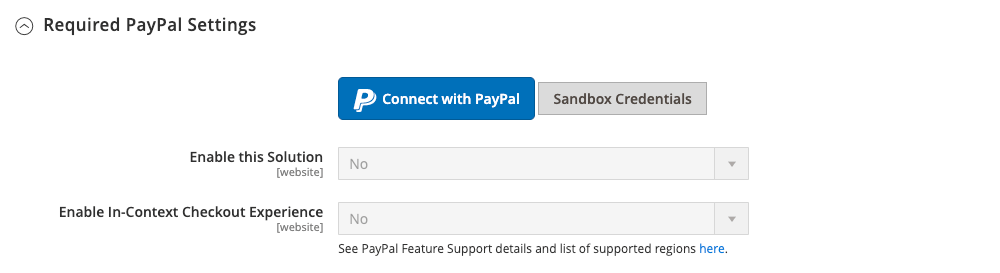

# Passage en caisse express PayPal

PayPal Express Checkout permet d&#39;augmenter les ventes en permettant à vos clients de payer par carte de crédit ou par la sécurité de leurs comptes personnels PayPal. Pendant le passage en caisse, le client est redirigé vers le site sécurisé PayPal pour renseigner les informations de paiement. Le client est ensuite renvoyé à votre magasin pour terminer le reste du processus de passage en caisse. Si vous sélectionnez l’option Passage en caisse express, le bouton familier PayPal est ajouté à votre boutique, ce qui a été signalé pour augmenter les ventes.

>[!IMPORTANT]
>
>**Exigences de PSD2 :**  
>À compter du 14 septembre 2019, les banques européennes pourraient refuser les paiements qui ne satisfont pas [PSD2](../getting-started/compliance-payment-services-directive.md) conditions requises. Aucune action n’est nécessaire pour que le paiement express PayPal soit conforme au PSD2, car toutes les exigences sont gérées par PayPal.

Les clients disposant de comptes PayPal en cours peuvent effectuer un achat en une seule étape en cliquant sur le bouton _[!UICONTROL Check out with PayPal]_bouton . Le passage en caisse express peut être utilisé comme une solution autonome ou avec l’une des solutions tout-en-un de PayPal. Si vous acceptez déjà les cartes de crédit en ligne, vous pouvez proposer le paiement express comme une option supplémentaire pour attirer de nouveaux clients qui préfèrent payer avec PayPal.

>[!NOTE]
>
>PayPal a abandonné la prise en charge de la vente de produits numériques par le biais de PayPal Express Checkout et vous recommande d’utiliser : [PayPal payment Standard](paypal-payments-standard.md) ou une autre passerelle de paiement PayPal pour traiter toute commande incluant [produits virtuels](../catalog/product-create-virtual.md).

## Conditions

- Marchand : [Compte PayPal commercial][1]
- Client : [Compte PayPal personnel][2]

## Processus de passage en caisse express

Contrairement à d’autres méthodes de paiement, le paiement express PayPal permet au client de régler son paiement au début du workflow habituel de passage en caisse à partir de la page du produit, du mini-panier et du panier.

1. **Classement des clients** - Le client clique/appuie sur la balise _[!UICONTROL Check out with PayPal]_bouton .
1. **Le client est redirigé vers le site PayPal** - Le client est redirigé vers le site PayPal pour terminer la transaction.
1. **Le client se connecte à son compte PayPal** - Le client doit se connecter à son compte PayPal pour terminer la transaction. Le système de paiement utilise les informations de facturation et d’expédition de son compte PayPal.
1. **Le client revient à la page de passage en caisse** - Le client est redirigé vers la page de passage en caisse de votre boutique pour passer en revue la commande.
1. **Classement des clients** - Le client place la commande et les informations de commande sont envoyées à PayPal.
1. **PayPal règle la transaction** - PayPal reçoit la commande et règle la transaction.

>[!NOTE]
>
>PayPal Express Checkout ne prend pas en charge les commandes avec plusieurs adresses.

## Passage en caisse dans le contexte

PayPal _Extraction en contexte_ permet de payer plus facilement que jamais en ligne. Les clients ne perdent jamais de vue votre boutique lors de ce passage en caisse simplifié en un ou deux clics. Le passage en caisse dans le contexte fonctionne également bien sur les ordinateurs et les ordinateurs et offre une expérience cohérente sur les ordinateurs de bureau, les tablettes et les appareils mobiles. Pour en savoir plus, voir [Extraction dans le contexte du passage en caisse express][5].

{width="700" zoomable="yes"}

[_Démo de paiement en contexte PayPal_][6]

Lorsque vous configurez votre magasin pour [!DNL PayPal Express Checkout], vous pouvez activer cette option.

## Configuration de votre compte PayPal

Avant de configurer le paiement express PayPal dans l’administrateur Commerce, vous devez configurer votre compte marchand sur le site Web de PayPal.

1. Connectez-vous à votre compte PayPal Advanced à l’adresse [manager.paypal.com][3].

1. Accédez à **[!UICONTROL Service Settings]** > **[!UICONTROL Hosted Checkout Pages]** > **[!UICONTROL Set Up]** et définissez les paramètres suivants :

   - **[!UICONTROL AVS]**: `No`
   - **[!UICONTROL CSC]**: `No`
   - **[!UICONTROL Enable Secure Token]**: `Yes`

1. Cliquez sur **[!UICONTROL Save Changes]**.

1. Configurez un autre utilisateur (recommandé par PayPal) :

   - Accédez à [manager.paypal.com][3] et connectez-vous à votre compte.

   - Pour configurer un autre utilisateur, suivez les instructions.

   - Cliquez sur **[!UICONTROL Update]**.

## Configuration du paiement express PayPal dans Commerce

Vous pouvez activer deux solutions PayPal en même temps : paiement express PayPal, ainsi qu’une solution tout-en-un. Si vous activez une autre solution, celle utilisée précédemment est automatiquement désactivée.

>[!NOTE]
>
>Cliquez sur **[!UICONTROL Save Config]** à tout moment pour enregistrer votre progression.

### Etape 1 : lancer la configuration

1. Sur le _Administration_ barre latérale, accédez à **[!UICONTROL Stores]** > _[!UICONTROL Settings]_>**[!UICONTROL Configuration]**.

1. Dans le panneau de gauche, développez **[!UICONTROL Sales]** et choisissez **[!UICONTROL Payment Methods]**.

1. Si votre installation comporte plusieurs sites web, magasins ou vues, définissez **[!UICONTROL Store View]** à la vue magasin dans laquelle vous souhaitez appliquer cette configuration.

1. Dans le _[!UICONTROL Merchant Location]_, sélectionnez **[!UICONTROL Merchant Country]**où se trouve votre entreprise.

   Ce paramètre détermine la sélection des solutions PayPal qui apparaissent dans la configuration.

   {width="600" zoomable="yes"}

1. Sous _[!UICONTROL Recommended Solutions]_, cliquez sur **[!UICONTROL Configure]**pour **[!UICONTROL PayPal Express Checkout]**.

   {width="600"}

### Étape 2 : activation et connexion de votre compte PayPal

1. Si nécessaire, développez  la valeur **[!UICONTROL Required PayPal Settings]** .

   {width="600" zoomable="yes"}

1. Connectez votre compte à des fins de test ou de production :

   - Pour le mode test (développement), cliquez sur **[!UICONTROL Sandbox Credentials]** et saisissez votre [Environnement de test PayPal][7] informations d’identification.
   - Pour le mode de production, cliquez sur **[!UICONTROL Connect with PayPal]** et saisissez vos informations d’identification de compte de production.

   Une fois votre connexion validée, vous pouvez continuer.

1. Définir **[!UICONTROL Enable this Solution]** to `Yes`.

1. Pour activer [Passage en caisse contextuel de PayPal](#in-context-checkout):

   - Définir **[!UICONTROL Enable In-Context Checkout Experience]** to `Yes`.

   - Entrez votre PayPal **[!UICONTROL Merchant Account ID]**.

     Votre identifiant de compte marchand se trouve dans votre profil de compte commercial PayPal.

>[!NOTE]
>
>[Crédit PayPal](paypal.md#paypal-credit-and-pay-later) est activé par défaut pour cette option de paiement.

### Étape 3 : Remplir les paramètres PayPal requis

1. Si nécessaire, développez  la valeur **[!UICONTROL Express Checkout]** .

   {width="600" zoomable="yes"}

1. (Facultatif) Saisissez la variable **[!UICONTROL Email Associated with PayPal Merchant Account]**.

   >[!IMPORTANT]
   >
   >Les adresses électroniques sont sensibles à la casse. Pour recevoir le paiement, l’adresse électronique que vous saisissez doit correspondre à l’adresse électronique spécifiée dans votre compte marchand PayPal.

   Si vous ne disposez pas d’un compte PayPal, cliquez sur **[!UICONTROL Start accepting payments via PayPal]**.

1. Définir **[!UICONTROL API Authentication Methods]** à l’une des options suivantes :

   - `API Signature` - Cette méthode d’authentification PayPal est la plus facile à mettre en oeuvre. Elle est basée sur votre nom d’utilisateur, votre mot de passe et une chaîne de caractères et de nombres uniques qui identifient votre compte. Les informations d’identification de signature d’API n’expirent pas.
   - `API Certificate` - Cette méthode d’authentification PayPal est plus sécurisée, basée sur votre nom d’utilisateur, votre mot de passe et un certificat téléchargeable. Les informations d’identification API expirent après trois ans et doivent être renouvelées.

   Au besoin, procédez comme suit :

   - **[!UICONTROL API Username]**
   - **[!UICONTROL API Password]**
   - **[!UICONTROL API Signature]**

1. Si vous utilisez des informations d’identification de votre compte sandbox, définissez **[!UICONTROL Sandbox Mode]** to `Yes`.

   Lors du test de la configuration dans un environnement de test, utilisez uniquement [numéros de carte de crédit][4] qui sont recommandés par PayPal. Lorsque vous êtes prêt à passer en production, revenez à la configuration et définissez le mode Sandbox sur . `No` et connectez-vous à votre compte PayPal de production.

1. Si votre système utilise un serveur proxy pour établir la connexion entre Commerce et le système de paiement PayPal, définissez **[!UICONTROL API Uses Proxy]** to `Yes` et procédez comme suit :

   - **[!UICONTROL Proxy Host]**
   - **[!UICONTROL Proxy Port]**

À la fin de cette séquence d’étapes, les paramètres requis de PayPal sont terminés. Vous pouvez continuer avec les paramètres de base et avancés ou cliquer sur **[!UICONTROL Save Config]** et revenir ultérieurement pour ajuster la configuration.

### Étape 4 : configuration du crédit PayPal de publicité/de la publicité PayPal de publicité plus tard (facultatif)

À compter de la version 2.4.3, PayPal PayLater est pris en charge dans les déploiements qui incluent PayPal. Cette fonctionnalité permet aux acheteurs de payer une commande par versements bimensuels au lieu de payer le montant complet au moment de l’achat. L’expérience de crédit PayPal est obsolète.

Définir **[!UICONTROL Enable PayPal PayLater Experience]** à l’une des options suivantes :

- `Yes` - Pour configurer Advertising PayPal PayLater
- `No` - Pour configurer le crédit Advertising PayPal

>[!NOTE]
>
>La variable **[!UICONTROL Enable PayPal PayLater Experience]** ne désactive pas le paramètre [!DNL PayPal PayLater] et ne supprime pas **_[!UICONTROL PayPal PayLater]_** des boutons du storefront. Pour désactiver les deux **_[!UICONTROL PayPal PayLater]_** et **_[!UICONTROL PayPal Credit]_** sur le storefront, vous devez sélectionner la `PayPal Credit` de la variable **[!UICONTROL Disable Funding Options]** paramètre ([!UICONTROL Advanced Settings] under [!UICONTROL Frontend Experience Settings]).

#### Publicité Crédit PayPal

1. Développer  la valeur **[!UICONTROL Advertise PayPal Credit]** .

1. Pour obtenir les informations sur votre compte, cliquez sur **[!UICONTROL Get Publisher ID from PayPal]** et suivez les instructions.

1. Saisissez votre **[!UICONTROL Publisher ID]**.

   {width="600" zoomable="yes"}

1. Développer  la valeur **[!UICONTROL Home Page]** .

1. Pour placer une bannière sur la page, définissez **[!UICONTROL Display]** to `Yes`.

1. Définir **[!UICONTROL Position]** à l’une des options suivantes :

   - `Header (center)`
   - `Sidebar (right)`

1. Définir **[!UICONTROL Size]** à l’une des options suivantes :

   - `190 x 100`
   - `234 x 60`
   - `300 x 50`
   - `468 x 60`
   - `728 x 90`
   - `800 x 66`

   {width="600" zoomable="yes"}

1. Développer  les sections restantes et répétez les étapes précédentes :

   - [!UICONTROL Catalog Category Page]
   - [!UICONTROL Catalog Product Page]
   - [!UICONTROL Checkout Cart Page]

#### Publicité PayPal PayLater

1. Développer  la valeur **[!UICONTROL Advertise PayPal PayLater]** .

1. Définir **[!UICONTROL Enable PayPal PayLater]** to `Yes`.

1. Développer  la valeur **[!UICONTROL Home Page]** .

1. Pour placer une bannière sur la page, définissez **[!UICONTROL Display]** to `Yes`.

1. Définir **[!UICONTROL Position]** à l’une des options suivantes :

   - `Header (center)`
   - `Sidebar`

1. Définir **[!UICONTROL Style Layout]** à l’une des options suivantes :

   - `Text`
   - `Flex`

1. Pour [!UICONTROL Style Layout] **[!UICONTROL Text]** uniquement, défini **[!UICONTROL Logo Type]** à l’une des options suivantes :

   - `Primary`
   - `Alternative`
   - `Inline`
   - `None`

1. Pour [!UICONTROL Style Layout] **[!UICONTROL Text]** uniquement, défini **[!UICONTROL Logo Position]** à l’une des options suivantes :

   - `Left`
   - `Right`
   - `Top`

1. Pour [!UICONTROL Style Layout] **[!UICONTROL Text]** uniquement, défini **[!UICONTROL Text Color]** à l’une des options suivantes :

   - `Black`
   - `White`
   - `Monochrome`
   - `Grayscale`

1. Pour [!UICONTROL Style Layout] **[!UICONTROL Text]** uniquement, défini **[!UICONTROL Text Size]** à l’une des options suivantes :

   - `10px`
   - `11px`
   - `12px`
   - `13px`
   - `14px`
   - `15px`
   - `16px`

1. Pour [!UICONTROL Style Layout] **[!UICONTROL Flex]** uniquement, défini **[!UICONTROL Ratio]** à l’une des options suivantes :

   - `1x1`
   - `1x4`
   - `8x1`
   - `20x1`

1. Pour [!UICONTROL Style Layout] **[!UICONTROL Flex]** uniquement, défini **[!UICONTROL Color]** à l’une des options suivantes :

   - `Blue`
   - `Black`
   - `White`
   - `White No Border`
   - `Gray`
   - `Monochrome`
   - `Grayscale`

   {width="600" zoomable="yes"}

1. Développer  les sections restantes et répétez les étapes précédentes :

   - [!UICONTROL Catalog Product Page]
   - [!UICONTROL Checkout Cart Page]
   - [!UICONTROL Checkout Payment Step]
   - [!UICONTROL Catalog Category Page]

### Étape 5 : définition des paramètres de base

1. Développer  la valeur **[!UICONTROL Basic Settings - PayPal Express Checkout]** .

   {width="600" zoomable="yes"}

1. Pour **[!UICONTROL Title]**, saisissez un titre qui identifie ce mode de paiement lors du passage en caisse.

   Il est recommandé d’utiliser le titre _PayPal_ pour toutes les vues de magasin.

1. Si vous proposez plusieurs modes de paiement, saisissez un nombre pour **[!UICONTROL Sort Order]** pour déterminer la séquence dans laquelle le paiement express PayPal apparaît lorsqu’il est répertorié avec les autres méthodes de paiement.

   Ce nombre est relatif aux autres modes de paiement. (`0` = first, `1` = second, `2` = troisième, etc.)

1. Définir **[!UICONTROL Payment Action]** à l’une des options suivantes :

   - `Authorization` - Valide l&#39;achat et met un frein aux fonds. Le montant n&#39;est pas retiré tant qu&#39;il n&#39;est pas _capturé_ par le marchand.
   - `Sale` - Le montant de l’achat est autorisé et immédiatement retiré du compte du client.
   - `Order` - Le montant de la commande n’est pas capturé ou autorisé dans le solde du client, le compte bancaire ou la carte de crédit de PayPal. L&#39;action Paiement de commande représente un accord entre le système de paiement de PayPal et le marchand. Il permet au commerçant de capturer un ou plusieurs montants jusqu’au total commandé du compte client acheteur, sur une période pouvant aller jusqu’à 29 jours. Une fois les fonds commandés, le marchand peut les capturer à tout moment au cours de la période de 29 jours suivante. La saisie du montant de la commande ne peut être effectuée que par l’administrateur Commerce en créant une ou plusieurs factures.

1. Pour afficher la variable _[!UICONTROL Check out with PayPal]_sur la page produit, définissez **[!UICONTROL Display on Product Details Page]**to `Yes`.

1. Si l’action de paiement est définie sur `Order`, procédez comme suit

   - **[!UICONTROL Authorization Honor Period (days)]** - Détermine la durée de validité de l’autorisation principale. La valeur doit être égale à la valeur correspondante dans votre compte marchand PayPal. La valeur par défaut de votre compte marchand PayPal est `3`. Pour augmenter ce nombre, vous devez contacter PayPal. L’autorisation devient invalide à 23 h 49, heure du Pacifique, des États-Unis, du dernier jour.

   - **[!UICONTROL Order Valid Period (days)]** - Détermine la durée de validité de la commande. Lorsque la commande devient invalide, vous ne pouvez plus créer de factures pour elle. Indiquez la valeur égale à la valeur Période de commande valide dans votre compte marchand PayPal. La valeur par défaut de votre compte marchand PayPal est `29`. Pour modifier ce numéro, vous devez contacter PayPal.

   - **[!UICONTROL Number of Child Authorizations]** - Indique le nombre maximal d’autorisations pour une seule commande, qui détermine le nombre maximal de factures partielles en ligne que vous pouvez créer pour une commande. Cette valeur doit être égale au paramètre correspondant dans votre compte marchand PayPal. Le nombre par défaut d’autorisations enfant dans votre compte PayPal est `1`. Pour augmenter ce nombre, vous devez contacter PayPal.

### Étape 6 : définition des paramètres avancés

1. Développer  la valeur **[!UICONTROL Advanced Settings]** .

   {width="600" zoomable="yes"}

1. Définir **[!UICONTROL Display on Shopping Cart]** to `Yes`.

1. Définir **[!UICONTROL Payment Applicable From]** à l’une des options suivantes :

   - `All Allowed Countries` - Les clients de tous les pays spécifiés dans votre configuration de magasin peuvent utiliser ce mode de paiement.
   - `Specific Countries` - Après avoir choisi cette option, la variable _[!UICONTROL Payment from Specific Countries]_s’affiche. Pour sélectionner plusieurs pays, maintenez la touche Ctrl (PC) ou la touche Commande (Mac) enfoncée, puis cliquez sur chaque élément.

1. Pour écrire des communications avec le système de paiement dans le fichier journal, définissez **[!UICONTROL Debug Mode]** to `Yes`.

   Le fichier journal de PayPal payment Advanced est `_payflow_advanced.log`.

   >[!NOTE]
   >
   >Conformément aux normes de sécurité des données PCI, les informations de carte de crédit ne sont pas enregistrées dans le fichier journal.

1. Pour activer la vérification de l’authentification de l’hôte, définissez **[!UICONTROL Enable SSL Verification]** to `Yes`.

1. Pour afficher un résumé complet de la commande client par article sur le site PayPal, définissez **[!UICONTROL Transfer Cart Line Items]** to `Yes`.

1. Pour inclure jusqu’à dix options d’expédition dans le résumé, définissez **[!UICONTROL Transfer Shipping Options]** to `Yes`. (Cette option s’affiche uniquement si les éléments de ligne sont définis pour le transfert.)

1. Pour déterminer le type d’image utilisé pour le bouton d’acceptation de PayPal, définissez **[!UICONTROL Shortcut Buttons Flavor]** à l’une des options suivantes :

   - `Dynamic` - (Recommandé) Affiche une image qui peut être modifiée dynamiquement à partir du serveur PayPal.
   - `Static` : affiche une image spécifique qui ne peut pas être modifiée dynamiquement.

1. Pour permettre aux clients sans compte PayPal d’effectuer un achat avec cette méthode, définissez **[!UICONTROL Enable PayPal Guest Checkout]** to `Yes`.

1. Définir **[!UICONTROL Require Customer's Billing Address]** à l’une des options suivantes :

   - `Yes` - Nécessite l’adresse de facturation du client pour tous les achats.
   - `No` - Ne nécessite pas l’adresse de facturation du client pour les achats.
   - `For Virtual Quotes Only` - Nécessite l’adresse de facturation du client pour les devis virtuels uniquement.

   >[!NOTE]
   >
   >Cette fonctionnalité doit être activée pour le compte marchand via le support technique de PayPal.

1. (Facultatif) Définissez la variable **[!UICONTROL Billing Agreement Signup]** pour permettre aux clients de signer une [contrat de facturation](paypal-billing-agreements.md) avec votre boutique dans le système de paiement PayPal lorsqu’aucun contrat de facturation actif n’est disponible dans le compte client :

   - `Auto` - Le client peut soit signer un contrat de facturation lors du passage en caisse express, soit utiliser un autre mode de paiement.
   - `Ask Customer` - Le client peut décider de signer ou non un contrat de facturation lors du passage en caisse express.
   - `Never` - Le client ne peut pas signer de contrat de facturation lors du flux de passage en caisse express.

   >[!NOTE]
   >
   >Les marchands doivent demander : [Support technique de PayPal Merchant](https://developer.paypal.com/support/) pour activer les contrats de facturation dans leurs comptes. La variable _Signature d’un contrat de facturation_ n’est activé que lorsque PayPal a confirmé que les contrats de facturation sont activés pour votre compte marchand.

1. Pour permettre au client de terminer la transaction à partir du site PayPal sans retourner dans votre magasin pour la consultation de la commande, définissez **[!UICONTROL Skip Order Review Step]** to `Yes`.

1. Renseignez les sections supplémentaires, selon les besoins pour votre boutique :

   - [Paramètres du contrat de facturation PayPall](#paypal-billing-agreement-settings)
   - [Paramètres du rapport de règlement](#settlement-report-settings)
   - [Paramètres de l’expérience frontale](#frontend-experience-settings)
   - [Personnalisation des boutons intelligents](#customize-smart-buttons)
   - [Fonctionnalités](#features)

1. Lorsque vous avez terminé, cliquez sur **[!UICONTROL Save Config]**.

#### Paramètres du contrat de facturation PayPal

A [contrat de facturation](paypal-billing-agreements.md) est un contrat de vente entre le marchand et le client qui a été autorisé par PayPal pour une utilisation avec plusieurs commandes. Pendant le processus de paiement, l’option de paiement du contrat de facturation s’affiche uniquement pour les clients qui ont déjà conclu un contrat de facturation avec votre société. Une fois que PayPal a autorisé l’accord, le système de paiement émet un identifiant de référence unique pour identifier chaque commande associée à l’accord. Comme pour un bon de commande, il n’existe aucune limite au nombre de contrats de facturation qu’un client peut configurer avec votre société.

1. Développer  la valeur **[!UICONTROL PayPal Billing Agreement Settings]** .

   {width="600" zoomable="yes"}

1. Définir **[!UICONTROL Enabled]** to `Yes`.

1. Pour **[!UICONTROL Title]**, saisissez un titre qui identifie la méthode du contrat de facturation PayPal lors du passage en caisse.

1. Si vous proposez plusieurs modes de paiement, saisissez un nombre dans la variable **[!UICONTROL Sort Order]** pour déterminer la séquence dans laquelle le contrat de facturation apparaît lorsqu’il est répertorié avec d’autres méthodes de paiement lors du passage en caisse.

1. Définir **[!UICONTROL Payment Action]** à l’une des options suivantes :

   - `Authorization` - Valide l&#39;achat et met un frein aux fonds. Le montant n’est pas retiré tant qu’il n’a pas été &quot;capturé&quot; par le marchand.
   - `Sale` - Le montant de l’achat est autorisé et immédiatement retiré du compte du client.

1. Définir **[!UICONTROL Payment Applicable From]** à l’une des options suivantes :

   - `All Allowed Countries` - Les clients de tous les pays spécifiés dans votre configuration de magasin peuvent utiliser ce mode de paiement.
   - `Specific Countries` - Après avoir choisi cette option, la variable _[!UICONTROL Payment from Specific Countries]_s’affiche. Pour sélectionner plusieurs pays, maintenez la touche Ctrl (PC) ou la touche Commande (Mac) enfoncée, puis cliquez sur chacun d’eux.

1. Pour enregistrer les communications avec le système de paiement dans le fichier journal, définissez **[!UICONTROL Debug Mode]** to `Yes`.

   >[!NOTE]
   >
   >Le fichier journal est stocké sur le serveur et accessible uniquement aux développeurs. Conformément aux normes de sécurité des données PCI, les informations de carte de crédit ne sont pas enregistrées dans le fichier journal.

1. Pour activer la vérification SSL, définissez **[!UICONTROL Enable SSL Verification]** to `Yes`.

1. Pour afficher un résumé de chaque article dans la commande du client sur votre page de paiements PayPal, définissez **[!UICONTROL Transfer Cart Line Items]** to `Yes`.

1. Pour permettre aux clients d’initier un contrat de facturation à partir du tableau de bord de leur compte client, définissez **[!UICONTROL Allow in Billing Agreement Wizard]** to `Yes`.

#### Paramètres du rapport de règlement

1. Développer  la valeur **[!UICONTROL Settlement Report Settings]** .

   {width="600" zoomable="yes"}

1. Pour **[!UICONTROL SFTP Credentials]**, procédez comme suit :

   - Si vous vous êtes inscrit au serveur FTP sécurisé PayPal, saisissez les informations d’identification de connexion SFTP suivantes :

      - Connexion
      - Mot de passe

   - Pour exécuter des rapports de test avant _en direct_ avec le passage en caisse express sur votre site, définissez **[!UICONTROL Sandbox Mode]** to `Yes`.

   - Saisissez le **[!UICONTROL Custom Endpoint Hostname or IP Address]**.

     Par défaut, la valeur est : `reports.paypal.com`

   - Saisissez le **[!UICONTROL Custom Path]** où les rapports sont enregistrés.

     Par défaut, la valeur est : `/ppreports/outgoing`

1. Pour générer des rapports selon un calendrier précis, renseignez les **[!UICONTROL Scheduled Fetching]** settings :

   - Définir **[!UICONTROL Enable Automatic Fetching]** to `Yes`.

   - Définir **[!UICONTROL Schedule]** à l’une des options suivantes :

      - `Daily`
      - `Every 3 Days`
      - `Every 7 Days`
      - `Every 10 Days`
      - `Every 14 Days`
      - `Every 30 Days`
      - `Every 40 Days`

     PayPal conserve chaque rapport pendant 45 jours.

   - Définir **[!UICONTROL Time of Day]** à l’heure, à la minute et à la seconde auxquelles les rapports doivent être générés.

#### Paramètres de l’expérience frontale

Utilisez les paramètres d’expérience de la frontière pour choisir les logos PayPal qui apparaissent sur votre site et personnaliser l’aspect de vos pages de marchand PayPal.

1. Développer  la valeur **[!UICONTROL Frontend Experience Settings]** .

   {width="600" zoomable="yes"}

1. Sélectionnez la variable **[!UICONTROL PayPal Product Logo]** que vous souhaitez voir apparaître dans le bloc PayPal de votre magasin.

   Les logos PayPal sont disponibles en quatre styles et deux tailles :

   - `No Logo`
   - `We Prefer PayPal (150 x 60 or 150 x 40)`
   - `Now Accepting PayPal (150 x 60 or 150 x 40)`
   - `Payments by PayPal (150 x 60 or 150 x 40)`
   - `Shop Now Using PayPal (150 x 60 or 150 x 40)`

1. Pour personnaliser l’aspect de vos pages marchandes PayPal, procédez comme suit :

   - Saisissez le nom du **[!UICONTROL Page Style]** que vous souhaitez appliquer à vos pages marchandes PayPal :

      - `paypal` - Utilise le style de page PayPal.
      - `primary` : permet d’utiliser le style de page que vous avez identifié comme _primary_ style dans votre profil de compte.
      - `your_custom_value` - Utilise un style de page de paiement personnalisé, qui est spécifié dans votre profil de compte.

   - Pour **[!UICONTROL Header Image URL]**, saisissez l’URL de l’image que vous souhaitez voir apparaître dans le coin supérieur gauche de la page de paiement. La taille de fichier maximale est de 750 pixels de large par 90 pixels de haut.

     >[!NOTE]
     >
     >PayPal recommande que l’image réside sur un serveur sécurisé (https). Sinon, un navigateur peut avertir que _la page contient des éléments sécurisés et non sécurisés._.

   - Pour définir la couleur de vos pages, saisissez le code hexadécimal à six caractères, sans le champ `#` pour chacun des symboles suivants :

      - **[!UICONTROL Header Background Color]** - Couleur d’arrière-plan de l’en-tête de la page de passage en caisse.
      - **[!UICONTROL Header Border Color]** - Couleur de bordure de deux pixels autour de l’en-tête.
      - **[!UICONTROL Page Background Color]** - Couleur d’arrière-plan de la page de passage en caisse et autour de l’en-tête et du formulaire de paiement.

#### Personnalisation des boutons intelligents

La variable _Boutons de paiement intelligent_ permet de personnaliser le bouton PayPal qui s’affiche sur les pages Passage en caisse, Détails du produit, Panier et Mini Panier. Les recherches internes de PayPal suggèrent que les options par défaut sont très reconnaissables et peuvent entraîner une augmentation des taux d’achat, mais que leurs valeurs par défaut peuvent ne pas correspondre au style de votre boutique. Vous pouvez choisir :

- Taille, couleur et forme du bouton PayPal
- Texte qui apparaît sur le bouton PayPal
- Disposition, lorsque plusieurs boutons sont affichés (horizontal ou vertical)

Pour personnaliser des boutons, développez  Chacune des sections suivantes et ajustez les paramètres :

- **[!UICONTROL Checkout Page]**
- **[!UICONTROL Product Pages]**
- **[!UICONTROL Cart Page]**
- **[!UICONTROL Mini Cart]**

{width="600" zoomable="yes"}

**_Pour paramétrer l&#39;affichage des boutons pour chaque type de page :_**

1. Développer  de la section .

1. Définir **[!UICONTROL Customize Button]** to `Yes`.

1. Pour définir le texte que PayPal affiche sur le bouton de paiement dynamique, définissez **[!UICONTROL Label]** à l’une des options suivantes :

   - `Checkout` - Passage en caisse PayPal
   - `Pay` - Passage en caisse PayPal
   - `Buy Now` - Acheter maintenant avec PayPal
   - `PayPal` - PayPal
   - `Installment`  - PayPal
   - `Credit` - Crédit PayPal

1. Définir **[!UICONTROL Layout]** à l’une des options suivantes :

   - `Vertical` - (Par défaut) Affiche les boutons intelligents PayPal verticalement. L&#39;acheteur doit se connecter à PayPal ou créer un compte PayPal, que ce soit **[!UICONTROL Enable Guest Checkout]** est sélectionnée.
   - `Horizontal` : affiche les boutons intelligents PayPal horizontalement. When **[!UICONTROL Enable Guest Checkout]** est sélectionné, la variable **[!UICONTROL Pay with Debit Card or Credit Card]** s’affiche dans la fenêtre contextuelle de PayPal. Dans le cas contraire, l&#39;acheteur doit se connecter à PayPal ou créer un compte PayPal.

1. Définir **[!UICONTROL Size]** à l’une des options suivantes :

   - `Medium` : 250 pixels sur 35 pixels.
   - `Large` : 350 pixels par 40 pixels.
   - `Responsive` - (Par défaut) s’ajuste à la largeur du conteneur. La largeur minimale est de 100 pixels et la largeur maximale est de 500 pixels. La hauteur s’ajuste dynamiquement en fonction de la largeur.

1. Définir **[!UICONTROL Shape]** à l’une des options suivantes :

   - `Pill` - (Par défaut) Le bouton a la forme d’une pilule (longue au centre et incurvée au bout).
   - `Rectangle` - Forme carrée, sans courbes, dans un rectangle.

1. Définir **[!UICONTROL Color]** à l’une des options suivantes :

   - `Gold` (Par défaut)
   - `Blue`
   - `Silver`
   - `Black`

#### Fonctionnalités

Les paramètres des fonctionnalités vous permettent de désactiver certaines fonctionnalités liées à cette solution PayPal.

1. Développer  la valeur **[!UICONTROL Features]** .

   {width="600" zoomable="yes"}

1. Définissez la variable **[!UICONTROL Disable Funding Options]** pour déterminer les autres options de financement PayPal qui s’affichent sur la variable _Passage en caisse_ page.

   Les options sélectionnées ne s’affichent pas sur la _Passage en caisse_ page. Les options non sélectionnées s’affichent uniquement si PayPal prend en charge la devise du magasin et l’emplacement de l’acheteur. Les options incluent :

   - Crédit PayPal
   - Venmo
   - Icônes de carte de crédit de paiement client PayPal
   - Elektronisches Lastschriftverfahren - ELV allemand

[1]: https://www.paypal.com/webapps/mpp/how-to-sell-online
[2]: https://www.paypal.com/webapps/mpp/buying-online
[3]: https://manager.paypal.com/
[4]: https://www.paypalobjects.com/en_AU/vhelp/paypalmanager_help/credit_card_numbers.htm
[5]: https://www.paypal.com/rs/webapps/mpp/express-checkout
[6]: https://demo.paypal.com/us/demo/navigation?merchant=bigbox&amp;amp;page=incontextProductCheckout
[7]: https://developer.paypal.com/docs/api-basics/sandbox/
