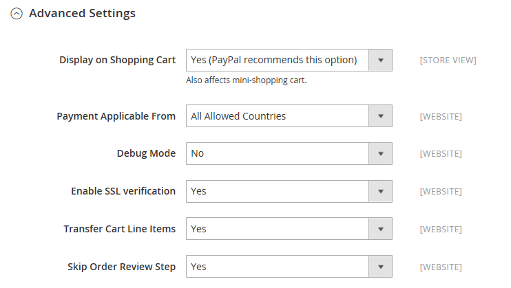

# Lien de flux de production PayPal

PayPal Payflow Link est disponible pour les commerçants aux États-Unis et au Canada uniquement. Les clients ne sont pas tenus de disposer d’un compte PayPal personnel et de saisir leurs informations de carte de crédit dans un formulaire hébergé par PayPal. Les informations ne sont jamais stockées sur votre serveur Adobe Commerce ou Magento Open Source. Le lien de flux de production ne peut pas être utilisé pour les commandes créées à partir de l’administrateur.

Les notes de crédit sont prises en charge pour les remboursements en ligne et hors ligne. Cependant, plusieurs remboursements en ligne ne sont pas pris en charge.

>[!IMPORTANT]
>
>**Exigences de PSD2 :**  
>À compter du 14 septembre 2019, les banques européennes pourront refuser les paiements qui ne répondent pas aux exigences de [PSD2](../getting-started/compliance-payment-services-directive.md). Pour se conformer à PSD2, PayPal Payflow Link doit être intégré à Cardinal Commerce. Pour en savoir plus, voir [3-D Secure for Payflow](https://developer.paypal.com/api/nvp-soap/payflow/3d-secure-overview/).

## Conditions

- [Compte professionnel PayPal][1] La passerelle PayPal Payflow Pro relie le compte marchand de PayPal au site web marchand, en tant que passerelle et compte marchand.

- Si vous gérez plusieurs sites web Commerce, vous devez disposer d’un compte marchand PayPal distinct pour chaque site web.

## Workflow client

1. **Le client va au passage en caisse** - Pendant le passage en caisse, le client choisit de payer avec le lien Payflow de PayPal et saisit les informations de carte de crédit. Le client n’est pas tenu d’avoir un compte PayPal personnel.
1. **Le client choisit Payer maintenant** : le client appuie sur le bouton Payer maintenant pour envoyer la commande.
1. **Le client saisit les informations de carte de crédit** : le client saisit les informations de carte de crédit sur un formulaire hébergé par PayPal. Si le client clique sur le lien _Annuler le paiement_, il revient à l’étape Informations de paiement de l’extraction et l’état de la commande passe à _Annulé_.
1. **Le client envoie la commande** - Les informations de carte de crédit sont envoyées directement à PayPal et ne sont conservées nulle part sur le site Commerce.

## Workflow de commande

1. **PayPal reçoit la demande** - PayPal reçoit la demande du client de payer maintenant.
1. **PayPal vérifie les informations de paiement** - PayPal vérifie les informations de carte de crédit et attribue le statut approprié :
   - **Paiement vérifié :** Si vérifié, le statut _En attente de paiement_ est initialement attribué à la commande jusqu’à la résolution de la transaction.
   - **Traitement** - La transaction a réussi.
   - **En attente de paiement** - Le système n’a pas reçu de réponse de PayPal.
   - **Annulé** - La transaction n’a pas réussi pour une raison quelconque.
   - **Fraude suspectée** - La transaction n’a pas réussi certains des [filtres de fraude PayPal](paypal.md#paypal-fraud-management-filters). Le système reçoit la réponse de PayPal indiquant que la transaction est en cours d’examen par le service de fraude.
   - **Annuler le paiement :** Si le client clique sur le lien _Annuler le paiement_, le client revient à l’étape Informations de paiement de l’extraction et l’état de la commande passe à _Annulé_.
1. **Le client est redirigé vers la page de confirmation** - Si la transaction est terminée avec succès, le client est redirigé vers la page de confirmation de commande de votre magasin. Si la transaction échoue pour une raison quelconque, un message d’erreur s’affiche sur la page de passage en caisse et le client est invité à répéter le processus de passage en caisse. Ces situations sont gérées par PayPal.
1. **Le marchand remplit la commande** : le marchand facture et envoie la commande comme d’habitude.

## Configuration de votre compte PayPal

1. Connectez-vous à votre [compte professionnel PayPal][2].

1. Configurez les [pages de passage en caisse hébergées][4] à l’aide du Gestionnaire PayPal avec les paramètres suivants :

   - Sous **[!UICONTROL Security Options]**, renseignez les paramètres suivants :

     **[!UICONTROL AVS]** : `No`

     **[!UICONTROL CSC]** : `No`

     **[!UICONTROL Enable Secure Token]** : `Yes`

   - Sélectionnez **[!UICONTROL Customize]**, puis **[!UICONTROL Layout C]**.

     La disposition C affiche uniquement les champs de carte de crédit et de débit. Elle peut être encadrée sur votre site ou utilisée comme fenêtre contextuelle autonome. La taille est fixée à 490 x 565 pixels, avec un espace supplémentaire pour les messages d’erreur. Sur certains systèmes, ce paramètre corrige un problème de redirection transparente.

1. Une fois les paramètres de configuration terminés, cliquez sur **[!UICONTROL Save and Publish]**.

1. Configurez un utilisateur supplémentaire (recommandé par PayPal) :

   - Dans la deuxième ligne du menu principal, cliquez sur **[!UICONTROL Manage Users]**.

   - Pour ajouter un autre utilisateur au compte, cliquez sur **[!UICONTROL Add User]**.

   - Renseignez les champs requis dans les sections suivantes du formulaire _Ajouter un utilisateur_ :

      - [!UICONTROL Admin Confirmation]
      - [!UICONTROL User Information]
      - [!UICONTROL User Login Information]
      - [!UICONTROL Assign Privilege to User]

   - Cliquez sur **[!UICONTROL Update]**.

## Configuration du lien de flux de production PayPal

>[!TIP]
>
>Cliquez à tout moment sur **[!UICONTROL Save Config]** pour enregistrer votre progression.

### Etape 1 : lancer la configuration

Cette méthode de configuration suppose que vous disposez d’un compte PayPal existant.

1. Sur la barre latérale _Admin_, accédez à **[!UICONTROL Stores]** > _[!UICONTROL Settings]_>**[!UICONTROL Configuration]**.

1. Dans le panneau de gauche, développez **[!UICONTROL Sales]** et choisissez **[!UICONTROL Payment Methods]**.

1. Si votre installation Commerce comporte plusieurs sites web, magasins ou vues, définissez **[!UICONTROL Store View]** sur la vue de magasin dans laquelle vous souhaitez appliquer cette configuration.

1. Dans la section _[!UICONTROL Merchant Location]_, sélectionnez l’**[!UICONTROL Merchant Country]**&#x200B;où se trouve votre entreprise.

   Ce paramètre détermine la sélection des solutions PayPal qui apparaissent dans la configuration.

   {width="600" zoomable="yes"}

1. Développez **[!UICONTROL PayPal Payment Gateways]** (si nécessaire) et cliquez sur **[!UICONTROL Configure]** pour **[!UICONTROL Payflow Link]**.

   {width="600" zoomable="yes"}

### Étape 2 : Remplir les paramètres PayPal requis

{width="600" zoomable="yes"}

1. (Facultatif) Saisissez le **[!UICONTROL Email Associated with your PayPal Merchant Account]**.

   >[!IMPORTANT]
   >
   >Les adresses électroniques sont sensibles à la casse. Pour recevoir le paiement, l’adresse électronique doit correspondre à l’adresse électronique spécifiée dans votre compte marchand PayPal.

1. Saisissez l’une des informations d’identification suivantes que vous utilisez pour vous connecter à votre compte marchand PayPal :

   - **[!UICONTROL Partner]** - Votre identifiant de partenaire PayPal.
   - **[!UICONTROL User]** - Identifiant d’un autre utilisateur configuré sur votre compte PayPal.
   - **[!UICONTROL Vendor]** - Votre nom d’utilisateur PayPal.

1. Saisissez le **[!UICONTROL Password]** associé à votre compte PayPal.

1. Pour exécuter des transactions de test, définissez **[!UICONTROL Test Mode]** sur `Yes`.

   Lors du test de la configuration dans un environnement de test, utilisez uniquement les [numéros de carte de crédit][3] recommandés par PayPal. Lorsque vous êtes prêt à passer en production, revenez à la configuration et définissez le mode test sur `No`.

1. Si votre système utilise un serveur proxy pour établir la connexion au système PayPal, définissez **[!UICONTROL Test Mode]** sur `Yes` et procédez comme suit :

   - Saisissez l’adresse IP du **[!UICONTROL Proxy Host]**.

   - Saisissez le numéro de port de **[!UICONTROL Proxy Port]**.

     Un proxy est utilisé lorsque le pare-feu du serveur empêche l’accès direct au serveur PayPal. Dans ce cas, un serveur tiers est utilisé pour relayer le trafic.

1. Définissez **[!UICONTROL Enable Payflow Link]** sur `Yes`.

1. Si vous souhaitez activer les options [PayPal Express Checkout](paypal-express-checkout.md) pour les clients, définissez **[!UICONTROL Enable Express Checkout]** sur `Yes`.

1. Si vous souhaitez proposer le [crédit PayPal](paypal.md#paypal-credit-and-pay-later) à vos clients, définissez **[!UICONTROL Enable PayPal Credit]** sur `Yes`.

### Étape 3 : configuration du crédit PayPal de publicité/de la publicité PayPal de publicité (facultatif)

À compter de la version 2.4.3, PayPal PayLater est pris en charge dans les déploiements qui incluent PayPal. Cette fonctionnalité permet aux acheteurs de payer une commande par versements bimensuels au lieu de payer le montant complet au moment de l’achat. L’expérience de crédit PayPal est obsolète.

Définissez **[!UICONTROL Enable PayPal PayLater Experience]** sur l’une des options suivantes :

- `Yes` - Pour configurer Advertising PayPal PayLater
- `No` - Pour configurer le crédit Advertising PayPal

#### Publicité Crédit PayPal

1. Développez la section  sur **[!UICONTROL Advertise PayPal Credit]** .

   {width="600" zoomable="yes"}

1. Pour obtenir les informations sur votre compte, cliquez sur **[!UICONTROL Get Publisher ID from PayPal]** et suivez les instructions.

1. Saisissez votre **[!UICONTROL Publisher ID]**.

1. Développez la section  sur **[!UICONTROL Home Page]** .

   {width="600" zoomable="yes"}

1. Pour placer une bannière sur la page, définissez **[!UICONTROL Display]** sur `Yes`.

1. Définissez **[!UICONTROL Position]** sur l’une des options suivantes :

   - `Header (center)`
   - `Sidebar (right)`

1. Définissez **[!UICONTROL Size]** sur l’une des options suivantes :

   - `190 x 100`
   - `234 x 60`
   - `300 x 50`
   - `468 x 60`
   - `728 x 90`
   - `800 x 66`

1. Développez le  des sections restantes et répétez les étapes précédentes pour la configuration de la page d’accueil :

   - **[!UICONTROL Catalog Category Page]**
   - **[!UICONTROL Catalog Product Page]**
   - **[!UICONTROL Checkout Cart Page]**

#### Publicité PayPal PayLater

1. Développez la section  sur **[!UICONTROL Advertise PayPal PayLater]** .

1. Définissez **[!UICONTROL Enable PayPal PayLater]** sur `Yes`.

1. Développez la section  sur **[!UICONTROL Home Page]** .

   {width="600" zoomable="yes"}

1. Pour placer une bannière sur la page, définissez **[!UICONTROL Display]** sur `Yes`.

1. Définissez **[!UICONTROL Position]** sur l’une des options suivantes :

   - `Header (center)`
   - `Sidebar`

1. Définissez **[!UICONTROL Style Layout]** sur l’une des options suivantes :

   - `Text`
   - `Flex`

1. Pour [!UICONTROL Style Layout] **[!UICONTROL Text]** uniquement, définissez **[!UICONTROL Logo Type]** sur l&#39;une des options suivantes :

   - `Primary`
   - `Alternative`
   - `Inline`
   - `None`

1. Pour [!UICONTROL Style Layout] **[!UICONTROL Text]** uniquement, définissez **[!UICONTROL Logo Position]** sur l&#39;une des options suivantes :

   - `Left`
   - `Right`
   - `Top`

1. Pour [!UICONTROL Style Layout] **[!UICONTROL Text]** uniquement, définissez **[!UICONTROL Text Color]** sur l&#39;une des options suivantes :

   - `Black`
   - `White`
   - `Monochrome`
   - `Grayscale`

1. Pour [!UICONTROL Style Layout] **[!UICONTROL Text]** uniquement, définissez **[!UICONTROL Text Size]** sur l&#39;une des options suivantes :

   - `10px`
   - `11px`
   - `12px`
   - `13px`
   - `14px`
   - `15px`
   - `16px`

1. Pour [!UICONTROL Style Layout] **[!UICONTROL Flex]** uniquement, définissez **[!UICONTROL Ratio]** sur l&#39;une des options suivantes :

   - `1x1`
   - `1x4`
   - `8x1`
   - `20x1`

1. Pour [!UICONTROL Style Layout] **[!UICONTROL Flex]** uniquement, définissez **[!UICONTROL Color]** sur l&#39;une des options suivantes :

   - `Blue`
   - `Black`
   - `White`
   - `White No Border`
   - `Gray`
   - `Monochrome`
   - `Grayscale`

1. Développez le  des sections restantes et répétez les étapes précédentes :

   - **[!UICONTROL Catalog Product Page]**
   - **[!UICONTROL Checkout Cart Page]**
   - **[!UICONTROL Checkout Payment Step]**
   - **[!UICONTROL Catalog Category Page]**

### Étape 4 : définition des paramètres de base

1. Développez la section  sur **[!UICONTROL Basic Settings - PayPal Payflow Link]** .

   {width="600" zoomable="yes"}

1. Pour **[!UICONTROL Title]**, saisissez un titre qui identifie le lien de paiement PayPal lors du passage en caisse.

   Il est recommandé d’utiliser le titre _Débit ou Carte de crédit_.

1. Si vous proposez plusieurs méthodes de paiement, saisissez un nombre pour **[!UICONTROL Sort Order]** afin de déterminer l’ordre dans lequel le lien de flux de paiement apparaît lorsqu’il est répertorié avec les autres méthodes de paiement.

   Ce nombre est relatif aux autres modes de paiement. (`0` = premier, `1` = deuxième, `2` = troisième, etc.)

1. Définissez **[!UICONTROL Payment Action]** sur l’une des options suivantes :

   - `Authorization` - Approuve l’achat et met un frein aux fonds. Le montant n’est pas retiré tant qu’il n’a pas été capturé par le marchand.
   - `Sale` - Le montant de l’achat est autorisé et immédiatement retiré du compte du client.

### Étape 5 : définition des paramètres avancés

1. Développez la section  sur **[!UICONTROL Advanced Settings]** .

   {width="600" zoomable="yes"}

1. Définissez **[!UICONTROL Payment Applicable From]** sur l’une des options suivantes :

   - `All Allowed Countries` - Les clients de tous les [pays](../getting-started/store-details.md#country-options) spécifiés dans votre configuration de magasin peuvent utiliser ce mode de paiement.
   - `Specific Countries` - Après avoir choisi cette option, la liste _[!UICONTROL Payment from Specific Countries]_&#x200B;s’affiche. Maintenez la touche Ctrl enfoncée et sélectionnez chaque pays de la liste dans lequel les clients peuvent effectuer des achats dans votre boutique.

1. Pour écrire des communications avec le système de paiement dans le fichier journal, définissez **[!UICONTROL Debug Mode]** sur `Yes`.

   >[!NOTE]
   >
   >Conformément aux normes de sécurité des données PCI, les informations de carte de crédit ne sont pas enregistrées dans le fichier journal.

1. Pour activer la vérification de l’authentification de l’hôte, définissez **[!UICONTROL Enable SSL Verification]** sur `Yes`.

1. Si vous souhaitez que le client puisse corriger son entrée du code de sécurité CVV à trois chiffres à partir de l’arrière d’une carte de crédit, définissez **[!UICONTROL CVV Entry is Editable]** sur `Yes`.

1. Pour obliger les clients à saisir un code CVV, définissez **[!UICONTROL Require CVV Entry]** sur `Yes`.

1. Pour envoyer une confirmation du paiement au client, définissez **[!UICONTROL Send Email Confirmation]** sur `Yes`.

1. Pour déterminer la méthode utilisée pour exchange des informations avec le serveur PayPal lors d’une transaction, définissez l’élément **[!UICONTROL URL method for Cancel URL and Return URL]** sur l’une des options suivantes :

   - `GET` - Récupère les informations qui résultent d’un processus (méthode par défaut).
   - `POST` - Fournit un bloc de données, telles que les données entrées dans un formulaire, à un processus de traitement des données.

   Les _URL d’annulation_ et _URL de retour_ se rapportent à la page sur laquelle le client revient après avoir terminé ou annulé la partie paiement du processus de passage en caisse sur le serveur PayPal.

1. Renseignez les sections suivantes, selon les besoins pour votre magasin :

   - [Paramètres du rapport de règlement](#settlement-report-settings)
   - [Paramètres de l’expérience frontale](#frontend-experience-settings)

#### Paramètres du rapport de règlement

1. Développez la section  sur **[!UICONTROL Settlement Report Settings]** .

   {width="600" zoomable="yes"}

1. Pour **[!UICONTROL SFTP Credentials]**, procédez comme suit :

   - Si vous vous êtes inscrit au serveur FTP sécurisé PayPal, saisissez les informations d’identification de connexion SFTP suivantes :

      - Connexion
      - Mot de passe

   - Pour exécuter des rapports de test avant de passer en direct avec le passage en caisse express sur votre site, définissez **[!UICONTROL Sandbox Mode]** sur `Yes`.

   - Saisissez le **[!UICONTROL Custom Endpoint Hostname or IP Address]**.

     Par défaut, la valeur est `reports.paypal.com`.

   - Saisissez le **[!UICONTROL Custom Path]** où les rapports sont enregistrés.

     Par défaut, la valeur est `/ppreports/outgoing`.

1. Pour générer des rapports selon un planning, renseignez les paramètres **[!UICONTROL Scheduled Fetching]** :

   - Définissez **[!UICONTROL Enable Automatic Fetching]** sur `Yes`.

   - Définissez **[!UICONTROL Schedule]** sur l’une des options suivantes :

      - `Daily`
      - `Every 3 Days`
      - `Every 7 Days`
      - `Every 10 Days`
      - `Every 14 Days`
      - `Every 30 Days`
      - `Every 40 Days`

     PayPal conserve chaque rapport pendant 45 jours.

   - Définissez **[!UICONTROL Time of Day]** sur l’heure, la minute et la seconde lorsque vous souhaitez que les rapports soient générés.

#### Paramètres de l’expérience frontale

Utilisez le _[!UICONTROL Frontend Experience Settings]_&#x200B;pour choisir les logos PayPal qui apparaissent sur votre site et pour personnaliser l’aspect de vos pages marchandes PayPal.

1. Développez la section  sur **[!UICONTROL Frontend Experience Settings]** .

   {width="600" zoomable="yes"}

1. Sélectionnez le **[!UICONTROL PayPal Product Logo]** que vous souhaitez voir apparaître dans le bloc PayPal de votre boutique.

   Les logos PayPal sont disponibles en quatre styles et deux tailles :

   - `No Logo`
   - `We Prefer PayPal (150 x 60 or 150 x 40)`
   - `Now Accepting PayPal (150 x 60 or 150 x 40)`
   - `Payments by PayPal (150 x 60 or 150 x 40)`
   - `Shop Now Using PayPal (150 x 60 or 150 x 40)`

1. Pour personnaliser l’aspect de vos pages marchandes PayPal :

   - Saisissez le nom du **[!UICONTROL Page Style]** que vous souhaitez appliquer à vos pages marchandes PayPal :

      - `paypal` - Utilise le style de page PayPal.
      - `primary` - Utilise le style de page que vous avez identifié comme le style _primary_ de votre profil de compte.
      - `your_custom_value` - Utilise un style de page de paiement personnalisé, qui est spécifié dans votre profil de compte.

   - Pour **[!UICONTROL Header Image URL]**, saisissez l’URL de l’image que vous souhaitez afficher dans le coin supérieur gauche de la page de paiement. La taille de fichier maximale est de 750 pixels de large par 90 pixels de haut.

     >[!NOTE]
     >
     >PayPal recommande que l’image réside sur un serveur sécurisé (https). Sinon, un navigateur peut avertir que _la page contient des éléments sécurisés et non sécurisés_.

   - Pour définir la couleur de vos pages, saisissez le code hexadécimal à six caractères, sans le symbole `#`, pour chacun des éléments suivants :

      - **[!UICONTROL Header Background Color]** - Couleur de fond de l’en-tête de la page de passage en caisse.
      - **[!UICONTROL Header Border Color]** - Couleur de bordure de deux pixels autour de l’en-tête.
      - **[!UICONTROL Page Background Color]** - Couleur de fond de la page de passage en caisse et autour de l’en-tête et du formulaire de paiement.

### Étape 6 : renseigner les paramètres de base pour le paiement express PayPal

1. Développez la section  sur **[!UICONTROL Basic Settings - PayPal Express Checkout]** .

   {width="600" zoomable="yes"}

1. Pour **[!UICONTROL Title]**, saisissez un titre qui identifie ce mode de paiement lors du passage en caisse.

   Il est recommandé de définir le titre sur _PayPal_ pour chaque vue de magasin.

1. Si vous proposez plusieurs méthodes de paiement, saisissez un numéro pour **[!UICONTROL Sort Order]** afin de déterminer l’ordre dans lequel le paiement express PayPal apparaît lorsqu’il est répertorié avec les autres méthodes de paiement.

   Ce nombre est relatif aux autres modes de paiement. (`0` = premier, `1` = deuxième, `2` = troisième, etc.)

1. Définissez **[!UICONTROL Payment Action]** sur l’une des options suivantes :

   - `Authorization` - Approuve l’achat et met un frein aux fonds. Le montant n’est pas retiré tant qu’il n’a pas été _capturé_ par le commerçant.
   - `Sale` - Le montant de l’achat est autorisé et immédiatement retiré du compte du client.

1. Pour afficher le bouton _[!UICONTROL Check out with PayPal]_&#x200B;sur la page du produit, définissez **[!UICONTROL Display on Product Details Page]**&#x200B;sur `Yes`.

### Étape 7 : Définition des paramètres avancés du paiement express PayPal

1. Développez la section  sur **[!UICONTROL Advanced Settings]** .

   {width="600" zoomable="yes"}

1. Définissez **[!UICONTROL Display on Shopping Cart]** sur `Yes`.

1. Définissez **[!UICONTROL Payment Applicable From]** sur l’une des options suivantes :

   - `All Allowed Countries` - Les clients de tous les pays spécifiés dans votre configuration de magasin peuvent utiliser ce mode de paiement.
   - `Specific Countries` - Après avoir choisi cette option, la liste _[!UICONTROL Payment from Specific Countries]_&#x200B;s’affiche. Pour sélectionner plusieurs pays, maintenez la touche Ctrl (PC) ou la touche Commande (Mac) enfoncée, puis cliquez sur chaque élément.

1. Pour écrire des communications avec le système de paiement dans le fichier journal, définissez **[!UICONTROL Debug Mode]** sur `Yes`.

   >[!NOTE]
   >
   >Conformément aux normes de sécurité des données PCI, les informations de carte de crédit ne sont pas enregistrées dans le fichier journal.

1. Pour activer la vérification de l’authentification de l’hôte, définissez **[!UICONTROL Enable SSL Verification]** sur `Yes`.

1. Pour afficher un résumé complet de la commande du client par article sur le site PayPal, définissez **[!UICONTROL Transfer Cart Line Items]** sur `Yes`.

1. Pour permettre au client de terminer la transaction à partir du site PayPal sans retourner dans votre magasin pour la consultation de la commande, définissez **[!UICONTROL Skip Order Review Step]** sur `Yes`.

1. Une fois l’opération terminée, cliquez sur **[!UICONTROL Save Config]**.

[1]: https://www.paypal.com/webapps/mpp/how-to-sell-online
[2]: https://manager.paypal.com/
[3]: https://www.paypalobjects.com/en_AU/vhelp/paypalmanager_help/credit_card_numbers.htm
[4]: https://developer.paypal.com/docs/payflow/integration-guide/configure-hosted-checkout/#configuring-hosted-pages-using-paypal-manager
