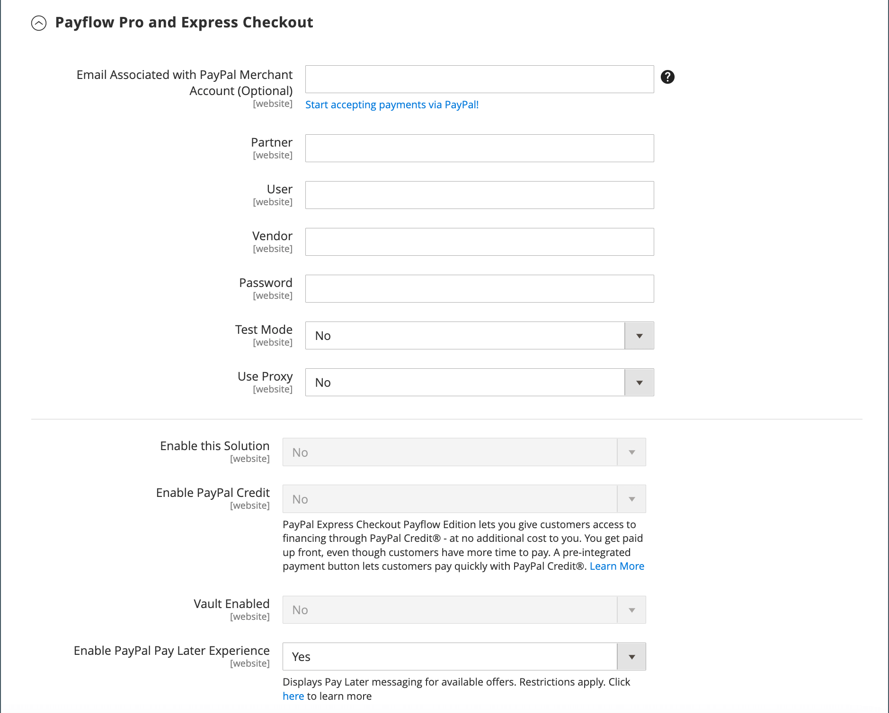

# PayPal Payflow Pro

La passerelle PayPal Payflow Pro, anciennement connue sous le nom de _Verisign_, est disponible pour les clients des États-Unis, du Canada, d&#39;Australie et de Nouvelle-Zélande. Contrairement aux autres modes de paiement PayPal, les commerçants doivent payer des frais mensuels fixes, plus des frais fixes pour chaque transaction, quel que soit le numéro.

{width="700" zoomable="yes"}

>[!IMPORTANT]
>
>**Conditions requises pour PSD2 :**  
>À compter du 14 septembre 2019, les banques européennes pourraient refuser les paiements qui ne répondent pas aux exigences de [PSD2](../getting-started/compliance-payment-services-directive.md). Pour se conformer à PSD2, PayPal Payflow Pro doit être intégré à un plug-in tiers. Pour en savoir plus, consultez la section [3-D Secure for Payflow](https://developer.paypal.com/api/nvp-soap/payflow/3d-secure-mpi/).

## Conditions requises

- [Compte professionnel PayPal][1] - La passerelle PayPal Payflow Pro relie le compte marchand de PayPal au site marchand, agissant à la fois comme une passerelle et un compte marchand.

- Si vous gérez plusieurs sites web Adobe Commerce et Magento Open Source, vous devez disposer d’un compte marchand PayPal distinct pour chaque site web.

## Workflow client

1. **Le client passe à la caisse** - Lors de la caisse, le client choisit de payer avec PayPal Payflow Pro et saisit les informations de carte de crédit. Les clients ne sont pas tenus d&#39;avoir un compte PayPal personnel. Cependant, selon le pays du vendeur, les clients peuvent également utiliser leur compte PayPal personnel pour payer la commande.
1. **Le client envoie la commande** - Le client envoie la commande et les informations de la commande sont envoyées à PayPal pour traitement. Le client ne quitte pas la page de passage en caisse de votre site.
1. **PayPal effectue la transaction** - Les paiements sont acceptés au moment de la commande. En fonction de l&#39;action de paiement spécifiée dans la configuration, une commande client ou une commande client et une facture sont créées.

## Workflow de traitement des commandes en ligne

1. **L’administrateur soumet la facture en ligne** - L’administrateur du magasin soumet une facture en ligne et, par conséquent, une transaction et une facture correspondantes sont créées.
1. **PayPal reçoit la transaction** - Les informations de commande sont envoyées à PayPal. Un enregistrement de la transaction et une facture sont générés. Vous pouvez afficher toutes les transactions Payflow Pro Gateway dans votre [compte marchand PayPal][2].

>[!NOTE]
>
>Les factures partielles et les remboursements partiels ne sont pas pris en charge par PayPal Payflow Pro.

## Configuration de votre compte PayPal

1. Connectez-vous à votre [compte professionnel PayPal][2].

1. Configurez les [Pages de paiement hébergées][4] à l’aide de PayPal Manager avec les paramètres suivants :

   - Sous **[!UICONTROL Choose your settings]**, définissez **[!UICONTROL Transaction Process Mode]** sur `Live`.

   - Sous **[!UICONTROL Display options on payment page]**, définissez **Méthode d’URL d’annulation** sur `POST`.

   - Sous **[!UICONTROL Billing Information]**, cochez les cases du **[!UICONTROL CSC]** Code de sécurité de la carte pour les champs obligatoires et modifiables.

   - Sous **[!UICONTROL Payment Confirmation]**, définissez **[!UICONTROL Return URL Method]** sur `POST`.

   - Sous **[!UICONTROL Security Options]**, renseignez les paramètres suivants :

      - **[!UICONTROL AVS]** : `No`
      - **[!UICONTROL CSC]** : `No`
      - **[!UICONTROL Enable Secure Token]** : `Yes`

   - Choisissez **[!UICONTROL Customize]**, puis choisissez **[!UICONTROL Layout C]**.

     La disposition C affiche uniquement les champs de carte de crédit et de débit. Ils peuvent soit être encadrés sur votre site, soit être utilisés comme une fenêtre contextuelle autonome. La taille est fixée à 490 x 565 pixels, avec un espace supplémentaire pour les messages d’erreur. Sur certains systèmes, ce paramètre corrige un problème de redirection transparente.

1. Une fois les paramètres de configuration définis, cliquez sur **[!UICONTROL Save and Publish]**.

1. Dans le menu Gestionnaire PayPal, choisissez **[!UICONTROL Account Administration]**.

1. Sous **[!UICONTROL Manage Security]**, cliquez sur **[!UICONTROL Transaction Settings]** et procédez comme suit :

   - Définissez **[!UICONTROL Allow reference transactions]** sur `Yes`.

   - Cliquez sur **[!UICONTROL Confirm]**.

     >[!NOTE]
     >
     >Si vous disposez de plusieurs sites Web Commerce, vous devez créer un compte PayPal Payments Advanced distinct pour chacun d&#39;eux.

1. Configurer un autre utilisateur (recommandé par PayPal) :

   - Dans la deuxième ligne du menu principal, cliquez sur **[!UICONTROL Manage Users]**.

   - Pour ajouter un autre utilisateur au compte, cliquez sur **[!UICONTROL Add User]**. Le lien se trouve juste au-dessus du titre Gérer les utilisateurs .

   - Renseignez les champs obligatoires dans les sections suivantes du formulaire _[!UICONTROL Add User]_:

      - [!UICONTROL Admin Confirmation]
      - [!UICONTROL User Information]
      - [!UICONTROL User Login Information]
      - [!UICONTROL Assign Privilege to User]

   - Cliquez sur **[!UICONTROL Update]**.

1. Veillez à vous déconnecter de votre compte PayPal.

## Configuration de PayPal Payflow Pro dans Commerce

>[!TIP]
>
>Cliquez sur **[!UICONTROL Save Config]** à tout moment pour enregistrer votre progression.

### Étape 1 : Commencer la configuration

Cette méthode de configuration suppose que vous disposez d&#39;un compte PayPal existant.

1. Dans la barre latérale _Admin_, accédez à **[!UICONTROL Stores]** > _[!UICONTROL Settings]_>**[!UICONTROL Configuration]**.

1. Dans le panneau de gauche, développez **[!UICONTROL Sales]** et choisissez **[!UICONTROL Payment Methods]**.

1. Si votre installation Commerce comporte plusieurs sites web, boutiques ou vues, définissez **[!UICONTROL Store View]** sur la vue de la boutique dans laquelle vous souhaitez appliquer cette configuration.

1. Dans la section _[!UICONTROL Merchant Location]_, sélectionnez le **[!UICONTROL Merchant Country]**&#x200B;où se trouve votre entreprise.

   Ce paramètre détermine la sélection des solutions PayPal qui apparaissent dans la configuration.

   {width="600" zoomable="yes"}

1. Développez **[!UICONTROL PayPal Payment Gateways]** (si nécessaire) et cliquez sur **[!UICONTROL Configure]** pour **[!UICONTROL Payflow Pro]**.

   {width="600" zoomable="yes"}

### Étape 2 : remplir les paramètres PayPal requis

{width="600" zoomable="yes"}

1. (Facultatif) Saisissez le **[!UICONTROL Email Associated with your PayPal Merchant Account]**.

   >[!IMPORTANT]
   >
   >Les adresses e-mail respectent la casse. Pour recevoir le paiement, l&#39;adresse e-mail doit correspondre à l&#39;adresse e-mail indiquée dans votre compte marchand PayPal.

1. Saisissez l&#39;une des informations d&#39;identification suivantes que vous utilisez pour vous connecter à votre compte marchand PayPal :

   - **[!UICONTROL Partner]** - Votre identifiant de partenaire PayPal.
   - **[!UICONTROL User]** - Si vous configurez un ou plusieurs utilisateurs supplémentaires sur le compte, cette valeur correspond à l’identifiant de l’utilisateur autorisé à traiter les transactions. Si, toutefois, vous n’avez pas configuré d’utilisateurs supplémentaires, **[!UICONTROL USER]** a la même valeur que **[!UICONTROL Vendor]**.
   - **[!UICONTROL Vendor]** - Identifiant de connexion de commerçant créé lors de votre inscription au compte.

1. Saisissez le **[!UICONTROL Password]** associé à votre compte PayPal.

1. Pour exécuter des transactions de test, définissez **[!UICONTROL Test Mode]** sur `Yes`.

   Lors du test de la configuration dans un sandbox, utilisez uniquement les [numéros de carte de crédit][3] recommandés par PayPal. Lorsque vous êtes prêt à passer en production, revenez à la configuration et définissez le Mode Test sur `No`.

1. Si votre système utilise un serveur proxy pour établir la connexion au système PayPal, définissez **[!UICONTROL Use Proxy]** sur `Yes` et procédez comme suit :

   - Saisissez l’adresse IP du **[!UICONTROL Proxy Host]**.

   - Saisissez le numéro de port du **[!UICONTROL Proxy Port]**.

     Un proxy est utilisé lorsque le pare-feu du serveur empêche l’accès direct au serveur PayPal. Dans ce cas, un serveur tiers est utilisé pour relayer le trafic.

1. Définissez **[!UICONTROL Enable this Solution]** sur `Yes`.

1. Si vous souhaitez proposer le [crédit PayPal](paypal.md#paypal-credit-and-pay-later) à vos clients, définissez **[!UICONTROL Enable PayPal Credit]** sur `Yes`.

1. Si vous souhaitez stocker en toute sécurité les informations de paiement/carte de crédit du client, afin que les clients n’aient pas à saisir à nouveau les informations de paiement à chaque fois, définissez **[!UICONTROL Vault Enabled]** sur `Yes`.

### Étape 3 : Configurer le crédit PayPal publicitaire / Annoncer PayPal PayLater (facultatif)

À partir de la version 2.4.3, PayPal PayLater est pris en charge dans les déploiements qui incluent PayPal. Cette fonctionnalité permet aux acheteurs de payer une commande par versements bimensuels au lieu de payer le montant total au moment de l’achat. L&#39;expérience de crédit PayPal est obsolète.

Définissez **[!UICONTROL Enable PayPal PayLater Experience]** sur l’une des options suivantes :

- `Yes` - Pour configurer Advertiser PayPal PayLater
- `No` - Pour configurer le crédit PayPal Advertising

#### Annoncer le crédit PayPal

1. Développez  la section **[!UICONTROL Advertise PayPal Credit]** .

   {width="600" zoomable="yes"}

1. Pour obtenir les informations relatives à votre compte, cliquez sur **[!UICONTROL Get Publisher ID from PayPal]** et suivez les instructions.

1. Saisissez votre **[!UICONTROL Publisher ID]**.

1. Développez  la section **[!UICONTROL Home Page]** .

   {width="600" zoomable="yes"}

1. Pour placer une bannière sur la page, définissez **[!UICONTROL Display]** sur `Yes`.

1. Définissez **[!UICONTROL Position]** sur l’une des options suivantes :

   - `Header (center)`
   - `Sidebar (right)`

1. Définissez **[!UICONTROL Size]** sur l’une des options suivantes :

   - `190 x 100`
   - `234 x 60`
   - `300 x 50`
   - `468 x 60`
   - `728 x 90`
   - `800 x 66`

1. Développez  les sections restantes et répétez les étapes précédentes pour les paramètres de la page d’accueil :

   - **[!UICONTROL Catalog Category Page]**
   - **[!UICONTROL Catalog Product Page]**
   - **[!UICONTROL Checkout Cart Page]**

#### Annoncer PayPal PayLater

1. Développez  la section **[!UICONTROL Advertise PayPal PayLater]** .

1. Définissez **[!UICONTROL Enable PayPal PayLater]** sur `Yes`.

1. Développez  la section **[!UICONTROL Home Page]** .

   {width="600" zoomable="yes"}

1. Pour placer une bannière sur la page, définissez **[!UICONTROL Display]** sur `Yes`.

1. Définissez **[!UICONTROL Position]** sur l’une des options suivantes :

   - `Header (center)`
   - `Sidebar`

1. Définissez **[!UICONTROL Style Layout]** sur l’une des options suivantes :

   - `Text`
   - `Flex`

1. Pour [!UICONTROL Style Layout] **[!UICONTROL Text]** uniquement, définissez **[!UICONTROL Logo Type]** sur l’une des options suivantes :

   - `Primary`
   - `Alternative`
   - `Inline`
   - `None`

1. Pour [!UICONTROL Style Layout] **[!UICONTROL Text]** uniquement, définissez **[!UICONTROL Logo Position]** sur l’une des options suivantes :

   - `Left`
   - `Right`
   - `Top`

1. Pour [!UICONTROL Style Layout] **[!UICONTROL Text]** uniquement, définissez **[!UICONTROL Text Color]** sur l’une des options suivantes :

   - `Black`
   - `White`
   - `Monochrome`
   - `Grayscale`

1. Pour [!UICONTROL Style Layout] **[!UICONTROL Text]** uniquement, définissez **[!UICONTROL Text Size]** sur l’une des options suivantes :

   - `10px`
   - `11px`
   - `12px`
   - `13px`
   - `14px`
   - `15px`
   - `16px`

1. Pour [!UICONTROL Style Layout] **[!UICONTROL Flex]** uniquement, définissez **[!UICONTROL Ratio]** sur l’une des options suivantes :

   - `1x1`
   - `1x4`
   - `8x1`
   - `20x1`

1. Pour [!UICONTROL Style Layout] **[!UICONTROL Flex]** uniquement, définissez **[!UICONTROL Color]** sur l’une des options suivantes :

   - `Blue`
   - `Black`
   - `White`
   - `White No Border`
   - `Gray`
   - `Monochrome`
   - `Grayscale`

1. Développez  les sections restantes et répétez les étapes précédentes :

   - **[!UICONTROL Catalog Product Page]**
   - **[!UICONTROL Checkout Cart Page]**
   - **[!UICONTROL Checkout Payment Step]**
   - **[!UICONTROL Catalog Category Page]**

### Étape 4 : définition des paramètres de base

1. Développez  la section **[!UICONTROL Basic Settings - PayPal Payflow Pro]** .

   {width="600" zoomable="yes"}

1. Par **[!UICONTROL Title]**, saisissez un titre qui identifie PayPal Payflow Pro lors du passage en caisse.

   Il est recommandé d’utiliser le titre _Carte de débit ou de crédit_.

1. Si vous proposez plusieurs modes de règlement, saisissez un nombre pour **[!UICONTROL Sort Order]** afin de déterminer l&#39;ordre dans lequel Payflow Pro apparaît lorsqu&#39;il est répertorié avec les autres modes de règlement.

   Ce nombre est relatif aux autres modes de paiement. (`0` = premier, `1` = deuxième, `2` = troisième, etc.)

1. Définissez **[!UICONTROL Payment Action]** sur l’une des options suivantes :

   - `Authorization` - Valide l&#39;achat et met un blocage sur les fonds. Le montant n&#39;est pas retiré tant qu&#39;il n&#39;est pas saisi par le commerçant.
   - `Sale` - Le montant de l&#39;achat est autorisé et immédiatement retiré du compte du client.

1. Par **[!UICONTROL Credit Card Settings]**, sélectionnez les cartes de crédit que vous acceptez pour le paiement dans votre magasin.

   Pour sélectionner plusieurs cartes, maintenez la touche Ctrl (PC) ou Commande (Mac) enfoncée et cliquez sur chacune d’elles.

   >[!NOTE]
   >
   >American Express nécessite un accord supplémentaire.

### Étape 5 : définition des paramètres avancés

1. Développez  la section **[!UICONTROL Advanced Settings]** .

   {width="600" zoomable="yes"}

1. Définissez **[!UICONTROL Payment Applicable From]** sur l’une des options suivantes :

   - `All Allowed Countries` - Les clients de tous les [pays](../getting-started/store-details.md#country-options) spécifiés dans la configuration de votre boutique peuvent utiliser ce mode de paiement.
   - `Specific Countries` - Après avoir choisi cette option, la liste des _[!UICONTROL Payment from Specific Countries]_&#x200B;s’affiche. Maintenez la touche Ctrl (PC) ou Commande (Mac) enfoncée et sélectionnez chaque pays dans la liste où les clients peuvent effectuer des achats dans votre boutique.

1. Pour écrire des communications avec le système de paiement dans le fichier journal, définissez **[!UICONTROL Debug Mode]** sur `Yes`.

   >[!NOTE]
   >
   >Conformément aux normes PCI Data Security, les informations de carte de crédit ne sont pas enregistrées dans le fichier journal.

1. Pour activer la vérification de l’authenticité de l’hôte, définissez **[!UICONTROL Enable SSL Verification]** sur `Yes`.

1. Pour obliger les clients à saisir un code CVV, définissez **[!UICONTROL Require CVV Entry]** sur `Yes`.

1. Renseignez les sections suivantes, selon les besoins de votre boutique :

   - [Paramètres CVV et AVS](#cvv-and-avs-settings)
   - [Paramètres du rapport de règlement](#settlement-report-settings)
   - [Paramètres de l’expérience front-end](#frontend-experience-settings)

#### Paramètres CVV et AVS

Pour déterminer quand une transaction doit être rejetée lorsque le système de vérification des adresses identifie une discordance, spécifiez comment gérer divers scénarios.

1. Développez  la section **[!UICONTROL CVV and AVS Settings]** .

   {width="600" zoomable="yes"}

1. Pour rejeter une transaction en raison d’une non-correspondance de rue, définissez **[!UICONTROL AVS Street Does Not Match]** sur `Yes`.

1. Pour rejeter une transaction basée sur un code postal incompatible, définissez **[!UICONTROL AVS Zip Does Not Match]** sur `Yes`.

1. Pour rejeter une transaction en fonction d’un identifiant de pays non correspondant, définissez **[!UICONTROL International AVS Indicator Does Not Match]** sur `Yes`.

1. Pour rejeter une transaction en fonction d’un code CVV non correspondant, définissez **[!UICONTROL International Card Security Code Does Not Match]** sur `Yes`.

#### Paramètres du rapport de règlement

1. Développez  la section **[!UICONTROL Settlement Report Settings]** .

   {width="600" zoomable="yes"}

1. Par **[!UICONTROL SFTP Credentials]**, procédez comme suit :

   - Si vous vous êtes inscrit au serveur FTP sécurisé PayPal, saisissez les informations d&#39;identification SFTP suivantes :

      - Login
      - Mot de passe

   - Pour exécuter des rapports de test avant la mise en ligne avec le paiement express sur votre site, définissez **[!UICONTROL Sandbox Mode]** sur `Yes`.

   - Saisissez le **[!UICONTROL Custom Endpoint Hostname or IP Address]**.

     Par défaut, la valeur est `reports.paypal.com`.

   - Saisissez le **[!UICONTROL Custom Path]** où les rapports sont enregistrés.

     Par défaut, la valeur est `/ppreports/outgoing`.

1. Pour générer des rapports selon un planning, définissez les paramètres **[!UICONTROL Scheduled Fetching]** :

   - Définissez **[!UICONTROL Enable Automatic Fetching]** sur `Yes`.

   - Définissez **[!UICONTROL Schedule]** sur l’une des options suivantes :

      - `Daily`
      - `Every 3 Days`
      - `Every 7 Days`
      - `Every 10 Days`
      - `Every 14 Days`
      - `Every 30 Days`
      - `Every 40 Days`

     PayPal conserve chaque rapport pendant 45 jours.

   - Définissez **[!UICONTROL Time of Day]** sur l’heure, la minute et la seconde auxquelles vous souhaitez que les rapports soient générés.

#### Paramètres de l’expérience front-end

Utilisez les paramètres d’expérience Frontend pour choisir les logos PayPal à afficher sur votre site et personnaliser l’apparence de vos pages marchandes PayPal.

1. Développez  la section **[!UICONTROL Frontend Experience Settings]** .

   {width="600" zoomable="yes"}

1. Sélectionnez les **[!UICONTROL PayPal Product Logo]** qui doivent apparaître dans le bloc PayPal de votre boutique.

   Les logos PayPal sont disponibles en quatre styles et deux tailles :

   - `No Logo`
   - `We Prefer PayPal (150 x 60 or 150 x 40)`
   - `Now Accepting PayPal (150 x 60 or 150 x 40)`
   - `Payments by PayPal (150 x 60 or 150 x 40)`
   - `Shop Now Using PayPal (150 x 60 or 150 x 40)`

1. Pour personnaliser l&#39;apparence de vos pages marchandes PayPal :

   - Saisissez le nom du **[!UICONTROL Page Style]** que vous souhaitez appliquer à vos pages marchandes PayPal :

      - `paypal` - Utilise le style de page PayPal.
      - `primary` - Utilise le style de page que vous avez identifié comme style _principal_ dans le profil de votre compte.
      - `your_custom_value` - Utilise un style de page de paiement personnalisé, spécifié dans le profil de votre compte.

   - Par **[!UICONTROL Header Image URL]**, saisissez l’URL de l’image que vous souhaitez afficher dans le coin supérieur gauche de la page de paiement. La taille de fichier maximale est de 750 pixels de large sur 90 pixels de haut.

     >[!NOTE]
     >
     >PayPal recommande que l&#39;image réside sur un serveur sécurisé (https). Sinon, un navigateur peut vous avertir que _la page contient des éléments sécurisés et non sécurisés_.

   - Pour définir la couleur de vos pages, saisissez le code hexadécimal à six caractères, sans le symbole `#`, pour chacun des éléments suivants :

      - **[!UICONTROL Header Background Color]** - Couleur d’arrière-plan de l’en-tête de la page de passage en caisse.
      - **[!UICONTROL Header Border Color]** : couleur de la bordure de deux pixels autour de l’en-tête.
      - **[!UICONTROL Page Background Color]** - Couleur d’arrière-plan de la page de passage en caisse et autour de l’en-tête et du formulaire de paiement.

### Étape 6 : Définissez les paramètres de base de PayPal Express Checkout

1. Développez  la section **[!UICONTROL Basic Settings - PayPal Express Checkout]** .

   {width="600" zoomable="yes"}

1. Par **[!UICONTROL Title]**, saisissez un titre qui identifie ce mode de paiement lors du passage en caisse.

   Il est recommandé de définir le titre sur _PayPal_ pour chaque vue de magasin.

1. Si vous proposez plusieurs modes de paiement, saisissez un nombre pour **[!UICONTROL Sort Order]** afin de déterminer l&#39;ordre dans lequel le paiement PayPal Express apparaît lorsqu&#39;il est répertorié avec les autres modes de paiement.

   Ce nombre est relatif aux autres modes de paiement. (`0` = premier, `1` = deuxième, `2` = troisième, etc.)

1. Définissez **[!UICONTROL Payment Action]** sur l’une des options suivantes :

   - `Authorization` - Valide l&#39;achat et met un blocage sur les fonds. Le montant n&#39;est pas retiré tant qu&#39;il n&#39;est pas _saisi_ par le commerçant.
   - `Sale` - Le montant de l&#39;achat est autorisé et immédiatement retiré du compte du client.

1. Pour afficher le bouton _[!UICONTROL Check out with PayPal]_&#x200B;sur la page produit, définissez **[!UICONTROL Display on Product Details Page]**&#x200B;sur `Yes`.

### Étape 7 : Définissez les paramètres avancés de PayPal Express Checkout

1. Développez  la section **[!UICONTROL Advanced Settings]** .

   {width="600" zoomable="yes"}

1. Définissez **[!UICONTROL Display on Shopping Cart]** sur `Yes`.

1. Définissez **[!UICONTROL Payment Applicable From]** sur l’une des options suivantes :

   - `All Allowed Countries` - Les clients de tous les pays spécifiés dans la configuration de votre boutique peuvent utiliser ce mode de paiement.
   - `Specific Countries` - Après avoir choisi cette option, la liste des _[!UICONTROL Payment from Specific Countries]_&#x200B;s’affiche. Pour sélectionner plusieurs pays, maintenez la touche Ctrl (PC) ou Commande (Mac) enfoncée et cliquez sur chaque élément.

1. Pour écrire des communications avec le système de paiement dans le fichier journal, définissez **[!UICONTROL Debug Mode]** sur `Yes`.

   >[!NOTE]
   >
   >Conformément aux normes PCI Data Security, les informations de carte de crédit ne sont pas enregistrées dans le fichier journal.

1. Pour activer la vérification de l’authenticité de l’hôte, définissez **[!UICONTROL Enable SSL Verification]** sur `Yes`.

1. Pour afficher un résumé complet de la commande client par ligne à partir du site PayPal, définissez **[!UICONTROL Transfer Cart Line Items]** sur `Yes`.

1. Pour permettre au client de terminer la transaction à partir du site PayPal sans retourner dans votre magasin pour la révision de commande, définissez **[!UICONTROL Skip Order Review Step]** sur `Yes`.

1. Cliquez ensuite sur **[!UICONTROL Save Config]**.

### Étape 8 : ajouter Google reCAPTCHA

Pour mieux protéger le passage en caisse PayPal Payflow Pro, activez Google reCAPTCHA. Il comprend des options pour exécuter reCAPTCHA à l’aide d’une interface cliquable ou d’un contrôle invisible pour valider le client. L’option invisible est recommandée pour augmenter la conversion des ventes et protéger votre boutique. Pour plus d’informations, voir [Google reCAPTCHA](../systems/security-google-recaptcha.md).

[1]: https://www.paypal.com/webapps/mpp/how-to-sell-online
[2]: https://manager.paypal.com/
[3]: https://www.paypalobjects.com/en_AU/vhelp/paypalmanager_help/credit_card_numbers.htm
[4]: https://developer.paypal.com/docs/payflow/integration-guide/configure-hosted-checkout/#configuring-hosted-pages-using-paypal-manager
