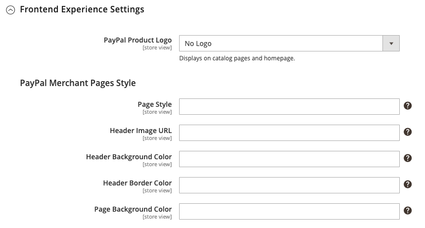

# Paiements PayPal avancés

[PayPal Payments Advanced][4] est une solution [compatible PCI](../getting-started/compliance-pci.md) qui permet à vos clients de payer par carte de débit ou de crédit sans quitter votre site. Il comprend une page de passage en caisse intégrée qui peut être personnalisée pour créer une expérience de passage en caisse transparente et sécurisée.

Même les clients sans compte PayPal peuvent effectuer des achats via la passerelle de paiement sécurisée PayPal. Les cartes de crédit acceptées sont les cartes Visa, MasterCard, Switch/Maestro et Solo aux États-Unis et au Royaume-Uni. Pour plus de commodité, PayPal Express Checkout est inclus avec PayPal Payments Advanced.

>[!IMPORTANT]
>
>**Conditions requises pour PSD2 :**  
>À compter du 14 septembre 2019, les banques européennes pourraient refuser les paiements qui ne répondent pas aux exigences de [PSD2](../getting-started/compliance-payment-services-directive.md). Pour se conformer à PSD2, PayPal Payments Advanced doit être intégré à un plug-in tiers. Pour en savoir plus, consultez la section [3-D Secure for Payflow](https://developer.paypal.com/api/nvp-soap/payflow/3d-secure-mpi/).

>[!NOTE]
>
>PayPal Payments Advanced ne peut pas être utilisé pour les commandes créées à partir de l&#39;administrateur de votre boutique.

## Conditions requises

- [Compte professionnel PayPal][1]
- Si vous gérez plusieurs sites web Adobe Commerce et Magento Open Source, vous devez disposer d’un compte marchand PayPal distinct pour chaque site web.

## Workflow de passage en caisse

1. **Le client choisit le mode de paiement** - Lors du passage en caisse, le client choisit de payer avec PayPal Payments Advanced. Le bouton Payer maintenant s’affiche à la place du bouton Passer une commande .

1. **Payer maintenant** - Le client clique/appuie sur _Payer maintenant_ et un formulaire hébergé par PayPal s’affiche. Le client saisit les informations de la carte, qui sont ensuite vérifiées. En cas de réussite, la page de confirmation de commande s’affiche.

   **Payer avec PayPal** - Le formulaire comprend également le bouton _Payer avec PayPal_, qui redirige le client vers le site PayPal, où le paiement peut être effectué avec PayPal Express Checkout.

1. **Dépannage** - Si la transaction échoue pour une raison quelconque, un message d’erreur s’affiche sur la page de passage en caisse et le client est invité à réessayer. Tous les problèmes sont gérés par PayPal.

## Workflow de traitement des commandes

Le traitement des commandes avec PayPal Payments Advanced est le même que pour toute commande PayPal normale. Les commandes sont facturées et expédiées, et des avoirs générés pour les remboursements en ligne et hors ligne. Cependant, les remboursements multiples en ligne ne sont pas disponibles pour les commandes payées avec PayPal Payments Advanced.

1. **Le client passe une commande** - À la dernière étape du passage en caisse, le client appuie sur le bouton Passer une commande.

1. **PayPal répond** - PayPal évalue la demande. S&#39;il s&#39;avère valide, PayPal traite la transaction.

1. **Commerce définit le statut de la commande** - Commerce reçoit une réponse de PayPal et définit le statut de la commande sur l&#39;un des suivants :

   - **Traitement** - La transaction a réussi.
   - **En attente de paiement** - Le système n&#39;a reçu aucune réponse de PayPal.
   - **Annulée** - La transaction a échoué pour une raison quelconque
   - **Fraude présumée** - La transaction n&#39;a pas réussi certains des [filtres de fraude PayPal](paypal.md#paypal-fraud-management-filters). Le système reçoit la réponse de PayPal indiquant que la transaction est en cours d&#39;examen par le service de fraude.

1. **Le commerçant exécute la commande** - Le commerçant facture et expédie la commande.

## Configuration de votre compte PayPal

Avant de configurer PayPal Payments Advanced dans Commerce, vous devez configurer votre compte sur le site Web PayPal.

1. Connectez-vous à votre [compte professionnel PayPal][2].

1. Accédez à **[!UICONTROL Service Settings]** > **[!UICONTROL Hosted Checkout Pages]** > **[!UICONTROL Set Up Menu]** et définissez les paramètres suivants :

   - **[!UICONTROL AVS]** : `No`
   - **[!UICONTROL CSC]** : `No`
   - **[!UICONTROL Enable Secure Token]** : `Yes`

1. **[!UICONTROL Save]** les paramètres.

   >[!NOTE]
   >
   >Si vous disposez de plusieurs sites Web Commerce, vous devez créer un compte PayPal Payments Advanced distinct pour chacun d&#39;eux.

1. Lorsque vous êtes invité à créer une mise en page, procédez comme suit :

   - En haut de la page, cliquez sur **[!UICONTROL Customize]**.

   - Choisissez **[!UICONTROL Layout C]**.

   - Cliquez sur **[!UICONTROL Save and Publish]**.

1. Configurer un autre utilisateur (recommandé par PayPal) :

   - Connectez-vous à votre [compte professionnel PayPal][2].

   - Pour configurer un autre utilisateur, suivez les instructions.

   - **[!UICONTROL Save]** les modifications.

## Configurer les paiements PayPal avancés dans Commerce

>[!NOTE]
>
>Vous pouvez avoir deux solutions PayPal actives en même temps : Paiement express, ainsi que n&#39;importe quelle solution Tout-en-un ou Passerelle de paiement. Si vous modifiez les solutions de paiement, celle qui a été utilisée précédemment est désactivée.

>[!TIP]
>
>Cliquez sur **[!UICONTROL Save Config]** à tout moment pour enregistrer votre progression.

### Étape 1 : Commencer la configuration

1. Dans la barre latérale _Admin_, accédez à **[!UICONTROL Stores]** > _[!UICONTROL Settings]_>**[!UICONTROL Configuration]**.

1. Dans le panneau de gauche, développez **[!UICONTROL Sales]** et choisissez **[!UICONTROL Payment Methods]**.

1. Si votre installation Commerce comporte plusieurs sites web, boutiques ou vues, définissez **[!UICONTROL Store View]** sur la vue de la boutique dans laquelle vous souhaitez appliquer cette configuration.

1. Dans la section _[!UICONTROL Merchant Location]_, sélectionnez le **[!UICONTROL Merchant Country]**&#x200B;où se trouve votre entreprise.

   Ce paramètre détermine la sélection des solutions PayPal qui apparaissent dans la configuration.

   {width="600" zoomable="yes"}

1. Développez **[!UICONTROL PayPal All-in-One Payment Solution]** et cliquez sur **[!UICONTROL Configure]** pour **[!UICONTROL Payments Advanced]**.

   {width="600" zoomable="yes"}

### Étape 2 : effectuez les paramètres requis

1. Développez  la section **[!UICONTROL Required PayPal Settings]**, si nécessaire.

   {width="600" zoomable="yes"}

1. (Facultatif) Saisissez le **[!UICONTROL Email Associated with your PayPal Merchant Account]**.

   >[!IMPORTANT]
   >
   >Les adresses e-mail respectent la casse. Pour recevoir le paiement, l&#39;adresse e-mail doit correspondre à l&#39;adresse e-mail indiquée dans votre compte marchand PayPal.

   Si vous n&#39;avez pas de compte PayPal, cliquez sur **[!UICONTROL Start accepting payments via PayPal]**.

1. Saisissez l&#39;une des informations d&#39;identification suivantes que vous utilisez pour vous connecter à votre compte marchand PayPal :

   - **[!UICONTROL Partner]** - Votre identifiant de partenaire PayPal.
   - **[!UICONTROL Vendor]** - Votre nom d&#39;utilisateur PayPal.
   - **[!UICONTROL User]** - ID d&#39;un autre utilisateur configuré sur votre compte PayPal.

1. Saisissez le **[!UICONTROL Password]** associé à votre compte PayPal.

1. Pour exécuter des transactions de test, définissez **[!UICONTROL Test Mode]** sur `Yes`.

   Lors du test de la configuration dans un sandbox, utilisez uniquement les [numéros de carte de crédit][3] recommandés par PayPal. Lorsque vous êtes prêt à passer en production, revenez à la configuration et définissez le Mode Test sur `No`.

1. Si votre système utilise un serveur proxy pour établir la connexion au système PayPal, définissez **[!UICONTROL Use Proxy]** sur `Yes` et procédez comme suit :

   - Saisissez l’adresse IP du **[!UICONTROL Proxy Host]**.

   - Saisissez le numéro de port du **[!UICONTROL Proxy Port]**.

     Un proxy est utilisé lorsque le pare-feu du serveur empêche l’accès direct au serveur PayPal. Dans ce cas, un serveur tiers est utilisé pour relayer le trafic.

1. Définissez **[!UICONTROL Enable this Solution]** sur `Yes`.

1. Si vous souhaitez proposer le [crédit PayPal](paypal.md#paypal-credit-and-pay-later) à vos clients, définissez **[!UICONTROL Enable PayPal Credit]** sur `Yes`.

### Étape 3 : Configurer le crédit PayPal publicitaire / Annoncer PayPal PayLater (facultatif)

À partir de la version 2.4.3, PayPal PayLater est pris en charge dans les déploiements qui incluent PayPal. Cette fonctionnalité permet aux acheteurs de payer une commande par versements bimensuels au lieu de payer le montant total au moment de l’achat. L&#39;expérience de crédit PayPal est obsolète.

Définissez **[!UICONTROL Enable PayPal PayLater Experience]** sur l’une des options suivantes :

- `Yes` - Pour configurer Advertiser PayPal PayLater
- `No` - Pour configurer le crédit PayPal Advertising

#### Annoncer le crédit PayPal

1. Développez  la section **[!UICONTROL Advertise PayPal Credit]** .

   {width="600" zoomable="yes"}

1. Pour obtenir les informations relatives à votre compte, cliquez sur **[!UICONTROL Get Publisher ID from PayPal]** et suivez les instructions.

1. Saisissez votre **[!UICONTROL Publisher ID]**.

1. Développez  la section **[!UICONTROL Home Page]** .

1. Pour placer une bannière sur la page, définissez **[!UICONTROL Display]** sur `Yes`.

1. Définissez **[!UICONTROL Position]** sur l’une des options suivantes :

   - `Header (center)`
   - `Sidebar (right)`

1. Définissez **[!UICONTROL Size]** sur l’une des options suivantes :

   - `190 x 100`
   - `234 x 60`
   - `300 x 50`
   - `468 x 60`
   - `728 x 90`
   - `800 x 66`

   {width="600" zoomable="yes"}

1. Développez  les sections restantes et répétez les étapes précédentes :

   - **[!UICONTROL Catalog Category Page]**
   - **[!UICONTROL Catalog Product Page]**
   - **[!UICONTROL Checkout Cart Page]**

#### Annoncer PayPal PayLater

1. Développez  la section **[!UICONTROL Advertise PayPal PayLater]** .

1. Définissez **[!UICONTROL Enable PayPal PayLater]** sur `Yes`.

1. Développez  la section **[!UICONTROL Home Page]** .

1. Pour placer une bannière sur la page, définissez **[!UICONTROL Display]** sur `Yes`.

1. Définissez **[!UICONTROL Position]** sur l’une des options suivantes :

   - `Header (center)`
   - `Sidebar`

1. Définissez **[!UICONTROL Style Layout]** sur l’une des options suivantes :

   - `Text`
   - `Flex`

1. Pour [!UICONTROL Style Layout] **[!UICONTROL Text]** uniquement, définissez **[!UICONTROL Logo Type]** sur l’une des options suivantes :

   - `Primary`
   - `Alternative`
   - `Inline`
   - `None`

1. Pour [!UICONTROL Style Layout] **[!UICONTROL Text]** uniquement, définissez **[!UICONTROL Logo Position]** sur l’une des options suivantes :

   - `Left`
   - `Right`
   - `Top`

1. Pour [!UICONTROL Style Layout] **[!UICONTROL Text]** uniquement, définissez **[!UICONTROL Text Color]** sur l’une des options suivantes :

   - `Black`
   - `White`
   - `Monochrome`
   - `Grayscale`

1. Pour [!UICONTROL Style Layout] **[!UICONTROL Text]** uniquement, définissez **[!UICONTROL Text Size]** sur l’une des options suivantes :

   - `10px`
   - `11px`
   - `12px`
   - `13px`
   - `14px`
   - `15px`
   - `16px`

1. Pour [!UICONTROL Style Layout] **[!UICONTROL Flex]** uniquement, définissez **[!UICONTROL Ratio]** sur l’une des options suivantes :

   - `1x1`
   - `1x4`
   - `8x1`
   - `20x1`

1. Pour [!UICONTROL Style Layout] **[!UICONTROL Flex]** uniquement, définissez **[!UICONTROL Color]** sur l’une des options suivantes :

   - `Blue`
   - `Black`
   - `White`
   - `White No Border`
   - `Gray`
   - `Monochrome`
   - `Grayscale`

   {width="600" zoomable="yes"}

1. Développez  les sections restantes et répétez les étapes précédentes :

   - **[!UICONTROL Catalog Product Page]**
   - **[!UICONTROL Checkout Cart Page]**
   - **[!UICONTROL Checkout Payment Step]**
   - **[!UICONTROL Catalog Category Page]**

### Étape 4 : définition des paramètres de base

1. Développez  la section **[!UICONTROL Basic Settings - PayPal Payments Advanced]**, si nécessaire.

   {width="600" zoomable="yes"}

1. Pour identifier les paiements PayPal avancés lors du passage en caisse, saisissez un **[!UICONTROL Title]**.

   Il est recommandé d’utiliser le titre _Carte de débit ou de crédit_.

1. Si vous proposez plusieurs modes de paiement, saisissez un nombre pour **[!UICONTROL Sort Order]** afin de déterminer l&#39;ordre dans lequel PayPal Payments Advanced apparaît lorsqu&#39;il est répertorié avec d&#39;autres modes de paiement lors de la commande.

   Ce nombre est relatif aux autres modes de paiement. (`0` = premier, `1` = deuxième, `2` = troisième, etc.)

1. Définissez **[!UICONTROL Payment Action]** sur l’une des options suivantes :

   - `Authorization` - Approuve l’achat, mais suspend les fonds. Le montant n&#39;est pas retiré tant qu&#39;il n&#39;est pas _saisi_ par le commerçant.
   - `Sale` - Le montant de l&#39;achat est autorisé et immédiatement retiré du compte du client.

### Étape 5 : définition des paramètres avancés

1. Développez  la section **[!UICONTROL Advanced Settings]** .

   {width="600" zoomable="yes"}

1. Définissez **[!UICONTROL Payment Applicable From]** sur l’une des options suivantes :

   - `All Allowed Countries` - Les clients de tous les [pays](../getting-started/store-details.md#country-options) spécifiés dans la configuration de votre boutique peuvent utiliser ce mode de paiement.
   - `Specific Countries` - Après avoir choisi cette option, la liste des _[!UICONTROL Payment from Specific Countries]_&#x200B;s’affiche. Maintenez la touche Ctrl (PC) ou Commande (Mac) enfoncée et sélectionnez chaque pays dans la liste où les clients peuvent effectuer des achats dans votre boutique.

1. Pour écrire des communications avec le système de paiement dans le fichier journal, définissez **[!UICONTROL Debug Mode]** sur `Yes`.

   Le fichier journal de PayPal Payments Advanced est `payments_payflow_advanced.log`.

   >[!NOTE]
   >
   >Conformément aux normes PCI Data Security, les informations de carte de crédit ne sont pas enregistrées dans le fichier journal.

1. Pour activer la vérification de l’authenticité de l’hôte, définissez **[!UICONTROL Enable SSL Verification]** sur `Yes`.

1. Pour permettre au client de corriger sa saisie du code de sécurité CVV à trois chiffres au verso d&#39;une carte de crédit, définissez **[!UICONTROL CVV Entry is Editable]** sur `Yes`.

1. Pour obliger les clients à saisir un code CVV, définissez **[!UICONTROL Require CVV Entry]** sur `Yes`.

1. Pour envoyer une confirmation du paiement au client, définissez **[!UICONTROL Send Email Confirmation]** sur `Yes`.

1. Pour déterminer la méthode utilisée pour échanger des informations avec le serveur PayPal lors d&#39;une transaction, définissez la **[!UICONTROL URL method for Cancel URL and Return URL]** sur l&#39;une des méthodes suivantes :

   - `GET` - (Par défaut) : récupère les informations issues d’un processus.
   - `POST` - Fournit un bloc de données, telles que des données saisies dans un formulaire, à un processus de gestion des données.

   Les _URL d&#39;annulation_ et _URL de retour_ se rapportent à la page sur laquelle le client revient après avoir effectué ou annulé la partie paiement du processus de passage en caisse sur le serveur PayPal.

1. Renseignez les sections suivantes, selon les besoins de votre boutique :

   - [Paramètres du rapport de règlement](#settlement-report-settings)
   - [Paramètres de l’expérience front-end](#frontend-experience-settings)

#### Paramètres du rapport de règlement

1. Développez  la section **[!UICONTROL Settlement Report Settings]** .

   {width="600" zoomable="yes"}

1. Par **[!UICONTROL SFTP Credentials]**, procédez comme suit :

   - Si vous vous êtes inscrit au serveur FTP sécurisé de PayPal, saisissez les informations d&#39;identification SFTP suivantes :

      - Login
      - Mot de passe

   - Pour exécuter les rapports de test avant la mise en ligne, définissez **[!UICONTROL Sandbox Mode]** sur `Yes`.

   - Saisissez le **[!UICONTROL Custom Endpoint Hostname or IP Address]**.

     Par défaut, la valeur est `reports.paypal.com`.

   - Saisissez le **[!UICONTROL Custom Path]** où les rapports sont enregistrés.

     Par défaut, la valeur est `/ppreports/outgoing`.

1. Pour générer des rapports selon un planning, définissez les paramètres **[!UICONTROL Scheduled Fetching]** :

   - Définissez **[!UICONTROL Enable Automatic Fetching]** sur `Yes`.

   - Définissez **[!UICONTROL Schedule]** sur l’une des options suivantes :

      - `Daily`
      - `Every 3 Days`
      - `Every 7 Days`
      - `Every 10 Days`
      - `Every 14 Days`
      - `Every 30 Days`
      - `Every 40 Days`

     PayPal conserve chaque rapport pendant 45 jours.

   - Définissez **[!UICONTROL Time of Day]** sur l’heure, la minute et la seconde auxquelles vous souhaitez que les rapports soient générés.

#### Paramètres de l’expérience front-end

Utilisez le _[!UICONTROL Frontend Experience Settings]_&#x200B;pour choisir les logos PayPal qui apparaissent sur votre site et personnaliser l&#39;apparence de vos pages marchandes PayPal.

1. Développez  la section **[!UICONTROL Frontend Experience Settings]** .

   {width="600" zoomable="yes"}

1. Sélectionnez les **[!UICONTROL PayPal Product Logo]** qui doivent apparaître dans le bloc PayPal de votre boutique.

   Les logos PayPal sont disponibles en quatre styles et deux tailles :

   - `No Logo`
   - `We Prefer PayPal (150 x 60 or 150 x 40)`
   - `Now Accepting PayPal (150 x 60 or 150 x 40)`
   - `Payments by PayPal (150 x 60 or 150 x 40)`
   - `Shop Now Using PayPal (150 x 60 or 150 x 40)`

1. Pour personnaliser l&#39;apparence de vos pages marchandes PayPal :

   - Saisissez le nom du **[!UICONTROL Page Style]** que vous souhaitez appliquer à vos pages marchandes PayPal :

      - `paypal` - Utilise le style de page PayPal.
      - `primary` - Utilise le style de page que vous avez identifié comme style _principal_ dans le profil de votre compte.
      - `your_custom_value` - Utilise un style de page de paiement personnalisé, spécifié dans le profil de votre compte.

   - Par **[!UICONTROL Header Image URL]**, saisissez l’URL de l’image que vous souhaitez afficher dans le coin supérieur gauche de la page de paiement. La taille de fichier maximale est de 750 pixels de large sur 90 pixels de haut.

   >[!NOTE]
   >
   >PayPal recommande que l&#39;image réside sur un serveur sécurisé (https). Sinon, un navigateur peut vous avertir que _la page contient des éléments sécurisés et non sécurisés_.

   - Pour définir la couleur de vos pages, saisissez le code hexadécimal à six caractères, sans le symbole `#`, pour chacun des éléments suivants :

      - **[!UICONTROL Header Background Color]** - Couleur d’arrière-plan de l’en-tête de la page de passage en caisse.
      - **[!UICONTROL Header Border Color]** : couleur de la bordure de deux pixels autour de l’en-tête.
      - **[!UICONTROL Page Background Color]** - Couleur d’arrière-plan de la page de passage en caisse et autour de l’en-tête et du formulaire de paiement.

### Étape 6 : Complétez les paramètres de base pour PayPal Express Checkout

1. Développez  la section **[!UICONTROL Basic Settings - PayPal Express Checkout]** .

   {width="600" zoomable="yes"}

1. Par **[!UICONTROL Title]**, saisissez un titre qui identifie ce mode de paiement lors du passage en caisse.

   Il est recommandé de définir le titre sur _PayPal_ pour chaque vue de magasin.

1. Si vous proposez plusieurs modes de paiement, saisissez un nombre pour **[!UICONTROL Sort Order]** afin de déterminer l&#39;ordre dans lequel le paiement PayPal Express apparaît lorsqu&#39;il est répertorié avec les autres modes de paiement.

   Ce nombre est relatif aux autres modes de paiement. (`0` = premier, `1` = deuxième, `2` = troisième, etc.)

1. Définissez **[!UICONTROL Payment Action]** sur l’une des options suivantes :

   - `Authorization` - Valide l&#39;achat et met un blocage sur les fonds. Le montant n&#39;est pas retiré tant qu&#39;il n&#39;est pas _saisi_ par le commerçant.
   - `Sale` - Le montant de l&#39;achat est autorisé et immédiatement retiré du compte du client.

1. Pour afficher le bouton _[!UICONTROL Check out with PayPal]_&#x200B;sur la page produit, définissez **[!UICONTROL Display on Product Details Page]**&#x200B;sur `Yes`.

### Étape 7 : Compléter les paramètres avancés - PayPal Express Checkout

1. Développez  la section **[!UICONTROL Advanced Settings]** .

   {width="600" zoomable="yes"}

1. Pour rendre PayPal Express Checkout disponible à partir du panier et du mini panier, définissez **[!UICONTROL Display on Shopping Cart]** sur `Yes`.

1. Définissez **[!UICONTROL Payment Applicable From]** sur l’une des options suivantes :

   - `All Allowed Countries` - Les clients de tous les [pays](../getting-started/store-details.md#country-options) spécifiés dans la configuration de votre boutique peuvent utiliser ce mode de paiement.
   - `Specific Countries` |Après avoir choisi cette option, la liste _Paiement à partir de pays spécifiques_ s’affiche. Maintenez la touche Ctrl (PC) ou Commande (Mac) enfoncée et cliquez sur chaque pays de la liste où les clients peuvent effectuer des achats dans votre boutique.

1. Pour écrire des communications avec le système de paiement dans le fichier journal, définissez **[!UICONTROL Debug Mode]** sur `Yes`.

   >[!NOTE]
   >
   >Conformément aux normes [PCI Data Security Standards](../getting-started/compliance-pci.md), les informations de carte de crédit ne sont pas enregistrées dans le fichier journal.

1. Pour activer la vérification de l’authenticité de l’hôte, définissez **[!UICONTROL Enable SSL Verification]** sur `Yes`.

1. Pour afficher un résumé complet de la commande du client par article de ligne à partir du site PayPal, définissez **[!UICONTROL Transfer Cart Line Items]** sur `Yes`.

1. Pour permettre au client de terminer la transaction à partir du site PayPal sans retourner dans votre magasin pour la révision de commande, définissez **[!UICONTROL Skip Order Review Step]** sur `Yes`.

1. Cliquez ensuite sur **[!UICONTROL Save Config]**.

[1]: https://www.paypal.com/webapps/mpp/how-to-sell-online
[2]: https://manager.paypal.com/
[3]: https://www.paypalobjects.com/en_AU/vhelp/paypalmanager_help/credit_card_numbers.htm
[4]: https://developer.paypal.com/docs/payflow/gs-ppa-hosted-pages/
