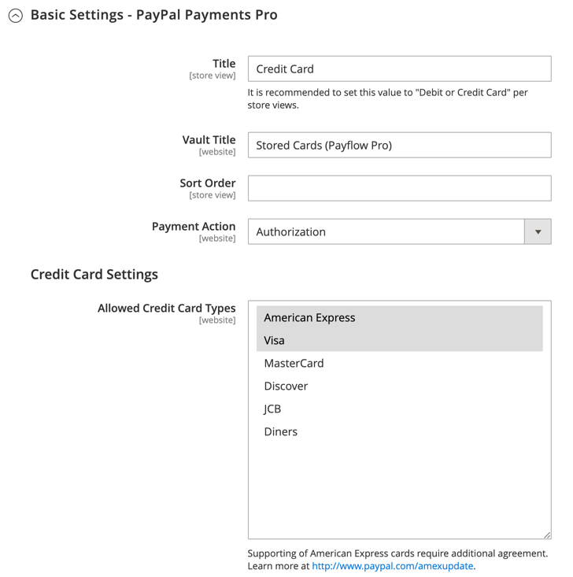
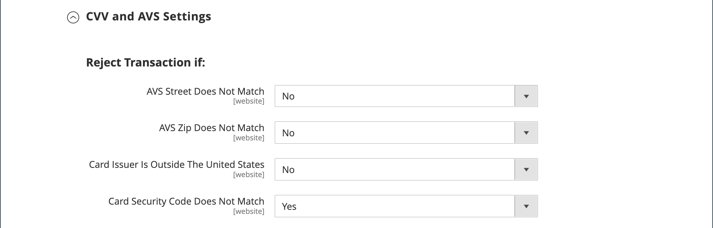

# PayPal payment Pro

[PayPal payment Pro][3] offre tous les avantages d’un compte commercial et d’une passerelle de paiement en un seul, ainsi que la possibilité de créer votre propre expérience de passage en caisse entièrement personnalisée. PayPal Express Checkout est automatiquement activé avec PayPal Payments Pro, ce qui vous permet d’appuyer sur plus de 110 millions d’utilisateurs PayPal actifs.

{width="700" zoomable="yes"}

>[!IMPORTANT]
>
>**Exigences de PSD2 :**  
>À compter du 14 septembre 2019, les banques européennes pourraient refuser les paiements qui ne satisfont pas [PSD2](../getting-started/compliance-payment-services-directive.md) conditions requises. Pour se conformer à PSD2, PayPal payment Pro doit être intégré à un module externe tiers.

>[!NOTE]
>
>Actuellement, PayPal payment Pro est disponible aux États-Unis, au Royaume-Uni et au Canada.

## Conditions

- [Compte marchand PayPal][1] (avec les paiements directs activés)

## Processus de passage en caisse

1. **Le client va au passage en caisse** - Le client ajoute des produits au panier et clique/appuie _Passez à l’extraction_.
1. **Le client choisit le mode de paiement** - Pendant le passage en caisse, le client choisit la variable _Paiement direct PayPal_ et saisit les informations de la carte de crédit.
   - Si vous payez avec PayPal payment Pro, le client reste sur votre site pendant le processus de passage en caisse.
   - Si vous payez avec le paiement express PayPal, le client est redirigé vers le site PayPal pour terminer la transaction.

À la demande du client, l’administrateur du magasin peut également créer une commande auprès de l’administrateur et traiter la transaction avec PayPal payment Pro.

## Workflow de traitement des commandes

1. **Ordre placé** - La commande peut être traitée soit à partir de l’administrateur de votre boutique, soit à partir de votre compte marchand PayPal.

1. **[!UICONTROL Payment Action]** - L’action de paiement spécifiée dans le paramétrage est appliquée à la commande. Les options incluent :

   - **Autoriser** - Commerce crée une commande client avec le _Traitement_ statut. Dans ce cas, le montant à autoriser est en attente d&#39;approbation.
   - **Sale** - Commerce crée à la fois une commande client et une facture.
   - **Capture** - PayPal transfère le montant de la commande du solde client, du compte bancaire ou de la carte de crédit vers le compte marchand.

1. **Facturation** - Une facture est créée dans Commerce après que PayPal a envoyé un message de notification de paiement instantanée à Commerce.

   Assurez-vous que les notifications de paiement instantané sont activées dans votre compte marchand PayPal.

   >[!NOTE]
   >
   >Si nécessaire, une commande peut être partiellement facturée pour une quantité spécifiée de produits. Pour chaque facture partielle envoyée, une transaction de capture distincte avec un identifiant unique est disponible et une facture distincte est générée.

   Les transactions de paiement avec autorisation seule sont fermées uniquement après la saisie du montant total de la commande.

   Une commande peut être annulée en ligne à tout moment jusqu’à ce que le montant de la commande soit entièrement facturé.

1. **Renvoie** - Si le client renvoie les produits achetés et demande un remboursement, comme avec la saisie du montant de la commande et la création des factures, vous pouvez créer un remboursement en ligne depuis l&#39;administrateur ou depuis votre compte marchand PayPal.

## Configuration de votre compte PayPal

Avant de configurer PayPal payment Pro dans Commerce, vous devez configurer votre compte marchand sur le site Web de PayPal.

1. Connectez-vous à [Compte commercial PayPal](https://manager.paypal.com/).

1. Dans le menu Gestionnaire PayPal, sélectionnez **[!UICONTROL Service Settings]**.

1. Sous **[!UICONTROL Hosted Checkout Pages]**, cliquez sur **[!UICONTROL Set Up]**.

1. Sous **[!UICONTROL Choose your settings]**, définit **[!UICONTROL Transaction Process Mode]** to `Live`.

1. Sous **[!UICONTROL Display options on payment page]**, définit **[!UICONTROL Cancel URL Method]** to `POST`.

1. Sous **[!UICONTROL Billing Information]**, sélectionnez le code de sécurité de la carte. **[!UICONTROL CSC]** des cases à cocher pour les champs obligatoires et modifiables.

1. Sous **[!UICONTROL Payment Confirmation]**, définit **[!UICONTROL Return URL Method]** to `POST`.

1. Sous **[!UICONTROL Security Options]**, configurez les éléments suivants :

   - **[!UICONTROL AVS]**: `No`
   - **[!UICONTROL CSC]**: `No`
   - **[!UICONTROL Enable Secure Token]**: `Yes`

1. Cliquez sur **[!UICONTROL Save Changes]**.

1. Dans le _Gestionnaire PayPal_ menu, choisissez **[!UICONTROL Service Settings]** et sous _Pages de passage en caisse hébergées_, choisissez **[!UICONTROL Customize]**.

1. Choisir **[!UICONTROL Layout C]**.

   La disposition C affiche uniquement les champs de carte de crédit et de débit. Elle peut être encadrée sur votre site ou utilisée comme fenêtre contextuelle autonome. La taille est fixée à 490 x 565 pixels, avec un espace supplémentaire pour les messages d’erreur. Sur certains systèmes, ce paramètre corrige un problème de redirection transparente.

1. Cliquez sur **[!UICONTROL Save and Publish]**.

1. Dans le menu Gestionnaire PayPal, sélectionnez **[!UICONTROL Account Administration]**. Sous **[!UICONTROL Manage Security]**, cliquez sur **[!UICONTROL Transaction Settings]**.

1. Définir **[!UICONTROL Allow reference transactions]** to `Yes`.

1. Cliquez sur **[!UICONTROL Confirm]**.

   >[!NOTE]
   >
   >Si vous disposez de plusieurs sites Web Commerce, vous devez créer un compte PayPal Payments Pro distinct pour chacun d’eux.

1. Configurez un autre utilisateur (recommandé par PayPal) :

   - Dans la deuxième ligne du menu principal, cliquez sur **[!UICONTROL Manage Users]**.

   - Pour ajouter un autre utilisateur au compte, cliquez sur **[!UICONTROL Add User]**. Le lien se trouve juste au-dessus du titre Gérer les utilisateurs .

   - Renseignez les champs obligatoires des sections suivantes du _[!UICONTROL Add User]_form :

      - [!UICONTROL Admin Confirmation]
      - [!UICONTROL User Information]
      - [!UICONTROL User Login Information]
      - [!UICONTROL Assign Privilege to User]

   - Cliquez sur **[!UICONTROL Update]**.

1. Veillez à vous déconnecter de votre compte PayPal.

## Configuration de PayPal payment Pro dans Commerce

>[!NOTE]
>
>Deux solutions PayPal peuvent être actives en même temps : [Passage en caisse express PayPal](paypal-express-checkout.md), plus l’un des [solutions tout-en-un](paypal.md#paypal-all-in-one-payment-solutions). Si vous modifiez des solutions de paiement, celle utilisée précédemment est automatiquement désactivée.

>[!TIP]
>
>Cliquez sur **[!UICONTROL Save Config]** à tout moment pour enregistrer votre progression.

### Etape 1 : lancer la configuration

1. Sur le _Administration_ barre latérale, accédez à **[!UICONTROL Stores]** > _[!UICONTROL Settings]_>**[!UICONTROL Configuration]**.

1. Dans le panneau de gauche, développez **[!UICONTROL Sales]** et choisissez **[!UICONTROL Payment Methods]**.

1. Si votre installation Commerce comporte plusieurs sites web, magasins ou vues, définissez **[!UICONTROL Store View]** à la vue magasin dans laquelle vous souhaitez appliquer cette configuration.

1. Dans le _[!UICONTROL Merchant Location]_, sélectionnez **[!UICONTROL Merchant Country]**où se trouve votre entreprise.

   Ce paramètre détermine la sélection des solutions PayPal qui apparaissent dans la configuration.

   {width="600" zoomable="yes"}

1. Développer **[!UICONTROL PayPal All-in-One Payment Solution]** et cliquez sur **[!UICONTROL Configure]** pour **[!UICONTROL Payments Pro]**.

   {width="600" zoomable="yes"}

### Étape 2 : Remplir les paramètres PayPal requis

1. Développer  la valeur **[!UICONTROL Payments Pro and Express Checkout]** .

   {width="600" zoomable="yes"}

1. (Facultatif) Saisissez la variable **[!UICONTROL Email Associated with your PayPal Merchant Account]**.

   >[!IMPORTANT]
   >
   >Les adresses électroniques sont sensibles à la casse. Pour recevoir le paiement, l’adresse électronique doit correspondre à l’adresse électronique spécifiée dans votre compte marchand PayPal.

   Si vous ne disposez pas d’un compte PayPal, cliquez sur **[!UICONTROL Start accepting payments via PayPal]**.

1. Saisissez l’une des informations d’identification suivantes que vous utilisez pour vous connecter à votre compte marchand PayPal :

   - **[!UICONTROL Partner]** - Votre identifiant de partenaire PayPal.
   - **[!UICONTROL Vendor]** - Votre nom d’utilisateur PayPal.
   - **[!UICONTROL User]** - Identifiant d’un autre utilisateur configuré sur votre compte PayPal.

1. Saisissez le **[!UICONTROL Password]** qui est associé à votre compte PayPal.

1. Pour exécuter des transactions de test, définissez **[!UICONTROL Test Mode]** to `Yes`.

   Lors du test de la configuration dans un environnement de test, utilisez uniquement [numéros de carte de crédit][2] qui sont recommandés par PayPal. Lorsque vous êtes prêt à passer en production, revenez à la configuration et définissez le mode test sur `No`.

1. Si votre système utilise un serveur proxy pour établir la connexion au système PayPal, définissez **[!UICONTROL Use Proxy]** to `Yes` et procédez comme suit :

   - Saisissez l’adresse IP du **[!UICONTROL Proxy Host]**.

   - Saisissez le numéro de port du **[!UICONTROL Proxy Port]**.

   Un proxy est utilisé lorsque le pare-feu du serveur empêche l’accès direct au serveur PayPal. Dans ce cas, un serveur tiers est utilisé pour relayer le trafic.

1. Définir **[!UICONTROL Enable this Solution]** to `Yes`.

1. Si vous souhaitez proposer [Crédit PayPal](paypal.md#paypal-credit-and-pay-later) à vos clients, définissez **[!UICONTROL Enable PayPal Credit]** to `Yes`.

1. Si vous souhaitez stocker en toute sécurité les informations de paiement/carte de crédit des clients, de sorte que les clients n’aient pas à saisir à nouveau les informations de paiement, définissez **[!UICONTROL Vault Enabled]** to `Yes`.

### Étape 3 : configuration du crédit PayPal de publicité/de la publicité PayPal de publicité (facultatif)

À compter de la version 2.4.3, PayPal PayLater est pris en charge dans les déploiements qui incluent PayPal. Cette fonctionnalité permet aux acheteurs de payer une commande par versements bimensuels au lieu de payer le montant complet au moment de l’achat. L’expérience de crédit PayPal est obsolète.

Définir **[!UICONTROL Enable PayPal PayLater Experience]** à l’une des options suivantes :

- `Yes` - Pour configurer Advertising PayPal PayLater
- `No` - Pour configurer le crédit Advertising PayPal

#### Publicité Crédit PayPal

1. Développer  la valeur **[!UICONTROL Advertise PayPal Credit]** .

   {width="600" zoomable="yes"}

1. Pour obtenir les informations sur votre compte, cliquez sur **[!UICONTROL Get Publisher ID from PayPal]** et suivez les instructions.

1. Saisissez votre **[!UICONTROL Publisher ID]**.

1. Développer  la valeur **[!UICONTROL Home Page]** .

   {width="600" zoomable="yes"}

1. Pour placer une bannière sur la page, définissez **[!UICONTROL Display]** to `Yes`.

1. Définir **[!UICONTROL Position]** à l’une des options suivantes :

   - `Header (center)`
   - `Sidebar (right)`

1. Définir **[!UICONTROL Size]** à l’une des options suivantes :

   - `190 x 100`
   - `234 x 60`
   - `300 x 50`
   - `468 x 60`
   - `728 x 90`
   - `800 x 66`

1. Développer  les sections restantes et répétez les étapes précédentes :

   - **[!UICONTROL Catalog Category Page]**
   - **[!UICONTROL Catalog Product Page]**
   - **[!UICONTROL Checkout Cart Page]**

#### Publicité PayPal PayLater

1. Développer  la valeur **[!UICONTROL Advertise PayPal PayLater]** .

1. Définir **[!UICONTROL Enable PayPal PayLater]** to `Yes`.

1. Développer  la valeur **[!UICONTROL Home Page]** .

   {width="600" zoomable="yes"}

1. Pour placer une bannière sur la page, définissez **[!UICONTROL Display]** to `Yes`.

1. Définir **[!UICONTROL Position]** à l’une des options suivantes :

   - `Header (center)`
   - `Sidebar`

1. Définir **[!UICONTROL Style Layout]** à l’une des options suivantes :

   - `Text`
   - `Flex`

1. Pour [!UICONTROL Style Layout] **[!UICONTROL Text]** uniquement, défini **[!UICONTROL Logo Type]** à l’une des options suivantes :

   - `Primary`
   - `Alternative`
   - `Inline`
   - `None`

1. Pour [!UICONTROL Style Layout] **[!UICONTROL Text]** uniquement, défini **[!UICONTROL Logo Position]** à l’une des options suivantes :

   - `Left`
   - `Right`
   - `Top`

1. Pour [!UICONTROL Style Layout] **[!UICONTROL Text]** uniquement, défini **[!UICONTROL Text Color]** à l’une des options suivantes :

   - `Black`
   - `White`
   - `Monochrome`
   - `Grayscale`

1. Pour [!UICONTROL Style Layout] **[!UICONTROL Text]** uniquement, défini **[!UICONTROL Text Size]** à l’une des options suivantes :

   - `10px`
   - `11px`
   - `12px`
   - `13px`
   - `14px`
   - `15px`
   - `16px`

1. Pour [!UICONTROL Style Layout] **[!UICONTROL Flex]** uniquement, défini **[!UICONTROL Ratio]** à l’une des options suivantes :

   - `1x1`
   - `1x4`
   - `8x1`
   - `20x1`

1. Pour [!UICONTROL Style Layout] **[!UICONTROL Flex]** uniquement, défini **[!UICONTROL Color]** à l’une des options suivantes :

   - `Blue`
   - `Black`
   - `White`
   - `White No Border`
   - `Gray`
   - `Monochrome`
   - `Grayscale`

1. Développer  les sections restantes et répétez les étapes précédentes :

   - **[!UICONTROL Catalog Product Page]**
   - **[!UICONTROL Checkout Cart Page]**
   - **[!UICONTROL Checkout Payment Step]**
   - **[!UICONTROL Catalog Category Page]**

### Étape 4 : définition des paramètres de base

1. Développer  la valeur **[!UICONTROL Basic Settings - PayPal Payments Pro]** .

   {width="600" zoomable="yes"}

1. Pour **[!UICONTROL Title]**, saisissez un titre qui identifie PayPal payment Pro lors du passage en caisse.

   Il est recommandé d’utiliser le titre _Carte de débit ou carte de crédit_.

1. Si vous proposez plusieurs modes de paiement, saisissez un nombre pour **[!UICONTROL Sort Order]** pour déterminer la séquence dans laquelle PayPal payment Pro apparaît lorsqu’il est répertorié avec d’autres méthodes de paiement lors du passage en caisse.

   Ce nombre est relatif aux autres modes de paiement. (`0` = first, `1` = second, `2` = troisième, etc.)

1. Définir **[!UICONTROL Payment Action]** à l’une des options suivantes :

   - `Authorization` - Valide l’achat, mais met un frein aux fonds. Le montant n&#39;est pas retiré tant qu&#39;il n&#39;est pas _capturé_ par le marchand.
   - `Sale` - Le montant de l’achat est autorisé et immédiatement retiré du compte du client.

1. Pour **[!UICONTROL Credit Card Settings]**, sélectionnez les cartes de crédit que vous acceptez pour paiement dans votre boutique.

   Pour sélectionner plusieurs cartes, maintenez la touche Ctrl (PC) ou la touche Commande (Mac) enfoncée, puis cliquez sur chacune d’elles.

   >[!NOTE]
   >
   >American Express requiert un accord supplémentaire.

### Étape 5 : définition des paramètres avancés

1. Développer  la valeur **[!UICONTROL Advanced Settings]** .

   {width="600" zoomable="yes"}

1. Définir **[!UICONTROL Payment Applicable From]** à l’une des options suivantes :

   - `All Allowed Countries` - Clients de tous les [pays](../getting-started/store-details.md#country-options) spécifié dans votre configuration de magasin peut utiliser ce mode de paiement.
   - `Specific Countries` - Après avoir choisi cette option, la variable _[!UICONTROL Payment from Specific Countries]_s’affiche. Maintenez la touche Ctrl (PC) ou Commande (Mac) enfoncée et sélectionnez chaque pays de la liste dans lequel les clients peuvent effectuer des achats dans votre boutique.

1. Pour écrire des communications avec le système de paiement dans le fichier journal, définissez **[!UICONTROL Debug Mode]** to `Yes`.

   >[!NOTE]
   >
   >Conformément aux normes de sécurité des données PCI, les informations de carte de crédit ne sont pas enregistrées dans le fichier journal.

1. Pour activer la vérification de l’authentification de l’hôte, définissez **[!UICONTROL Enable SSL Verification]** to `Yes`.

1. Pour obliger les clients à saisir un code CVV, définissez **[!UICONTROL Require CVV Entry]** to `Yes`.

1. Développer  la valeur **[!UICONTROL CVV and AVS Settings]** .

1. Pour déterminer quand une transaction doit être refusée lorsque le système de vérification des adresses identifie une incohérence, indiquez comment gérer chacun des scénarios suivants :

   - Pour rejeter une transaction basée sur une discordance de rue discordante, définissez **[!UICONTROL AVS Street Does Not Match]** to `Yes`.

   - Pour rejeter une transaction basée sur un code postal non compatible, définissez **[!UICONTROL AVS Zip Does Not Match]** to `Yes`.

   - Pour rejeter une transaction en fonction d’un identifiant de pays discordant, définissez **[!UICONTROL International AVS Indicator Does Not Match]** to `Yes`.

   - Pour rejeter une transaction basée sur un code CVV discordant, définissez **[!UICONTROL International Card Security Code Does Not Match]** to `Yes`.

   {width="600" zoomable="yes"}

1. Renseignez les sections suivantes, selon les besoins pour votre magasin :

   - [Paramètres du rapport de règlement](#settlement-report-settings)
   - [Paramètres de l’expérience frontale](#frontend-experience-settings)

#### Paramètres du rapport de règlement

1. Développer  la valeur **[!UICONTROL Settlement Report Settings]** .

   {width="600" zoomable="yes"}

1. Pour **[!UICONTROL SFTP Credentials]**, procédez comme suit :

   - Si vous vous êtes inscrit au serveur FTP sécurisé de PayPal, saisissez les informations d’identification de connexion SFTP suivantes :

      - Connexion
      - Mot de passe

   - Pour exécuter des rapports de test avant de passer en ligne avec Paiements Pro sur votre site, définissez **[!UICONTROL Sandbox Mode]** to `Yes`.

   - Saisissez le **[!UICONTROL Custom Endpoint Hostname or IP Address]**.

     Par défaut, la valeur est `reports.paypal.com`.

   - Saisissez le **[!UICONTROL Custom Path]** où les rapports sont enregistrés.

     Par défaut, la valeur est `/ppreports/outgoing`.

1. Pour générer des rapports selon un calendrier précis, renseignez les **[!UICONTROL Scheduled Fetching]** settings :

   - Définir **[!UICONTROL Enable Automatic Fetching]** to `Yes`.

   - Définir **[!UICONTROL Schedule]** à l’une des options suivantes :

      - `Daily`
      - `Every 3 Days`
      - `Every 7 Days`
      - `Every 10 Days`
      - `Every 14 Days`
      - `Every 30 Days`
      - `Every 40 Days`

     PayPal conserve chaque rapport pendant 45 jours.

   - Définir **[!UICONTROL Time of Day]** à l’heure, à la minute et à la seconde auxquelles les rapports doivent être générés.

#### Paramètres de l’expérience frontale

Utilisez la variable _[!UICONTROL Frontend Experience Settings]_pour choisir les logos PayPal qui apparaissent sur votre site et personnaliser l’aspect de vos pages marchandes PayPal.

1. Développer  la valeur **[!UICONTROL Frontend Experience Settings]** .

   {width="600" zoomable="yes"}

1. Sélectionnez la variable **[!UICONTROL PayPal Product Logo]** que vous souhaitez voir apparaître dans le bloc PayPal de votre magasin.

   Les logos PayPal sont disponibles en quatre styles et deux tailles :

   - `No Logo`
   - `We Prefer PayPal (150 x 60 or 150 x 40)`
   - `Now Accepting PayPal (150 x 60 or 150 x 40)`
   - `Payments by PayPal (150 x 60 or 150 x 40)`
   - `Shop Now Using PayPal (150 x 60 or 150 x 40)`

1. Pour personnaliser l’aspect de vos pages marchandes PayPal, procédez comme suit :

   - Saisissez le nom du **[!UICONTROL Page Style]** que vous souhaitez appliquer à vos pages marchandes PayPal :

      - `paypal` - Utilise le style de page PayPal.
      - `primary` : permet d’utiliser le style de page que vous avez identifié comme _primary_ style dans votre profil de compte.
      - `your_custom_value` - Utilise un style de page de paiement personnalisé, qui est spécifié dans votre profil de compte.

   - Pour **[!UICONTROL Header Image URL]**, saisissez l’URL de l’image que vous souhaitez voir apparaître dans le coin supérieur gauche de la page de paiement. La taille de fichier maximale est de 750 pixels de large par 90 pixels de haut.

     >[!NOTE]
     >
     >PayPal recommande que l’image réside sur un serveur sécurisé (https). Sinon, un navigateur peut avertir que _la page contient des éléments sécurisés et non sécurisés._.

   - Pour définir la couleur de vos pages, saisissez le code hexadécimal à six caractères, sans le champ `#` pour chacun des symboles suivants :

      - **[!UICONTROL Header Background Color]** - Couleur d’arrière-plan de l’en-tête de la page de passage en caisse.
      - **[!UICONTROL Header Border Color]** - Couleur de bordure de deux pixels autour de l’en-tête.
      - **[!UICONTROL Page Background Color]** - Couleur d’arrière-plan de la page de passage en caisse et autour de l’en-tête et du formulaire de paiement.

### Étape 6 : renseigner les paramètres de base pour le paiement express PayPal

1. Développer  la valeur **[!UICONTROL Basic Settings - PayPal Express Checkout]** .

   {width="600" zoomable="yes"}

1. Pour **[!UICONTROL Title]**, saisissez un titre qui identifie ce mode de paiement lors du passage en caisse.

   Définir le titre sur _PayPal_ pour chaque vue de magasin est recommandée.

1. Si vous proposez plusieurs modes de paiement, saisissez un nombre pour **[!UICONTROL Sort Order]** pour déterminer la séquence dans laquelle le paiement express PayPal apparaît lorsqu’il est répertorié avec les autres méthodes de paiement.

   Ce nombre est relatif aux autres modes de paiement. (`0` = first, `1` = second, `2` = troisième, etc.)

1. Définir **[!UICONTROL Payment Action]** à l’une des options suivantes :

   - `Authorization` - Valide l&#39;achat et met un frein aux fonds. Le montant n&#39;est pas retiré tant qu&#39;il n&#39;est pas _capturé_ par le marchand.
   - `Sale` - Le montant de l’achat est autorisé et immédiatement retiré du compte du client.

1. Pour afficher la variable _[!UICONTROL Check out with PayPal]_sur la page produit, définissez **[!UICONTROL Display on Product Details Page]**to `Yes`.

### Étape 7 : Définition des paramètres avancés du paiement express PayPal

1. Développer  la valeur **[!UICONTROL Advanced Settings]** .

   {width="600" zoomable="yes"}

1. Définir **[!UICONTROL Display on Shopping Cart]** to `Yes`.

1. Définir **[!UICONTROL Payment Applicable From]** à l’une des options suivantes :

   - `All Allowed Countries` - Clients de tous les [pays](../getting-started/store-details.md#country-options) spécifié dans votre configuration de magasin peut utiliser ce mode de paiement.
   - `Specific Countries` - Après avoir choisi cette option, la variable _[!UICONTROL Payment from Specific Countries]_s’affiche. Pour sélectionner plusieurs pays, maintenez la touche Ctrl (PC) ou la touche Commande (Mac) enfoncée, puis cliquez sur chaque élément.

1. Pour écrire des communications avec le système de paiement dans le fichier journal, définissez **[!UICONTROL Debug Mode]** to `Yes`.

   >[!NOTE]
   >
   >Conformément aux normes de sécurité des données PCI, les informations de carte de crédit ne sont pas enregistrées dans le fichier journal.

1. Pour activer la vérification de l’authentification de l’hôte, définissez **[!UICONTROL Enable SSL Verification]** to `Yes`.

1. Pour afficher un résumé complet de la commande client par article sur le site PayPal, définissez **[!UICONTROL Transfer Cart Line Items]** to `Yes`.

1. Pour permettre au client de terminer la transaction à partir du site PayPal sans retourner dans votre magasin pour la consultation de la commande, définissez **[!UICONTROL Skip Order Review Step]** to `Yes`.

1. Lorsque vous avez terminé, cliquez sur **[!UICONTROL Save Config]**.

[1]: https://www.paypal.com/webapps/mpp/how-to-sell-online
[2]: https://www.paypalobjects.com/en_AU/vhelp/paypalmanager_help/credit_card_numbers.htm
[3]: https://developer.paypal.com/docs/paypal-payments-pro/
