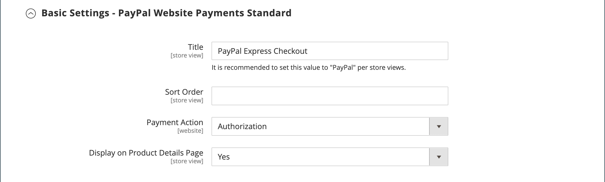

# Paiements PayPal Standard

[PayPal Payments Standard](https://developer.paypal.com/docs/paypal-payments-standard/mobile-paypal-payments-standard/) est le moyen le plus simple d&#39;accepter des paiements en ligne. Vous pouvez offrir à vos clients la commodité du paiement par carte de crédit et PayPal en ajoutant simplement un bouton de passage en caisse à votre boutique.

>[!NOTE]
>
>Pour les commerçants en dehors des États-Unis, il est appelé _PayPal Website Payments Standard_.

Avec PayPal Payments Standard, vous pouvez faire glisser les cartes de crédit sur les appareils mobiles. Il n&#39;y a pas de frais mensuels et vous pouvez être payé via eBay. Les cartes de crédit prises en charge sont Visa, MasterCard, Discover et American Express. En outre, les clients peuvent payer directement à partir de leurs comptes PayPal personnels. PayPal Payments Standard est disponible dans tous les pays sur la liste de référence mondiale de PayPal.

>[!IMPORTANT]
>
>**Conditions requises pour PSD2 :**  
>À compter du 14 septembre 2019, les banques européennes pourraient refuser les paiements qui ne répondent pas aux exigences de [PSD2](../getting-started/compliance-payment-services-directive.md). Aucune action n&#39;est nécessaire pour que PayPal Payments Standard se conforme à PSD2, car toutes les exigences sont gérées par PayPal.

## Exigences des commerçants

- [Compte professionnel PayPal](https://www.paypal.com/webapps/mpp/how-to-sell-online)

## Workflow de passage en caisse

Pour les clients, PayPal Payments Standard est un processus en une étape si les informations de carte de crédit sur leurs comptes PayPal personnels sont à jour.

1. **Le client passe une commande** - Le client clique/appuie sur le bouton _Payer maintenant_ pour terminer l’achat.

1. **PayPal traite la transaction** - Le client est redirigé vers le site PayPal pour terminer la transaction.

## Configurer PayPal Payments Standard

>[!NOTE]
>
>PayPal Payments Standard ne peut pas être utilisé simultanément avec toute autre méthode PayPal, y compris le paiement express. Si vous modifiez les solutions de paiement, celle utilisée précédemment est désactivée.

>[!TIP]
>
>Cliquez sur **[!UICONTROL Save Config]** à tout moment pour enregistrer votre progression.

### Étape 1 : Commencer la configuration

Cette méthode de configuration suppose que vous disposez d&#39;un compte PayPal existant.

1. Dans la barre latérale _Admin_, accédez à **[!UICONTROL Stores]** > _[!UICONTROL Settings]_>**[!UICONTROL Configuration]**.

1. Dans le panneau de gauche, développez **[!UICONTROL Sales]** et choisissez **[!UICONTROL Payment Methods]**.

1. Si votre installation Commerce comporte plusieurs sites web, boutiques ou vues, définissez **[!UICONTROL Store View]** sur la vue de la boutique dans laquelle vous souhaitez appliquer cette configuration.

1. Dans la section _[!UICONTROL Merchant Location]_, sélectionnez le **[!UICONTROL Merchant Country]**&#x200B;où se trouve votre entreprise.

   Ce paramètre détermine la sélection des solutions PayPal qui apparaissent dans la configuration.

   {width="600" zoomable="yes"}

1. Développez **[!UICONTROL PayPal All-in-One Payment Solutions]** et cliquez sur **[!UICONTROL Configure]** pour **[!UICONTROL Payments Standard]**.

   {width="700" zoomable="yes"}

### Étape 2 : activer et connecter votre compte PayPal

{width="600" zoomable="yes"}

1. Connectez votre compte à des fins de test ou de production :

   - Pour le mode test (développement) , cliquez sur **[!UICONTROL Sandbox Credentials]** et saisissez vos informations d’identification [sandbox PayPal](https://developer.paypal.com/docs/api-basics/sandbox/).
   - Pour le mode de production, cliquez sur **[!UICONTROL Connect with PayPal]** et saisissez les informations d’identification de votre compte de production.

   Une fois votre connexion validée, vous pouvez continuer.

1. Définissez **[!UICONTROL Enable this Solution]** sur `Yes`.

1. Si vous souhaitez proposer le [crédit PayPal](paypal.md#paypal-credit-and-pay-later) à vos clients, définissez **[!UICONTROL Enable PayPal Credit]** sur `Yes`.

### Étape 3 : remplir les paramètres de Payments Standard

1. Développez  la section **[!UICONTROL Payments Standard]** .

   {width="600" zoomable="yes"}

1. Saisissez le **[!UICONTROL Email Associated with your PayPal Merchant Account]**.

   >[!IMPORTANT]
   >
   >Les adresses e-mail respectent la casse. Pour recevoir le paiement, l&#39;adresse e-mail que vous entrez doit correspondre à l&#39;adresse e-mail indiquée dans votre compte marchand PayPal.

   Si vous n&#39;avez pas de compte PayPal, cliquez sur **[!UICONTROL Start accepting payments via PayPal]**.

1. Définissez **[!UICONTROL API Authentication Methods]** sur l’une des options suivantes :

   - `API Signature` - Cette méthode d&#39;authentification PayPal est la plus simple à mettre en œuvre et est basée sur votre nom d&#39;utilisateur, mot de passe et une chaîne unique de caractères et de chiffres qui identifie votre compte. Les informations d’identification de signature API n’expirent pas.
   - `API Certificate` - Cette méthode d&#39;authentification PayPal est plus sécurisée, est basée sur votre nom d&#39;utilisateur, votre mot de passe et un certificat téléchargeable. Les informations d’identification d’API expirent au bout de trois ans et doivent être renouvelées.

   Si nécessaire, effectuez les opérations suivantes :

   - **[!UICONTROL API Username]**
   - **[!UICONTROL API Password]**
   - **[!UICONTROL API Signature]**

1. Si vous utilisez des informations d’identification provenant de votre compte sandbox, définissez **[!UICONTROL Sandbox Mode]** sur `Yes`.

   Lors du test de la configuration dans un sandbox, utilisez uniquement les [numéros de carte de crédit](https://www.paypalobjects.com/en_AU/vhelp/paypalmanager_help/credit_card_numbers.htm) recommandés par PayPal. Lorsque vous êtes prêt à passer en production, revenez à la configuration et définissez le mode Sandbox sur `No` et connectez-vous à votre compte PayPal de production.

1. Si votre système utilise un serveur proxy pour établir la connexion entre Adobe Commerce ou Magento Open Source et le système de paiement PayPal, définissez **[!UICONTROL API Uses Proxy]** sur `Yes` et effectuez les opérations suivantes :

   - **[!UICONTROL Proxy Host]**
   - **[!UICONTROL Proxy Port]**

### Étape 4 : Configurer le crédit PayPal publicitaire / Annoncer PayPal PayLater (facultatif)

À partir de la version 2.4.3, PayPal PayLater est pris en charge dans les déploiements qui incluent PayPal. Cette fonctionnalité permet aux acheteurs de payer une commande par versements bimensuels au lieu de payer le montant total au moment de l’achat. L&#39;expérience de crédit PayPal est obsolète.

Définissez **[!UICONTROL Enable PayPal PayLater Experience]** sur l’une des options suivantes :

- `Yes` - Pour configurer Advertiser PayPal PayLater
- `No` - Pour configurer le crédit PayPal Advertising

#### Annoncer le crédit PayPal

1. Développez  la section **[!UICONTROL Advertise PayPal Credit]** .

   {width="600" zoomable="yes"}

1. Pour obtenir les informations relatives à votre compte, cliquez sur **[!UICONTROL Get Publisher ID from PayPal]** et suivez les instructions.

1. Saisissez votre **[!UICONTROL Publisher ID]**.

   {width="600" zoomable="yes"}

1. Développez  la section **[!UICONTROL Home Page]** .

1. Pour placer une bannière sur la page, définissez **[!UICONTROL Display]** sur `Yes`.

1. Définissez **[!UICONTROL Position]** sur l’une des options suivantes :

   - `Header (center)`
   - `Sidebar (right)`

1. Définissez **[!UICONTROL Size]** sur l’une des options suivantes :

   - `190 x 100`
   - `234 x 60`
   - `300 x 50`
   - `468 x 60`
   - `728 x 90`
   - `800 x 66`

1. Développez  les sections restantes et répétez les étapes précédentes :

   - **[!UICONTROL Catalog Category Page]**
   - **[!UICONTROL Catalog Product Page]**
   - **[!UICONTROL Checkout Cart Page]**

#### Annoncer PayPal PayLater

1. Développez  la section **[!UICONTROL Advertise PayPal PayLater]** .

1. Définissez **[!UICONTROL Enable PayPal PayLater]** sur `Yes`.

1. Développez  la section **[!UICONTROL Home Page]** .

   {width="600" zoomable="yes"}

1. Pour placer une bannière sur la page, définissez **[!UICONTROL Display]** sur `Yes`.

1. Définissez **[!UICONTROL Position]** sur l’une des options suivantes :

   - `Header (center)`
   - `Sidebar`

1. Définissez **[!UICONTROL Style Layout]** sur l’une des options suivantes :

   - `Text`
   - `Flex`

1. Pour [!UICONTROL Style Layout] **[!UICONTROL Text]** uniquement, définissez **[!UICONTROL Logo Type]** sur l’une des options suivantes :

   - `Primary`
   - `Alternative`
   - `Inline`
   - `None`

1. Pour [!UICONTROL Style Layout] **[!UICONTROL Text]** uniquement, définissez **[!UICONTROL Logo Position]** sur l’une des options suivantes :

   - `Left`
   - `Right`
   - `Top`

1. Pour [!UICONTROL Style Layout] **[!UICONTROL Text]** uniquement, définissez **[!UICONTROL Text Color]** sur l’une des options suivantes :

   - `Black`
   - `White`
   - `Monochrome`
   - `Grayscale`

1. Pour [!UICONTROL Style Layout] **[!UICONTROL Text]** uniquement, définissez **[!UICONTROL Text Size]** sur l’une des options suivantes :

   - `10px`
   - `11px`
   - `12px`
   - `13px`
   - `14px`
   - `15px`
   - `16px`

1. Pour [!UICONTROL Style Layout] **[!UICONTROL Flex]** uniquement, définissez **[!UICONTROL Ratio]** sur l’une des options suivantes :

   - `1x1`
   - `1x4`
   - `8x1`
   - `20x1`

1. Pour [!UICONTROL Style Layout] **[!UICONTROL Flex]** uniquement, définissez **[!UICONTROL Color]** sur l’une des options suivantes :

   - `Blue`
   - `Black`
   - `White`
   - `White No Border`
   - `Gray`
   - `Monochrome`
   - `Grayscale`

1. Développez  les sections restantes et répétez les étapes précédentes :

   - **[!UICONTROL Catalog Product Page]**
   - **[!UICONTROL Checkout Cart Page]**
   - **Étape de paiement de la commande**
   - **[!UICONTROL Catalog Category Page]**

### Étape 5 : définition des paramètres de base

1. Développez  la section **[!UICONTROL Basic Settings - PayPal Website Payments Standard]** .

   {width="600" zoomable="yes"}

1. Par **[!UICONTROL Title]**, saisissez un titre qui identifie ce mode de paiement lors du passage en caisse.

   Il est recommandé d’utiliser le titre _PayPal_ pour toutes les vues de la boutique.

1. Si vous proposez plusieurs modes de paiement, saisissez un nombre pour **[!UICONTROL Sort Order]** afin de déterminer l&#39;ordre dans lequel PayPal Payments Standard apparaît lorsqu&#39;il est répertorié avec les autres modes de paiement.

   Ce nombre est relatif aux autres modes de paiement. (`0` = premier, `1` = deuxième, `2` = troisième, etc.)

1. Définissez **[!UICONTROL Payment Action]** sur l’une des options suivantes :

   - `Authorization` - Valide l&#39;achat et met un blocage sur les fonds. Le montant n&#39;est pas retiré tant qu&#39;il n&#39;est pas saisi par le commerçant.
   - `Sale` - Le montant de l&#39;achat est autorisé et immédiatement retiré du compte du client.

1. Pour afficher le bouton _[!UICONTROL Check out with PayPal]_&#x200B;sur la page produit, définissez **[!UICONTROL Display on Product Details Page]**&#x200B;sur `Yes`.

### Étape 6 : définition des paramètres avancés

1. Développez  la section **[!UICONTROL Advanced Settings]** .

   {width="600" zoomable="yes"}

1. Pour rendre PayPal Payments Standard disponible à partir du panier et du mini panier, définissez **[!UICONTROL Display on Shopping Cart]** sur `Yes`.

1. Définissez **[!UICONTROL Payment from Applicable Countries]** sur l’une des options suivantes :

   - `All Allowed Countries` - Les clients de tous les [pays](../getting-started/store-details.md#country-options) spécifiés dans la configuration de votre boutique peuvent utiliser ce mode de paiement.
   - `Specific Countries` - Une fois cette option sélectionnée, la liste des _[!UICONTROL Payment from Specific Countries]_&#x200B;s’affiche. Pour sélectionner plusieurs pays, maintenez la touche Ctrl (PC) ou Commande (Mac) enfoncée et cliquez sur chaque option.

1. Pour enregistrer les communications avec le système de paiement dans le fichier journal, **[!UICONTROL Debug Mode]** sur `Yes`.

   >[!NOTE]
   >
   >Le fichier journal est stocké sur le serveur et n’est accessible que par les développeurs. Conformément aux normes PCI Data Security, les informations de carte de crédit ne sont pas enregistrées dans le fichier journal.

1. Pour activer la vérification SSL, définissez **[!UICONTROL Enable SSL Verification]** sur `Yes`.

1. Pour afficher une synthèse de chaque article de la commande sur votre page de paiements PayPal, définissez **[!UICONTROL Transfer Cart Line Items]** sur `Yes`.

   Pour inclure jusqu’à dix options d’expédition dans le résumé, définissez **[!UICONTROL Transfer Shipping Options]** sur `Yes`. (Cette option s&#39;affiche uniquement si les lignes sont définies pour le transfert.)

1. Pour déterminer le type d&#39;image utilisé pour le bouton d&#39;acceptation PayPal, définissez **[!UICONTROL Shortcut Buttons Flavor]** sur l&#39;une des options suivantes :

   - `Dynamic` - (Recommandé) Affiche une image qui peut être modifiée dynamiquement à partir du serveur PayPal.
   - `Static` - Affiche une image spécifique qui ne peut pas être modifiée dynamiquement.

1. Pour permettre aux clients qui n&#39;ont pas de compte PayPal d&#39;effectuer un achat avec cette méthode, définissez **[!UICONTROL Enable PayPal Guest Checkout]** sur `Yes`.

1. Définissez **[!UICONTROL Require Customer's Billing Address]** sur l’une des options suivantes :

   - `Yes` - Nécessite l’adresse de facturation du client pour tous les achats.
   - `No` - Ne nécessite pas l’adresse de facturation du client pour les achats.
   - `For Virtual Quotes Only` - Exige l&#39;adresse de facturation du client pour les devis virtuels uniquement.

1. Pour permettre à un client de conclure un contrat de facturation [PayPal](paypal-billing-agreements.md) avec votre boutique en l&#39;absence de contrat de facturation actif dans le compte client, définissez **[!UICONTROL Billing Agreement Signup]** sur l&#39;un des éléments suivants :

   - `Auto` - Le client peut conclure un accord de facturation pendant le flux de paiement express ou utiliser un autre mode de paiement.
   - `Ask Customer` - Le client peut décider de conclure ou non un accord de facturation au cours du processus de passage en caisse express.
   - `Never` - Le client ne peut pas conclure d&#39;accord de facturation pendant le processus de paiement express.

   >[!NOTE]
   >
   >Les commerçants doivent demander l&#39;assistance technique des commerçants PayPal pour activer les accords de facturation dans leurs comptes. Le paramètre _Inscription à un contrat de facturation_ ne peut être activé qu&#39;une fois que PayPal a confirmé que les contrats de facturation sont activés pour votre compte commercial.

1. Pour permettre au client de terminer la transaction à partir du site PayPal sans retourner dans votre magasin pour la révision de commande, définissez **[!UICONTROL Skip Order Review Step]** sur `Yes`.

### Étape 7 : terminer et enregistrer les paramètres de configuration

1. Renseignez les sections suivantes, selon les besoins de votre boutique :

   - [Paramètres du contrat de facturation PayPal](#paypal-billing-agreement-settings)
   - [Paramètres du rapport de règlement](#settlement-report-settings)
   - [Paramètres de l’expérience front-end](#frontend-experience-settings)

1. Cliquez ensuite sur **[!UICONTROL Save Config]**.

#### Paramètres du contrat de facturation PayPal

Un [accord de facturation](paypal-billing-agreements.md) est un accord de vente entre le vendeur et le client qui a été autorisé par PayPal à être utilisé avec plusieurs commandes. Pendant le processus de passage en caisse, l’option de paiement Accord de facturation ne s’affiche que pour les clients qui ont déjà conclu un accord de facturation avec votre société. Une fois que PayPal a autorisé le contrat, le système de paiement émet un ID de référence unique pour identifier chaque commande associée au contrat. Comme pour une commande fournisseur, il n’existe aucune limite au nombre de contrats de facturation qu’un client peut configurer avec votre société.

1. Développez  la section **[!UICONTROL PayPal Billing Agreement Settings]** .

   {width="600" zoomable="yes"}

1. Définissez **[!UICONTROL Enabled]** sur `Yes`.

1. Par **[!UICONTROL Title]**, saisissez un titre qui identifie la méthode de l&#39;accord de facturation PayPal lors du passage en caisse.

1. Si vous proposez plusieurs modes de paiement, saisissez un nombre dans le champ **[!UICONTROL Sort Order]** pour déterminer l&#39;ordre dans lequel le contrat de facturation apparaît lorsqu&#39;il est indiqué avec d&#39;autres modes de paiement lors de la commande.

1. Définissez **[!UICONTROL Payment Action]** sur l’une des options suivantes :

   - `Authorization` - Valide l&#39;achat et met un blocage sur les fonds. Le montant n&#39;est pas retiré tant qu&#39;il n&#39;a pas été « capturé » par le commerçant.
   - `Sale` - Le montant de l&#39;achat est autorisé et immédiatement retiré du compte du client.

1. Définissez **[!UICONTROL Payment Applicable From]** sur l’une des options suivantes :

   - `All Allowed Countries` - Les clients de tous les pays spécifiés dans la configuration de votre boutique peuvent utiliser ce mode de paiement.
   - `Specific Countries` - Après avoir choisi cette option, la liste des _[!UICONTROL Payment from Specific Countries]_&#x200B;s’affiche. Pour sélectionner plusieurs pays, maintenez la touche Ctrl (PC) ou Commande (Mac) enfoncée et cliquez sur chacun d&#39;eux.

1. Pour enregistrer les communications avec le système de paiement dans le fichier journal, **[!UICONTROL Debug Mode]** sur `Yes`.

   >[!NOTE]
   >
   >Le fichier journal est stocké sur le serveur et n’est accessible que par les développeurs. Conformément aux normes PCI Data Security, les informations de carte de crédit ne sont pas enregistrées dans le fichier journal.

1. Pour activer la vérification SSL, définissez **[!UICONTROL Enable SSL Verification]** sur `Yes`.

1. Pour afficher une synthèse de chaque article de la commande du client sur votre page de paiements PayPal, définissez **[!UICONTROL Transfer Cart Line Items]** sur `Yes`.

1. Pour permettre aux clients de lancer un accord de facturation à partir du tableau de bord de leur compte client, définissez **[!UICONTROL Allow in Billing Agreement Wizard]** sur `Yes`.

#### Paramètres du rapport de règlement

1. Développez  la section **[!UICONTROL Settlement Report Settings]** .

   {width="600" zoomable="yes"}

1. Par **[!UICONTROL SFTP Credentials]**, procédez comme suit :

   - Si vous vous êtes inscrit au serveur FTP sécurisé PayPal, saisissez les informations d&#39;identification SFTP suivantes :

      - Login
      - Mot de passe

   - Pour exécuter des rapports de test avant la mise en ligne avec le paiement express sur votre site, définissez **[!UICONTROL Sandbox Mode]** sur `Yes`.

   - Saisissez le **[!UICONTROL Custom Endpoint Hostname or IP Address]**.

     Par défaut, la valeur est `reports.paypal.com`.

   - Saisissez le **[!UICONTROL Custom Path]** où les rapports sont enregistrés.

     Par défaut, la valeur est `/ppreports/outgoing`.

1. Pour générer des rapports selon un planning, définissez les paramètres **[!UICONTROL Scheduled Fetching]** :

   - Définissez **[!UICONTROL Enable Automatic Fetching]** sur `Yes`.

   - Définissez **[!UICONTROL Schedule]** sur l’une des options suivantes :

      - `Daily`
      - `Every 3 Days`
      - `Every 7 Days`
      - `Every 10 Days`
      - `Every 14 Days`
      - `Every 30 Days`
      - `Every 40 Days`

     PayPal conserve chaque rapport pendant 45 jours.

   - Définissez **[!UICONTROL Time of Day]** sur l’heure, la minute et la seconde auxquelles vous souhaitez que les rapports soient générés.

#### Paramètres de l’expérience front-end

Utilisez le _[!UICONTROL Frontend Experience Settings]_&#x200B;pour choisir les logos PayPal qui apparaîtront sur votre site et personnaliser l&#39;apparence de vos pages marchandes PayPal.

1. Développez  la section **[!UICONTROL Frontend Experience Settings]** .

   {width="600" zoomable="yes"}

1. Sélectionnez les **[!UICONTROL PayPal Product Logo]** qui doivent apparaître dans le bloc PayPal de votre boutique.

   Les logos PayPal sont disponibles en quatre styles et deux tailles :

   - `No Logo`
   - `We Prefer PayPal (150 x 60 or 150 x 40)`
   - `Now Accepting PayPal (150 x 60 or 150 x 40)`
   - `Payments by PayPal (150 x 60 or 150 x 40)`
   - `Shop Now Using PayPal (150 x 60 or 150 x 40)`

1. Pour personnaliser l&#39;apparence de vos pages marchandes PayPal :

   - Saisissez le nom du **[!UICONTROL Page Style]** que vous souhaitez appliquer à vos pages marchandes PayPal :

      - `paypal` - Utilise le style de page PayPal.
      - `primary` - Utilise le style de page que vous avez identifié comme style _principal_ dans le profil de votre compte.
      - `your_custom_value` - Utilise un style de page de paiement personnalisé, spécifié dans le profil de votre compte.

   - Par **[!UICONTROL Header Image URL]**, saisissez l’URL de l’image que vous souhaitez afficher dans le coin supérieur gauche de la page de paiement. La taille de fichier maximale est de 750 pixels de large sur 90 pixels de haut.

     >[!NOTE]
     >
     >PayPal recommande que l&#39;image réside sur un serveur sécurisé (https). Sinon, un navigateur peut vous avertir que _la page contient des éléments sécurisés et non sécurisés_.

   - Pour définir la couleur de vos pages, saisissez le code hexadécimal à six caractères, sans le symbole `#`, pour chacun des éléments suivants :

      - **[!UICONTROL Header Background Color]** - Couleur d’arrière-plan de l’en-tête de la page de passage en caisse.
      - **[!UICONTROL Header Border Color]** : couleur de la bordure de deux pixels autour de l’en-tête.
      - **[!UICONTROL Page Background Color]** - Couleur d’arrière-plan de la page de passage en caisse et autour de l’en-tête et du formulaire de paiement.
