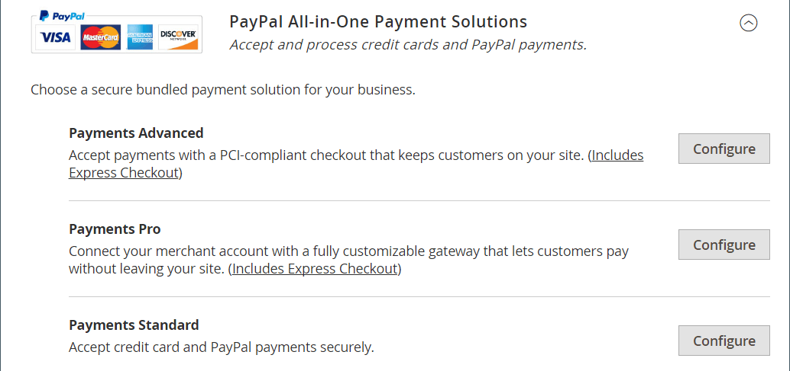
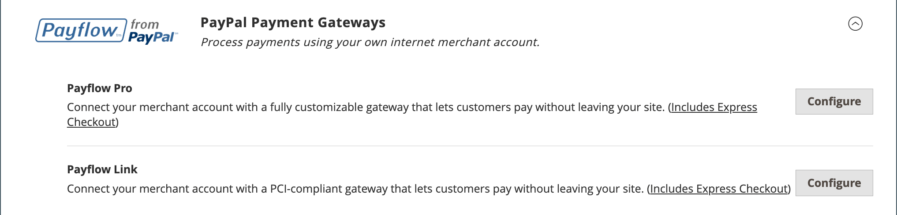

# Solutions de paiement PayPal

PayPal est un leader mondial des paiements en ligne et un moyen rapide et sécurisé pour vos clients de payer en ligne. La sélection des solutions PayPal disponibles varie en fonction de l’emplacement du marché. PayPal Express Checkout et PayPal payment Standard peuvent être utilisés dans toutes les régions du monde. Pour en savoir plus, voir [Solutions PayPal par pays](#paypal-solutions-by-country).

>[!IMPORTANT]
>
>**Exigences de PSD2 :**  
>À compter du 14 septembre 2019, les banques européennes pourront refuser les paiements qui ne répondent pas aux exigences de [PSD2](../getting-started/compliance-payment-services-directive.md). Pour la plupart des solutions PayPal, aucune action n’est requise pour se conformer à PSD2, car ces exigences sont gérées par PayPal.

## Compte commercial PayPal

Pour proposer PayPal comme mode de paiement dans votre boutique, vous devez disposer d’un [ compte commercial ][1] PayPal et/ou d’un [compte de paiement PayPal][2]. Les exigences du compte sont spécifiées dans la description de chaque solution PayPal. Votre compte marchand PayPal est également utilisé pour gérer les [filtres de fraude](#paypal-fraud-management-filters) qui sont appliqués aux achats effectués dans votre boutique.

Les clients qui utilisent PayPal Express Checkout ou Express Checkout pour Payflow Pro doivent disposer d’un compte d’acheteur PayPal. PayPal payment Standard (site Web payment Standard dans certains pays) peut être utilisé directement ou par l’intermédiaire d’un compte d’acheteur lorsque le marchand active le _compte PayPal facultatif_. Par défaut, ce paramètre est activé afin que les clients puissent choisir de saisir les informations de leur carte de crédit ou créer un compte d’acheteur avec PayPal. Lorsque cette option est désactivée, les clients doivent d’abord créer un compte d’acheteur PayPal avant d’effectuer un achat.

Les services Web émoluments Pro, Web payment Pro Payflow Edition, Payflow Pro Gateway et Payflow Link exigent que les clients saisissent les informations de carte de crédit lors du passage en caisse.

## Crédit PayPal et PayLater

PayPal PayLater permet à vos clients d&#39;accéder rapidement au financement, afin qu&#39;ils puissent acheter maintenant et payer au fil du temps, sans frais supplémentaires. Vous n’êtes pas facturé lorsque les clients choisissent les options de crédit PayPal et que vous payez uniquement les frais de transaction standard de PayPal. Pour en savoir plus, consultez le [site Web PayPal][3].

Donnez un coup de pouce à vos ventes lorsque vous annoncez le financement. PayPal aide à transformer les navigateurs en acheteurs grâce à un financement de PayPal PayLater. Vos clients peuvent payer au fil du temps, pendant que vous êtes payé au préalable, sans frais supplémentaires pour vous. Utilisez les bannières publicitaires gratuites PayPal pour faire de la publicité pour le financement PayPal comme option de paiement lorsque vos clients passent leurs commandes avec PayPal. Il a été démontré que le programme PayPal Advertising génère des achats supplémentaires et augmente la taille moyenne des achats de 15 % ou plus.

Vous pouvez facilement ajouter des bannières publicitaires gratuites et prêtes à l’emploi aux pages de votre site et le bouton _Crédit PayPal_ à votre panier lors du passage en caisse pour rappeler à vos clients que le financement est facilement disponible.

>[!NOTE]
>
>À compter de la version 2.4.3, PayPal PayLater est pris en charge dans les déploiements qui incluent PayPal. Cette fonctionnalité permet aux acheteurs de payer une commande par versements bimensuels au lieu de payer le montant complet au moment de l’achat. L’expérience de crédit PayPal est obsolète.

Pour les commerçants américains, le crédit PayPal est activé par défaut pour l’option de paiement [ PayPal Express Checkout](paypal-express-checkout.md). Pour la désactiver pour ce mode de paiement, reportez-vous à la section _Fonctionnalités_ de la [configuration de paiement express PayPal](paypal-express-checkout.md#features).

Le crédit PayPal est désactivé par défaut pour les autres solutions de paiement PayPal, mais il peut être activé dans la configuration du mode de paiement pour les solutions de prise en charge :

- [Paiements avancés](paypal-payments-advanced.md)
- [Paiements Pro](paypal-payments-pro.md)
- [Paiements standard](paypal-payments-standard.md)
- [Payflow Pro](paypal-payflow-pro.md)
- [Lien de flux de production](paypal-payflow-link.md)

>[!IMPORTANT]
>
>Avant de configurer le crédit PayPal ou PayPalLater pour votre boutique, assurez-vous qu’il est activé dans votre compte marchand PayPal.

## Solutions intégrées de PayPal

Avec PayPal et Adobe Commerce, vous pouvez accepter les paiements depuis toutes les principales cartes de débit et de crédit. PayPal offre des avantages supplémentaires sans effort supplémentaire, car même vos clients qui n&#39;ont pas de compte PayPal peuvent payer leurs achats avec PayPal.

>[!NOTE]
>
>Vous ne pouvez pas activer plusieurs méthodes PayPal à la fois dans votre boutique, à l’exception du paiement express par PayPal. Le paiement express PayPal peut être utilisé avec d’autres méthodes de paiement PayPal, à l’exception de la norme PayPal. Si vous modifiez des solutions de paiement, la méthode précédente est désactivée.

### Passage en caisse express PayPal

[Passage en caisse express PayPal](paypal-express-checkout.md)

### Solutions de paiement tout-en-un PayPal

Aux États-Unis, PayPal propose les solutions compatibles PCI suivantes pour répondre aux besoins de votre entreprise en pleine croissance.

- [Paiements avancés de PayPal](paypal-payments-advanced.md)
- [PayPal payment Pro](paypal-payments-pro.md)
- [PayPal payment Standard](paypal-payments-standard.md)

{width="600" zoomable="yes"}

### Passerelles de paiement PayPal

Une passerelle de paiement est un service marchand fourni par un fournisseur de services de demande de commerce électronique qui autorise le traitement des paiements directs ou par carte de crédit. Elles servent d&#39;intermédiaires entre les clients et les banques.

Les passerelles de paiement sont disponibles dans les environnements en ligne et hors ligne. Les paiements peuvent être acceptés par téléphone, en ligne ou via une application mobile. La transaction est envoyée au système de traitement du prestataire puis à la banque du client pour vérification et confirmation. S’il est vérifié, le marchand reçoit le paiement sans avoir aucun contact direct avec le compte bancaire du client.

Il existe deux types de passerelles de paiement : directes et hébergées.

- Les passerelles de paiement direct permettent aux utilisateurs de saisir les détails de leur carte sur le site web du magasin.
- Les passerelles de paiement hébergées redirigent les utilisateurs vers une page de paiement hébergée, en dehors du site web du magasin.

La passerelle de paiement assure la sécurité et la protection de toutes les parties impliquées dans une transaction.

PayPal offre le choix entre deux solutions de passerelle de paiement pour votre entreprise. Vous pouvez laisser PayPal héberger votre passage en caisse sur son site de paiement sécurisé, ou vous pouvez contrôler toute l’expérience de paiement grâce à une solution personnalisable.

- [PayPal Payflow Pro](paypal-payflow-pro.md)
- [Lien de flux de production PayPal](paypal-payflow-link.md)

{width="600" zoomable="yes"}

## Filtres de gestion des fraudes PayPal

Les filtres de gestion des fraudes PayPal facilitent la détection et la réponse aux transactions frauduleuses et peuvent être configurés pour signaler, conserver ou refuser des paiements plus risqués. Les actions liées aux valeurs Commerce [order status](order-status.md) ont changé en fonction des paramètres de filtre de fraude :

| Action | Résultat |
| --- | --- |
| [!UICONTROL Review] | La commande suspectée reçoit le statut _Révision du paiement_ lorsque la commande est passée. Vous pouvez consulter la commande et l’approuver, ou annuler le paiement dans l’Admin, ou du côté de PayPal. Lorsque vous cliquez sur **[!UICONTROL Accept Payment]** ou **[!UICONTROL Deny Payment]**, aucune nouvelle transaction pour la commande n’est créée.   Si vous modifiez l’état de la transaction sur le site PayPal, vous devez cliquer sur **[!UICONTROL Get Payment Update]** dans la page Commande de l’administrateur pour appliquer les modifications. Si vous cliquez sur **[!UICONTROL Accept Payment]** ou **[!UICONTROL Deny Payment]**, les modifications effectuées sur le site PayPal sont appliquées. |
| [!UICONTROL Deny] | La commande suspectée ne peut pas être passée par le client, car la transaction correspondante est rejetée par PayPal.   Pour refuser le paiement de l’administrateur, cliquez sur **[!UICONTROL Deny Payment]** dans le coin supérieur droit de la page. L’état de la commande passe à `Canceled`, la transaction est annulée et les fonds sont débloqués sur le compte client. Les informations correspondantes sont ajoutées dans la section _[!UICONTROL Comments History]_de la vue de commande. |
| [!UICONTROL Flag] | L’ordre suspecté obtient le statut `Processing` lorsqu’il est placé. La transaction correspondante est marquée d’un indicateur dans la liste des transactions du compte marchand. |

{style="table-layout:auto"}

## Solutions PayPal par pays

| Pays | Solution de paiement PayPal |
|--- |--- |
| Australie | [!DNL PayPal Website Payments Standard] [[!DNL PayPal Payflow Pro]](paypal-payflow-pro.md) [!DNL PayPal Website Payments Pro Hosted Solution] [[!DNL PayPal Express Checkout]](paypal-express-checkout.md) |
| Canada | [!DNL PayPal Website Payments Standard] [!DNL PayPal Website Payments Pro] [[!DNL PayPal Payflow Pro]](paypal-payflow-pro.md) [[!DNL PayPal Payflow Link]](paypal-payflow-link.md) (comprend le passage en caisse express) [[!DNL PayPal Express Checkout]](paypal-express-checkout.md) |
| France | [!DNL PayPal Integral Evolution] [!DNL PayPal Website Payments Standard] [[!DNL PayPal Express Checkout]](paypal-express-checkout.md) |
| Allemagne | [[!DNL PayPal Express Checkout]](paypal-express-checkout.md) |
| Hong Kong (RAS) Chine | [!DNL PayPal Website Payments Pro Hosted Solution] [!DNL PayPal Website Payments Standard] [[!DNL PayPal Express Checkout]](paypal-express-checkout.md) |
| Italie | [!DNL PayPal ProPay] [[!DNL Pal Payments Standard]](paypal-payments-standard.md) [[!DNL PayPal Express Checkout]](paypal-express-checkout.md) |
| Japon | [!DNL PayPal Website Payments Plus] [!DNL PayPal Website Payments Standard] [[!DNL PayPal Express Checkout]](paypal-express-checkout.md) |
| Nouvelle-Zélande | [[!DNL PayPal Payflow Pro]](paypal-payflow-pro.md) [!DNL PayPal Website Payments Standard] [[!DNL PayPal Express Checkout]](paypal-express-checkout.md) |
| Espagne | [!DNL PayPal Pasarela Integral] [!DNL PayPal Website Payments Standard] [[!DNL PayPal Express Checkout]](paypal-express-checkout.md) |
| Royaume-Uni | [!DNL PayPal Payments Pro Hosted Solution] (comprend le passage en caisse express) [[!DNL PayPal Payments Standard]](paypal-payments-standard.md) [[!DNL PayPal Express Checkout]](paypal-express-checkout.md) |
| États-Unis | [[!DNL PayPal Payments Advanced]](paypal-payments-advanced.md) (comprend le passage en caisse express) [[!DNL PayPal Payments Pro]](paypal-payments-pro.md) (comprend le passage en caisse express) [[!DNL PayPal Payments Standard+]](paypal-payments-standard.md) [[!DNL PayPal Payflow Pro]](paypal-payflow-pro.md) (comprend le passage en caisse express) [[!DNL PayPal Payflow Link]](paypal-payflow-link.md) (inclut le passage en caisse express) [[!DNL PayPal Express Checkout]](paypal-express-checkout.md) |

{style="table-layout:auto"}

### Autres pays

PayPal Express Checkout et PayPal Website payment Standard sont disponibles dans les pays suivants :

- Argentine
- Autriche
- Belgique
- Brésil
- Bulgarie
- Chili
- Costa Rica
- Chypre
- République tchèque
- Danemark
- République dominicaine
- Equateur
- Estonie
- Finlande
- Guyane française
- Gibraltar
- Grèce
- Guadeloupe
- Hongrie
- Islande
- Inde
- Indonésie
- Irlande
- Israël
- Jamaïque
- Lettonie
- Liechtenstein
- Lituanie
- Luxembourg
- Malaisie
- Malte
- Martinique
- Mexique
- Pays
- Norvège
- Philippines
- Pologne
- Portugal
- Réunion
- Roumanie
- Saint Marin
- Singapour
- Slovaquie
- Slovénie
- Afrique du Sud
- Corée du Sud
- Suède
- Suisse
- Taiwan
- Thaïlande
- Turquie
- Émirats arabes unis
- Uruguay
- Venezuela
- Vietnam

[1]: https://manager.paypal.com/
[2]: https://developer.paypal.com/docs/payflow/payflow-gateway/
[3]: https://www.paypal.com/us/business/buy-now-pay-later
