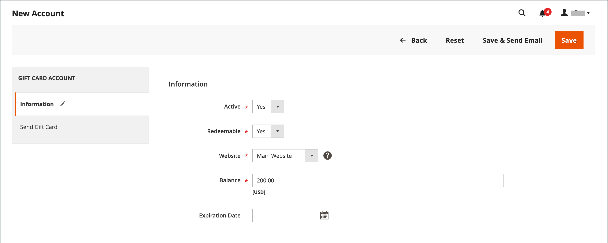

# Comptes de carte cadeau

Un compte de carte-cadeau est automatiquement créé pour chaque carte-cadeau achetée. La valeur de la carte-cadeau peut ensuite être appliquée à l’achat d’un produit dans votre boutique. Vous pouvez également créer des comptes de carte-cadeau à partir de l’administrateur en tant que promotion ou service pour les clients. Le numéro de compte de la carte-cadeau correspond au code de la carte-cadeau.

{width="700" zoomable="yes"}

## Configuration des comptes de carte cadeau

La configuration des cartes-cadeaux établit les paramètres par défaut de toutes les cartes-cadeaux pour la vue de magasin et gère le pool de codes. Le pool de code est un ensemble de codes de carte-cadeau uniques dans un format spécifique. Les codes du pool sont utilisés chaque fois qu’un compte de carte-cadeau est créé. Il incombe à l’administrateur du magasin de s’assurer qu’il existe suffisamment de codes disponibles pour la vente de cartes-cadeaux. Veillez à générer un pool de codes avant de proposer des cartes-cadeaux à vendre. Par défaut, Adobe Commerce génère 1 000 codes. Un nouveau pool de code n’est pas généré tant qu’aucun autre code n’est disponible dans le pool actuel.

### Étape 1 : configurer les notifications électroniques

1. Sur la barre latérale _Admin_, accédez à **[!UICONTROL Stores]** > _[!UICONTROL Settings]_>**[!UICONTROL Configuration]**.

1. Dans le panneau de gauche, développez **[!UICONTROL Sales]** et choisissez **[!UICONTROL Gift Cards]**.

1. Développez la section  de _[!UICONTROL Gift Card Email Settings]_et procédez comme suit :

   - Définissez **[!UICONTROL Gift Card Notification Email Sender]** sur l’identité du magasin qui apparaît comme l’expéditeur des notifications de carte-cadeau.

   - Définissez **[!UICONTROL Gift Card Notification Email Template]** sur le modèle utilisé pour la notification.

   {width="600" zoomable="yes"}

1. Développez la section  de _[!UICONTROL Email Sent from Gift Card Account Management]_et procédez comme suit :

   - Définissez **[!UICONTROL Gift Card Email Sender]** sur l’identité du magasin pour qu’elle apparaisse comme l’expéditeur des cartes-cadeaux.

   - Définissez **[!UICONTROL Gift Card Template]** sur le modèle que vous souhaitez utiliser pour la carte cadeau.

Voir [Stocker les adresses électroniques](../configuration-reference/general/store-email-addresses.md) pour connaître les champs et options de configuration spécifiques.

### Etape 2 : paramétrage général

1. Développez la section  sur _[!UICONTROL Gift Card General Settings]_.

1. Pour permettre au client de racheter la valeur de la carte pour l’argent liquide, définissez **[!UICONTROL Redeemable]** sur `Yes`.

1. Pour **[!UICONTROL Lifetime (days)]**, saisissez le nombre de jours avant l’expiration de la carte.

   Si aucune date d’expiration n’est définie, laissez le champ vide.

   >[!NOTE]
   >
   >Selon votre emplacement, il peut être illégal pour les cartes-cadeaux d’expirer. Vérifiez vos lois locales avant de définir une durée de vie pour vos cartes-cadeaux.

1. Pour donner aux clients la possibilité de saisir un message pour accompagner la carte-cadeau, définissez **[!UICONTROL Allow Gift Message]** sur `Yes` et saisissez le nombre de caractères disponibles pour le message pour **[!UICONTROL Gift Message Maximum Length]**.

1. Définissez **[!UICONTROL Generate Gift Card Account when Orders Item is]** sur l’une des options suivantes :

   - `Ordered` - Le compte de carte-cadeau est créé lors de la commande.
   - `Invoiced` - Le compte de carte-cadeau est créé une fois le paiement capturé et la commande facturée.

   {width="600" zoomable="yes"}

### Étape 3 : définition du pool de codes de carte-cadeau

1. Développez la section  de _[!UICONTROL Gift Card Account General Settings]_et procédez comme suit :

   {width="600" zoomable="yes"}

   - Pour personnaliser le code, procédez comme suit selon vos préférences :

      - Longueur du code
      - Format de code
      - Préfixe de code
      - Suffixe de code
      - Tiret Toutes Les X Caractères

   - Pour déterminer le nombre de codes à générer, saisissez le **[!UICONTROL New Pool Size]**.

   - Pour indiquer le moment où vous recevez la notification pour reverrouiller le pool de code, saisissez la valeur **[!UICONTROL Low Code Pool Threshold]**.

1. Avant de générer le pool de code, cliquez sur **[!UICONTROL Save Config]**.

1. Cliquez sur **[!UICONTROL Generate]**.

1. Une fois l’opération terminée, cliquez sur **[!UICONTROL Save Config]**.

## Vérification d’un compte de carte-cadeau existant

1. Pour trouver le numéro du compte de carte-cadeau d’une commande en cours, procédez comme suit :

   - Sur la barre latérale _Admin_, accédez à **[!UICONTROL Sales]** > _[!UICONTROL Operations]_>**[!UICONTROL Orders]**.

   - Recherchez l’ordre dans la liste et cliquez sur **[!UICONTROL View]** dans la colonne _[!UICONTROL Action]_.

   - Faites défiler l’écran jusqu’à la section _[!UICONTROL Items Ordered]_.

   Le nombre se trouve dans la colonne _[!UICONTROL Product]_, sous **[!UICONTROL Gift Card Accounts]**.

1. Sur la barre latérale _Admin_, accédez à **[!UICONTROL Marketing]** > _[!UICONTROL Promotions]_>**[!UICONTROL Gift Card Accounts]**.

1. Recherchez le compte de carte-cadeau dans la grille et ouvrez-le en mode d’édition.

   Le code de carte-cadeau s’affiche en haut de la section _Informations_.

   {width="600" zoomable="yes"}

## Créer un compte de carte-cadeau

1. Sur la barre latérale _Admin_, accédez à **[!UICONTROL Marketing]** > _[!UICONTROL Promotions]_>**[!UICONTROL Gift Card Accounts]**.

1. Dans le coin supérieur droit, cliquez sur **[!UICONTROL Add Gift Card Account]**.

1. Dans la section _[!UICONTROL Information]_, définissez **[!UICONTROL Active]**sur `Yes` et procédez comme suit :

   - Pour que le solde des cartes puisse être récupéré lors du passage en caisse ou transféré au crédit de la boutique du client, définissez **[!UICONTROL Redeemable]** sur `Yes`.

   - Sélectionnez l’ **[!UICONTROL Website]** où le compte de carte-cadeau peut être utilisé.

   - Saisissez le **[!UICONTROL Balance]** initial sur la carte cadeau.

   - _(Facultatif)_ Pour définir un **[!UICONTROL Expiration Date]** pour la carte-cadeau, sélectionnez la date dans le calendrier .

     Si rien n’est indiqué, le compte de carte cadeau n’expire pas.

     {width="600" zoomable="yes"}

1. Dans le panneau de gauche, sélectionnez **[!UICONTROL Send Gift Card]** et procédez comme suit :

   - Saisissez l’adresse **[!UICONTROL Recipient Email]**.

   - Saisissez le **[!UICONTROL Recipient Name]**.

   - Définissez **[!UICONTROL Send Email from the Following Store View]** sur la vue de magasin qui apparaît comme l’expéditeur de la notification de carte cadeau.

   {width="600" zoomable="yes"}

1. Pour enregistrer le nouveau compte, effectuez l’une des opérations suivantes :

   - Si vous n&#39;êtes pas prêt à envoyer la carte-cadeau, cliquez sur **[!UICONTROL Save]**.

   - Pour enregistrer les modifications et envoyer la carte-cadeau par courrier électronique au destinataire, cliquez sur **Enregistrer et envoyer le courrier électronique**.

## Afficher l’historique du compte de carte cadeau

1. Accédez à **[!UICONTROL Marketing]** > _[!UICONTROL Promotions]_>**[!UICONTROL Gift Card Accounts]**.

1. Ouvrez la carte cadeau en mode d’édition.

1. Le **[!UICONTROL History]** de la carte cadeau s’affiche.

   {width="600" zoomable="yes"}

| Colonne | Description |
|--- |--- |
| [!UICONTROL ID] | Nombre d’actions unique avec carte-cadeau. |
| [!UICONTROL Date] | Date de l’action. |
| [!UICONTROL Action] | Détermine toutes les actions possibles avec une carte cadeau. Options : `Created` / `Updated` / `Sent` / `Used` / `Redeemed` / `Expired` |
| [!UICONTROL Balance Change] | Affiche le montant par lequel le solde de la carte-cadeau a changé. |
| [!UICONTROL Balance] | Indique le solde disponible. |
| [!UICONTROL More Information] | Affiche des informations sur les personnes qui ont modifié le solde de la carte-cadeau. |

{style="table-layout:auto"}

## Supprimer un compte de carte-cadeau

1. Sur la barre latérale _Admin_, accédez à **[!UICONTROL Marketing]** > _[!UICONTROL Promotions]_>**[!UICONTROL Gift Card Accounts]**.

1. Sélectionnez le compte de carte-cadeau à supprimer et ouvrez-le en mode d’édition.

1. Dans la barre de menus, cliquez sur **[!UICONTROL Delete]**.

1. Pour confirmer l’action, cliquez sur **[!UICONTROL OK]**.

## Descriptions des colonnes

| Colonne | Description |
|--- |--- |
| [!UICONTROL ID] | Identifiant numérique unique attribué à un compte de carte-cadeau. |
| [!UICONTROL Code] | Code à saisir pour appliquer une carte-cadeau. |
| [!UICONTROL Website] | Indique les sites web sur lesquels le compte de carte-cadeau est disponible. |
| [!UICONTROL Created] | Date de création. |
| [!UICONTROL End] | Date d’expiration de la carte cadeau, le cas échéant. |
| [!UICONTROL Active] | Détermine si la carte cadeau est active. |
| [!UICONTROL Status] | Détermine si la carte cadeau est consommée dans le compte du client ou disponible. Options : `Used` / `Redeemed` / `Expired` |
| [!UICONTROL Balance] | Indique le solde disponible. |

{style="table-layout:auto"}
