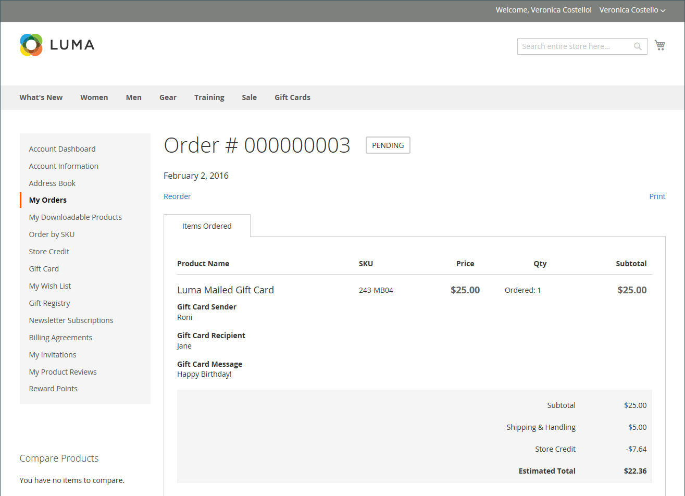
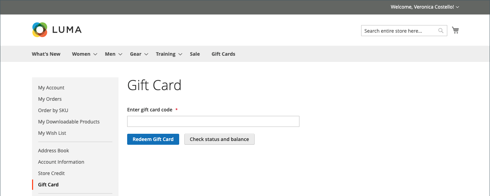
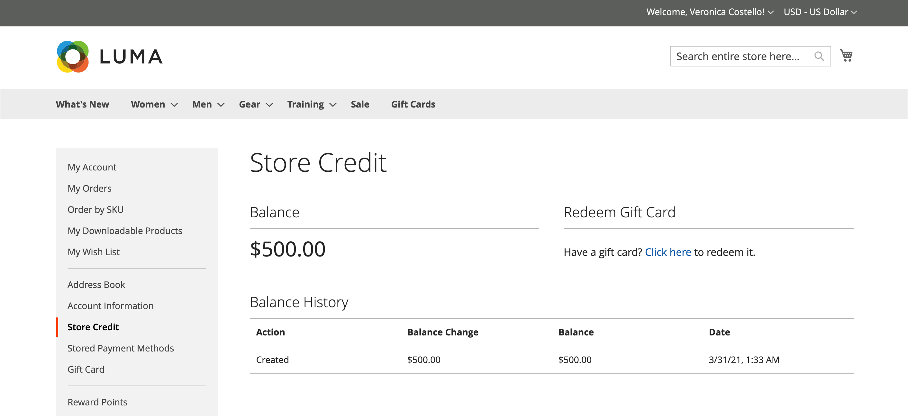

# Achat et remboursement par carte-cadeau

{{ee-feature}}

Les cartes-cadeaux sont échangées dans le panier de la même manière qu’un coupon est appliqué à une commande. Lors du passage en caisse, l’acheteur saisit le code de carte cadeau pour appliquer un montant de la carte cadeau à l’achat. Les titulaires d’une carte-cadeau qui possèdent un compte client peuvent vérifier le statut et le solde restant à partir du tableau de bord de leur compte. Des cartes-cadeaux uniques et multiples peuvent être utilisées pour payer tout ou partie d&#39;une commande.

Le code de carte cadeau appliqué peut être visualisé en ouvrant la commande dans le _Admin_, ce qui vous permet de récupérer le code pour le placer sur une carte cadeau physique, si nécessaire. Si une commande de carte cadeau est annulée ou remboursée, vous devez annuler manuellement le compte de carte cadeau associé. Vous pouvez soit supprimer entièrement le compte, soit le désactiver.

{width="700" zoomable="yes"}

Par exemple, un client effectuant des achats dans la boutique Luma de démonstration peut acheter une carte cadeau virtuelle ou physique.

**Carte cadeau virtuelle** - Une carte cadeau virtuelle Luma est envoyée par e-mail avec un message facultatif au destinataire. Il peut être utilisé sur n’importe quel site de la famille Luma et n’expire jamais.

**Carte cadeau physique** - Une carte cadeau Luma est emballée dans un e-mail d’art personnalisé et envoyée gratuitement au destinataire. Il peut être produit à l’avance, étiqueté avec des codes uniques et échangé en magasin, par téléphone ou sur l’un des sites web de la famille Luma. Il n&#39;expire jamais.

**Carte-cadeau combinée** - Une carte-cadeau combinée a les caractéristiques d&#39;une carte-cadeau virtuelle et physique. Une carte cadeau combinée Luma est envoyée par e-mail au destinataire. L&#39;adresse e-mail et l&#39;adresse de livraison sont requises lors de l&#39;achat de la carte cadeau. Il n&#39;expire jamais.

## Cycle de vie d&#39;une carte cadeau

1. **Le client détermine la valeur de la carte cadeau**.

   Le client détermine la valeur de la carte cadeau à partir de la page produit. Selon la configuration, il existe un champ à prix fixe, une liste d’options de prix, ou les deux. Tous les montants apparaissent dans la devise utilisée dans le magasin.

1. **Le client remplit les informations de la carte cadeau**.

   Pour une carte cadeau physique, le client saisit le **Nom de l’expéditeur** et le **Nom du destinataire**. Pour les cartes-cadeaux virtuelles ou combinées, le client saisit également les **E-mail de l’expéditeur** et **E-mail du destinataire**. Si le client est connecté, le nom de l’expéditeur (et l’e-mail de l’expéditeur, le cas échéant) est automatiquement saisi à partir du compte. Selon la configuration, le client peut également saisir un message pour le destinataire.

1. **Le client termine le passage en caisse**.

   La carte cadeau s’affiche en tant qu’élément de ligne dans le panier avec des détails indiquant le nom de l’expéditeur, du destinataire et du message, le cas échéant. Le montant associé à la carte cadeau est converti dans la devise de base du magasin lorsqu’il est ajouté au panier.

1. **Le client reçoit une confirmation de la commande**.

   L&#39;acheteur de la carte cadeau peut cliquer sur le lien dans la confirmation pour suivre la commande à partir du tableau de bord de son compte.

1. **Le destinataire reçoit la carte cadeau**.

   Pour les cartes-cadeaux virtuelles ou combinées, le destinataire reçoit un e-mail contenant le code de la carte-cadeau, le nom de l’expéditeur et le message, le cas échéant. Si plusieurs cartes-cadeaux sont achetées dans une seule commande et que le type est virtuel ou combiné, tous les codes de carte-cadeau correspondants sont envoyés au destinataire dans un seul e-mail. Les cartes-cadeaux physiques peuvent être expédiées directement au destinataire ou au client, qui peut ensuite livrer personnellement la carte-cadeau au destinataire.

1. **Le destinataire applique une carte cadeau à l’achat**.

   Le destinataire achète un article dans votre boutique et applique le code de carte cadeau lors du passage en caisse. Chaque fois qu&#39;une carte cadeau est appliquée pendant le passage en caisse, le montant apparaît dans le bloc des totaux de commande et est soustrait du total général. Le solde complet de chaque carte cadeau est soustrait du total du panier. Si plusieurs cartes-cadeaux sont utilisées pour un achat, elles sont appliquées dans l’ordre croissant, en commençant par la carte présentant le solde restant le plus faible, jusqu’à ce que toutes les cartes soient appliquées ou que le total général soit égal à zéro. Lorsque le total général atteint zéro, le dernier compte de carte cadeau appliqué au panier reçoit une déduction partielle. Toutes les cartes qui n’ont pas été appliquées au panier ne reçoivent pas de déduction de solde. Les montants ne sont déduits des comptes de carte cadeau qu&#39;une fois la commande passée.

## Expérience Storefront

Fonctionnement des cartes-cadeaux sur la vitrine :

- Le code de la carte cadeau peut être appliqué dans le panier ou lors du passage en caisse pour couvrir le montant total de la commande.

- Dans le catalogue, une carte cadeau est présentée comme un type de produit distinct.

- Le code de carte cadeau est activé une fois la commande facturée. Si la commande n&#39;est pas payée, le client destinataire ne peut pas utiliser la carte cadeau.

- Les comptes pour les codes cadeau sont créés pour suivre le solde d&#39;un bon spécifique. Un administrateur de magasin peut ajuster manuellement le solde.

Le client récepteur peut utiliser la section _[!UICONTROL Gift Card]_&#x200B;du tableau de bord de son compte pour vérifier le solde de son compte [compte de carte cadeau](product-gift-card-accounts.md) et échanger des cartes cadeau contre du crédit [en magasin](../customers/store-credit-using.md).

{width="700" zoomable="yes"}

### Vérifier le statut et le solde de la carte cadeau

1. À partir du storefront, le client se connecte et ouvre la page de son compte client.

1. Le client ouvre la page **[!UICONTROL Gift Card]** et saisit le code de la carte cadeau.

1. Le client clique sur **[!UICONTROL Check status and balance]**.

{width="700" zoomable="yes"}

Le solde de la carte cadeau s&#39;affiche.

### Activation de la carte cadeau

1. Sur la page _[!UICONTROL Gift Card]_, le client saisit le code de la carte cadeau.

1. Le client clique sur **[!UICONTROL Redeem Gift Card]**.

{width="700" zoomable="yes"}

Le montant de la carte cadeau est activé et ajouté au solde créditeur total du magasin.

{width="700" zoomable="yes"}

Toutes les opérations pour le solde de la carte cadeau sont disponibles sur la page _[!UICONTROL Store Credit]_.

### Appliquer une carte cadeau lors du passage en caisse

Si la carte cadeau n&#39;est pas échangeable, un client peut appliquer le code de la carte cadeau lors du passage en caisse.

1. Lors de l’étape _Vérification et paiements_, le client clique sur **[!UICONTROL Apply Gift Card]**.

1. Saisissez le code de la carte cadeau, puis cliquez sur **[!UICONTROL Apply]**.

   La remise doit être reflétée dans le _[!UICONTROL Order Summary]_.

1. Clique sur **[!UICONTROL Place Order]** pour finaliser la commande.
