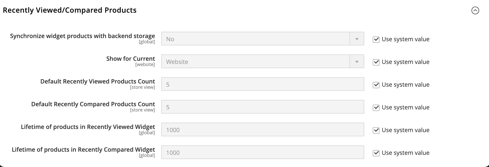

# Produits récemment consultés ou comparés

Les blocs _Récemment consultés et Récemment comparés_ s’affichent généralement dans la barre latérale droite d’une page de catalogue. Le nombre de produits répertoriés dans chaque peut être configuré pour chaque site web, magasin ou vue de magasin.

**_Pour configurer les produits récemment consultés et comparés:_**

1. Dans la barre latérale _Admin_, accédez à **[!UICONTROL Stores]** > _[!UICONTROL Settings]_>**[!UICONTROL Configuration]**.

1. Dans le panneau de gauche, développez **[!UICONTROL Catalog]** et choisissez **[!UICONTROL Catalog]** en dessous.

1. Développez  la section **[!UICONTROL Recently Viewed/Compared Products]** .

   {width="600" zoomable="yes"}

   Pour obtenir une description détaillée de chacun de ces paramètres de configuration, consultez [Produits récemment consultés/comparés](../configuration-reference/catalog/catalog.md#recently-viewedcompared-products) dans le _Guide de référence de configuration_.

1. Définissez des **[!UICONTROL Synchronize widget products with backend storage]** pour synchroniser les informations sur le widget du produit, telles que l’ID du produit, avec la disponibilité actuelle du stockage du produit dans la base de données et réutilisez ces informations sur différents appareils.

1. Définissez **[!UICONTROL Show for Current]** sur la vue du site web, du magasin ou du magasin où s’applique la configuration.

1. Par **[!UICONTROL Default Recently Viewed Products Count]**, saisissez le nombre de produits récemment consultés qui apparaîtront dans la liste.

1. Par **[!UICONTROL Default Recently Compared Products Count]**, saisissez le nombre de produits récemment comparés à afficher dans la liste.

1. Par **[!UICONTROL Lifetime of products in Recently Viewed Widget]**, saisissez une plage horaire en secondes, supérieure à zéro.

   Ce paramètre détermine la durée d’affichage des produits consultés dans la liste récemment consultée.

1. Par **[!UICONTROL Lifetime of products in Recently Compared Widget]**, saisissez une plage horaire en secondes, supérieure à zéro.

   Ce paramètre détermine la durée d’affichage des produits comparés dans la liste récemment comparée.

1. Cliquez ensuite sur **[!UICONTROL Save Config]**.
