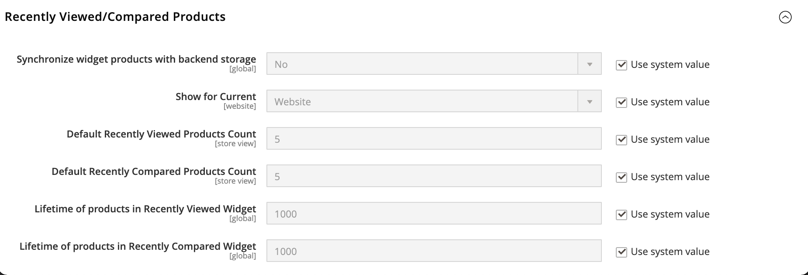

# Produits récemment consultés ou comparés

La variable _Récemment consultés et récemment comparés_ les blocs apparaissent généralement dans la barre latérale droite d’une page de catalogue. Le nombre de produits répertoriés dans chaque peut être configuré pour chaque site web, magasin ou vue de magasin.

**_Pour configurer les produits récemment consultés et comparés :_**

1. Sur le _Administration_ barre latérale, accédez à **[!UICONTROL Stores]** > _[!UICONTROL Settings]_>**[!UICONTROL Configuration]**.

1. Dans le panneau de gauche, développez **[!UICONTROL Catalog]** et choisissez **[!UICONTROL Catalog]** en-dessous.

1. Développer  la valeur **[!UICONTROL Recently Viewed/Compared Products]** .

   {width="600" zoomable="yes"}

   Pour une description détaillée de chacun de ces paramètres de configuration, voir [Produits récemment consultés/comparés](../configuration-reference/catalog/catalog.md#recently-viewedcompared-products) dans le _Guide de référence de configuration_.

1. Définir **[!UICONTROL Synchronize widget products with backend storage]** pour synchroniser les informations du widget du produit, telles que l’ID du produit, avec la disponibilité actuelle du stockage du produit dans la base de données et réutiliser ces informations sur différents appareils.

1. Définir **[!UICONTROL Show for Current]** à la vue du site web, du magasin ou du magasin où la configuration s’applique.

1. Pour **[!UICONTROL Default Recently Viewed Products Count]**, saisissez le nombre de produits récemment consultés à afficher dans la liste.

1. Pour **[!UICONTROL Default Recently Compared Products Count]**, saisissez le nombre de produits récemment comparés à afficher dans la liste.

1. Pour **[!UICONTROL Lifetime of products in Recently Viewed Widget]**, saisissez une période en secondes supérieure à zéro.

   Ce paramètre détermine la durée pendant laquelle les produits consultés sont affichés dans la liste récemment affichée.

1. Pour **[!UICONTROL Lifetime of products in Recently Compared Widget]**, saisissez une période en secondes supérieure à zéro.

   Ce paramètre détermine la durée pendant laquelle les produits comparés s’affichent dans la liste comparée récemment.

1. Lorsque vous avez terminé, cliquez sur **[!UICONTROL Save Config]**.
