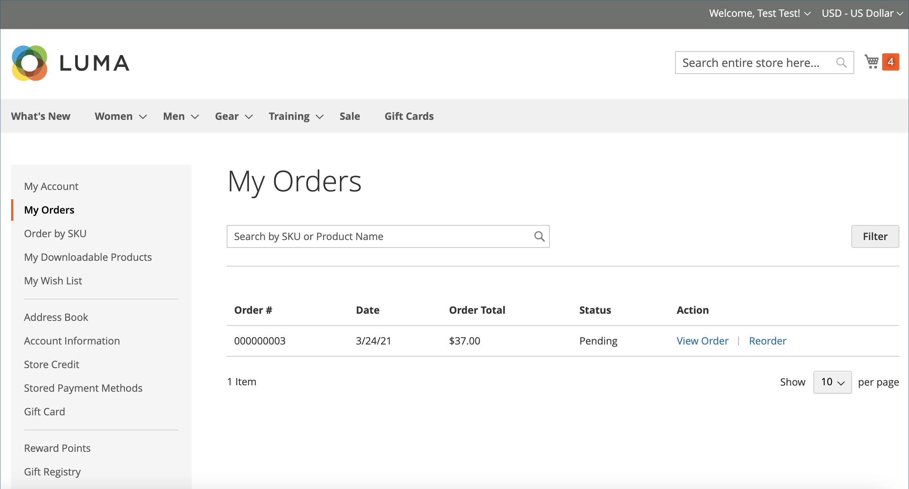
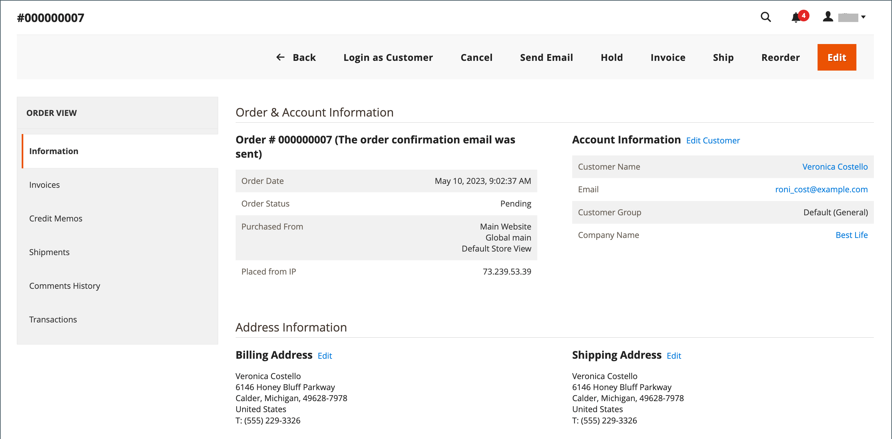

# Autoriser les nouvelles commandes

Lorsque cette option est activée, les commandes peuvent être effectuées directement à partir du compte client ou de la commande d’origine dans l’_Admin_. Les réapprovisionnements sont activés par défaut.

{width="700" zoomable="yes"}

## Critères d’activation de la réorganisation pour une commande

- L’option de configuration _Autoriser la réorganisation_ doit être activée.

- Si l’ordre est à l’état `Hold` ou `Payment Review`, l’option de réorganisation est désactivée.

- Si l’un des articles de la commande est indisponible, en rupture de stock ou désactivé, l’option de réorganisation est désactivée sur le storefront.

- Un _administrateur_ peut réorganiser l’ordre même si l’un des éléments est en rupture de stock ou désactivé.

## Configurer pour autoriser les nouvelles commandes client

1. Dans la barre latérale _Admin_, accédez à **[!UICONTROL Stores]** > _[!UICONTROL Settings]_>**[!UICONTROL Configuration]**.

1. Dans le panneau de gauche, développez **[!UICONTROL Sales]** et choisissez **[!UICONTROL Sales]** en dessous.

1. Développez  la section **[!UICONTROL Reorder]** .

   {width="600" zoomable="yes"}

1. Définissez **[!UICONTROL Allow Reorder]** sur `Yes`.

   Ce paramètre active la fonctionnalité de réorganisation à partir du compte client sur le storefront ou de la liste des commandes dans l’Admin.

1. Cliquez sur **[!UICONTROL Save Config]**.

## Réorganiser à partir du storefront

Un client peut lancer la fonctionnalité de réorganisation pour une commande spécifique à partir de deux pages :

- Page _Mes commandes_

- Page _Vue Commande_

### Mes commandes

Le bouton _Réorganiser_ est toujours affiché dans la liste avec Commandes (même si tous les produits de la commande ne peuvent pas être réorganisés).

{width="700" zoomable="yes"}

**Cas 1.** Tous les produits de la commande sont **disponibles** pour la réorganisation

L’utilisateur est redirigé vers le panier et tous les produits sont ajoutés au panier

{width="700" zoomable="yes"}

**Cas 2.** Certains/tous les produits de la commande ne sont **pas disponibles** pour la réorganisation

>[!NOTE]
>
>Il est possible de réorganiser les produits `Not Visible Individually`.

Le bouton _Réorganiser_ n’apparaît pas sur les pages _Mes commandes_ et _Afficher la commande_.

{width="700" zoomable="yes"}

### Page Vue Commande

**Cas 1.** Tous les produits de la commande sont disponibles pour la réorganisation

L’utilisateur est redirigé vers le panier et tous les produits sont ajoutés au panier

**Cas 2.** Certains/tous les produits de la commande ne sont **pas disponibles** pour la réorganisation

>[!NOTE]
>
>Il est possible de réorganiser les produits `Not Visible Individually`.

Le bouton _Réorganiser_ n’apparaît pas sur les pages _Mes commandes_ et _Afficher la commande_.

{width="700" zoomable="yes"}

### Panier non vide

Si le panier n’est pas vide et que l’utilisateur clique sur **[!UICONTROL Reorder]** (à partir de la page _Mes commandes_ ou _Vue des commandes_), les produits existants restent dans le panier avec les produits de nouvelle commande ajoutés.

{width="700" zoomable="yes"}

## Réorganiser à partir de l’administrateur

1. Dans la barre latérale _Admin_, accédez à **[!UICONTROL Sales]** > **[!UICONTROL Orders]**.

1. Recherchez la commande et ouvrez en mode **[!UICONTROL View]**.

1. Cliquez sur **[!UICONTROL Reorder]** qui s’affiche dans la barre de boutons supérieure.

   {width="600" zoomable="yes"}

   Après avoir cliqué sur **[!UICONTROL Reorder]**, la page _Créer une nouvelle commande_ s’ouvre avec des produits à réorganiser.

   {width="600" zoomable="yes"}

1. Renseignez tous les champs obligatoires selon vos besoins.

1. Pour envoyer la commande, cliquez sur **[!UICONTROL Submit Order]**.
