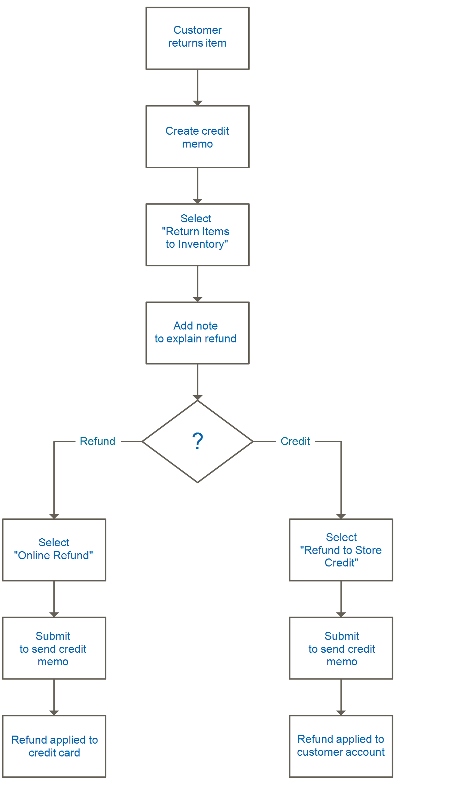

# Renvoie

Une _autorisation de retour de marchandise_ (RMA) peut être accordée aux clients qui demandent à renvoyer un article pour le remplacer ou le rembourser. En règle générale, le client contacte le commerçant pour demander un remboursement. En cas d&#39;approbation, un numéro RMA unique est attribué pour identifier le produit renvoyé. Dans la configuration, vous pouvez activer RMA pour tous les produits ou autoriser RMA pour certains produits uniquement. La grille _[!UICONTROL Returns]_répertorie les demandes de retour de marchandises (RMA) actuelles et permet de saisir de nouvelles demandes de retour.

{width="600" zoomable="yes"}

Des autorisations de retour client peuvent être émises pour des types de produits simples, groupés, configurables et groupés. Cependant, les RMA ne sont pas disponibles pour les produits virtuels, les produits téléchargeables et les cartes-cadeaux.

## Descriptions des colonnes

| Colonne | Description |
|--- |--- |
| [!UICONTROL Select] | Cochez les cases des retours qui feront l&#39;objet d&#39;une action ou utilisez le contrôle de sélection dans l&#39;en-tête de colonne. Options : `Select All` / `Deselect All` / `Select Visible` / `Unselect Visible` |
| [!UICONTROL RMA] | Identifiant numérique unique attribué à chaque retour |
| [!UICONTROL Requested] | Date et heure auxquelles le retour a été effectué |
| [!UICONTROL Order] | Numéro unique de la commande d’origine |
| [!UICONTROL Ordered] | Date et heure auxquelles la commande a été passée |
| [!UICONTROL Customer] | Nom du client ou de l&#39;acheteur qui a passé la commande |
| [!UICONTROL Status] | Statut de retour. Options : `Pending` / `Authorized` / `Partially Authorized` / `Approved` / `Rejected` / `Processed and Closed` / `Closed` |
| [!UICONTROL Action] | **[!UICONTROL View]** ouvre le retour en mode d’édition. |

{style="table-layout:auto"}

## RMA et workflow de retour

1. **Recevoir la demande** - Si [activé](rma-configure.md#enable-rmas-for-your-store) pour le storefront, les clients enregistrés et les invités peuvent demander une autorisation de retour client. Vous pouvez également [soumettre une demande RMA dans Admin](#create-a-return-request-in-the-admin).

2. **RMA émis** - Après avoir examiné la demande, vous pouvez l’autoriser partiellement, complètement ou annuler la demande. Si vous autorisez le retour et acceptez de payer l&#39;expédition de retour, vous pouvez créer une commande d&#39;expédition auprès de l&#39;administrateur avec un transporteur pris en charge.

3. **Marchandises reçues et retour de produits traité** - L’organigramme suivant décrit l’ordre opérationnel pour terminer le processus de retour :

   {width="500"}

## Statut de RMA

Au cours de son cycle de vie, une autorisation de marchandise renvoyée (RMA) peut avoir de nombreux statuts attribués (tels que En attente ou Autorisé). Le statut de RMA indique la progression d&#39;une demande de RMA émise par l&#39;utilisateur ou le commerçant.

| Statut | Description |
|--- |--- |
| [!UICONTROL Pending] | Statut initial attribué à une demande RMA lorsqu’elle est générée par un utilisateur sur le storefront ou par le commerçant dans l’Admin. |
| [!UICONTROL Authorized] | Ce statut est attribué au RMA lorsque tous les articles demandés sont autorisés par le commerçant dans l&#39;administrateur pour les retours. |
| [!UICONTROL Partially Authorized] | Ce statut est attribué au RMA si l&#39;un des éléments demandés a été refusé et si d&#39;autres produits sont autorisés. |
| [!UICONTROL Denied] | Ce statut est attribué au RMA si tous les articles demandés sont rejetés par le commerçant dans l&#39;administrateur pour les retours. |
| [!UICONTROL Return Received] | Ce statut est attribué par le commerçant au RMA lorsque les articles demandés sont reçus de l&#39;utilisateur. |
| [!UICONTROL Return Partially Received] | Ce statut est attribué par le commerçant au RMA lorsque les articles demandés sont partiellement renvoyés et que certains des articles sont refusés pour traitement. |
| [!UICONTROL Approved] | Ce statut est attribué par le commerçant au RMA lorsque les articles demandés sont approuvés pour traitement ultérieur. |
| [!UICONTROL Rejected] | Ce statut est attribué par le commerçant au RMA lorsque les articles demandés sont rejetés pour traitement ultérieur. |
| [!UICONTROL Processed and Closed] | Ce statut est attribué par le commerçant au RMA lorsque tous les articles demandés sont approuvés pour traitement ultérieur. |
| [!UICONTROL Closed] | Ce statut est attribué par le commerçant au RMA lorsque les articles demandés sont refusés pour le traitement du retour. |

{style="table-layout:auto"}

## Création d’une demande de retour dans l’Admin

Un commerçant peut créer une demande de retour au nom du client auprès de l’administrateur. Les clients peuvent [créer une demande de retour](rma-customer-experience.md) sur le storefront pour un magasin Adobe Commerce.

1. Dans la barre latérale _Admin_, accédez à **[!UICONTROL Sales]** > **[!UICONTROL Returns]**.

1. Cliquez sur **[!UICONTROL New Return Request]**.

1. Pour créer une demande de retour, cliquez sur une commande dont le statut est `Complete`.

1. Sous la section _[!UICONTROL Return Information]_, sélectionnez l’onglet **[!UICONTROL Return Items]**.

1. Pour ajouter des éléments à renvoyer, cliquez sur **[!UICONTROL Add Items]**.

1. Cochez la case correspondant au produit souhaité, puis cliquez sur **[!UICONTROL Add Selected Product to returns]**.

1. Par **[!UICONTROL Requested]**, saisissez le nombre d’éléments à renvoyer.

1. Définissez **[!UICONTROL Return Reason]** sur l’une des options suivantes :

   - `Wrong Color`
   - `Wrong Size`
   - `Out of Service`
   - `Other`

   Si le motif du retour est différent des choix répertoriés, vous pouvez saisir le vôtre en sélectionnant l’option `Other`.

1. Définissez **[!UICONTROL Item Condition]** sur l’une des options suivantes :

   - `Unopened`
   - `Opened`
   - `Damaged`

1. Définissez **[!UICONTROL Resolution]** sur l’une des options suivantes :

   - `Exchange`
   - `Refund`
   - `Store Credit`

1. Pour créer un retour, cliquez sur **[!UICONTROL Submit Returns]**.

   {width="600" zoomable="yes"}

   La nouvelle demande RMA soumise apparaît sur la page **[!UICONTROL Returns]** avec un statut `Pending`.
