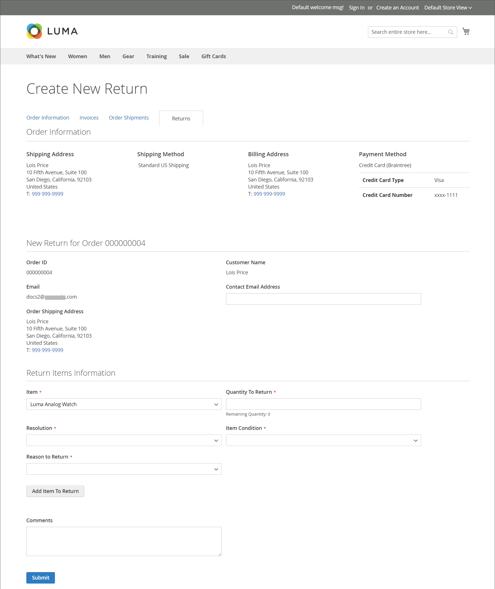

# Renvoie l’expérience storefront

{{ee-feature}}

Les clients peuvent utiliser l’une des méthodes suivantes pour demander une RAM à partir du storefront :

- [Widget Commandes et retours](../content-design/widget-orders-returns.md) dans la barre latérale
- _Commandes et renvoie_ lien dans le pied de page

Pour respecter les bonnes pratiques, veillez à inclure une description de vos exigences et processus de RAM dans la stratégie de service client.

>[!NOTE]
>
>Si vous souhaitez collecter des informations supplémentaires sur les retours, vous pouvez ajouter vos propres [renvoie des attributs](attributes-returns.md).

Toutes les informations RMA du client s’affichent sur la page **[!UICONTROL My Returns]** dans le tableau de bord du compte client.

{width="700" zoomable="yes"}

## Demande d’une RMA

Le client effectue les étapes suivantes sur le storefront pour envoyer une RAM :

1. Dans le pied de page, cliquez sur **[!UICONTROL Orders and Returns]**.

1. Renseigne les informations de commande :

   - ID de commande
   - Nom de la facturation
   - Email

1. Clics **[!UICONTROL Continue]**.

   {width="700" zoomable="yes"}

1. Sous la date de commande, cliquez sur **[!UICONTROL Return]**.

   {width="700" zoomable="yes"}

1. Choisit l’élément à renvoyer et saisit la variable **[!UICONTROL Quantity to Return]**.

1. Visionneuses **[!UICONTROL Resolution]** à l’une des options suivantes :

   - Exchange
   - [Remboursement](../customers/refunds-customer-account.md)
   - [Crédit de la boutique](../customers/store-credit-using.md)

1. Visionneuses **[!UICONTROL Item Condition]** à l’une des options suivantes :

   - `Unopened`
   - `Opened`
   - `Damaged`

1. Visionneuses **[!UICONTROL Reason to Return]** à l’une des options suivantes :

   - `Wrong Color`
   - `Wrong Size`
   - `Out of Service`
   - `Other`

   {width="700" zoomable="yes"}

1. Si nécessaire, définit **[!UICONTROL Contact Email Address]** et **[!UICONTROL Comments]**.

   >[!NOTE]
   >
   >Si la commande contient plusieurs éléments et que le client souhaite renvoyer un autre élément, il peut cliquer sur **[!UICONTROL Add Item To Return]**, sélectionnez l’élément, puis définissez toutes les options mentionnées.

1. Clics **[!UICONTROL Submit]**.
