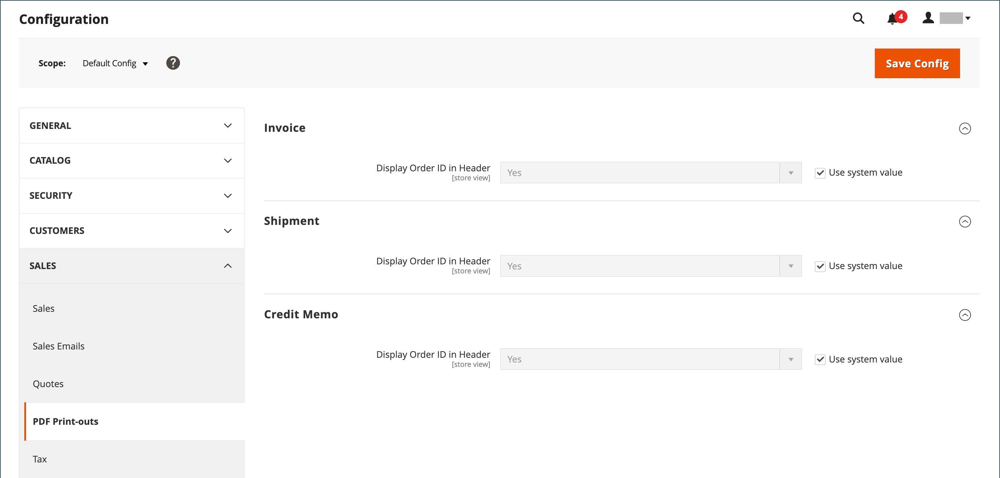

# Documents commerciaux

Pour prendre en charge le processus de commande et fournir à vos clients de la documentation sur les commandes qu’ils envoient, configurez les documents de vente associés afin qu’ils reflètent votre marque de magasin et incluent des informations de référence.

## Configurer des factures et des bordereaux d&#39;emballage

Contrairement aux images de logo utilisées dans les pages de vitrine, le logo des factures PDF et d’autres documents de vente peut être une image haute résolution de 300 ppp. Veillez à conserver les proportions lorsque vous redimensionnez le logo. Redimensionnez le logo pour qu’il s’adapte à la hauteur et ne vous souciez pas de l’espace inutilisé à droite.

{width="200"}

Pour redimensionner votre logo en fonction de la taille requise, vous pouvez créer une nouvelle image vierge aux dimensions correctes. Ensuite, collez l’image de votre logo et redimensionnez-la pour l’adapter à la hauteur. Avec la plupart des programmes de retouche d’images, vous pouvez soit l’adapter en pourcentage afin de conserver les proportions, soit maintenir la touche Maj enfoncée et redimensionner manuellement l’image.

**_Pour mettre à jour le logo :_**

1. Sur la barre latérale _Admin_, accédez à **[!UICONTROL Stores]** > _[!UICONTROL Settings]_>**[!UICONTROL Configuration]**.

1. Dans le panneau de gauche, développez **[!UICONTROL Sales]** et sélectionnez **[!UICONTROL Sales]** sous .

1. Développez la section  de **[!UICONTROL Invoice and Packing Slip Design]** et procédez comme suit :

   {width="600" zoomable="yes"}

   - Pour télécharger le **[!UICONTROL Logo for PDF Print-outs]**, cliquez sur **[!UICONTROL Choose File]**, recherchez le logo que vous avez préparé, puis cliquez sur **[!UICONTROL Open]**.

   - Pour télécharger le **[!UICONTROL Logo for HTML Print View]**, cliquez sur **[!UICONTROL Choose File]**, recherchez le logo que vous avez préparé, puis cliquez sur **[!UICONTROL Open]**.

   - Saisissez votre adresse telle qu&#39;elle apparaîtra sur les factures et les bordereaux d&#39;emballage.

1. Une fois l’opération terminée, cliquez sur **[!UICONTROL Save Config]**.

   À titre de référence, une miniature de l’image téléchargée s’affiche avant chaque champ. Ne vous inquiétez pas si la miniature semble déformée. La proportion du logo est correcte sur la facture.

### Remplacement d’une image

1. Cliquez sur **[!UICONTROL Choose File]** et choisissez un autre fichier de logo.

1. Cochez la case **[!UICONTROL Delete Image]** pour l’image que vous souhaitez remplacer.

1. Cliquez sur **[!UICONTROL Save Config]**.

### Formats d’image

| Format | Conditions |
|--- |------------------------------------------|
| **_PDF_** |  |
| Format du fichier | JPEG, PNG, TIF (TIFF) |
| Taille de l’image | Jusqu’à 1 080 pixels de large x 270 pixels de haut |
| Résolution | 300 ppp recommandé |
| **_HTML_** |  |
| Format du fichier | JPEG, PNG, GIF |
| Taille de l’image | Déterminé par le thème. |
| Résolution | 72 ou 96 ppp |

{style="table-layout:auto"}

## Ajout d’identifiants de référence

L’identifiant de commande et l’adresse IP du client peuvent être inclus dans l’en-tête des documents de vente accompagnant une commande. Par défaut, l’identifiant de commande et l’adresse IP du client apparaissent dans l’en-tête des factures, des bordereaux de livraison et des notes de crédit.

{width="600" zoomable="yes"}

**_Pour modifier le paramètre de l’ID de commande :_**

1. Sur la barre latérale _Admin_, accédez à **[!UICONTROL Stores]** > _[!UICONTROL Settings]_>**[!UICONTROL Configuration]**.

1. Dans le panneau de gauche, développez **[!UICONTROL Sales]** et choisissez **[!UICONTROL PDF Print-outs]**.

1. Développez la section  sur **Invoice** .

1. Définissez **[!UICONTROL Display Order ID in Header]** en fonction de vos préférences.

1. Répétez l&#39;opération pour les sections **[!UICONTROL Shipment]** et **[!UICONTROL Credit Memo]** .

1. Une fois l’opération terminée, cliquez sur **[!UICONTROL Save Config]**.

**_Pour modifier le paramètre d’adresse IP du client :_**

1. Sur la barre latérale _Admin_, accédez à **[!UICONTROL Stores]** > _[!UICONTROL Settings]_>**[!UICONTROL Configuration]**.

1. Dans le panneau de gauche, développez **[!UICONTROL Sales]** et sélectionnez **[!UICONTROL Sales]** sous .

1. Développez la section  sur **[!UICONTROL General]** .

   {width="600" zoomable="yes"}

1. Définissez **[!UICONTROL Hide Customer IP]** selon vos préférences.

1. Une fois l’opération terminée, cliquez sur **[!UICONTROL Save Config]**.
