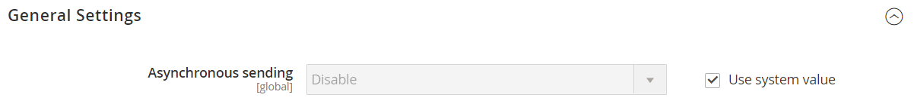
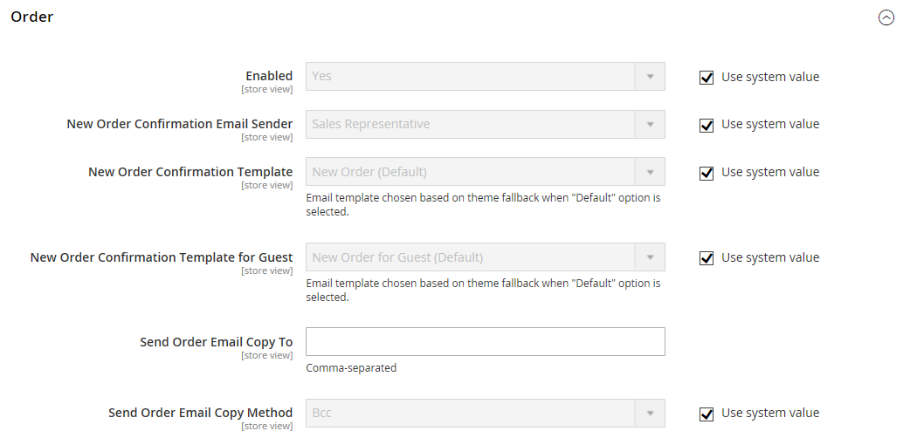

# Courriers électroniques de vente

Plusieurs messages électroniques sont déclenchés par les événements liés à une commande et la configuration est similaire. Assurez-vous d’identifier le contact du magasin qui apparaît comme l’expéditeur du message, le modèle d’email à utiliser et toute autre personne devant recevoir une copie du message. Les courriers électroniques de vente peuvent être envoyés lorsqu’ils sont déclenchés par un événement ou selon un intervalle prédéterminé.

{width="600" zoomable="yes"}

## Étape 1. Mettre à jour les modèles d&#39;email

Veillez à mettre à jour le modèle [en-tête d&#39;email](../systems/email-template-custom.md#header-template) afin qu&#39;il reflète votre marque et les autres modèles d&#39;email si nécessaire. Pour obtenir la liste complète des modèles, reportez-vous à la section [Modèles d&#39;email](../systems/email-templates.md).

## Étape 2. Choisissez le type de transmission

1. Sur la barre latérale _Admin_, accédez à **[!UICONTROL Stores]** > _[!UICONTROL Settings]_>**[!UICONTROL Configuration]**.

1. Dans le panneau de gauche, développez **[!UICONTROL Sales]** et choisissez **[!UICONTROL Sales Emails]**.

1. Si nécessaire, développez la section  de **[!UICONTROL General Settings]** .

   {width="600" zoomable="yes"}

   Par défaut, l’envoi asynchrone est défini sur `Disable`. Pour modifier le paramètre système, décochez la case **[!UICONTROL Use system value]** et définissez **[!UICONTROL Asynchronous sending]** sur l’une des options suivantes :

   - `Disable` - Envoie le courrier électronique de vente lorsqu’il est déclenché par un événement.
   - `Enable` - Envoie le courrier électronique de vente à intervalles réguliers et prédéterminés.

   Le support Adobe Commerce recommande d’activer l’envoi asynchrone afin d’améliorer les performances de placement des commandes. Voir [Bonnes pratiques de configuration pour le traitement des commandes](https://experienceleague.adobe.com/docs/commerce-operations/implementation-playbook/best-practices/maintenance/order-processing-configuration.html) dans la base de connaissances de support Adobe Commerce.

## Étape 3. Compléter les détails de chaque email de vente

1. Si nécessaire, développez la section  de **[!UICONTROL Order]** .

   {width="600" zoomable="yes"}

1. Vérifiez que **[!UICONTROL Enabled]** est défini sur `Yes` (valeur par défaut).

1. Définissez **[!UICONTROL New Order Confirmation Email]** sur le contact du magasin qui apparaît comme l’expéditeur du message.

1. Définissez **[!UICONTROL New Order Confirmation Template]** sur le modèle utilisé pour l’e-mail envoyé aux clients enregistrés.

1. Définissez **[!UICONTROL New Order Confirmation Template for Guest]** sur le modèle utilisé pour l’e-mail envoyé aux invités qui n’ont pas de compte avec votre boutique.

1. Pour **[!UICONTROL Send Order Email Copy To]**, saisissez l’adresse électronique de toute personne devant recevoir une copie du nouvel email de commande.

   Si vous envoyez une copie à plusieurs destinataires, séparez chaque adresse par une virgule.

1. Définissez **[!UICONTROL Send Order Email Copy Method]** sur l’une des options suivantes :

   - `Bcc` - Envoie une _copie de politesse aveugle_ en incluant le destinataire dans l’en-tête du même email qui est envoyé au client. Le destinataire Cci n&#39;est pas visible par le client.
   - `Separate Email` - Envoie la copie en tant qu’email distinct.

1. Développez  de la section **[!UICONTROL Order Comments]** et répétez ces étapes.

   {width="600" zoomable="yes"}

1. Effectuez la configuration pour les types d&#39;email de vente restants :

   - **[!UICONTROL Invoice]** / **[!UICONTROL Invoice Comments]**
   - **[!UICONTROL Shipment]** / **[!UICONTROL Shipment Comments]**
   - **[!UICONTROL Credit Memo]** / **[!UICONTROL Credit Memo Comments]**

1. Une fois l’opération terminée, cliquez sur **[!UICONTROL Save Config]**.

   Lorsque vous y êtes invité, cliquez sur le lien [Gestion du cache](../systems/cache-management.md) dans le message situé en haut de l’espace de travail et effacez tous les caches non valides.
