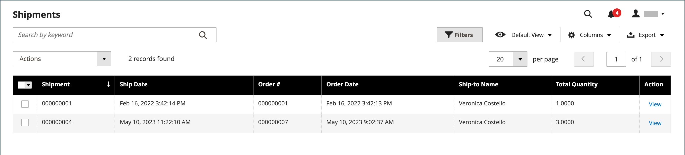
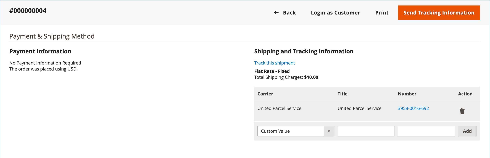
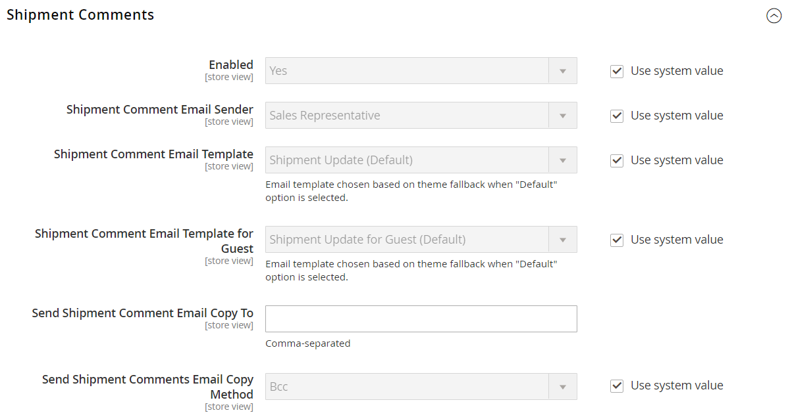

# Expéditions

La grille _[!UICONTROL Shipments]_&#x200B;répertorie l&#39;enregistrement d&#39;expédition de toutes les factures qui ont été préparées pour l&#39;expédition. Un enregistrement d&#39;expédition peut être généré lorsqu&#39;une commande est [facturée](invoices.md) ou ultérieure.

Adobe Commerce et Magento Open Source prennent en charge l’expédition partielle et complète des commandes, avec des options supplémentaires disponibles depuis [Inventory management](../inventory-management/introduction.md) et des extensions tierces.

{width="600" zoomable="yes"}

## Descriptions des colonnes

| Colonne ou contrôle | Description |
|--- |--- |
| [!UICONTROL Select] | Cochez la case de chaque devis devant faire l&#39;objet d&#39;une action ou utilisez le contrôle de sélection dans l&#39;en-tête de colonne. Options : `Select All` / `Deselect All` |
| [!UICONTROL Shipment] | Numéro séquentiel unique attribué lors du premier enregistrement d&#39;une nouvelle expédition |
| [!UICONTROL Ship Date] | Date d&#39;expédition |
| [!UICONTROL Order] | Numéro unique de la commande |
| [!UICONTROL Order Date] | Date et heure auxquelles la commande a été passée |
| [!UICONTROL Ship-to Name] | Nom de la personne à laquelle la commande est expédiée |
| [!UICONTROL Total Quantity] | Quantité totale d&#39;articles à expédier |
| [!UICONTROL Action] | Afficher ouvre l&#39;expédition en mode édition |

{style="table-layout:auto"}

Colonnes supplémentaires :

| Colonne | Description |
|--- |--- |
| [!UICONTROL Order Status] | Indique le statut de la commande |
| [!UICONTROL Purchased From] | Indique l’affichage du site web, du magasin et du magasin dans lequel la commande a été passée |
| [!UICONTROL Customer Name] | Nom du client ou de l&#39;acheteur qui a passé la commande |
| [!UICONTROL Email] | Adresse e-mail d’un client enregistré |
| [!UICONTROL Customer Group] | Nom du groupe de clients ou du catalogue partagé auquel le client est affecté |
| [!UICONTROL Billing Address] | Nom du client ou de l&#39;acheteur qui a passé la commande |
| [!UICONTROL Shipping Address] | Nom de la personne à laquelle la commande est expédiée |
| [!UICONTROL Payment Method] | Mode de paiement à utiliser pour la commande |
| [!UICONTROL Shipping Information] | Méthode à utiliser pour expédier la commande |

{style="table-layout:auto"}

## Créer une expédition

Les instructions suivantes vous guident tout au long du processus de création d’une expédition dans Adobe Commerce ou Magento Open Source. Si Inventory management est activé, vous pouvez consulter [Créer des expéditions multi-Source](../inventory-management/shipments-create.md) et sélectionner une source (ou un emplacement) et une quantité à envoyer par article de ligne.

1. Dans la barre latérale _Admin_, accédez à **[!UICONTROL Sales]** > **[!UICONTROL Orders]**.

1. Recherchez la commande dans la grille et ouvrez-la.

1. Si la commande est payée, facturée et prête à être expédiée, cliquez sur **[!UICONTROL Ship]**.

   Les sections en haut de l&#39;expédition contiennent le nom, l&#39;adresse et les informations de paiement de la commande client.

1. Remplissez chaque section du formulaire d&#39;expédition en suivant les instructions des sections suivantes.

### [!UICONTROL Items to Ship]

Pour chaque élément de ligne de la commande, modifiez le **[!UICONTROL Qty to Ship]** selon vos besoins.

### [!UICONTROL Shipping Information]

**Méthode 1 :** à l’aide de la page de commande

1. Dans la barre latérale _Admin_, accédez à **[!UICONTROL Sales]** > **[!UICONTROL Orders]**.

1. Dans la colonne **[!UICONTROL Action]** de l&#39;ordre sélectionné, cliquez sur **[!UICONTROL View]**.

1. Cliquez sur **[!UICONTROL Ship]**.

1. Faites défiler jusqu’au bloc _[!UICONTROL Payment & Shipping Method]_&#x200B;et cliquez sur **[!UICONTROL Add Tracking Number]**.

1. Définir **[!UICONTROL Carrier]** :

   - `Custom Value`
   - `DHL`
   - `Federal Express`
   - `United Parcel Service`
   - `United States Postal Service`

1. Pour suivre l&#39;expédition, saisissez les **[!UICONTROL Title]** et **[!UICONTROL Number]** .

**Méthode 2 :** Utilisation de la page d’expédition

Cette méthode n&#39;est autorisée que si la livraison de commande a déjà été créée à partir de la page de commande.
Vous pouvez modifier les informations d’expédition et de suivi si nécessaire à l’aide de la page Expédition directe :

1. Dans la barre latérale _Admin_, accédez à **[!UICONTROL Sales]** > **[!UICONTROL Shipments]**.

1. Recherchez et ouvrez l&#39;expédition en mode d&#39;édition.

1. Faites défiler l’écran jusqu’au bloc _[!UICONTROL Payment & Shipping Method]_.

1. Sélectionnez le **[!UICONTROL Carrier]**.

1. Saisissez un **[!UICONTROL Title]** pour le package.

1. Renseignez le **[!UICONTROL Number]** de tracking.

1. Cliquez sur **[!UICONTROL Add]**.

1. Pour envoyer un e-mail contenant des informations de suivi au client ou à la cliente, cliquez sur **[!UICONTROL Send Tracking Information]** et confirmez l’action.

   Pour suivre l&#39;emplacement de toute expédition, ouvrez l&#39;expédition requise en mode d&#39;édition et cliquez sur **[!UICONTROL Track this shipment]**.

   {width="600" zoomable="yes"}

### Boutons

| Bouton | Description |
|--- |--- |
| **[!UICONTROL Back]** | Ferme le nouveau formulaire d&#39;expédition et revient à la commande |
| **[!UICONTROL Submit Shipment]** | Ajoute l&#39;expédition pour la commande. |
| **[!UICONTROL Reset]** | Rétablit les valeurs d’origine de tous les champs. |

{style="table-layout:auto"}

### Commentaires d’expédition

1. Entrez **Commentaires** pour l&#39;expédition, si nécessaire.

1. Lorsque l&#39;expédition est prête, cliquez sur **Soumettre l&#39;expédition**.

## Paramétrer des commentaires pour les expéditions

1. Dans la barre latérale _Admin_, accédez à **[!UICONTROL Stores]** > _[!UICONTROL Settings]_>**[!UICONTROL Configuration]**.

1. Sous _[!UICONTROL Sales]_, sélectionnez **[!UICONTROL Sales Email]**.

1. Développez la section **Commentaires d’expédition** et modifiez les paramètres selon les besoins :

   {width="600" zoomable="yes"}

   - L’option **[!UICONTROL Enabled]** est définie sur `Yes` par défaut, ce qui signifie que l’e-mail est envoyé à un client lorsqu’un commentaire d’expédition est saisi.

   - Par **[!UICONTROL Shipment Comment Email Sender]**, sélectionnez la personne de qui l’e-mail de commentaire d’expédition est envoyé. La valeur par défaut propose cinq adresses e-mail.

   - Par **[!UICONTROL Shipment Comment Email Template]**, sélectionnez le modèle en fonction de vos besoins ou sélectionnez l’option par défaut.

   - Par **[!UICONTROL Shipment Comment Email Template for Guests]**, choisissez le modèle utilisé pour les clients qui n’ont pas de compte dans votre boutique.

   - Par **[!UICONTROL Shipment Comment Email Copy To]**, saisissez les adresses e-mail auxquelles envoyer une copie d’e-mail de commentaire d’expédition. Séparez plusieurs adresses e-mail par une virgule.

   - Par **[!UICONTROL Shipment Comment Email Copy Method]**, sélectionnez `bcc` (copie carbone invisible) ou `separate email copy` méthode en fonction de vos préférences.

1. Cliquez sur **[!UICONTROL Save Config]**.

## Annuler une expédition

Avant qu&#39;une expédition ne soit expédiée à un transporteur, elle peut être annulée en ouvrant la commande et en accédant à l&#39;expédition, à condition que le transporteur prenne en charge les annulations. Certains transporteurs limitent ou limitent les annulations après une réservation. Par exemple, UPS autorise les annulations, mais exige que vous attendiez 24 heures après la réservation de l&#39;expédition. Si une expédition est annulée, l&#39;annulation ne peut pas être annulée. Le seul recours consiste à recréer l’ordre.

1. Dans la barre latérale _Admin_, accédez à **[!UICONTROL Sales]** > **[!UICONTROL Orders]**.

1. Recherchez la commande dans la grille.

1. Dans la colonne _Action_, choisissez **[!UICONTROL View]**.

1. Dans le panneau de gauche, choisissez **[!UICONTROL Shipments]**.

   Si l&#39;expédition peut être annulée, _[!UICONTROL Cancel Shipment]_&#x200B;apparaît comme une option dans la barre de boutons supérieure.

1. Cliquez sur **[!UICONTROL Cancel Shipment]**.

1. Lorsque vous êtes invité à confirmer, cliquez sur **[!UICONTROL OK]**.

Le statut de l&#39;expédition passe à `Canceled`. Si le transporteur ne prend pas en charge les annulations, un message d&#39;erreur s&#39;affiche et explique pourquoi l&#39;expédition n&#39;a pas pu être annulée.

## Descriptions des champs Expédition

### [!UICONTROL Shipping Information]

| Champ | Description |
|-----|-----------|
| [!UICONTROL Carrier] | Nom de l’opérateur sélectionné |
| [!UICONTROL Title] | Nom descriptif attribué au package par le transporteur. |
| [!UICONTROL Number] | Numéro de suivi lié attribué au package. |
| [!UICONTROL Action] |  - Supprime les informations sur le colis de l’enregistrement d’expédition. |
| [!UICONTROL Add] | Ajoutez un autre colis à l&#39;expédition. |

{style="table-layout:auto"}

### [!UICONTROL Route Information]

| Champ | Description |
|-----|-----------|
| [!UICONTROL Origin Location] | Affiche une liste des emplacements disponibles. |
| [!UICONTROL International] | Si cette case est cochée, identifie l&#39;expédition comme une expédition internationale. |

{style="table-layout:auto"}

### [!UICONTROL Items Ordered]

| Champ | Description |
|-----|-----------|
| [!UICONTROL Description] | Description de l’élément. |
| [!UICONTROL SKU] | Unité de gestion des stocks de l&#39;article. |
| [!UICONTROL Weight] | Poids de l’élément. |
| [!UICONTROL Qty Ordered] | Quantité de l&#39;article qui a été commandé. |
| [!UICONTROL Qty Shipped] | Quantité d&#39;articles qui ont été expédiés. |
| [!UICONTROL Qty Packed] | Nombre d’éléments inclus dans ce package. |

{style="table-layout:auto"}

### [!UICONTROL Shipment Comments]

| Champ | Description |
|-----|-----------|
| [!UICONTROL Comments] | Les commentaires sur l&#39;expédition sont destinés à un usage interne. |

{style="table-layout:auto"}

### [!UICONTROL Documentation]

| Champ | Description |
|-----|-----------|
| [!UICONTROL Package Label] | **PNG** - Téléchargez l&#39;étiquette du colis d&#39;expédition. Taille : A6 (105 x 148 mm ; 4,1 x 5,6 po) |

{style="table-layout:auto"}
