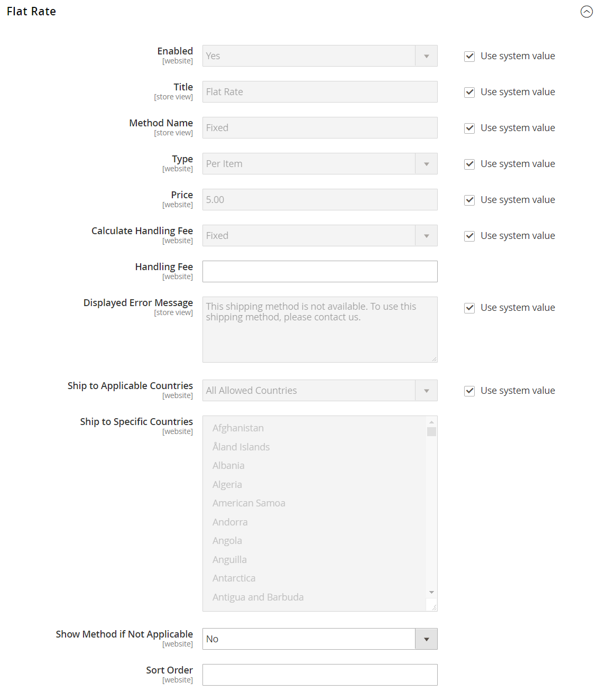

# Frais de livraison forfaitaires

_Taux forfaitaire_ est une charge fixe prédéfinie qui peut être appliquée par article ou par expédition. Le tarif forfaitaire est une solution d&#39;expédition simple, en particulier lorsqu&#39;il est utilisé avec l&#39;emballage forfaitaire disponible auprès de certains transporteurs. Lorsqu’elle est activée, la _Taux forfaitaire_ s’affiche en tant qu’option lors du passage en caisse. Comme aucun opérateur spécifique n&#39;est spécifié, vous pouvez utiliser un opérateur de votre choix.

## Configurer la livraison à taux forfaitaire

1. Dans la barre latérale _Admin_, accédez à **[!UICONTROL Stores]** > _[!UICONTROL Settings]_>**[!UICONTROL Configuration]**.

1. Dans le panneau de gauche, développez **[!UICONTROL Sales]** et choisissez **[!UICONTROL Delivery Methods]**.

1. Développez  la section **Taux plat**.

   {width="600" zoomable="yes"}

   Pour une description détaillée de chacun de ces paramètres de configuration, voir [Taux forfaitaire](../configuration-reference/sales/delivery-methods.md#flat-rate) dans le _Guide de référence de configuration_.

1. Définissez **[!UICONTROL Enabled]** sur `Yes`.

   Le taux forfaitaire apparaît comme une option dans la section Estimer l’expédition et les taxes du panier, ainsi que dans la section Expédition lors du passage en caisse.

1. Entrez un **[!UICONTROL Title]** descriptif pour la méthode Taux forfaitaire.

1. Saisissez un **Nom de la méthode** qui apparaîtra en regard du taux calculé dans le panier.

   Le nom de méthode par défaut est `Fixed`. Si vous facturez des frais de manutention, vous pouvez remplacer ce texte par `Plus Handling`, ou quelque chose d’autre qui convient.

1. Pour décrire comment les frais de livraison fixes peuvent être utilisés, définissez **Type** sur l&#39;une des options suivantes :

   - `None` - Désactive le type de paiement. L’option Taux forfaitaire est répertoriée dans le panier, mais avec un taux de zéro, qui est identique à la livraison gratuite.
   - `Per Order` - Facture un taux forfaitaire unique pour la commande entière.
   - `Per Item` - Facture un taux forfaitaire unique pour chaque article. Le taux est multiplié par le nombre d’articles du panier, qu’il existe plusieurs quantités d’articles identiques ou différents.

1. Saisissez le **Prix** que vous souhaitez facturer pour les frais d&#39;expédition forfaitaires.

1. Configurez les options de frais de gestion en fonction de vos besoins.

   Les frais de manutention sont facultatifs et apparaissent comme des frais supplémentaires qui s&#39;ajoutent aux frais d&#39;expédition. Si vous souhaitez inclure des frais de manutention, procédez comme suit :

   - Pour **Calculer les frais de manutention**, sélectionnez la méthode à utiliser pour calculer les frais de manutention :

      - `Fixed`
      - `Percent`

   - Pour **Frais de gestion**, saisissez le montant à facturer en fonction de la méthode de calcul choisie.

     Par exemple, si les frais sont basés sur des frais fixes, saisissez le montant sous la forme d’une décimale, comme `4.90`. Toutefois, si les frais de manutention sont basés sur un pourcentage des frais d&#39;expédition, entrez le montant en tant que pourcentage. Par exemple, si vous facturez 6 % des frais d’expédition, saisissez la valeur `6`.

1. Si nécessaire, modifiez le **Message d’erreur affiché**.

   Cette zone de texte est prédéfinie avec un message par défaut, mais vous pouvez saisir un message différent que vous souhaitez afficher si le service d&#39;expédition à taux forfaitaire n&#39;est plus disponible.

1. Définir **Livrer aux pays applicables** :

   - `All Allowed Countries` - Les clients de tous les [pays](../getting-started/store-details.md#country-options) spécifiés dans la configuration de votre boutique peuvent utiliser cette méthode de diffusion.
   - `Specific Countries` - Lorsque vous sélectionnez cette option, la liste _Livrer à des pays spécifiques_ s&#39;affiche. Sélectionnez dans la liste chaque pays où ce mode de diffusion peut être utilisé.

1. Définir **Afficher la méthode si non applicable** :

   - `Yes` - Affiche toujours la méthode Taux forfaitaire, même si elle n&#39;est pas applicable.
   - `No` - Affiche la méthode Taux forfaitaire uniquement le cas échéant.

1. Par **[!UICONTROL Sort Order]**, saisissez un nombre pour déterminer l&#39;ordre dans lequel les frais d&#39;expédition forfaitaires apparaissent lorsqu&#39;ils sont répertoriés avec d&#39;autres méthodes de livraison lors du passage en caisse.

   `0` = premier, `1` = deuxième, `2` = troisième, etc.

1. Cliquez sur **[!UICONTROL Save Config]**.
