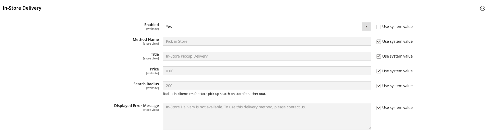

# Diffusion en magasin

Grâce à la méthode de livraison en magasin, le client peut sélectionner une source à utiliser comme emplacement de retrait lors du passage en caisse.

{width="700" zoomable="yes"}

Lors du passage en caisse sur le storefront :

1. Le client clique sur **[!UICONTROL Pick In Store]** ou sélectionne le mode d’expédition _[!UICONTROL In-Store Pickup Delivery]_.
1. L’onglet Passage en caisse _[!UICONTROL Pick In Store]_&#x200B;s’ouvre.

Lorsque le client a une adresse ou a déjà rempli le formulaire d’adresse de livraison avant de passer à l’onglet _[!UICONTROL Pick In Store]_:

- La source la plus proche de l’adresse du client dans le rayon configuré est automatiquement présélectionnée comme magasin de retrait.
- Lorsque le client clique sur **[!UICONTROL Select Other]**, le formulaire de recherche _[!UICONTROL Select Store]_&#x200B;s’ouvre. Seuls les magasins situés dans la distance configurée (rayon) du magasin présélectionné s’affichent dans la liste. Tous les magasins de la liste sont triés en fonction de la distance jusqu’au magasin présélectionné.
- Lorsque le client ou la cliente saisit un code postal ou un nom de ville dans le champ de recherche, seuls les magasins situés dans la distance configurée (rayon) par rapport à l’emplacement recherché s’affichent dans la liste. Tous les magasins de la liste sont triés en fonction de la distance jusqu’à l’emplacement recherché.
- Lorsque le client ou la cliente efface le code postal ou le nom de ville du champ de recherche, tous les magasins de retrait affectés aux produits du panier s’affichent pour lui. Tous les magasins de la liste sont triés dans l’ordre croissant des codes sources sans aucune limitation de distance (rayon).

Si le client n’a pas d’adresse ou n’a pas rempli le formulaire d’adresse de livraison avant de passer à l’onglet _[!UICONTROL Pick In Store]_:

- La page affiche le message _Nous n’avons pas pu présélectionner l’emplacement de retrait en fonction des informations disponibles_.
- Lorsque le client clique sur **[!UICONTROL Select Store]**, le formulaire de recherche _[!UICONTROL Select Store]_&#x200B;s’ouvre.
- Tous les magasins de retrait affectés aux produits dans le panier sont affichés dans l&#39;ordre croissant des codes sources sans aucune limitation de distance (rayon).
- Lorsque le client ou la cliente saisit un code postal ou un nom de ville dans le champ de recherche, seuls les magasins situés dans la distance configurée (rayon) par rapport à l’emplacement recherché s’affichent dans la liste. Tous les magasins de la liste sont triés en fonction de la distance jusqu’à l’emplacement recherché.

## Avant la configuration

- Assurez-vous d&#39;avoir un stock et une source non par défaut. Pour plus d’informations sur la configuration d’une source en tant qu’emplacement de prélèvement, voir [&#x200B; Ajouter une source &#x200B;](../inventory-management/sources-add.md).
- Assurez-vous d&#39;avoir configuré un algorithme de priorité à distance. Pour plus d&#39;informations, voir [Configurer l&#39;algorithme de priorité de distance](../inventory-management/distance-priority-algorithm.md).
- Vérifiez que vous avez [téléchargé et importé](../inventory-management/cli.md#import-geocodes) tous les géocodes nécessaires au calcul hors ligne.
- Vérifiez que vous avez configuré les paramètres [Calcul de destination de taxe par défaut](../configuration-reference/sales/tax.md#default-tax-destination-calculation).

>[!IMPORTANT]
>
>**Dans le storefront, les résultats de la recherche sont filtrés par distance (rayon) pour afficher les résultats pertinents :**  
>Si le client dispose d&#39;une adresse de livraison, l&#39;emplacement de base pour calculer la distance (rayon) est extrait de l&#39;adresse de livraison.  
>Si le client ne dispose pas d&#39;une adresse de livraison, l&#39;emplacement de base pour calculer la distance est extrait des paramètres [Calcul de la destination de taxe par défaut](../configuration-reference/sales/tax.md#default-tax-destination-calculation). Ces paramètres sont définis par vue de magasin et vous devez configurer les paramètres de calcul de destination de taxe par défaut pour vous assurer que la recherche de magasin de retrait fonctionne correctement.

## Configurer la diffusion en magasin

Tout d’abord, vérifiez que la diffusion en magasin est activée.

1. Dans la barre latérale _Admin_, accédez à **[!UICONTROL Stores]** > _[!UICONTROL Settings]_>**[!UICONTROL Configuration]**.

1. Dans le panneau de gauche, développez **[!UICONTROL Sales]** et choisissez **[!UICONTROL Delivery Methods]**.

1. Développez  la section **[!UICONTROL In-Store Delivery]** .

   {width="600" zoomable="yes"}

1. Définissez **[!UICONTROL Enabled]** sur `Yes`.

   >[!NOTE]
   >
   >Si nécessaire, décochez la case **[!UICONTROL Use system value]** pour modifier la valeur par défaut de n’importe quel champ.

1. Saisissez le **[!UICONTROL Method Name]** qui décrit la méthode de calcul utilisée pour produire une estimation d&#39;expédition.

   Le nom de la méthode s’affiche en regard du taux estimé calculé dans le panier.

1. Saisissez le **[!UICONTROL Title]** que vous souhaitez afficher pour la section _Diffusion en magasin_ lors du passage en caisse.

   Le titre par défaut est `In-Store Pickup Delivery`.

1. Pour facturer aux clients le service de retrait en magasin, saisissez les frais dans le champ **[!UICONTROL Price]**.

1. Saisissez le **[!UICONTROL Search Radius]** en kilomètres pour la recherche de l&#39;emplacement de retrait du magasin lors du passage en caisse du storefront.

1. Par **[!UICONTROL Displayed Error Message]**, saisissez le message qui s’affiche si la diffusion en magasin n’est plus disponible.

   Le message par défaut est `In-Store Delivery is not available. To use this delivery method, please contact us.`

1. Cliquez sur **[!UICONTROL Save Config]**.
